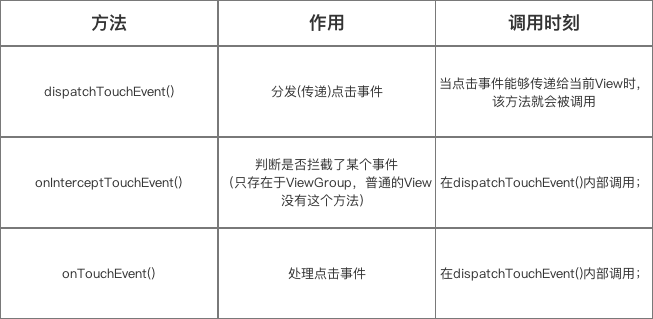
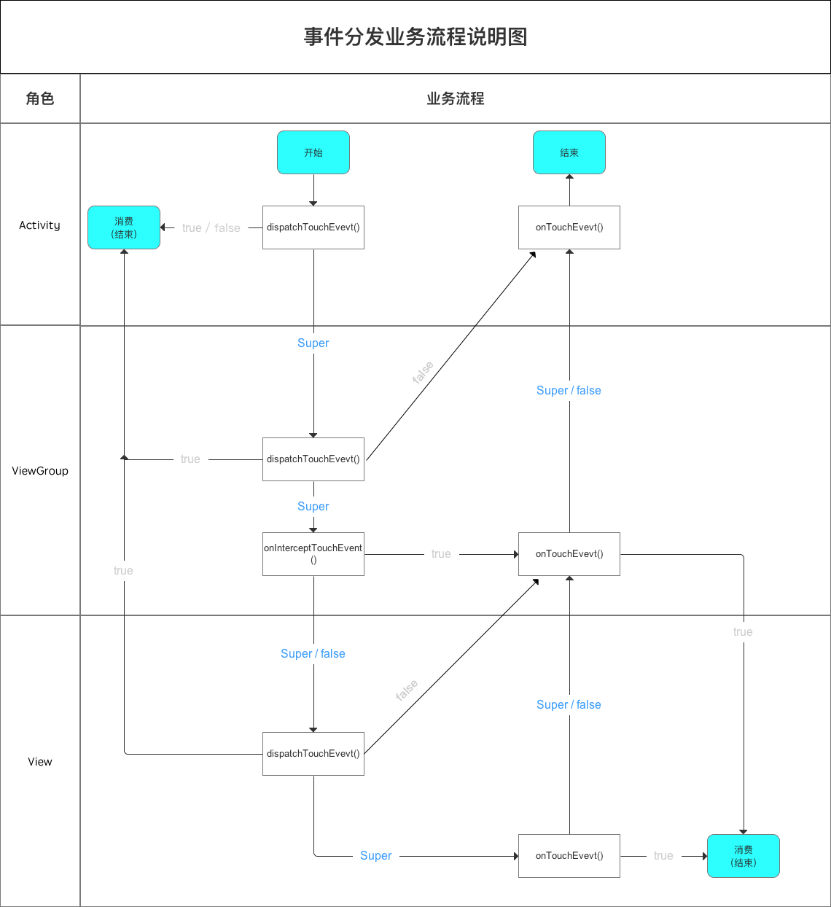
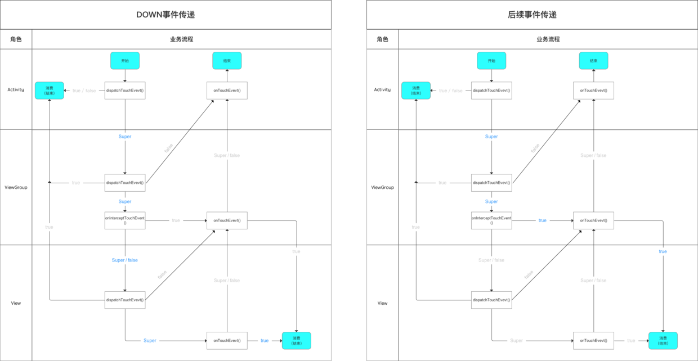
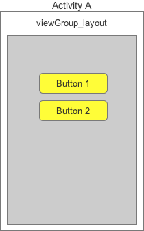

## 一、 基础认知

### 1.1 事件分发的对象是谁？

**答：事件**

- 当用户触摸屏幕时（View或ViewGroup派生的控件），将产生点击事件（Touch事件）。

  > Touch事件相关细节（发生触摸的位置、时间、历史记录、手势动作等）被封装成MotionEvent对象

- 主要发生的Touch事件有如下四种：

  - MotionEvent.ACTION_DOWN：按下View（所有事件的开始）
  - MotionEvent.ACTION_MOVE：滑动View
  - MotionEvent.ACTION_CANCEL：非人为原因结束本次事件
  - MotionEvent.ACTION_UP：抬起View（与DOWN对应）

- 事件列：从手指接触屏幕至手指离开屏幕，这个过程产生的一系列事件 任何事件列都是以DOWN事件开始，UP事件结束，中间有无数的MOVE事件，如下图：


即当一个MotionEvent 产生后，系统需要把这个事件传递给一个具体的 View 去处理,

### 1.2 事件分发的本质

**答：将点击事件（MotionEvent）向某个View进行传递并最终得到处理**

> 即当一个点击事件发生后，系统需要将这个事件传递给一个具体的View去处理。**这个事件传递的过程就是分发过程。**

### 1.3 事件在哪些对象之间进行传递？

**答：Activity、ViewGroup、View**

> 一个点击事件产生后，传递顺序是：Activity（Window） -> ViewGroup -> View

- Android的UI界面是由Activity、ViewGroup、View及其派生类组合而成的

  

- View是所有UI组件的基类

  > 一般Button、ImageView、TextView等控件都是继承父类View

- ViewGroup是容纳UI组件的容器，即一组View的集合（包含很多子View和子VewGroup），

  > 1. 其本身也是从View派生的，即ViewGroup是View的子类
  > 2. 是Android所有布局的父类或间接父类：项目用到的布局（LinearLayout、RelativeLayout等），都继承自ViewGroup，即属于ViewGroup子类。
  > 3. 与普通View的区别：ViewGroup实际上也是一个View，只不过比起View，它多了可以包含子View和定义布局参数的功能。

### 1.4 事件分发过程由哪些方法协作完成？

**答：dispatchTouchEvent() 、onInterceptTouchEvent()和onTouchEvent()**



> 下文会对这3个方法进行详细介绍

### 1.5 总结

- Android事件分发机制的本质是要解决：

  点击事件由哪个对象发出，经过哪些对象，最终达到哪个对象并最终得到处理。

  > 这里的对象是指Activity、ViewGroup、View

- Android中事件分发顺序：**Activity（Window） -> ViewGroup -> View**

- 事件分发过程由dispatchTouchEvent() 、onInterceptTouchEvent()和onTouchEvent()三个方法协助完成

经过上述3个问题，相信大家已经对Android的事件分发有了感性的认知，接下来，我将详细介绍Android事件分发机制。

## 二、 事件分发机制方法&流程介绍

- 事件分发过程由dispatchTouchEvent() 、onInterceptTouchEvent()和onTouchEvent()三个方法协助完成，如下图：


方法详细介绍

- Android事件分发流程如下：（必须熟记）

  > Android事件分发顺序：**Activity（Window） -> ViewGroup -> View**


其中：

- super：调用父类方法
- true：消费事件，即事件不继续往下传递
- false：不消费事件，事件也不继续往下传递 / 交由给父控件onTouchEvent（）处理

**接下来，我将详细介绍这3个方法及相关流程。**

### 2.1 dispatchTouchEvent()

| 属性     | 介绍                                             |
| :------- | :----------------------------------------------- |
| 使用对象 | Activity、ViewGroup、View                        |
| 作用     | 分发点击事件                                     |
| 调用时刻 | 当点击事件能够传递给当前View时，该方法就会被调用 |
| 返回结果 | 是否消费当前事件，详细情况如下：                 |

**1. 默认情况：根据当前对象的不同而返回方法不同**

| 对象      | 返回方法                   | 备注                                      |
| :-------- | :------------------------- | :---------------------------------------- |
| Activity  | super.dispatchTouchEvent() | 即调用父类ViewGroup的dispatchTouchEvent() |
| ViewGroup | onIntercepTouchEvent()     | 即调用自身的onIntercepTouchEvent()        |
| View      | onTouchEvent（）           | 即调用自身的onTouchEvent（）              |

流程解析

**2. 返回true**

- 消费事件
- 事件不会往下传递
- 后续事件（Move、Up）会继续分发到该View
- 流程图如下：


**3. 返回false**

- 不消费事件

- 事件不会往下传递

- 将事件回传给父控件的onTouchEvent()处理

  > Activity例外：返回false=消费事件

- 后续事件（Move、Up）会继续分发到该View(与onTouchEvent()区别）

- 流程图如下：

  

### 2.2 onTouchEvent()

| 属性     | 介绍                                     |
| :------- | :--------------------------------------- |
| 使用对象 | Activity、ViewGroup、View                |
| 作用     | 处理点击事件                             |
| 调用时刻 | 在dispatchTouchEvent()内部调用           |
| 返回结果 | 是否消费（处理）当前事件，详细情况如下： |

> 与dispatchTouchEvent()类似

**1. 返回true**

- 自己处理（消费）该事情

- 事件停止传递

- 该事件序列的后续事件（Move、Up）让其处理；

- 流程图如下：

  

**2. 返回false（同默认实现：调用父类onTouchEvent()）**

- 不处理（消费）该事件

- 事件往上传递给父控件的onTouchEvent()处理

- 当前View不再接受此事件列的其他事件（Move、Up）；

- 流程图如下：

  

### 2.3 onInterceptTouchEvent()

| 属性     | 介绍                                      |
| :------- | :---------------------------------------- |
| 使用对象 | ViewGroup（注：Activity、View都没该方法） |
| 作用     | 拦截事件，即自己处理该事件                |
| 调用时刻 | 在ViewGroup的dispatchTouchEvent()内部调用 |
| 返回结果 | 是否拦截当前事件，详细情况如下：          |

返回结果


- 流程图如下：


### 2.4 三者关系

下面将用一段伪代码来阐述上述三个方法的关系和点击事件传递规则

```java
// 点击事件产生后，会直接调用dispatchTouchEvent（）方法
public boolean dispatchTouchEvent(MotionEvent ev) {

    //代表是否消耗事件
    boolean consume = false;


    if (onInterceptTouchEvent(ev)) {
    //如果onInterceptTouchEvent()返回true则代表当前View拦截了点击事件
    //则该点击事件则会交给当前View进行处理
    //即调用onTouchEvent (）方法去处理点击事件
      consume = onTouchEvent (ev) ;

    } else {
      //如果onInterceptTouchEvent()返回false则代表当前View不拦截点击事件
      //则该点击事件则会继续传递给它的子元素
      //子元素的dispatchTouchEvent（）就会被调用，重复上述过程
      //直到点击事件被最终处理为止
      consume = child.dispatchTouchEvent (ev) ;
    }

    return consume;
   }
```

### 2.5 总结

- 对于事件分发的3个方法，你应该清楚了解
- 接下来，我将开始介绍Android事件分发的常见流程

## 三、事件分发场景介绍

下面我将利用例子来说明常见的点击事件传递情况

### 3.1 背景描述

我们将要讨论的布局层次如下：


- 最外层：Activiy A，包含两个子View：ViewGroup B、View C
- 中间层：ViewGroup B，包含一个子View：View C
- 最内层：View C

假设用户首先触摸到屏幕上View C上的某个点（如图中黄色区域），那么Action_DOWN事件就在该点产生，然后用户移动手指并最后离开屏幕。

### 3.2 一般的事件传递情况

一般的事件传递场景有：

- 默认情况
- 处理事件
- 拦截DOWN事件
- 拦截后续事件（MOVE、UP）

#### 3.2.1 默认情况

- 即不对控件里的方法(dispatchTouchEvent()、onTouchEvent()、onInterceptTouchEvent())进行重写或更改返回值
- 那么调用的是这3个方法的默认实现：调用父类的方法
- 事件传递情况：（如图下所示）
  - 从Activity A---->ViewGroup B--->View C，从上往下调用dispatchTouchEvent()
  - 再由View C--->ViewGroup B --->Activity A，从下往上调用onTouchEvent()



注：虽然ViewGroup B的onInterceptTouchEvent方法对DOWN事件返回了false，后续的事件（MOVE、UP）依然会传递给它的onInterceptTouchEvent()

> 这一点与onTouchEvent的行为是不一样的。

#### 3.2.2 处理事件

假设View C希望处理这个点击事件，即C被设置成可点击的（Clickable）或者覆写了C的onTouchEvent方法返回true。

> 最常见的：设置Button按钮来响应点击事件

事件传递情况：（如下图）

- DOWN事件被传递给C的onTouchEvent方法，该方法返回true，表示处理这个事件
- 因为C正在处理这个事件，那么DOWN事件将不再往上传递给B和A的onTouchEvent()；
- 该事件列的其他事件（Move、Up）也将传递给C的onTouchEvent()


#### 3.2.3 拦截DOWN事件

假设ViewGroup B希望处理这个点击事件，即B覆写了onInterceptTouchEvent()返回true、onTouchEvent()返回true。 事件传递情况：（如下图）

- DOWN事件被传递给B的onInterceptTouchEvent()方法，该方法返回true，表示拦截这个事件，即自己处理这个事件（不再往下传递）

- 调用onTouchEvent()处理事件（DOWN事件将不再往上传递给A的onTouchEvent()）

- 该事件列的其他事件（Move、Up）将直接传递给B的onTouchEvent()

  > 该事件列的其他事件（Move、Up）将不会再传递给B的onInterceptTouchEvent方法，该方法一旦返回一次true，就再也不会被调用了。


#### 3.2.4 拦截DOWN的后续事件

假设ViewGroup B没有拦截DOWN事件（还是View C来处理DOWN事件），但它拦截了接下来的MOVE事件。

- DOWN事件传递到C的onTouchEvent方法，返回了true。

- 在后续到来的MOVE事件，B的onInterceptTouchEvent方法返回true拦截该MOVE事件，但该事件并没有传递给B；这个MOVE事件将会被系统变成一个CANCEL事件传递给C的onTouchEvent方法

- 后续又来了一个MOVE事件，该MOVE事件才会直接传递给B的onTouchEvent()

  > 1. 后续事件将直接传递给B的onTouchEvent()处理
  > 2. 后续事件将不会再传递给B的onInterceptTouchEvent方法，该方法一旦返回一次true，就再也不会被调用了。

- C再也不会收到该事件列产生的后续事件。

  

特别注意：

- 如果ViewGroup A 拦截了一个半路的事件（如MOVE），这个事件将会被系统变成一个CANCEL事件并传递给之前处理该事件的子View；
- 该事件不会再传递给ViewGroup A的onTouchEvent()
- 只有再到来的事件才会传递到ViewGroup A的onTouchEvent()

### 3.3 总结

- 对于Android的事件分发机制，你应该已经非常清楚了
- **如果你只是希望了解Android事件分发机制而不想深入了解，那么你可以离开这篇文章了**
- 对于程序猿来说，知其然还需要知其所以然，接下来，**我将通过源码分析来深入了解Android事件分发机制**

## 四、Android事件分发机制源码分析

- Android中事件分发顺序：**Activity（Window） -> ViewGroup -> View**，再次贴出下图：


其中：

- super：调用父类方法
- true：消费事件，即事件不继续往下传递
- false：不消费事件，事件继续往下传递 / 交由给父控件onTouchEvent（）处理

**所以，要想充分理解Android分发机制，本质上是要理解：**

- Activity对点击事件的分发机制
- ViewGroup对点击事件的分发机制
- View对点击事件的分发机制

接下来，我将通过源码分析详细介绍Activity、View和ViewGroup的事件分发机制

### 4.1 Activity的事件分发机制

#### 4.1.1 源码分析

- 当一个点击事件发生时，事件最先传到Activity的dispatchTouchEvent()进行事件分发

  > 具体是由Activity的Window来完成

- 我们来看下Activity的dispatchTouchEvent()的源码

```java
public boolean dispatchTouchEvent(MotionEvent ev) {
        //关注点1
        //一般事件列开始都是DOWN，所以这里基本是true
        if (ev.getAction() == MotionEvent.ACTION_DOWN) {
            //关注点2
            onUserInteraction();
        }
        //关注点3
        if (getWindow().superDispatchTouchEvent(ev)) {
            return true;
        }
        return onTouchEvent(ev);
    }
```

**关注点1** 一般事件列开始都是DOWN（按下按钮），所以这里返回true，执行onUserInteraction()

**关注点2** 先来看下onUserInteraction()源码

```java
  /**
     * Called whenever a key, touch, or trackball event is dispatched to the
     * activity.  Implement this method if you wish to know that the user has
     * interacted with the device in some way while your activity is running.
     * This callback and {@link #onUserLeaveHint} are intended to help
     * activities manage status bar notifications intelligently; specifically,
     * for helping activities determine the proper time to cancel a notfication.
     *
     * <p>All calls to your activity's {@link #onUserLeaveHint} callback will
     * be accompanied by calls to {@link #onUserInteraction}.  This
     * ensures that your activity will be told of relevant user activity such
     * as pulling down the notification pane and touching an item there.
     *
     * <p>Note that this callback will be invoked for the touch down action
     * that begins a touch gesture, but may not be invoked for the touch-moved
     * and touch-up actions that follow.
     *
     * @see #onUserLeaveHint()
     */
public void onUserInteraction() { 
}
```

从源码可以看出：

- 该方法为空方法
- 从注释得知：当此activity在栈顶时，触屏点击按home，back，menu键等都会触发此方法
- 所以onUserInteraction()主要用于屏保

**关注点3**

- Window类是抽象类，且PhoneWindow是Window类的唯一实现类

- superDispatchTouchEvent(ev)是抽象方法

- 通过PhoneWindow类中看一下superDispatchTouchEvent()的作用

  ```Java
  @Override
  public boolean superDispatchTouchEvent(MotionEvent event) {
    return mDecor.superDispatchTouchEvent(event);
  //mDecor是DecorView的实例
  //DecorView是视图的顶层view，继承自FrameLayout，是所有界面的父类
  }
  ```

- 接下来我们看mDecor.superDispatchTouchEvent(event)：

```java
public boolean superDispatchTouchEvent(MotionEvent event) {
    return super.dispatchTouchEvent(event);
//DecorView继承自FrameLayout
//那么它的父类就是ViewGroup
而super.dispatchTouchEvent(event)方法，其实就应该是ViewGroup的dispatchTouchEvent()

}
```

所以：

- **执行getWindow().superDispatchTouchEvent(ev)实际上是执行了ViewGroup.dispatchTouchEvent(event)**

- 再回到最初的代码：

  ```java
  public boolean dispatchTouchEvent(MotionEvent ev) {
  
        if (ev.getAction() == MotionEvent.ACTION_DOWN) {
            //关注点2
            onUserInteraction();
        }
        //关注点3
        if (getWindow().superDispatchTouchEvent(ev)) {
            return true;
        }
        return onTouchEvent(ev);
    }
  ```

  由于一般事件列开始都是DOWN，所以这里返回true，基本上都会进入`getWindow().superDispatchTouchEvent(ev)`的判断

- 所以，执行**Activity.dispatchTouchEvent(ev)实际上是执行了ViewGroup.dispatchTouchEvent(event)**

- 这样事件就从 Activity 传递到了 ViewGroup

#### 4.1.2 汇总

当一个点击事件发生时，调用顺序如下

1. 事件最先传到Activity的dispatchTouchEvent()进行事件分发
2. 调用Window类实现类PhoneWindow的superDispatchTouchEvent()
3. 调用DecorView的superDispatchTouchEvent()
4. 最终调用DecorView父类的dispatchTouchEvent()，**即ViewGroup的dispatchTouchEvent()**

#### 4.1.3 结论

- 当一个点击事件发生时，事件最先传到Activity的dispatchTouchEvent()进行事件分发，最终是调用了ViewGroup的dispatchTouchEvent()方法
- 这样事件就从 Activity 传递到了 ViewGroup

### 4.2 ViewGroup事件的分发机制

在讲解ViewGroup事件的分发机制之前我们先来看个Demo

### 4.2.1 Demo讲解

**布局如下：**



**结果测试：** 只点击Button


再点击空白处


从上面的测试结果发现：

- 当点击Button时，执行Button的onClick()，但ViewGroupLayout注册的onTouch（）不会执行
- 只有点击空白区域时才会执行ViewGroupLayout的onTouch（）;
- 结论：Button的onClick()将事件消费掉了，因此事件不会再继续向下传递。

接下来，我们开始进行ViewGroup事件分发的源码分析

#### 4.2.2 源码分析

ViewGroup的dispatchTouchEvent()源码分析,该方法比较复杂，篇幅有限，就截取几个重要的逻辑片段进行介绍，来解析整个分发流程。

```java
// 发生ACTION_DOWN事件或者已经发生过ACTION_DOWN,并且将mFirstTouchTarget赋值，才进入此区域，主要功能是拦截器
        final boolean intercepted;
        if (actionMasked == MotionEvent.ACTION_DOWN|| mFirstTouchTarget != null) {
            //disallowIntercept：是否禁用事件拦截的功能(默认是false),即不禁用
            //可以在子View通过调用requestDisallowInterceptTouchEvent方法对这个值进行修改，不让该View拦截事件
            final boolean disallowIntercept = (mGroupFlags & FLAG_DISALLOW_INTERCEPT) != 0;
            //默认情况下会进入该方法
            if (!disallowIntercept) {
                //调用拦截方法
                intercepted = onInterceptTouchEvent(ev); 
                ev.setAction(action);
            } else {
                intercepted = false;
            }
        } else {
            // 当没有触摸targets，且不是down事件时，开始持续拦截触摸。
            intercepted = true;
        }
```

这一段的内容主要是为判断是否拦截。如果当前事件的MotionEvent.ACTION_DOWN，则进入判断，调用ViewGroup onInterceptTouchEvent()方法的值，判断是否拦截。如果mFirstTouchTarget != null，即已经发生过MotionEvent.ACTION_DOWN，并且该事件已经有ViewGroup的子View进行处理了，那么也进入判断，调用ViewGroup onInterceptTouchEvent()方法的值，判断是否拦截。如果不是以上两种情况，即已经是MOVE或UP事件了，并且之前的事件没有对象进行处理，则设置成true，开始拦截接下来的所有事件。**这也就解释了如果子View的onTouchEvent()方法返回false，那么接下来的一些列事件都不会交给他处理。如果VieGroup的onInterceptTouchEvent()第一次执行为true，则mFirstTouchTarget = null，则也会使得接下来不会调用onInterceptTouchEvent()，直接将拦截设置为true。**

当ViewGroup不拦截事件的时候，事件会向下分发交由它的子View或ViewGroup进行处理。

```java
  /* 从最底层的父视图开始遍历，
   ** 找寻newTouchTarget，即上面的mFirstTouchTarget
   ** 如果已经存在找寻newTouchTarget，说明正在接收触摸事件，则跳出循环。
    */
for (int i = childrenCount - 1; i >= 0; i--) {
  final int childIndex = customOrder
    ? getChildDrawingOrder(childrenCount, i) : i;
  final View child = (preorderedList == null)
    ? children[childIndex] : preorderedList.get(childIndex);

  // 如果当前视图无法获取用户焦点，则跳过本次循环
  if (childWithAccessibilityFocus != null) {
     if (childWithAccessibilityFocus != child) {
        continue;
     }
     childWithAccessibilityFocus = null;
     i = childrenCount - 1;
  }
  //如果view不可见，或者触摸的坐标点不在view的范围内，则跳过本次循环
  if (!canViewReceivePointerEvents(child) 
      || !isTransformedTouchPointInView(x, y, child, null)) {
    ev.setTargetAccessibilityFocus(false);
    continue;
    }

   newTouchTarget = getTouchTarget(child);
   // 已经开始接收触摸事件,并退出整个循环。
   if (newTouchTarget != null) {
       newTouchTarget.pointerIdBits |= idBitsToAssign;
       break;
    }

    //重置取消或抬起标志位
    //如果触摸位置在child的区域内，则把事件分发给子View或ViewGroup
    if (dispatchTransformedTouchEvent(ev, false, child, idBitsToAssign)) {
        // 获取TouchDown的时间点
        mLastTouchDownTime = ev.getDownTime();
        // 获取TouchDown的Index
        if (preorderedList != null) {
           for (int j = 0; j < childrenCount; j++) {
               if (children[childIndex] == mChildren[j]) {
                    mLastTouchDownIndex = j;
                    break;
                }
           }
         } else {
                 mLastTouchDownIndex = childIndex;
                }

      //获取TouchDown的x,y坐标
      mLastTouchDownX = ev.getX();
      mLastTouchDownY = ev.getY();
      //添加TouchTarget,则mFirstTouchTarget != null。
      newTouchTarget = addTouchTarget(child, idBitsToAssign);
      //表示以及分发给NewTouchTarget
      alreadyDispatchedToNewTouchTarget = true;
      break;
}
```

`dispatchTransformedTouchEvent()`方法实际就是调用子元素的`dispatchTouchEvent()`方法。 其中`dispatchTransformedTouchEvent()`方法的重要逻辑如下：

```java
 if (child == null) {
                handled = super.dispatchTouchEvent(event);
            } else {
                handled = child.dispatchTouchEvent(event);
            }
```

由于其中传递的child不为空，所以就会调用子元素的dispatchTouchEvent()。 如果子元素的dispatchTouchEvent()方法返回true，那么mFirstTouchTarget就会被赋值，同时跳出for循环。

```Java
//添加TouchTarget,则mFirstTouchTarget != null。
newTouchTarget = addTouchTarget(child, idBitsToAssign);
 //表示以及分发给NewTouchTarget
 alreadyDispatchedToNewTouchTarget = true;
```

其中在`addTouchTarget(child, idBitsToAssign);`内部完成mFirstTouchTarget被赋值。 如果mFirstTouchTarget为空，将会让ViewGroup默认拦截所有操作。 如果遍历所有子View或ViewGroup，都没有消费事件。ViewGroup会自己处理事件。

### 结论

- Android事件分发是先传递到ViewGroup，再由ViewGroup传递到View

- 在ViewGroup中通过onInterceptTouchEvent()对事件传递进行拦截

  > 1. onInterceptTouchEvent方法返回true代表拦截事件，即不允许事件继续向子View传递；
  > 2. 返回false代表不拦截事件，即允许事件继续向子View传递；（默认返回false）
  > 3. 子View中如果将传递的事件消费掉，ViewGroup中将无法接收到任何事件。

### 4.3 View事件的分发机制

View中dispatchTouchEvent()的源码分析

```java
public boolean dispatchTouchEvent(MotionEvent event) {  
    if (mOnTouchListener != null && (mViewFlags & ENABLED_MASK) == ENABLED &&  
            mOnTouchListener.onTouch(this, event)) {  
        return true;  
    }  
    return onTouchEvent(event);  
}
```

从上面可以看出：

- 只有以下三个条件都为真，dispatchTouchEvent()才返回true；否则执行onTouchEvent(event)方法

  ```java
  第一个条件：mOnTouchListener != null；
  第二个条件：(mViewFlags & ENABLED_MASK) == ENABLED；
  第三个条件：mOnTouchListener.onTouch(this, event)；
  ```

- 下面，我们来看看下这三个判断条件：

**第一个条件：mOnTouchListener!= null**

```java
//mOnTouchListener是在View类下setOnTouchListener方法里赋值的
public void setOnTouchListener(OnTouchListener l) { 

//即只要我们给控件注册了Touch事件，mOnTouchListener就一定被赋值（不为空）
    mOnTouchListener = l;  
}
```

**第二个条件：(mViewFlags & ENABLED_MASK) == ENABLED**

- 该条件是判断当前点击的控件是否enable
- 由于很多View默认是enable的，因此该条件恒定为true

**第三个条件：mOnTouchListener.onTouch(this, event)**

- 回调控件注册Touch事件时的onTouch方法

  ```java
  //手动调用设置
  button.setOnTouchListener(new OnTouchListener() {  
  
    @Override  
    public boolean onTouch(View v, MotionEvent event) {  
  
        return false;  
    }  
  });
  ```

- 如果在onTouch方法返回true，就会让上述三个条件全部成立，从而整个方法直接返回true。

- 如果在onTouch方法里返回false，就会去执行onTouchEvent(event)方法。

接下来，我们继续看：**onTouchEvent(event)**的源码分析

```java
public boolean onTouchEvent(MotionEvent event) {  
    final int viewFlags = mViewFlags;  
    if ((viewFlags & ENABLED_MASK) == DISABLED) {  
        // A disabled view that is clickable still consumes the touch  
        // events, it just doesn't respond to them.  
        return (((viewFlags & CLICKABLE) == CLICKABLE ||  
                (viewFlags & LONG_CLICKABLE) == LONG_CLICKABLE));  
    }  
    if (mTouchDelegate != null) {  
        if (mTouchDelegate.onTouchEvent(event)) {  
            return true;  
        }  
    }  
     //如果该控件是可以点击的就会进入到下两行的switch判断中去；

    if (((viewFlags & CLICKABLE) == CLICKABLE ||  
            (viewFlags & LONG_CLICKABLE) == LONG_CLICKABLE)) {  
    //如果当前的事件是抬起手指，则会进入到MotionEvent.ACTION_UP这个case当中。

        switch (event.getAction()) {  
            case MotionEvent.ACTION_UP:  
                boolean prepressed = (mPrivateFlags & PREPRESSED) != 0;  
               // 在经过种种判断之后，会执行到关注点1的performClick()方法。
               //请往下看关注点1
                if ((mPrivateFlags & PRESSED) != 0 || prepressed) {  
                    // take focus if we don't have it already and we should in  
                    // touch mode.  
                    boolean focusTaken = false;  
                    if (isFocusable() && isFocusableInTouchMode() && !isFocused()) {  
                        focusTaken = requestFocus();  
                    }  
                    if (!mHasPerformedLongPress) {  
                        // This is a tap, so remove the longpress check  
                        removeLongPressCallback();  
                        // Only perform take click actions if we were in the pressed state  
                        if (!focusTaken) {  
                            // Use a Runnable and post this rather than calling  
                            // performClick directly. This lets other visual state  
                            // of the view update before click actions start.  
                            if (mPerformClick == null) {  
                                mPerformClick = new PerformClick();  
                            }  
                            if (!post(mPerformClick)) {  
            //关注点1
            //请往下看performClick()的源码分析
                                performClick();  
                            }  
                        }  
                    }  
                    if (mUnsetPressedState == null) {  
                        mUnsetPressedState = new UnsetPressedState();  
                    }  
                    if (prepressed) {  
                        mPrivateFlags |= PRESSED;  
                        refreshDrawableState();  
                        postDelayed(mUnsetPressedState,  
                                ViewConfiguration.getPressedStateDuration());  
                    } else if (!post(mUnsetPressedState)) {  
                        // If the post failed, unpress right now  
                        mUnsetPressedState.run();  
                    }  
                    removeTapCallback();  
                }  
                break;  
            case MotionEvent.ACTION_DOWN:  
                if (mPendingCheckForTap == null) {  
                    mPendingCheckForTap = new CheckForTap();  
                }  
                mPrivateFlags |= PREPRESSED;  
                mHasPerformedLongPress = false;  
                postDelayed(mPendingCheckForTap, ViewConfiguration.getTapTimeout());  
                break;  
            case MotionEvent.ACTION_CANCEL:  
                mPrivateFlags &= ~PRESSED;  
                refreshDrawableState();  
                removeTapCallback();  
                break;  
            case MotionEvent.ACTION_MOVE:  
                final int x = (int) event.getX();  
                final int y = (int) event.getY();  
                // Be lenient about moving outside of buttons  
                int slop = mTouchSlop;  
                if ((x < 0 - slop) || (x >= getWidth() + slop) ||  
                        (y < 0 - slop) || (y >= getHeight() + slop)) {  
                    // Outside button  
                    removeTapCallback();  
                    if ((mPrivateFlags & PRESSED) != 0) {  
                        // Remove any future long press/tap checks  
                        removeLongPressCallback();  
                        // Need to switch from pressed to not pressed  
                        mPrivateFlags &= ~PRESSED;  
                        refreshDrawableState();  
                    }  
                }  
                break;  
        }  
//如果该控件是可以点击的，就一定会返回true
        return true;  
    }  
//如果该控件是不可以点击的，就一定会返回false
    return false;  
}
```

**关注点1：** performClick()的源码分析

```java
public boolean performClick() {  
    sendAccessibilityEvent(AccessibilityEvent.TYPE_VIEW_CLICKED);  

    if (mOnClickListener != null) {  
        playSoundEffect(SoundEffectConstants.CLICK);  
        mOnClickListener.onClick(this);  
        return true;  
    }  
    return false;  
}
```

- 只要mOnClickListener不为null，就会去调用onClick方法；
- 那么，mOnClickListener又是在哪里赋值的呢？请继续看：

```java
public void setOnClickListener(OnClickListener l) {  
    if (!isClickable()) {  
        setClickable(true);  
    }  
    mOnClickListener = l;  
}
```

- 当我们通过调用setOnClickListener方法来给控件注册一个点击事件时，就会给mOnClickListener赋值（不为空），即会回调onClick（）。

### 结论

1. onTouch（）的执行高于onClick（）

2. 每当控件被点击时：

   - 如果在回调onTouch()里返回false，就会让dispatchTouchEvent方法返回false，那么就会执行onTouchEvent()；如果回调了setOnClickListener()来给控件注册点击事件的话，最后会在performClick()方法里回调onClick()。

     > onTouch()返回false（该事件没被onTouch()消费掉） = 执行onTouchEvent() = 执行OnClick()

   - 如果在回调onTouch()里返回true，就会让dispatchTouchEvent方法返回true，那么将不会执行onTouchEvent()，即onClick()也不会执行；

     > onTouch()返回true（该事件被onTouch()消费掉） = dispatchTouchEvent()返回true（不会再继续向下传递） = 不会执行onTouchEvent() = 不会执行OnClick()

**下面我将用Demo验证上述的结论**

### Demo论证

#### 1. Demo1：在回调onTouch()里返回true


```java
//设置OnTouchListener()
   button.setOnTouchListener(new View.OnTouchListener() {

            @Override
            public boolean onTouch(View v, MotionEvent event) {
                System.out.println("执行了onTouch(), 动作是:" + event.getAction());

                return true;
            }
        });

//设置OnClickListener
    button.setOnClickListener(new View.OnClickListener() {
            @Override
            public void onClick(View v) {
                System.out.println("执行了onClick()");
            }
        });
```

点击Button，测试结果如下：


### 2. Demo2：在回调onTouch()里返回false

```java
//设置OnTouchListener()
   button.setOnTouchListener(new View.OnTouchListener() {

            @Override
            public boolean onTouch(View v, MotionEvent event) {
                System.out.println("执行了onTouch(), 动作是:" + event.getAction());

                return false;
            }
        });

//设置OnClickListener
    button.setOnClickListener(new View.OnClickListener() {
            @Override
            public void onClick(View v) {
                System.out.println("执行了onClick()");
            }
        });
```

点击Button，测试结果如下：


**总结：onTouch()返回true就认为该事件被onTouch()消费掉，因而不会再继续向下传递，即不会执行OnClick()。**

## 五、 思考点

### 5.1 onTouch()和onTouchEvent()的区别

- 这两个方法都是在View的dispatchTouchEvent中调用，但onTouch优先于onTouchEvent执行。

- 如果在onTouch方法中返回true将事件消费掉，onTouchEvent()将不会再执行。

- 特别注意：请看下面代码

  ```java
  //&&为短路与，即如果前面条件为false，将不再往下执行
  //所以，onTouch能够得到执行需要两个前提条件：
  //1. mOnTouchListener的值不能为空
  //2. 当前点击的控件必须是enable的。
  mOnTouchListener != null && (mViewFlags & ENABLED_MASK) == ENABLED &&  
            mOnTouchListener.onTouch(this, event)
  ```

- 因此如果你有一个控件是非enable的，那么给它注册onTouch事件将永远得不到执行。对于这一类控件，如果我们想要监听它的touch事件，就必须通过在该控件中重写onTouchEvent方法来实现。

### 5.2 Touch事件的后续事件（MOVE、UP）层级传递

- 如果给控件注册了Touch事件，每次点击都会触发一系列action事件（ACTION_DOWN，ACTION_MOVE，ACTION_UP等）

- 当dispatchTouchEvent在进行事件分发的时候，只有前一个事件（如ACTION_DOWN）返回true，才会收到后一个事件（ACTION_MOVE和ACTION_UP）

  > 即如果在执行ACTION_DOWN时返回false，后面一系列的ACTION_MOVE和ACTION_UP事件都不会执行

从上面对事件分发机制分析知：

- dispatchTouchEvent()和 onTouchEvent()消费事件、终结事件传递（返回true）

- 而onInterceptTouchEvent 并不能消费事件，它相当于是一个分叉口起到分流导流的作用，对后续的ACTION_MOVE和ACTION_UP事件接收起到非常大的作用

  > 请记住：接收了ACTION_DOWN事件的函数不一定能收到后续事件（ACTION_MOVE、ACTION_UP）

**这里给出ACTION_MOVE和ACTION_UP事件的传递结论**：

- 如果在某个对象（Activity、ViewGroup、View）的dispatchTouchEvent()消费事件（返回true），那么收到ACTION_DOWN的函数也能收到ACTION_MOVE和ACTION_UP

  > 黑线：ACTION_DOWN事件传递方向 红线：ACTION_MOVE和ACTION_UP事件传递方向


- 如果在某个对象（Activity、ViewGroup、View）的onTouchEvent()消费事件（返回true），那么ACTION_MOVE和ACTION_UP的事件从上往下传到这个View后就不再往下传递了，而直接传给自己的onTouchEvent()并结束本次事件传递过程。

  > 黑线：ACTION_DOWN事件传递方向 红线：ACTION_MOVE和ACTION_UP事件传递方向

