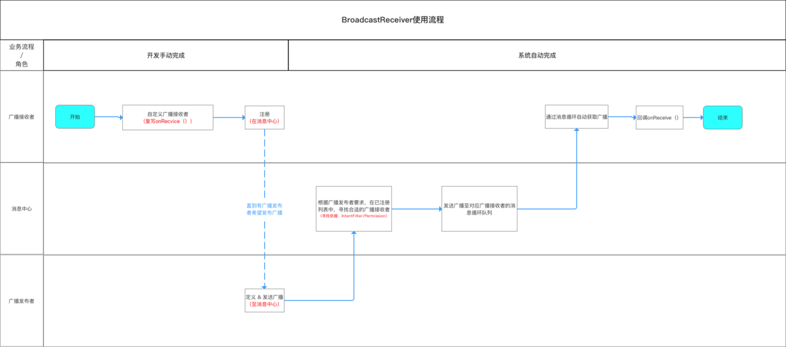

## 一、 定义

- `BroadcastReceiver`（广播接收器），属于Android四大组件之一
- 在Android开发中，BroadcastReceiver的应用场景非常多广播，是一个全局的监听器，属于`Android`四大组件之一

> `Android` 广播分为两个角色：广播发送者、广播接收者

## 二、 作用

- 用于监听 / 接收 应用发出的广播消息，并做出响应
- 应用场景 
  - 不同组件之间通信（包括应用内 / 不同应用之间）
  - 与 `Android` 系统在特定情况下的通信（如当电话呼入时、网络可用时）
  - 多线程通信

## 三、实现原理

- `Android`中的广播使用了设计模式中的**观察者模式**：基于消息的发布/订阅事件模型。

  > 因此，Android将广播的**发送者 和 接收者 解耦**，使得系统方便集成，更易扩展

- 模型中有3个角色：

  1. 消息订阅者（广播接收者）
  2. 消息发布者（广播发布者）
  3. 消息中心（`AMS`，即`Activity Manager Service`）


- 原理描述：

  1. 广播接收者 通过 `Binder`机制在 `AMS` 注册

  2. 广播发送者 通过 `Binder` 机制向 `AMS` 发送广播

  3. `AMS` 根据 广播发送者 要求，在已注册列表中，寻找合适的广播接收者

     > 寻找依据：`IntentFilter / Permission`

  4. `AMS`将广播发送到合适的广播接收者相应的消息循环队列中；

  5. 广播接收者通过 消息循环 拿到此广播，并回调 `onReceive()`

**特别注意**：广播发送者 和 广播接收者的执行 是 **异步**的，发出去的广播不会关心有无接收者接收，也不确定接收者到底是何时才能接收到；

## 四、具体使用

具体使用流程如下：



接下来我将一步步介绍如何使用

> 即上图中的 **开发者手动完成部分**

### 4.1 自定义广播接收者BroadcastReceiver

- 继承自BroadcastReceivre基类

- 必须复写抽象方法onReceive()方法

  > 1. 广播接收器接收到相应广播后，会自动回调onReceive()方法
  > 2. 一般情况下，onReceive方法会涉及与其他组件之间的交互，如发送Notification、启动service等
  > 3. 默认情况下，广播接收器运行在UI线程，因此，onReceive方法不能执行耗时操作，否则将导致ANR。

- 代码范例 *mBroadcastReceiver.java*

```java
public class mBroadcastReceiver extends BroadcastReceiver {

  //接收到广播后自动调用该方法
  @Override
  public void onReceive(Context context, Intent intent) {
    //写入接收广播后的操作
    }
}
```

### 4.2 广播接收器注册

注册的方式分为两种：静态注册、动态注册

#### 4.2.1 静态注册

- 在AndroidManifest.xml里通过 标签声明
- 属性说明：

```xml
<receiver
  android:enabled=["true" | "false"]
  //此broadcastReceiver能否接收其他App的发出的广播
  //默认值是由receiver中有无intent-filter决定的：如果有intent-filter，默认值为true，否则为false
  android:exported=["true" | "false"]
  android:icon="drawable resource"
  android:label="string resource"
  //继承BroadcastReceiver子类的类名
  android:name=".mBroadcastReceiver"
  //具有相应权限的广播发送者发送的广播才能被此BroadcastReceiver所接收；
  android:permission="string"
  //BroadcastReceiver运行所处的进程
  //默认为app的进程，可以指定独立的进程
  //注：Android四大基本组件都可以通过此属性指定自己的独立进程
  android:process="string" >

  //用于指定此广播接收器将接收的广播类型
  //本示例中给出的是用于接收网络状态改变时发出的广播
  <intent-filter>
    <action android:name="android.net.conn.CONNECTIVITY_CHANGE" />
  </intent-filter>
</receiver>
```

- 注册示例

  ```xml
  <receiver
    //此广播接收者类是mBroadcastReceiver
    android:name=".mBroadcastReceiver" >
    //用于接收网络状态改变时发出的广播
    <intent-filter>
        <action android:name="android.net.conn.CONNECTIVITY_CHANGE" />
    </intent-filter>
  </receiver>
  ```

  当此App首次启动时，系统会自动实例化mBroadcastReceiver类，并注册到系统中。

#### 4.2.2 动态注册

在代码中通过调用Context的*registerReceiver（）*方法进行动态注册BroadcastReceiver，具体代码如下：

```Java
@Override
protected void onResume() {
    super.onResume();

    //实例化BroadcastReceiver子类 &  IntentFilter
    mBroadcastReceiver mBroadcastReceiver = new mBroadcastReceiver();
    IntentFilter intentFilter = new IntentFilter();

    //设置接收广播的类型
    intentFilter.addAction(android.net.conn.CONNECTIVITY_CHANGE);

    //调用Context的registerReceiver（）方法进行动态注册
    registerReceiver(mBroadcastReceiver, intentFilter);
}


//注册广播后，要在相应位置记得销毁广播
//即在onPause() 中unregisterReceiver(mBroadcastReceiver)
//当此Activity实例化时，会动态将MyBroadcastReceiver注册到系统中
//当此Activity销毁时，动态注册的MyBroadcastReceiver将不再接收到相应的广播。
@Override
protected void onPause() {
    super.onPause();
    //销毁在onResume()方法中的广播
    unregisterReceiver(mBroadcastReceiver);
}
```

### 特别注意

- 动态广播最好在Activity的onResume()注册、onPause()注销。

- 原因：

  对于动态广播，有注册就必然得有注销，否则会导致**内存泄露**

  > 重复注册、重复注销也不允许

#### 4.2.3 两种注册方式的区别


### 4.3 广播发送者向AMS发送广播

#### 4.3.1 广播的发送

- 广播是用”意图（Intent）“标识
- 定义广播的本质：定义广播所具备的“意图（Intent）”
- 广播发送：广播发送者将此广播的”意图“通过**sendBroadcast()方法**发送出去

#### 4.3.2 广播的类型

广播的类型主要分为5类：

- 普通广播（Normal Broadcast）
- 系统广播（System Broadcast）
- 有序广播（Ordered Broadcast）
- 粘性广播（Sticky Broadcast）
- App应用内广播（Local Broadcast）

具体说明如下：

**①. 普通广播（Normal Broadcast）**

即开发者自身定义intent的广播（最常用）。发送广播使用如下：

```Java
Intent intent = new Intent();
//对应BroadcastReceiver中intentFilter的action
intent.setAction(BROADCAST_ACTION);
//发送广播
sendBroadcast(intent);
```

- 若被注册了的广播接收者中注册时intentFilter的action与上述匹配，则会接收此广播（即进行回调onReceive()）。如下mBroadcastReceiver则会接收上述广播

```Java
<receiver 
    //此广播接收者类是mBroadcastReceiver
    android:name=".mBroadcastReceiver" >
    //用于接收网络状态改变时发出的广播
    <intent-filter>
        <action android:name="BROADCAST_ACTION" />
    </intent-filter>
</receiver>
```

- 若发送广播有相应权限，那么广播接收者也需要相应权限

**②. 系统广播（System Broadcast）**

- Android中内置了多个系统广播：只要涉及到手机的基本操作（如开机、网络状态变化、拍照等等），都会发出相应的广播
- 每个广播都有特定的Intent - Filter（包括具体的action），Android系统广播action如下：

| 系统操作                                                     | action                               |
| :----------------------------------------------------------- | :----------------------------------- |
| 监听网络变化                                                 | android.net.conn.CONNECTIVITY_CHANGE |
| 关闭或打开飞行模式                                           | Intent.ACTION_AIRPLANE_MODE_CHANGED  |
| 充电时或电量发生变化                                         | Intent.ACTION_BATTERY_CHANGED        |
| 电池电量低                                                   | Intent.ACTION_BATTERY_LOW            |
| 电池电量充足（即从电量低变化到饱满时会发出广播               | Intent.ACTION_BATTERY_OKAY           |
| 系统启动完成后(仅广播一次)                                   | Intent.ACTION_BOOT_COMPLETED         |
| 按下照相时的拍照按键(硬件按键)时                             | Intent.ACTION_CAMERA_BUTTON          |
| 屏幕锁屏                                                     | Intent.ACTION_CLOSE_SYSTEM_DIALOGS   |
| 设备当前设置被改变时(界面语言、设备方向等)                   | Intent.ACTION_CONFIGURATION_CHANGED  |
| 插入耳机时                                                   | Intent.ACTION_HEADSET_PLUG           |
| 未正确移除SD卡但已取出来时(正确移除方法:设置--SD卡和设备内存--卸载SD卡) | Intent.ACTION_MEDIA_BAD_REMOVAL      |
| 插入外部储存装置（如SD卡）                                   | Intent.ACTION_MEDIA_CHECKING         |
| 成功安装APK                                                  | Intent.ACTION_PACKAGE_ADDED          |
| 成功删除APK                                                  | Intent.ACTION_PACKAGE_REMOVED        |
| 重启设备                                                     | Intent.ACTION_REBOOT                 |
| 屏幕被关闭                                                   | Intent.ACTION_SCREEN_OFF             |
| 屏幕被打开                                                   | Intent.ACTION_SCREEN_ON              |
| 关闭系统时                                                   | Intent.ACTION_SHUTDOWN               |
| 重启设备                                                     | Intent.ACTION_REBOOT                 |

注：当使用系统广播时，只需要在注册广播接收者时定义相关的action即可，并不需要手动发送广播，当系统有相关操作时会自动进行系统广播

**③. 有序广播（Ordered Broadcast）**

- 定义 发送出去的广播被广播接收者按照先后顺序接收

  > 有序是针对广播接收者而言的

- 广播接受者接收广播的顺序规则（同时面向静态和动态注册的广播接受者）

  1. 按照Priority属性值从大-小排序；
  2. Priority属性相同者，动态注册的广播优先；

- 特点

  1. 接收广播按顺序接收
  2. 先接收的广播接收者可以**对广播进行截断**，即后接收的广播接收者不再接收到此广播；
  3. 先接收的广播接收者可以**对广播进行修改**，那么后接收的广播接收者将接收到被修改后的广播

- 具体使用 有序广播的使用过程与普通广播非常类似，差异仅在于广播的发送方式：

  ```Java
  sendOrderedBroadcast(intent);
  ```

**④. App应用内广播（Local Broadcast）**

- 背景 Android中的广播可以跨App直接通信（exported对于有intent-filter情况下默认值为true）

- 冲突 可能出现的问题：

  - 其他App针对性发出与当前App intent-filter相匹配的广播，由此导致当前App不断接收广播并处理；
  - 其他App注册与当前App一致的intent-filter用于接收广播，获取广播具体信息； 即会出现安全性 & 效率性的问题。

- 解决方案 使用App应用内广播（Local Broadcast）

  > 1. App应用内广播可理解为一种局部广播，广播的发送者和接收者都同属于一个App。
  > 2. 相比于全局广播（普通广播），App应用内广播优势体现在：安全性高 & 效率高

- 具体使用1 - 将全局广播设置成局部广播

  1. 注册广播时将exported属性设置为*false*，使得非本App内部发出的此广播不被接收；

  2. 在广播发送和接收时，增设相应权限permission，用于权限验证；

  3. 发送广播时指定该广播接收器所在的包名，此广播将只会发送到此包中的App内与之相匹配的有效广播接收器中。

     > 通过 **intent.setPackage(packageName)** 指定报名

- 具体使用2 - 使用封装好的LocalBroadcastManager类 使用方式上与全局广播几乎相同，只是注册/取消注册广播接收器和发送广播时将参数的context变成了LocalBroadcastManager的单一实例

  > 注：对于LocalBroadcastManager方式发送的应用内广播，只能通过LocalBroadcastManager动态注册，不能静态注册

```Java
//注册应用内广播接收器
//步骤1：实例化BroadcastReceiver子类 & IntentFilter mBroadcastReceiver 
mBroadcastReceiver = new mBroadcastReceiver(); 
IntentFilter intentFilter = new IntentFilter(); 

//步骤2：实例化LocalBroadcastManager的实例
localBroadcastManager = LocalBroadcastManager.getInstance(this);

//步骤3：设置接收广播的类型 
intentFilter.addAction(android.net.conn.CONNECTIVITY_CHANGE);

//步骤4：调用LocalBroadcastManager单一实例的registerReceiver（）方法进行动态注册 
localBroadcastManager.registerReceiver(mBroadcastReceiver, intentFilter);

//取消注册应用内广播接收器
localBroadcastManager.unregisterReceiver(mBroadcastReceiver);

//发送应用内广播
Intent intent = new Intent();
intent.setAction(BROADCAST_ACTION);
localBroadcastManager.sendBroadcast(intent);
```

**⑤. 粘性广播（Sticky Broadcast）**

由于在Android5.0 & API 21中已经失效，所以不建议使用，在这里也不作过多的总结。