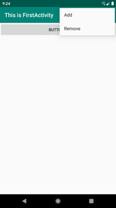
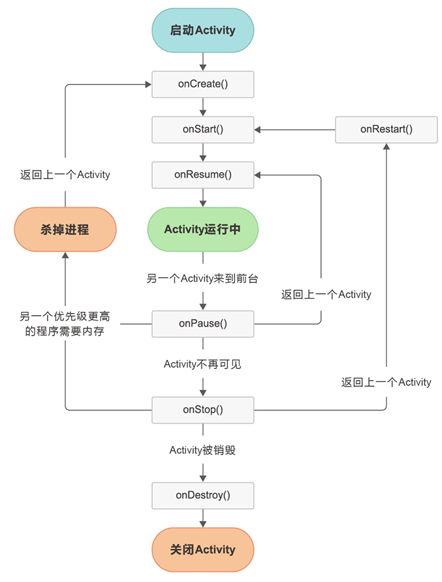
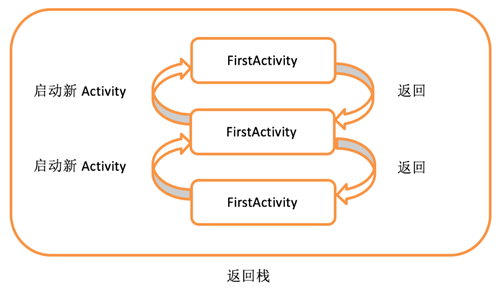
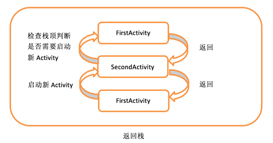
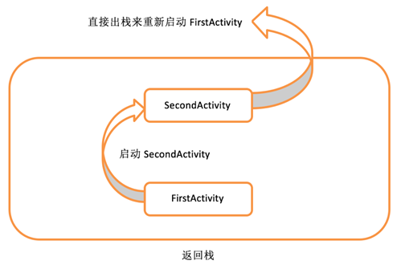
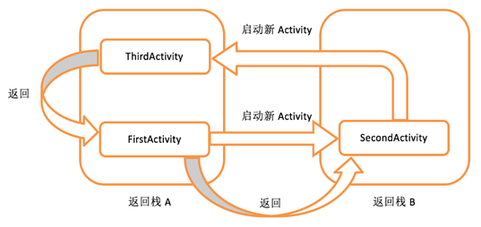

## Activity

### 基础

#### 1.如何Activity配置

新建Activity，所有的Activity都要在AndroidManifest.xml中进行注册才能生效。Activity的注册声明要放在< application >标签内，并通过< activity >标签来对Activity进行注册。

```kotlin
	<application …>
        <activity android:name=".FirstActivity" android:label="This is FirstActivity">
            <intent-filter>
                <action android:name="android.intent.action.MAIN" />
                <category android:name="android.intent.category.LAUNCHER" />
            </intent-filter>
        </activity>
    </application>
```


#### 2.如何构成页面

开发中经常将逻辑（Activity）与视图（Layout）进行分离。

通过setContentView(R.layout.first_layout)实现Activity和Layout的绑定（给Activity添加一个Layout）。

```kotlin
setContentView(R.layout.first_layout)
```


#### 3.Toast消息推送

Toast是Android系统提供的一种非常好的提醒方式。在程序中可以使用它将一些短小的信息通知给用户，这些信息会在一段时间后自动消失，并且不会占用任何屏幕空间。

```kotlin
	button1.setOnClickListener {
        Toast.makeText(this, "You clicked Button 1", Toast.LENGTH_SHORT).show()
    }
```

#### 4.Menu

Menu提供了一种机制，可以让界面中的菜单项在默认情况下不显示。

只有当用户主动点击了菜单按钮时，才会弹出里面具体的内容，因此它不会占用任何Activity的空间。

```kotlin
override fun onCreateOptionsMenu(menu: Menu?): Boolean {
    menuInflater.inflate(R.menu.main, menu)
    return true
}
```




#### 5.Activity销毁

方法

- 点击手机的back按钮
- finish()方法

Activity类提供了一个finish()方法，只需要调用一下这个方法就可以销毁当前的Activity了。

```kotlin
button1.setOnClickListener {
    finish()
}
```

### Activity之间的切换

- Intent：Intent是Android程序中各组件之间进行交互的一种重要方式，它不仅可以指明当前组件想要执行的动作，还可以在不同组件之间传递数据。

#### Intent的使用方法

- **显式Intent**：明确指定启动某个Activity
- **隐式Intent**：指定了一系列更为抽象的action和category等信息，然后交由系统去分析这个Intent，并帮我们找出合适的Activity去启动

```kotlin
//显式 
button1.setOnClickListener {
    //从FirstActivity跳转到SecondActivity。
    val intent = Intent(this, SecondActivity::class.java)  
    startActivity(intent)
}

//隐式
button1.setOnClickListener {
    //你的应用程序中需要展示一个网页，这时没有必要自己去实现一个浏览器
    //只需要调用系统的浏览器来打开这个网页即可
    val intent = Intent(Intent.ACTION_VIEW)
    intent.data = Uri.parse("https://www.baidu.com")
    startActivity(intent)
}
```

**Intent传输数据**

使用Intent传输数据向下一个Activity传输数据，Intent提供了putExtra()方法进行(key,value)数据的添加。

```kotlin
//数据发送方
button1.setOnClickListener {
    val data1 = "this is my data"
    val data2 = "this is my data2"
    val intent = Intent(this, SecondActivity::class.java)  
    intent.putExtra("data1", data1);
    intent.putExtra("data2", data2);
    startActivity(intent)
}

//数据接收方
override fun onCreate(saveInstanceState: Bundle){
    super.onCreate(saveInstanceState)
    setContentView(R.layout.first_layout)
    val data1 = intent.getStringExtra("data1")
    val data2 = intent.getStringExtra("data2")
}
```

**将数据返回给上一层Activity**

Activity使用startActivityForResult()获取下一层Activity数据

```kotlin
//发送方

//传递发送请求，1为请求码，可能有多个请求，用于返回数据时进行区分
val intent = Intent(this, SecondActivity::class.java)
startActivityForResult(intent, 1)
    
//返回的数据获取
override fun onActivityResult(requestCode: Int, resultCode: Int, data: Intent?) {
        when (requestCode) {
            1 -> if (resultCode == RESULT_OK) {
                val returnedData = data?.getStringExtra("data_return")
                Log.d("FirstActivity", returnedData)
            }
        }
    }
 
//数据接收方
button2.setOnClickListener {
    val intent = Intent()
    intent.putExtra("data_return", "Hello FirstActivity")
    setResult(RESULT_OK, intent)
    finish()
}

//如果没有数据直接返回了怎么办，使用onBackPressed强制添加数据
	override fun onBackPressed() {
        val intent = Intent()
        intent.putExtra("data_return", "Hello FirstActivity")
        setResult(RESULT_OK, intent)
        finish()
    }
```


### Activity的生命周期

Android是使用任务（task）来管理Activity的，一个任务就是一组存放在栈里的Activity的集合，这个栈也被称作返回栈（back stack）。

栈是一种后进先出的数据结构，在默认情况下，每当我们启动了一个新的Activity，它就会在返回栈中入栈，并处于栈顶的位置。而每当我们按下Back键或调用finish()方法去销毁一个Activity时，处于栈顶的Activity就会出栈，前一个入栈的Activity就会重新处于栈顶的位置。

系统总是会显示处于栈顶的Activity给用户。


#### 1. Activity四种状态：

- 运行状态：处于返回栈栈顶，不回收；
- 暂停状态：Activity不处于栈顶状态，但是Activity仍然视觉可见（全屏模式下的对话框），不回收；
- 停止状态：Activity不处于栈顶，也不可见，可回收；
- 销毁状态：从返回栈移除，回收。

#### 2. Activity的生存周期



- onCreate() ：第一次被创建的时候调用（初始化、加载布局、绑定事件等）。
- onStart() ：由不可见变为可见的时候调用。
- onResume()：准备好和用户进行交互的时候调用。
- onPause()：系统准备去启动或者恢复另一个Activity的时候调用。
- onStop() ：Activity完全不可见的时候调用。
- onDestroy()：被销毁之前调用，释放资源。
- onRestart() ：Activity由停止状态变为运行状态之前调用，也就是Activity被重新启动了。

七个生命周期可以看为三组 + 单个(onRestart())

- 完整生命周期：onCreate()  +  onDestroy()，两者之间是完整的生命周期；
- 可见生命周期：onStart() + onStop()，用户对Activity是可见的；
- 前台生命周期：onResume() + onPause()，两者之间Activity总是运行的，大多数时候Activity处于该状态。


#### 3. onSavaInstanceState()

当还有用的Activity被回收了怎么办？可以使用onSavaInstanceState(outState: Bundle)保存该Activity的数据，下次再加载该Activity时，在onCreate(outState: Bundle)中读取数据

```kotlin
fun onSavaInstanceState(outState: Bundle){
    super.onSavaInstanceState(outState)
    val data = "Activity is gc ";
    outState.putString("key", data);
}

fun onCreat(outState: Bundle){
    if(outState != null){
        val data = outState.getString("data_key");
    }
}
```

### Activity启动方式

1. standard
2. singleTop
3. singleTask
4. singleInstance

- **standard**：Activity默认的启动模式，在不进行显式指定的情况下，所有Activity都会自动使用这种启动模式。

  在standard模式下，每当启动一个新的Activity，它就会在返回栈中入栈，并处于栈顶的位置。

  对于使用standard模式的Activity，系统不会在乎这个Activity是否已经在返回栈中存在，每次启动都会创建一个该Activity的新实例。

  

- **singleTop**：当Activity的启动模式指定为singleTop，在启动Activity时如果发现返回栈的栈顶已经是该Activity，则认为可以直接使用它，不会再创建新的Activity实例。

  但是Activity不再栈顶则会新建Activity。

  

- **singleTask**：当Activity的启动模式指定为singleTask，每次启动该Activity时，系统首先会在返回栈中检查是否存在该Activity的实例，如果发现已经存在则直接使用该实例，**并把在这个Activity之上的所有其他Activity统统出栈**，如果没有发现就会创建一个新的Activity实例。

  

- **singleInstance**：当Activity的启动模式指定为singleInstance，会启用一个新的返回栈来管理这个Activity。

  假设我们的程序中有一个Activity是允许其他程序调用的，如果想实现其他程序和我们的程序可以共享这个Activity的实例，就可以使用singleInstance模式。

  在这种模式下，会有一个单独的返回栈来管理这个Activity，不管是哪个应用程序来访问这个Activity，都共用的同一个返回栈，也就解决了共享Activity实例的问题。

  

## BroadcastReceiver

每个应用程序都可以对自己感兴趣的广播进行注册，这样该程序就只会收到自己所关心的广播内容，这些广播可能是来自于系统的，也可能是来自于其他应用程序的。Android提供了一套完整的API，允许应用程序自由地发送和接收广播。

**广播的发送也是通过Intent实现。**

### 1. 接收广播

- **动态注册**：在Activity代码动态定义和绑定。
  - 动态注册应用**启动后**才能接收广播，因为是在代码onCreat()中注册的。
- **静态注册**：创建继承于BroadcastReceiver的类，并在AndroidManifest.xml中进行静态配置。
  - 静态注册的**不需要系统启动**就可以接收广播。
  - 但是恶意应用可能大量静态注册监听系统广播，实现自启动、后台传输数据等等，因此Google每次都会大量削减静态注册功能，到目前为止所有隐式广播都不能通过静态注册的方式接收。

无论动态静态广播，在使用时不要在onReceive()中进行大量的逻辑操作，因为BroadcastReceiver()不能开启线程，导致影响用户体验。

#### 1.1. 动态注册

在代码中动态定义和注册

```kotlin
	//继承BroadcastReceiver()类
	//重写onReceive（）方法，进行需要进行的操作
	inner class TimeChangeReceiver : BroadcastReceiver() {
        override fun onReceive(context: Context, intent: Intent) {
            Toast.makeText(context, "Time has changed", Toast.LENGTH_SHORT).show()
        }
    }

	//创建继承BroadcastReceiver实例
	lateinit var timeChangeReceiver: TimeChangeReceiver

    override fun onCreate(savedInstanceState: Bundle?) {
        super.onCreate(savedInstanceState)
        setContentView(R.layout.activity_main)
        val intentFilter = IntentFilter()
        //监听目标广播
        intentFilter.addAction("android.intent.action.TIME_TICK")
        timeChangeReceiver = TimeChangeReceiver()
        //注册广播
        registerReceiver(timeChangeReceiver, intentFilter)
    }
	
	//销毁注册的BroadcastReceiver
	override fun onDestroy() {
        super.onDestroy()
        unregisterReceiver(timeChangeReceiver)
    }
```

#### 1.2. 静态注册

新建BroadcastReceiver类，在AndroidManifest.xml中进行静态配置。

1.新建类

```kotlin
//新建roadcastReceiver类，继承自BroadcastReceiver（）
class BootCompleteReceiver : BroadcastReceiver() {
    override fun onReceive(context: Context, intent: Intent) {
        Toast.makeText(context, "Boot Complete", Toast.LENGTH_LONG).show()
    }   
}
```

2.在AndroidManifest.xml中进行静态配置。

```kotlin
	//进行部分敏感性操作，需要获取系统权限时，需要进行声明，否则系统可能崩溃
	<uses-permission android:name="android.permission.RECEIVE_BOOT_COMPLETED" />

    <application
        android:allowBackup="true"
        android:icon="@mipmap/ic_launcher"
        android:label="@string/app_name"
        android:roundIcon="@mipmap/ic_launcher_round"
        android:supportsRtl="true"
        android:theme="@style/AppTheme">

        <receiver
            android:name=".BootCompleteReceiver"
            android:enabled="true"
            android:exported="true">
            <intent-filter>
                <action android:name="android.intent.action.BOOT_COMPLETED" />
            </intent-filter>
        </receiver>
    </application>

```


### 2. 发送广播

- **标准广播**：一种完全异步执行的广播，sendBroadcast()。
  - 在广播发出之后，所有的BroadcastReceiver几乎都会在同一时刻接收到收到这条广播消息，因此它们之间没有任何先后顺序可言。这种广播的效率会比较高，但同时也意味着它是无法被截断的
- **顺序广播**：一种同步执行的广播。
  - 在广播发出之后，同一时刻只会有一个BroadcastReceiver能够收到这条广播消息，当这个BroadcastReceiver中的逻辑执行完毕后，广播才会继续传递。可对后方广播进行截断。

广播还可以根据接收方是否为特定对象进行分类：

- 隐式广播：没有特定对象，默认情况下发送都是隐式广播
- 显示广播：需要绑定包名，确定特定应用的广播

#### 2.1. 发送标准广播

构建一个Intent对象，并把要发送的广播的值传入，调用sendBroadcast()方法发送。

```kotlin
class MainActivity : AppCompatActivity() {
    
    override fun onCreate(savedInstanceState: Bundle?) {
        super.onCreate(savedInstanceState)
        setContentView(R.layout.activity_main)
        button.setOnClickListener {
            //intent类型
            val intent = Intent("com.example.broadcasttest.MY_BROADCAST")
            //广播中添加数据
            intent.putExtra("data", "data_value")
            //绑定包名，设置为显式广播
            intent.setPackage(packageName)
            //发送广播sendBroadcast()
            sendBroadcast(intent)
        }
    }   
}
```

#### 2.2. 发送顺序广播

只是将方法改为sendOrderedBroadcast(intent, 权限)，接收相似，可以使用abortBoardcast() 进行广播截断

```kotlin
//发送器
class MainActivity : AppCompatActivity() {   
    override fun onCreate(savedInstanceState: Bundle?) {
        super.onCreate(savedInstanceState)
        setContentView(R.layout.activity_main)
        button.setOnClickListener {
            val intent = Intent("com.example.broadcasttest.MY_BROADCAST")
            intent.setPackage(packageName)
            sendOrderedBroadcast(intent, null)
        }
    }   
}

//接收器
class MyBroadcastReceiver : BroadcastReceiver() {
    override fun onReceive(context: Context, intent: Intent) {
        Toast.makeText(context, "received in MyBroadcastReceiver", Toast.LENGTH_SHORT).show()
        //截断后续广播
        abortBoardcast() 
    }
}
```

### 3. 广播的用途

**强制下线功能**

接收到一个广播之后，在当前Activity强制显示一个消息框，只能点击消息框的确认按钮，点击按钮关闭所有Activity，通过返回登录Activity。

