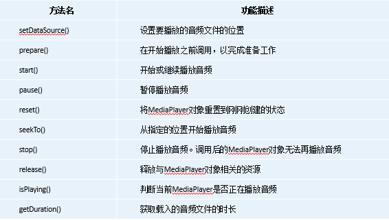
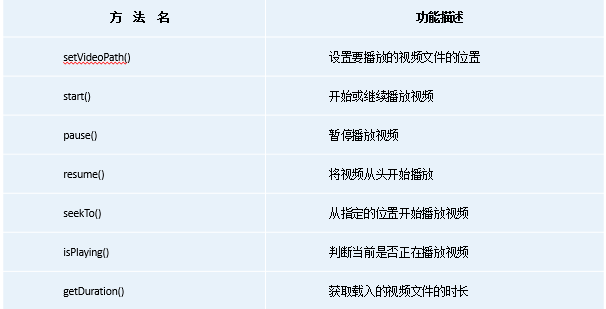

# 多媒体

## 1. 通知(Notification)

当某个应用程序希望向用户发出一些提示信息，而该应用程序又不在前台运行时，就可以借助Notification来实现。

### 1.1. 通知渠道

由于通知被应用开发者滥用，Android 8.0系统引入了通知渠道，通知渠道是实现对通知进行管理，开发者将通知分为很多类，不同类有不同的效果（震动、提示音等等），同时用户可以对通道中应用进行管理，进而对用户的影响。

**通知渠道一旦创建之后就不能再修改**

#### 1. 创建通道渠道

通道函数：NotificationChannel(channelId, channelName, importance)

- channelId：渠道ID可以随便定义，只要保证全局唯一性就可以。
- 渠道名称：给用户看的，需要可以清楚地表达这个渠道的用途。
- 重要性：通知的重要等级主要有IMPORTANCE_HIGH、IMPORTANCE_DEFAULT、IMPORTANCE_LOW、IMPORTANCE_MIN这几种，对应的重要程度依次从高到低，不同的重要等级会决定通知的不同行为。

```kotlin
if (Build.VERSION.SDK_INT >= Build.VERSION_CODES.O) {
    val channel = NotificationChannel(channelId, channelName, importance)
    manager.createNotificationChannel(channel)
}
```

### 2. 基本用法

通知可以在多个组件中创建，Activity, BroadcastReceiver, Service等

PS：由于Android在API版本之间变化很大，因此提供了AndroidX库实现版本兼容。8.0就不支持通知渠道了。

#### 2.1. 通知的创建

```kotlin
//创建空白通知
notification = NotificationCompat.Builder(context, channelId).build()

//1.创建通知管理器
val manager = getSystemService(Context.NOTIFICATION_SERVICE) as NotificationManager
getSystemService()//获取系统的那个服务

//2.创建一个包含内容的通知
val notification = NotificationCompat.Builder(context, channelId)
        .setContentTitle("This is content title")
        .setContentText("This is content text")
        .setSmallIcon(R.drawable.small_icon)//小图标	
        .setLargeIcon(BitmapFactory.decodeResource(getResources(), R.drawable.large_icon))//大图标
        .build()

//3.显示通知
manager.notify(notificationChannelId, notification)
```

以上的通知是单纯的通知，无法点击动作，如果需要加上跳转和转入某个Activity，则需要加意图Intent ( PendingIntent )

#### 2.2. PendingIntent 

PendingIntent 和普通Intent相似都是传递消息和跳转的，但是Intent立刻执行跳转（是其他触及其他控件），PendingIntent 需要用户触发，然后进行跳转。

PendingIntent 可以通过getActivity(), getService(), getBroadcast()获得 PendingIntent 实例，包含四个参数。

- Context
- Xxxx
- Inetnt
- action

```kotlin
//在notification添加
.setContentIntent(pi)
```

#### 2.3. 通知消除

- .setAutoCancel( true )：自动消除
- manager.cancel( NotificationID )：显示消除

#### 2.4. 进阶

- setStyle()：可以替代setContentText()方法，并在setStyle()方法中创建一个NotificationCompat.BigTextStyle对象，这个对象就是用于封装长文字信息的，只要调用它的bigText()方法并将文字内容传入就可以了。
- 在参数中创建一个NotificationCompat.BigPictureStyle对象，这个对象就是用于设置大图片的，然后调用它的bigPicture()方法并将图片传入即可。

## 图片

可以直接调用摄像头，但是通常我们是调用相机程序和相册获取图片

**相机**

```kotlin
class MainActivity : AppCompatActivity() {
    lateinit var imageUri: Uri
    lateinit var outputImage: File
    override fun onCreate(savedInstanceState: Bundle?) {
        super.onCreate(savedInstanceState)
        setContentView(R.layout.activity_main)
        outputImage = File(externalCacheDir, "output_image.jpg")
        if (outputImage.exists()) {
            outputImage.delete()
        }
        outputImage.createNewFile()
        imageUri = if (Build.VERSION.SDK_INT >= Build.VERSION_CODES.N) {
            //7.0开始不允许直接访问任意位置，需要FileProvider访问数据，用于保护用户数据安全
            //需要在AndroidManifest中对FileProvider进行注册
            FileProvider.getUriForFile(this, "com.example.cameraalbumtest.fileprovider", outputImage)
        } else {
            Uri.fromFile(outputImage)
        }
        //调用相机
        val intent = Intent("android.media.action.IMAGE_CAPTURE")
        intent.putExtra(MediaStore.EXTRA_OUTPUT, imageUri)
        startActivityForResult(intent, takePhoto)
    }

    override fun onActivityResult(requestCode: Int, resultCode: Int, data: Intent?) {
        super.onActivityResult(requestCode, resultCode, data)
        when (requestCode) {
            takePhoto -> {
                if (resultCode == Activity.RESULT_OK) {val bitmap = BitmapFactory.decodeStream(contentResolver.openInputStream(imageUri))
                    imageView.setImageBitmap( bitmap)
                }
            }
        }
    }
    ...
}

```

相册：

```kotlin
class MainActivity : AppCompatActivity() {

    override fun onCreate(savedInstanceState: Bundle?) {
        val intent = Intent(Intent.ACTION_OPEN_DOCUMENT)
        intent.addCategory(Intent.CATEGORY_OPENABLE) 
        intent.type = "image/*"
        startActivityForResult(intent, fromAlbum)
    }

    override fun onActivityResult(requestCode: Int, resultCode: Int, data: Intent?) {
        super.onActivityResult(requestCode, resultCode, data)
        when (requestCode) {
            fromAlbum -> {
                if (resultCode == Activity.RESULT_OK && data != null) {
                    data.data?.let { uri ->
                        val bitmap = getBitmapFromUri(uri)
                        imageView.setImageBitmap(bitmap)
                    }
                }
            }
        }
    }

    private fun getBitmapFromUri(uri: Uri) = contentResolver.openFileDescriptor(uri, "r")?.use {
        BitmapFactory.decodeFileDescriptor(it.fileDescriptor)
    }
    …
}
```


## 音视频

### 1.音频

在Android中播放音频文件一般都是使用MediaPlayer类实现的，它对多种格式的音频文件提供了非常全面的控制方法，从而使播放音乐的工作变得十分简单。下表列出了MediaPlayer类中一些较为常用的控制方法。



### 2.视频

播放视频文件其实并不比播放音频文件复杂，主要是使用VideoView类来实现的。这个类将视频的显示和控制集于一身，我们仅仅借助它就可以完成一个简易的视频播放器。VideoView的用法和MediaPlayer也比较类似，下表列出了MediaPlayer类中一些较为常用的控制方法。

