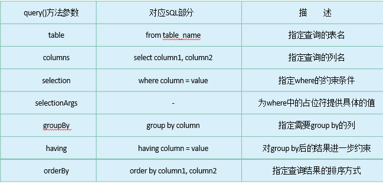

# 数据存储

将需要保存的数据保存到本地，避免应用关闭数据丢失。

有以下三大类方式数据持久化：

1. 文件存储
2. SharedPreferences存储
3. SQLite存储

## 1. 文件存储

最基本的储存方法，不对储存数据进行任何格式化处理，适用于储存简单的二进制数据和文本数据。

- **写入**：Context类 openFileOutput( filename, mode ) 方法，可以用于将数据存储到指定的文件中。
  - **filename**：可以不包含路径，直接文件名，因为所有的文件会默认存储到/data/data/< package name>/files/目录下。
  - **mode**：文件的操作模式，包括MODE_PRIVATE(默认), MODE_APPEND。
    - **MODE_PRIVATE**：如果文件已存在，会覆盖掉之前的文件，否则创建新文件；
    - **MODE_APPEND**：如果文件已存在，会在文件之后添加数据，否则创建新文件。
- **读取**：Context类openFileInput( filename )方法，直接从写入的默认路径中读取文件。

示例：

```kotlin
	//写入
	try {
        val output = openFileOutput("data", Context.MODE_PRIVATE)
        val writer = BufferedWriter(OutputStreamWriter(output))
        writer.use {
            it.write(inputText)
        }
    } catch (e: IOException) {
        e.printStackTrace()
    }
	//读取
	val content = StringBuilder()
    try {
        val input = openFileInput("data")
        val reader = BufferedReader(InputStreamReader(input))
        reader.use {
            reader.forEachLine {
                content.append(it)
            }
        }
    } catch (e: IOException) {
        e.printStackTrace()
    }
    return content.toString()
```


## 2. SharedPreferences存储

SharedPreferences使用**键值对**的方式来存储数据，保存在filename.**xml**文件中，每一种数据类型都有不同响应的putXXX()和getXXX()方法。

**使用步骤**

1. 获取SharedPreferences对象：有两种方式获取该对象，Context 类和 Activity 类，
   - **Context**：Context.getSharedPreferences( filename, mode)
     - **filename**:  文件会默认存储到/data/data/< package name>/shared_prefs/目录下，只需要提供filename即可；
     - **mode**：目前仅支持MODE_PRIVATE模式，表示只有当前程序能访问该文件，其他方法已经废除。
   - **Activity** ：在 Activity 中直接 getSharedPreferences( mode )，filename默认为Activity名
2. 向SharedPreferences对象存储数据
   1. SharedPreferences.Editor对象：调用SharedPreferences对象的edit()方法获取该对象；
   2. 添加数据：向SharedPreferences.Editor对象中添加数据；
   3. 提交数据：调用apply()或者commit()方法将添加的数据提交。
      1. apply()无返回值
      2. commit()有boolean返回值

示例

```kotlin
//写入
val editor = getSharedPreferences("data", Context.MODE_PRIVATE).edit()
editor.putString("name", "Tom")
editor.putInt("age", 28)
editor.putBoolean("married", false)
editor.apply()

//读取
val prefs = getSharedPreferences("data", Context.MODE_PRIVATE)
val name = prefs.getString("name", "")
val age = prefs.getInt("age", 0)
val married = prefs.getBoolean("married", false)

```


## 3. SQLite存储

SQLite是一款轻量级的关系型数据库，它的运算速度非常快，占用资源很少。

SQLite不仅支持标准的SQL语法，还遵循了数据库的ACID事务。

### 3.1. SQLiteDatabase

#### 3.1.1. SQLiteOpenHelper

提供SQLiteOpenHelper抽象类（使用时需要继承）用于实现对数据库的创建和升级（增加表）。

SQLiteOpenHelper包含必须两个重写的抽象方法：onCreate()和onUpgarde()

- onCreate()：创建相应表
- onUpgarde()：升级数据库，新增表，当数据库已经完成创建之后不会再执行onCreate()方法，如果将数据库删除之后会丢失用户数据，所以在onUpgarde()实现新建表。执行时数据库版本号大于当前数据库版本号才会执行。

SQLiteOpenHelper创建和打开数据方法：getReadableDatabase()和getWriteableDatabase()方法，两种方法都可以创建和打开现有数据库（如果没有则创建），并返回可操作数据库对象。

- getReadableDatabase()：当数据库不可写入（例如磁盘已满），则返回只读数据库。
- getWriteableDatabase()：出现上述情况则会出现异常报错。

SQLiteOpenHelper的四个参数：

- Context：context：当前上下文，才能对数据库进行操作；
- String：name：数据库名；
- Cursor: curos：在查询时返回一个自定义的游标，一般置为null；
- Int：version：数据库版本号，可用于数据库升级。

示例

```kotlin
class MyDatabaseHelper(val context: Context, name: String, version: Int) : SQLiteOpenHelper(context, name, null, version) {

    private val createBook = "create table Book (" +
            "id integer primary key autoincrement," +
            "author text," +
            "price real," +
            "pages integer," +
            "name text)"

    override fun onCreate(db: SQLiteDatabase) {
        db.execSQL(createBook)
        Toast.makeText(context, "Create succeeded", Toast.LENGTH_SHORT).show()
    }

    override fun onUpgrade(db: SQLiteDatabase, oldVersion: Int, newVersion: Int) {
    }

}

```

#### 3.1.2. 数据的增删改查

SQLiteDatabase提供两种操作数据方法：自定义方法和原始SQL语句

- **SQLiteDatabase自定义的方法**：增删改查
  - **insert()**：三个参数insert(tablename, 默认值，ContentValues)
    - tablename：要插入数据表名
    -  默认值：用于在未指定添加数据的情况下给某些可为空的列自动赋值NULL，一般不用，直接传入null即可。
    - ContentValues：每个列名以及相应的待添加数据
  - **update()**：四个参数update(tablename, ContentValues，where,  value of where)，3和4本质上是组成一个具体的约束条件。
  - **delete()**：三个参数delete(tablename，where,  value of where )，最后两个参数同样组成约束条件。
  - **query()**：
    - 
- **原始SQL语句**
  - 支持直接使用SQL操作数据库

示例：

```kotlin
//SQLiteDatabase自定义方法

//insert
val dbHelper = MyDatabaseHelper(this, "BookStore.db", 2)
val db = dbHelper.writableDatabase
val values1 = ContentValues().apply {
    // 开始组装第一条数据
    put("name", "The Da Vinci Code")
    put("author", "Dan Brown")
    put("pages", 454)
    put("price", 16.96)
}
db.insert("Book", null, values1) // 插入一条数据

//delete
val dbHelper = MyDatabaseHelper(this, "BookStore.db", 2)
val db = dbHelper.writableDatabase
db.delete("Book", "pages > ?", arrayOf("500"))

//update
val dbHelper = MyDatabaseHelper(this, "BookStore.db", 2)            
val db = dbHelper.writableDatabase
val values = ContentValues()
values.put("price", 10.99)
db.update("Book", values, "name = ?", arrayOf("The Da Vinci Code"))

//select
val dbHelper = MyDatabaseHelper(this, "BookStore.db", 2)
val db = dbHelper.writableDatabase
// 查询Book表中所有的数据
val cursor = db.query("Book", null, null, null, null, null, null)
if (cursor.moveToFirst()) {
    do {
        // 遍历Cursor对象，取出数据并打印
        val name = cursor.getString(cursor.getColumnIndex("name"))
        val author = cursor.getString(cursor.getColumnIndex("author"))
        val pages = cursor.getInt(cursor.getColumnIndex("pages"))
        val price = cursor.getDouble(cursor.getColumnIndex("price"))
        Log.d("MainActivity", "book name is $name")
        Log.d("MainActivity", "book author is $author")
        Log.d("MainActivity", "book pages is $pages")
        Log.d("MainActivity", "book price is $price")
    } while (cursor.moveToNext())
}
cursor.close()


//原始SQL语句
db.execSQL(
    “insert into Book (name, author, pages, price) values(?, ?, ?, ?)”, arrayOf("The Da Vinci Code", "Dan Brown", "454", "16.96")
)

db.execSQL("update Book set price = ? where name = ?", arrayOf("10.99", "The Da Vinci Code"))

db.execSQL("delete from Book where pages > ?", arrayOf("500"))

val cursor = db.rawQuery("select * from Book", null)
```


### 3.2. Room

