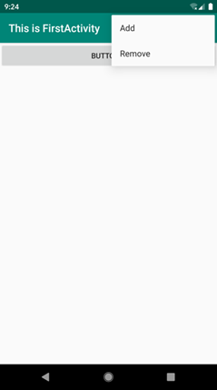
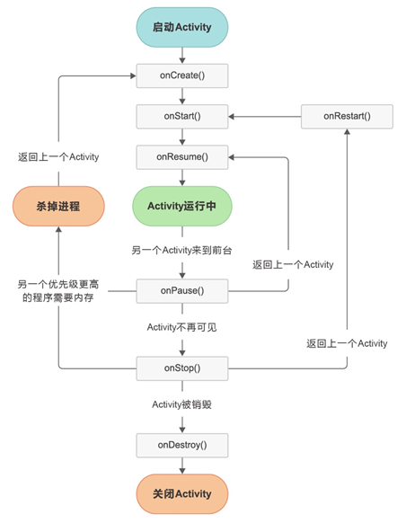
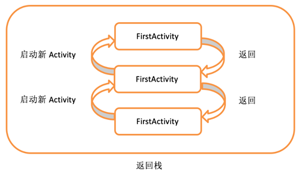
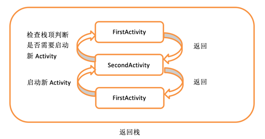
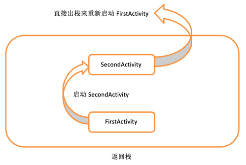

# 组件

## Activity

### 1. 基础

#### 1.1. 如何Activity配置

新建Activity，所有的Activity都要在AndroidManifest.xml中进行注册才能生效。Activity的注册声明要放在< application >标签内，并通过< activity >标签来对Activity进行注册。

```kotlin
	<application …>
        <activity android:name=".FirstActivity" android:label="This is FirstActivity">
            <intent-filter>
                <action android:name="android.intent.action.MAIN" />
                <category android:name="android.intent.category.LAUNCHER" />
            </intent-filter>
        </activity>
    </application>
```


#### 1.2. 如何构成页面

开发中经常将逻辑（Activity）与视图（Layout）进行分离。

通过setContentView(R.layout.first_layout)实现Activity和Layout的绑定（给Activity添加一个Layout）。

```kotlin
setContentView(R.layout.first_layout)
```


#### 1.3. Toast消息推送

Toast是Android系统提供的一种非常好的提醒方式。在程序中可以使用它将一些短小的信息通知给用户，这些信息会在一段时间后自动消失，并且不会占用任何屏幕空间。

```kotlin
	button1.setOnClickListener {
        Toast.makeText(this, "You clicked Button 1", Toast.LENGTH_SHORT).show()
    }
```

#### 1.4. Menu

Menu提供了一种机制，可以让界面中的菜单项在默认情况下不显示。

只有当用户主动点击了菜单按钮时，才会弹出里面具体的内容，因此它不会占用任何Activity的空间。

```kotlin
override fun onCreateOptionsMenu(menu: Menu?): Boolean {
    menuInflater.inflate(R.menu.main, menu)
    return true
}
```




#### 1.5. Activity销毁

方法

- 点击手机的back按钮
- finish()方法

Activity类提供了一个finish()方法，只需要调用一下这个方法就可以销毁当前的Activity了。

```kotlin
button1.setOnClickListener {
    finish()
}
```

### 2. Activity之间的切换

- Intent：Intent是Android程序中各组件之间进行交互的一种重要方式，它不仅可以指明当前组件想要执行的动作，还可以在不同组件之间传递数据。

#### 2. 1. Intent的使用方法

- **显式Intent**：明确指定启动某个Activity
- **隐式Intent**：指定了一系列更为抽象的action和category等信息，然后交由系统去分析这个Intent，并帮我们找出合适的Activity去启动

```kotlin
//显式 
button1.setOnClickListener {
    //从FirstActivity跳转到SecondActivity。
    val intent = Intent(this, SecondActivity::class.java)  
    startActivity(intent)
}

//隐式
button1.setOnClickListener {
    //你的应用程序中需要展示一个网页，这时没有必要自己去实现一个浏览器
    //只需要调用系统的浏览器来打开这个网页即可
    val intent = Intent(Intent.ACTION_VIEW)
    intent.data = Uri.parse("https://www.baidu.com")
    startActivity(intent)
}
```

**Intent传输数据**

使用Intent传输数据向下一个Activity传输数据，Intent提供了putExtra()方法进行(key,value)数据的添加。

```kotlin
//数据发送方
button1.setOnClickListener {
    val data1 = "this is my data"
    val data2 = "this is my data2"
    val intent = Intent(this, SecondActivity::class.java)  
    intent.putExtra("data1", data1);
    intent.putExtra("data2", data2);
    startActivity(intent)
}

//数据接收方
override fun onCreate(saveInstanceState: Bundle){
    super.onCreate(saveInstanceState)
    setContentView(R.layout.first_layout)
    val data1 = intent.getStringExtra("data1")
    val data2 = intent.getStringExtra("data2")
}
```

**将数据返回给上一层Activity**

Activity使用startActivityForResult()获取下一层Activity数据

```kotlin
//发送方

//传递发送请求，1为请求码，可能有多个请求，用于返回数据时进行区分
val intent = Intent(this, SecondActivity::class.java)
startActivityForResult(intent, 1)
    
//返回的数据获取
override fun onActivityResult(requestCode: Int, resultCode: Int, data: Intent?) {
        when (requestCode) {
            1 -> if (resultCode == RESULT_OK) {
                val returnedData = data?.getStringExtra("data_return")
                Log.d("FirstActivity", returnedData)
            }
        }
    }
 
//数据接收方
button2.setOnClickListener {
    val intent = Intent()
    intent.putExtra("data_return", "Hello FirstActivity")
    setResult(RESULT_OK, intent)
    finish()
}

//如果没有数据直接返回了怎么办，使用onBackPressed强制添加数据
	override fun onBackPressed() {
        val intent = Intent()
        intent.putExtra("data_return", "Hello FirstActivity")
        setResult(RESULT_OK, intent)
        finish()
    }
```


### 3. Activity的生命周期

Android是使用任务（task）来管理Activity的，一个任务就是一组存放在栈里的Activity的集合，这个栈也被称作返回栈（back stack）。

栈是一种后进先出的数据结构，在默认情况下，每当我们启动了一个新的Activity，它就会在返回栈中入栈，并处于栈顶的位置。而每当我们按下Back键或调用finish()方法去销毁一个Activity时，处于栈顶的Activity就会出栈，前一个入栈的Activity就会重新处于栈顶的位置。

系统总是会显示处于栈顶的Activity给用户。


#### 3.1. Activity四种状态：

- 运行状态：处于返回栈栈顶，不回收；
- 暂停状态：Activity不处于栈顶状态，但是Activity仍然视觉可见（全屏模式下的对话框），不回收；
- 停止状态：Activity不处于栈顶，也不可见，可回收；
- 销毁状态：从返回栈移除，回收。

#### 3.2. Activity的生存周期



- onCreate() ：第一次被创建的时候调用（初始化、加载布局、绑定事件等）。
- onStart() ：由不可见变为可见的时候调用。
- onResume()：准备好和用户进行交互的时候调用。
- onPause()：系统准备去启动或者恢复另一个Activity的时候调用。
- onStop() ：Activity变为完全不可见的时候调用。
- onDestroy()：被销毁之前调用，释放资源。
- onRestart() ：Activity由停止状态变为运行状态之前调用，也就是Activity被重新启动了。

七个生命周期可以看为三组 + 单个(onRestart())

- 完整生命周期：onCreate()  +  onDestroy()，两者之间是完整的生命周期；
- 可见生命周期：onStart() + onStop()，用户对Activity是可见的；
- 前台生命周期：onResume() + onPause()，两者之间Activity总是运行的，大多数时候Activity处于该状态。


#### 3.3. onSavaInstanceState()

当还有用的Activity被回收了怎么办？可以使用onSavaInstanceState(outState: Bundle)保存该Activity的数据，下次再加载该Activity时，在onCreate(outState: Bundle)中读取数据

```kotlin
fun onSavaInstanceState(outState: Bundle){
    super.onSavaInstanceState(outState)
    val data = "Activity is gc ";
    outState.putString("key", data);
}

fun onCreat(outState: Bundle){
    if(outState != null){
        val data = outState.getString("data_key");
    }
}
```

### 4. Activity启动方式

1. standard
2. singleTop
3. singleTask
4. singleInstance

- **standard**：Activity默认的启动模式，在不进行显式指定的情况下，所有Activity都会自动使用这种启动模式。

  在standard模式下，每当启动一个新的Activity，它就会在返回栈中入栈，并处于栈顶的位置。

  对于使用standard模式的Activity，系统不会在乎这个Activity是否已经在返回栈中存在，每次启动都会创建一个该Activity的新实例。

  

- **singleTop**：当Activity的启动模式指定为singleTop，在启动Activity时如果发现返回栈的栈顶已经是该Activity，则认为可以直接使用它，不会再创建新的Activity实例。

  但是Activity不再栈顶则会新建Activity。

  

- **singleTask**：当Activity的启动模式指定为singleTask，每次启动该Activity时，系统首先会在返回栈中检查是否存在该Activity的实例，如果发现已经存在则直接使用该实例，**并把在这个Activity之上的所有其他Activity统统出栈**，如果没有发现就会创建一个新的Activity实例。

  

- **singleInstance**：当Activity的启动模式指定为singleInstance，会启用一个新的返回栈来管理这个Activity。

  假设我们的程序中有一个Activity是允许其他程序调用的，如果想实现其他程序和我们的程序可以共享这个Activity的实例，就可以使用singleInstance模式。

  在这种模式下，会有一个单独的返回栈来管理这个Activity，不管是哪个应用程序来访问这个Activity，都共用的同一个返回栈，也就解决了共享Activity实例的问题。

  


## BroadcastReceiver

每个应用程序都可以对自己感兴趣的广播进行注册，这样该程序就只会收到自己所关心的广播内容，这些广播可能是来自于系统的，也可能是来自于其他应用程序的。Android提供了一套完整的API，允许应用程序自由地发送和接收广播。

**广播的发送也是通过Intent实现。**

### 1. 接收广播

- **动态注册**：在Activity代码动态定义和绑定。
  - 动态注册应用**启动后**才能接收广播，因为是在代码onCreat()中注册的。
- **静态注册**：创建继承于BroadcastReceiver的类，并在AndroidManifest.xml中进行静态配置。
  - 静态注册的**不需要系统启动**就可以接收广播。
  - 但是恶意应用可能大量静态注册监听系统广播，实现自启动、后台传输数据等等，因此Google每次都会大量削减静态注册功能，到目前为止所有隐式广播都不能通过静态注册的方式接收。

无论动态静态广播，在使用时不要在onReceive()中进行大量的逻辑操作，因为**BroadcastReceiver()不能开启线程**，导致影响用户体验。

#### 1.1. 动态注册

在代码中动态定义和注册

```kotlin
	//继承BroadcastReceiver()类
	//重写onReceive（）方法，进行需要进行的操作
	inner class TimeChangeReceiver : BroadcastReceiver() {
        override fun onReceive(context: Context, intent: Intent) {
            Toast.makeText(context, "Time has changed", Toast.LENGTH_SHORT).show()
        }
    }

	//创建继承BroadcastReceiver实例
	lateinit var timeChangeReceiver: TimeChangeReceiver

    override fun onCreate(savedInstanceState: Bundle?) {
        super.onCreate(savedInstanceState)
        setContentView(R.layout.activity_main)
        val intentFilter = IntentFilter()
        //监听目标广播
        intentFilter.addAction("android.intent.action.TIME_TICK")
        timeChangeReceiver = TimeChangeReceiver()
        //注册广播
        registerReceiver(timeChangeReceiver, intentFilter)
    }
	
	//销毁注册的BroadcastReceiver
	override fun onDestroy() {
        super.onDestroy()
        unregisterReceiver(timeChangeReceiver)
    }
```

#### 1.2. 静态注册

新建BroadcastReceiver类，在AndroidManifest.xml中进行静态配置。

1.新建类

```kotlin
//新建roadcastReceiver类，继承自BroadcastReceiver（）
class BootCompleteReceiver : BroadcastReceiver() {
    override fun onReceive(context: Context, intent: Intent) {
        Toast.makeText(context, "Boot Complete", Toast.LENGTH_LONG).show()
    }   
}
```

2.在AndroidManifest.xml中进行静态配置。

```kotlin
	//进行部分敏感性操作，需要获取系统权限时，需要进行声明，否则系统可能崩溃
	<uses-permission android:name="android.permission.RECEIVE_BOOT_COMPLETED" />

    <application
        android:allowBackup="true"
        android:icon="@mipmap/ic_launcher"
        android:label="@string/app_name"
        android:roundIcon="@mipmap/ic_launcher_round"
        android:supportsRtl="true"
        android:theme="@style/AppTheme">

        <receiver
            android:name=".BootCompleteReceiver"
            android:enabled="true"
            android:exported="true">
            <intent-filter>
                <action android:name="android.intent.action.BOOT_COMPLETED" />
            </intent-filter>
        </receiver>
    </application>

```


### 2. 发送广播

- **标准广播**：一种完全异步执行的广播，sendBroadcast()。
  - 在广播发出之后，所有的BroadcastReceiver几乎都会在同一时刻接收到收到这条广播消息，因此它们之间没有任何先后顺序可言。这种广播的效率会比较高，但同时也意味着它是无法被截断的
- **顺序广播**：一种同步执行的广播。sendOrderedBroadcast(intent, 权限)。
  - 在广播发出之后，同一时刻只会有一个BroadcastReceiver能够收到这条广播消息，当这个BroadcastReceiver中的逻辑执行完毕后，广播才会继续传递。可对后方广播进行截断。

广播还可以根据接收方是否为特定对象进行分类：

- 隐式广播：没有特定对象，默认情况下发送都是隐式广播
- 显示广播：需要绑定包名，确定特定应用的广播

#### 2.1. 发送标准广播

构建一个Intent对象，并把要发送的广播的值传入，调用sendBroadcast()方法发送。

```kotlin
class MainActivity : AppCompatActivity() {
    
    override fun onCreate(savedInstanceState: Bundle?) {
        super.onCreate(savedInstanceState)
        setContentView(R.layout.activity_main)
        button.setOnClickListener {
            //intent类型
            val intent = Intent("com.example.broadcasttest.MY_BROADCAST")
            //广播中添加数据
            intent.putExtra("data", "data_value")
            //绑定包名，设置为显式广播
            intent.setPackage(packageName)
            //发送广播sendBroadcast()
            sendBroadcast(intent)
        }
    }   
}
```

#### 2.2. 发送顺序广播

只是将方法改为sendOrderedBroadcast(intent, 权限)，接收相似，可以使用abortBoardcast() 进行广播截断

```kotlin
//发送器
class MainActivity : AppCompatActivity() {   
    override fun onCreate(savedInstanceState: Bundle?) {
        super.onCreate(savedInstanceState)
        setContentView(R.layout.activity_main)
        button.setOnClickListener {
            val intent = Intent("com.example.broadcasttest.MY_BROADCAST")
            intent.setPackage(packageName)
            sendOrderedBroadcast(intent, null)
        }
    }   
}

//接收器
class MyBroadcastReceiver : BroadcastReceiver() {
    override fun onReceive(context: Context, intent: Intent) {
        Toast.makeText(context, "received in MyBroadcastReceiver", Toast.LENGTH_SHORT).show()
        //截断后续广播
        abortBoardcast() 
    }
}
```

### 3. 广播的用途

**强制下线功能**

接收到一个广播之后，在当前Activity强制显示一个消息框，只能点击消息框的确认按钮，点击按钮关闭所有Activity，通过返回登录Activity。


## ContentProvider

ContentProvider：主要用于不同应用程序之间实现数据共享，同时保护被访问数据的安全。

ContentProvider是Android实现跨程序共享数据的标准方式。

ContentProvider类似于一个特殊的管道，可以用于访问其他程序的数据和包装当前程序数据供其他程序访问。

访问数据：ContentResolver类，其提供增删改查、getType()等功能函数

提供数据：

### 1. 访问其他程序数据

与database不同，ContentResolver中的增删改查方法都不接收表名参数，而是使用一个Uri参数代替，这个参数被称为内容URI。

内容URI给ContentProvider中的数据建立了唯一标识符，它主要由三部分组成：协议头 + authority + path。

- 协议头：需要添加协议头方便判断为URI，协议头为：content
- authority：用于区分不同应用，避免冲突，一般采用包名 + provider，eg :  com.example.app.provider
- path：用于对不同的表进行区分，eg：table1

内容URI最标准的格式如下：content://com.example.app.provider/table1

需要将Uri解析为URI对象才能作为参数传入，解析方法：Uri.prase()

val uri = Uri.parse("content://com.example.app.provider/table1")

**使用步骤：**

- 获取ContentResolver对象
- 封装Uri字符串（类似于查询对象，但是包括查询的数据库（应用程序）、表），并解析为URI对象
- 增删改，需要使用contentValuesOf()封装参数（查不需要）
- 关闭ContentResolver对象

示例：

```kotlin
class MainActivity : AppCompatActivity() {

    var bookId: String? = null

    override fun onCreate(savedInstanceState: Bundle?) {
        super.onCreate(savedInstanceState)
        setContentView(R.layout.activity_main)
        addData.setOnClickListener {
            // 添加数据
            val uri = Uri.parse("content://com.example.databasetest.provider/book")
            val values = contentValuesOf("name" to "A Clash of Kings", "author" to "George Martin", "pages" to 1040, "price" to 22.85)
            val newUri = contentResolver.insert(uri, values)
            bookId = newUri?.pathSegments?.get(1)
        }
        queryData.setOnClickListener {
            // 查询数据
            val uri = Uri.parse("content://com.example.databasetest.provider/book")
            contentResolver.query(uri, null, null, null, null)?.build {
                while (moveToNext()) {
                    val name = getString(getColumnIndex("name"))
                    val author = getString(getColumnIndex("author"))
                    val pages = getInt(getColumnIndex("pages"))
                    val price = getDouble(getColumnIndex("price"))
                    Log.d("MainActivity", "book name is $name")
                    Log.d("MainActivity", "book author is $author")
                    Log.d("MainActivity", "book pages is $pages")
                    Log.d("MainActivity", "book price is $price")
                }
                //需要close
                close()
            }
        }
        updateData.setOnClickListener {
            // 更新数据
            bookId?.let {
                val uri = Uri.parse("content://com.example.databasetest.provider/book/$it")
                val values = contentValuesOf("name" to "A Storm of Swords", "pages" to 1216, "price" to 24.05)
                contentResolver.update(uri, values, null, null)
            }
        }
        deleteData.setOnClickListener {
            // 删除数据
            bookId?.let {
                val uri = Uri.parse("content://com.example.databasetest.provider/book/$it")
                contentResolver.delete(uri, null, null)
            }
        }
    }
}
```


### 2. 提供数据访问接口

通过继承ContentProvider的方式实现，需要重写ContentProvider中全部6个方法。

- onCreate()：初始化ContentProvider的时候调用。通常会在这里完成对数据库的创建和升级等操作，返回true表示ContentProvider初始化成功，返回false则表示失败。

- query()：从ContentProvider中查询数据。uri参数用于确定查询哪张表，projection参数用于确定查询哪些列，selection和selectionArgs参数用于约束查询哪些行，sortOrder参数用于对结果进行排序，查询的结果存放在Cursor对象中返回。

- insert()：向ContentProvider中添加一条数据。uri参数用于确定要添加到的表，待添加的数据保存在values参数中。添加完成后，返回一个用于表示这条新记录的URI。

- update()：更新ContentProvider中已有的数据。uri参数用于确定更新哪一张表中的数据，新数据保存在values参数中，selection和selectionArgs参数用于约束更新哪些行，受影响的行数将作为返回值返回。

- delete()：从ContentProvider中删除数据。uri参数用于确定删除哪一张表中的数据，selection和selectionArgs参数用于约束删除哪些行，被删除的行数将作为返回值返回。

- getType()：根据传入的内容URI返回相应的MIME类型。

UriMatcher实现匹配内容URI，调用UriMatcher的match()方法时，可以将一个Uri对象传入，返回值是某个能够匹配这个Uri对象所对应的自定义代码，需要返回的值。

```kotlin
class MyProvider : ContentProvider() {
    private val table1Dir = 0
    private val table1Item = 1
    private val uriMatcher = UriMatcher(UriMatcher.NO_MATCH)

    init {
        uriMatcher.addURI("com.example.app.provider", "table1", table1Dir)
        uriMatcher.addURI("com.example.app.provider ", "table1/#", table1Item)
    }
    …
    override fun query(uri: Uri, projection: Array<String>?, selection: String?, selectionArgs: Array<String>?, sortOrder: String?): Cursor? {
        when (uriMatcher.match(uri)) {
            table1Dir -> {
                // 查询table1表中的所有数据
            }
            table1Item -> {
                // 查询table1表中的单条数据
            }
        }
    }
    override fun insert(uri: Uri, values: Array<String>?): Cursor? {
        when (uriMatcher.match(uri)) {
            table1Dir -> {
                // 插入table1表中的所有数据
            }
            table1Item -> {
                // 插入table1表中的单条数据
            }
        }
    }
    override fun updata()
    override fun delete()
}

```

**getType()**

getType()方法是所有的ContentProvider都必须提供的一个方法，用于获取Uri对象所对应的MIME类型。一个内容URI所对应的MIME字符串主要由3部分组成，Android对这3个部分做了如下格式规定。

- 必须以vnd开头
- 如果内容URI以路径结尾，则后接android.cursor.dir/；如果内容URI以id结尾，则后接android.cursor.item/
- 最后接上vnd.< authority >.< path >

content://com.example.app.provider/table1

它所对应的MIME类型就可以写成：vnd.android.cursor.dir/vnd.com.example.app.provider.table1

### 3. 运行时权限

在Android6.0之前权限获取是在安装时，获取列出的权限才能安装，否则不能安装。

为了保护用户隐私，Android6.0之后无权限授权也可以安装，无法直接.xml中添加权限获取从而直接获取权限，在需要获取权限时挣得用户的同意，从而获取权限。

权限种类：

- 普通权限
- 危险权限：电话、短信、地理位置
- 特殊权限

```kotlin
class MainActivity : AppCompatActivity() {

    override fun onCreate(savedInstanceState: Bundle?) {
        super.onCreate(savedInstanceState)
        setContentView(R.layout.activity_main)
        makeCall.setOnClickListener {
            //查看是否已获取拨打电话的权限
            if (ContextCompat.checkSelfPermission(this,  Manifest.permission.CALL_PHONE) != PackageManager.PERMISSION_GRANTED) {
                //目前未获得则请求权限，向系统请求权限
                ActivityCompat.requestPermissions(this, arrayOf(Manifest.permission.CALL_PHONE), 1)
            } else {
                call()
            }
        }
    }
	
    //得到请求权限的结果
    override fun onRequestPermissionsResult(requestCode: Int, permissions: Array<String>, grantResults: IntArray) {
        super.onRequestPermissionsResult(requestCode, permissions, grantResults)
        when (requestCode) {
            1 -> {
                //获取系统权限
                if (grantResults.isNotEmpty() && grantResults[0] == PackageManager.PERMISSION_GRANTED) {
                    call()
                } else {
                    Toast.makeText(this, "You denied the permission", Toast.LENGTH_SHORT).show()
                }
            }
        }
    }
	
    //具体获得打电话的操作
    private fun call() {
        try {
            val intent = Intent(Intent.ACTION_CALL)
            intent.data = Uri.parse("tel:10086")
            startActivity(intent)
        } catch (e: SecurityException) {
            e.printStackTrace()
        }
    }

}
```


## Service

Service：Android后台运行的方案，运行时依赖运行程序（不依赖用户页面），即使程序切换仍然可以继续执行（但是如果未在前台执行，内存不足时，可能被回收）。**Service默认在主线程中启动**，如果Service的逻辑开销较大，我们通常将其新建线程放到子线程中执行。

**适用场景**

- 不需要与用户交互的任务
- 需要长期运行的任务

### 1. Android多线程

Android的多线程基本上与Java相同，直接继承Thread，实现Runable、Callable接口。

```kotlin
class MyThread : Thread() {
    override fun run() {
        //do something
    }
}
MyThread().start()
```

#### 1. UI更新

Android的UI是线程不安全的，所以Android强制子线程无法更新UI，但是Android提供两种方案通过子线程间接更新UI。

**子线程间接更新UI**

- **异步消息处理机制**：子线程通过Handler对象发送消息，然后主线程Handler对象再接收处理消息，处理消息时对UI更新。
- **AsyncTask**：对异步消息处理机制进行封装，简化了编程的复杂度。

##### 1.1. 异步消息处理机制

异步消息处理主要由4个部分组成：Message、Handler、MessageQueue和Looper。

- **Message**：是在线程之间传递的消息，它可以在内部携带少量的信息，用于在不同线程之间传递数据。
- **Handler**：主要用于发送和处理消息，发送消息一般是使用Handler的sendMessage()方法、post()方法等，而发出的消息经过一系列地辗转处理后，最终会传递到Handler的handleMessage()方法中。
- **MessageQueue**：是消息队列的意思，它主要用于存放所有通过Handler发送的消息。这部分消息会一直存在于消息队列中，等待被处理。每个线程中**只会**有一个MessageQueue对象。
- **Looper**：是每个线程中的MessageQueue的管家，调用Looper的loop()方法后，就会进入一个无限循环当中，然后每当发现MessageQueue中存在一条消息时，就会将它取出，并传递到Handler的handleMessage()方法中。每个线程中**只会**有一个Looper对象。

**异步消息处理机制流程**


示例：

```kotlin
class MainActivity : AppCompatActivity() {

    val updateText = 1
	
    val handler = object : Handler() {
        //处理消息
        override fun handleMessage(msg: Message) {
            // 在这里可以进行UI操作
            when (msg.what) {
                updateText -> textView.text = "Nice to meet you"
            }
        }
    }

    override fun onCreate(savedInstanceState: Bundle?) {
        super.onCreate(savedInstanceState)
        setContentView(R.layout.activity_main)
        changeTextBtn.setOnClickListener {
            thread {
                val msg = Message()
                msg.what = updateText
                handler.sendMessage(msg) // 将Message对象发送出去
            }
        }
    }
}
```


##### 1.2. AsyncTask

AsyncTask：是一个**抽象类**，使用时需要继承才能使用，通过对异步消息处理机制进行封装，简化异步消息处理机制的复杂度，本质上还是异步消息。[讲解](https://www.jianshu.com/p/37502bbbb25a)

**AsyncTask的参数**：控制AsyncTask子类执行线程任务时各个阶段的返回类型。

- **Params**：开始异步任务执行时传入的参数类型，对应excute()中传递的参数；
- **Progress**：异步任务执行过程中，返回下载进度值的类型（若未被使用，可用java.lang.Void类型代替）；
- **Result**：异步任务执行完成后，返回的结果类型，与doInBackground()的返回值类型保持一致（若有不同业务，需额外再写1个AsyncTask的子类）。

```kotlin
public abstract class AsyncTask<Params, Progress, Result>  
```

**AsyncTask的方法**


经常需要重写的四个方法：

- **onPreExecute()**：UI的初始化的操作
- **doInBackground(params)**：接收输入参数、执行任务中的耗时操作、返回线程任务执行的结果
- **onProgressUpdate(progresses)**：在主线程 显示线程任务执行的进度
- **onPostExecute(Result)**：接收线程任务执行结果、将执行结果显示到UI组件

```java
private class MyTask extends AsyncTask<Params, Progress, Result> {
      // 方法1：onPreExecute（）
      // 作用：执行 线程任务前的操作
      // 注：根据需求重写
      @Override
      protected void onPreExecute() {
           ...
      }
    
      // 方法2：doInBackground（）
      // 作用：接收输入参数、执行任务中的耗时操作、返回线程任务执行的结果
      // 注：必须重写，从而自定义线程任务
      @Override
      protected String doInBackground(String... params) {
            ...// 自定义的线程任务
            // 可调用publishProgress（）显示进度, 之后将执行onProgressUpdate（）
             publishProgress(count);
         }

      // 方法3：onProgressUpdate（）
      // 作用：在主线程 显示线程任务执行的进度
      // 注：根据需求重写
      @Override
      protected void onProgressUpdate(Integer... progresses) {
            ...
        }
    
      // 方法4：onPostExecute（）
      // 作用：接收线程任务执行结果、将执行结果显示到UI组件
      // 注：必须重写，从而自定义UI操作
      @Override
      protected void onPostExecute(String result) {
         ...// UI操作
        }

      // 方法5：onCancelled()
      // 作用：将异步任务设置为：取消状态
      @Override
        protected void onCancelled() {
        }
  }
```

**AsyncTask方法执行顺序**


**源码解析**


### 2. 启动和停止Service

使用Service时，需要继承Service类，将Service类方法进行重写。

**常重写的方法包括：**

- **onCreate()**：Service创建的时候调用
- **onStartCommand()**：每次Service启动的时候调用
- **onDestroy()**：Service销毁的时候调用

**Service启动和停止方法**

- 启动：startService(intent)，intent = Intent(this,**MyService::class.java**)，intent指向Service对象。
- 停止：stopServic(intent) 和 stopSelf()两种

**Service回收**

从8.0开始后台功能大规模缩减，目前仅前台可见的情况下才能保证Service一直运行，否则可能被回收。但是也提供两个解决方法。

- 前台Service
- WorkManager

### 3. Service与Activity通信

如果仅仅是启动和停止Service，那么Service和Activity之间的交互并不多，为了让后者可以调用前者，Android提供Service中的onBind()。

使用步骤：

- Service中声明继承于Binder的类，继承类提供Activity所需要的相关功能，并在Service中声明继承类的实例。
- Service中的onBind()方法返回继承类实例
- 使用**bindService()**和**unbindService**绑定和解绑Service
- 在Activity中声明Binder继承类，并在Activity声明**ServiceConnection**对象，在其onServiceConnected()方法中获取继承类，在该方法中进行需要的操作

```kotlin
class MyService : Service() {
	//2.创建实例对象
    private val mBinder = DownloadBinder()
	//1.创建继承类
    class DownloadBinder : Binder() {
		//定义需要的功能
        fun startDownload() {
            Log.d("MyService", "startDownload executed")
        }

        fun getProgress(): Int {
            Log.d("MyService", "getProgress executed")
            return 0
        }
    }
    override fun onBind(intent: Intent): IBinder {
        //3.返回实例对象
        return mBinder
    }
    …
}


class MainActivity : AppCompatActivity() {
	//1. 创建继承绑定对象
    lateinit var downloadBinder: MyService.DownloadBinder
	//2. 创建ServiceConnection，因为service和其他组件之间的连接都表示为一个ServiceConnection，要想将service和其他组件进行绑定，就需要实现一个新的ServiceConnection
    private val connection = object : ServiceConnection {

        override fun onServiceConnected(name: ComponentName, service: IBinder) {
            downloadBinder = service as MyService.DownloadBinder
            downloadBinder.startDownload()
            downloadBinder.getProgress()
        }

        override fun onServiceDisconnected(name: ComponentName) {
        }

    }

    override fun onCreate(savedInstanceState: Bundle?) {
        …
        bindServiceBtn.setOnClickListener {
            val intent = Intent(this, MyService::class.java)
            // 3.绑定Service
            bindService(intent, connection, Context.BIND_AUTO_CREATE) 
        }
        unbindServiceBtn.setOnClickListener {
            // 4.解绑Service
            unbindService(connection) 
        }
    }

}


```


### 4. Service的生命周期

无论Service启动多少次，一个Service只有一个实例，只要被启动或者被绑定Service会一直运行，直至StopService()和销毁onDestroy()。

- **onCreate()**：Service创建的时候调用
- **onBind()**：绑定Activity
- **onStartCommand()**：每次Service启动的时候调用
- **onDestroy()**：Service销毁的时候调用

### 5. 前台Service

为了让Service不被系统回收，可以使用前台Service的方式，它会一直有一个正在运行的图标在系统的状态栏显示，相当于可见，并且前台Service从9.0开始需要在.xml中声明权限。 **startForeground()**会让Service变为前台Service。

### 6. IntentService

IntentService：用于简单地创建一个异步的、会自动停止的Service。

因为Service默认在主线程中，并且最后需要解绑销毁，但是我们很多时候忘记，所以提供了IntentService。

```kotlin
class MyIntentService : IntentService("MyIntentService") {

    override fun onHandleIntent(intent: Intent?) {
        // 打印当前线程的id
        Log.d("MyIntentService", "Thread id is ${Thread.currentThread().name}")
    }

    override fun onDestroy() {
        super.onDestroy()
        Log.d("MyIntentService", "onDestroy executed")
    }
}
```

onHandleIntent()方法会运行在子线程当中，并且IntentService会在任务执行完成后自动结束，因而onDestroy()方法将会执行。

