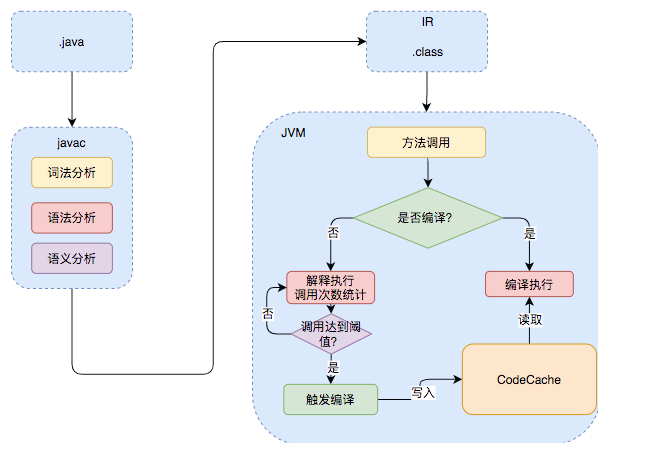
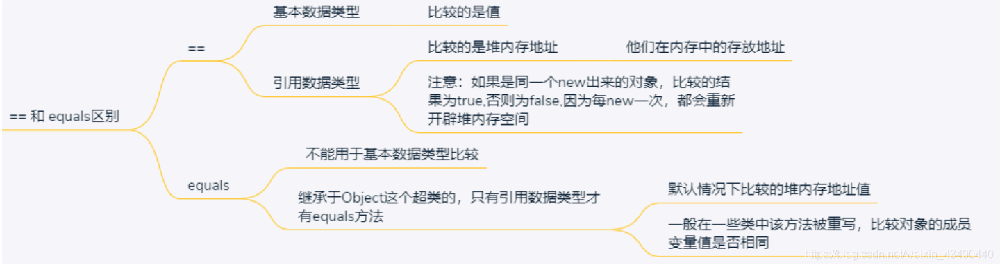
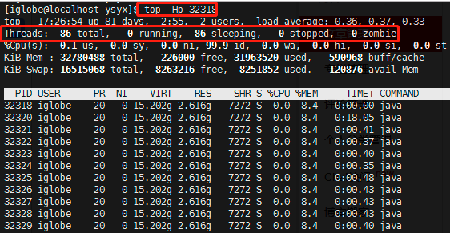

# Java基础

## 1、Java入门

### 1.1、Java和C++区别

- 都是面对对象的语言，支持封装、继承、多态
- Java不提供指针来直接访问内存，更加安全，Java使用引用来访问对象（引用和指针的区别）
- Java是不支持多继承，C++支持多继承，但是Java通过接口的方式实现类似的多继承操作
- Java不支持运算符重载，C++支持
- Java通过 JVM 自动管理内存回收垃圾，C++必须手动回收垃圾
- **C++中的字符串和数组需要额外一个字符'\0'表示结束**，因为char[] str或者 *char str只表示一个地址，需要额外的字符表示其结束，而在Java中字符串和数组都是对象，对象有其长度，所以不需要再使用额外的字符表示结束。
- Java是编译型与解释型并存的语言，C++是编译型语言

### 1.2、编译型语言和解释型语言

- 编译型语言是指编译器针对特定的操作系统将源代码一次性翻译成可被该平台执行的机器码
- 解释型语言是指解释器对源程序逐行解释成特定平台的机器码并立即执行
- Java是半编译半解释型语言。

#### 1.2.1. JIT（Just In Time）即时编译器



.class->机器码 这一步。在这一步 JVM 类加载器首先加载字节码文件，然后通过解释器逐行解释执行，这种方式的执行速度会相对比较慢。而且，有些方法和代码块是经常需要被调用的(也就是所谓的热点代码)，所以后面引进了 JIT 编译器，而 JIT 属于运行时编译。当 JIT 编译器完成第一次编译后，其会将字节码对应的机器码保存下来，下次可以直接使用。

即时编译器极大地提高了Java程序的运行速度，而且跟静态编译相比，即时编译器可以选择性地编译热点代码，省去了很多编译时间，也节省很多的空间。

HotSpot 采用了惰性评估(Lazy Evaluation)的做法，根据二八定律，消耗大部分系统资源的只有那一小部分的代码（热点代码），而这也就是 JIT 所需要编译的部分。JVM 会根据代码每次被执行的情况收集信息并相应地做出一些优化，因此执行的次数越多，它的速度就越快。JDK 9 引入了一种新的编译模式 AOT(Ahead of Time Compilation)，它是直接将字节码编译成机器码，这样就避免了 JIT 预热等各方面的开销。JDK 支持分层编译和 AOT 协作使用。但是 ，AOT 编译器的编译质量是肯定比不上 JIT 编译器的。


#### 1. JVM中的编译器

JVM中集成了两种编译器，Client Compiler和Server Compiler，它们的作用也不同。Client Compiler注重启动速度和局部的优化，Server Compiler则更加关注全局的优化，性能会更好，但由于会进行更多的全局分析，所以启动速度会变慢。两种编译器有着不同的应用场景，在虚拟机中同时发挥作用。

#### Client Compiler

HotSpot VM带有一个Client Compiler  C1编译器。这种编译器启动速度快，但是性能比较Server Compiler来说会差一些。C1会做三件事：

- 局部简单可靠的优化，比如字节码上进行的一些基础优化，方法内联、常量传播等，放弃许多耗时较长的全局优化。
- 将字节码构造成高级中间表示（High-level Intermediate Representation，以下称为HIR），HIR与平台无关，通常采用图结构，更适合JVM对程序进行优化。
- 最后将HIR转换成低级中间表示（Low-level Intermediate Representation，以下称为LIR），在LIR的基础上会进行寄存器分配、窥孔优化（局部的优化方式，编译器在一个基本块或者多个基本块中，针对已经生成的代码，结合CPU自己指令的特点，通过一些认为可能带来性能提升的转换规则或者通过整体的分析，进行指令转换，来提升代码性能）等操作，最终生成机器码。

#### Server Compiler

Server Compiler主要关注一些编译耗时较长的全局优化，甚至会还会根据程序运行的信息进行一些不可靠的激进优化。这种编译器的启动时间长，适用于长时间运行的后台程序，它的性能通常比Client Compiler高30%以上。目前，Hotspot虚拟机中使用的Server Compiler有两种：C2和Graal。

#### 编译策略

**分层编译**

在**Java 7**以前，需要研发人员根据服务的性质去选择编译器。对于需要快速启动的，或者一些不会长期运行的服务，可以采用编译效率较高的C1，对应参数-client。长期运行的服务，或者对峰值性能有要求的后台服务，可以采用峰值性能更好的C2，对应参数-server。Java 7开始引入了分层编译的概念，它结合了C1和C2的优势，追求启动速度和峰值性能的一个平衡。分层编译将JVM的执行状态分为了五个层次。五个层级分别是：

- 解释执行。
- 执行不带profiling的C1代码。
- 执行仅带方法调用次数以及循环回边执行次数profiling的C1代码。
- 执行带所有profiling的C1代码。
- 执行C2代码。

profiling就是收集能够反映程序执行状态的数据。其中最基本的统计数据就是方法的调用次数，以及循环回边的执行次数。

通常情况下，C2代码的执行效率要比C1代码的高出30%以上。C1层执行的代码，按执行效率排序从高至低则是1层>2层>3层。这5个层次中，1层和4层都是终止状态，当一个方法到达终止状态后，只要编译后的代码并没有失效，那么JVM就不会再次发出该方法的编译请求的。服务实际运行时，JVM会根据服务运行情况，从解释执行开始，选择不同的编译路径，直到到达终止状态。


### 1.3、Java基础类型数据长度

Java基础类型数据长度固定，而其他大多数语言会根据机器硬件架构不同而改变，这也是Java可移植性强的原因

## 2、Java语言

### 2.1、return

#### 2.1.1、return作用

1. `return;` ：直接使用 return 结束方法执行，用于没有返回值函数的方法
2. `return val;` ：return 一个特定值，用于有返回值函数的方法

#### 2.2.2、try-catch-finally


### 2.2、==和equals的区别




#### 2.4、指针和引用的区别

指针和引用都是地址，但是引用时对象的别名，指针是实际地址。

1. 指针本身就是数据需要额外空间存储，引用不需要；
2. 引用必须被初始化，但是不分配存储空间。指针不声明时初始化，在初始化的时候需要分配存储空间；
3. 指针是间接访问，引用是对象别名直接访问；
4. 引用初始化后不能被改变，指针可以改变所指的对象。
5. 指针可能出现悬空的情况很危险，引用不会；
6. 不存在指向空值的引用，但是存在指向空值的指针

#### 2.5、构造函数的重写？

不同的类名字不一样，无法继承，所以构造函数不能被重写

 Java 中重载是由静态类型确定的，在类加载的时候即可确定，属于静态分派；而重写是由动态类型确定，是在运行时确定的，属于动态分派，动态分派是由虚方法表实现的，虚方法表中存在着各个方法的实际入口地址，如若父类中某个方法子类没有重写，则父类与子类的方法表中的方法地址相同，如若重写了，则子类方法表的地址指向重写后的地址；（重写之后可以调用子类方法了）

#### 2.6、在 Java 中定义一个不做事且没有参数的构造方法的作用

子类初始化之前，会先初始化父类，如果没有调用父类特定的构造函数，会自动调用父类的无参构造函数，如果父类没有无参构造函数，那么就会出现编译错误，所以需要在定义类的时候加上一个无参构造函数。

#### 2.7、成员变量与局部变量的区别有哪些？

1. 从语法形式上看:成员变量是属于类的，而局部变量是在代码块或方法中定义的变量或是方法的参数；成员变量可以被 public,private,static 等修饰符所修饰，而局部变量不能被访问控制修饰符及 static 所修饰；但是，成员变量和局部变量都能被 final 所修饰。
2. 从变量在内存中的存储方式来看:如果成员变量是使用`static`修饰的，那么这个成员变量是属于类的，如果没有使用`static`修饰，这个成员变量是属于实例的。而对象存在于堆内存，局部变量则存在于栈内存。
3. 从变量在内存中的生存时间上看:成员变量是对象的一部分，它随着对象的创建而存在，而局部变量随着方法的调用而自动消失。
4. **成员变量如果没有被赋初值:则会自动以类型的默认值而赋值（一种情况例外:被 final 修饰的成员变量也必须显式地赋值），而局部变量则不会自动赋值。**

#### 2.8、一个类的构造方法的作用是什么? 若一个类没有声明构造方法，该程序能正确执行吗? 为什么?

主要作用是完成对类对象的初始化工作。可以执行。因为一个类即使没有声明构造方法也会有默认的不带参数的构造方法。如果我们自己添加了类的构造方法（无论是否有参），Java 就不会再添加默认的无参数的构造方法了，这时候，就不能直接 new 一个对象而不传递参数了，所以我们一直在不知不觉地使用构造方法，这也是为什么我们在创建对象的时候后面要加一个括号（因为要调用无参的构造方法）。如果我们重载了有参的构造方法，记得都要把无参的构造方法也写出来（无论是否用到），因为这可以帮助我们在创建对象的时候少踩坑。

#### 2.9、无参构造方法的意义

在Java程序编写中，子类的构造方法必定会调用父类的构造方法，如果在子类的构造方法中没有指定调用父类的哪个构造方法，在实例化子类对象时，子类会默认调用父类的无参构造方法。如果在父类中没有定义无参构造方法的话，编译会报错。


#### 2.10、为什么静态方法不能访问非静态变量和非静态方法？

静态方法是属于类的，非静态方法属于实例对象，在类加载的时候就会分配内存，可以通过类名直接去访问，非静态成员（变量和方法）属于类的对象，所以只有该对象初始化之后才存在，然后通过类的对象去访问。如果我们在静态方法中调用非静态成员变量会超前，可能会调用了一个还未初始化的变量。因此编译器会报错。


#### 2.11、transient 关键字

对于不想进行序列化的变量，使用 transient 关键字修饰。

**transient 只能修饰变量，不能修饰类和方法。**

transient 关键字的作用是：阻止实例中那些用此关键字修饰的的变量序列化；当对象被反序列化时，被 transient 修饰的变量值不会被持久化和恢复


#### 2.12 toArray()的用法注意点

List、Set、Queue都可以使用toArray()转为array。

```java
set.toArray(new String[set.size()])
list.toArray(new String[set.size()])
queue.toArray(new String[set.size()])
```

需要注意的地方是这些集合里面存都应该是对象，而基础类型不能直接转换。

```java
set.toArray(new int[set.size()])
```

以上则不对。

#### 2.13 Java变量的存储

在Java层面上，变量的存储种类（storage class）可以粗略分为3种：

1. 局部变量/方法参数，在方法体中/参数列表中声明，**属于方法，存储在栈中**，操作的Java字节码为xload / xstore / iinc
2. 成员字段，在类中声明，**属于对象，储存在堆中**，操作的Java字节码为getfield / putfield。
3. 静态变量，在类中声明，**属于类，储存在方法区中**，操作的Java字节码为getstatic / putstatic。

static在Java里是一种storage modifier（存储修饰符），它会影响变量的存储种类；
final在Java里则不是一种存储修饰符，不影响变量的存储种类。被final修饰的变量，该存哪儿存哪儿，跟final与否根本没关系；


### 泛型

Java 泛型（generics）是 JDK 5 中引入的一个新特性, 泛型提供了编译时类型安全检测机制，该机制允许程序员在编译时检测到非法的类型。泛型的本质是参数化类型，也就是说所操作的数据类型被指定为一个参数。

泛型擦除

Java的泛型是伪泛型，这是因为Java在编译期间，所有的泛型信息都会被擦掉，这也就是通常所说类型擦除 。

在调用泛型方法时，可以指定泛型，也可以不指定泛型。

- 在不指定泛型的情况下，泛型变量的类型为该方法中的几种类型的同一父类的最小级，直到Object
- 在指定泛型的情况下，该方法的几种类型必须是该泛型的实例的类型或者其子类

```java
public class Test {  
    public static void main(String[] args) {  

        /**不指定泛型的时候*/  
        int i = Test.add(1, 2); //这两个参数都是Integer，所以T为Integer类型  
        Number f = Test.add(1, 1.2); //这两个参数一个是Integer，以风格是Float，所以取同一父类的最小级，为Number  
        Object o = Test.add(1, "asd"); //这两个参数一个是Integer，以风格是Float，所以取同一父类的最小级，为Object  

        /**指定泛型的时候*/  
        int a = Test.<Integer>add(1, 2); //指定了Integer，所以只能为Integer类型或者其子类  
        int b = Test.<Integer>add(1, 2.2); //编译错误，指定了Integer，不能为Float  
        Number c = Test.<Number>add(1, 2.2); //指定为Number，所以可以为Integer和Float  
    }  

    //这是一个简单的泛型方法  
    public static <T> T add(T x,T y){  
        return y;  
    }  
}
```

#### 位运算比乘除快的原因

编译器会将乘除分解为一系列的加法和位运算，因而位指令数少于乘除运算，移位运算相对于乘除运算更好实现。

将乘除转化为移位计算有一定效果的提升，但是效果提升不是非常高，只是我们在底层使用的时候经量优化。

#### HashMap的遍历方法的性能

总共四大类，七小类，除了.parallelStream()性能比较高，其他基本上相似，因为其他都会被编译器编程成相同的代码（Lambda 也不一样）。在遍历的时候，通过迭代器删除数据是安全的，其他方法不安全。

- 迭代器（Iterator）方式遍历（entrySet，keySet）；
- For Each 方式遍历(entrySet，keySet)；
- Lambda 表达式遍历（JDK 1.8+）;
- Streams API 遍历（JDK 1.8+）(单线程、多线程)。


# Java基础概念

#### 为什么需要public static void main(String[] args)这个方法 ？

- public：表示表明任何类或对象都可以访问这个方法
- static：只要类被加载后，就可以使用 该方法而不需要通过实例化对象来访问。

通常来讲，要执行一个类的方法，先必须实例化一个类的对象，然后通过对象来调用这个方法。但由于main是 程序的入口方法，此时还没有实例化对象，因此在编写main（）方法时就要求不需要实例化对象就可以 调用这个方法，鉴于此，main（）方法需要被定义成public与static。

1.main()定义格式 

由于public与static没有先后顺序关系，可以交换顺序

final、synchronized可以用于修饰main()，但是由于main()方法为程序的入口方法，因此不能用abstract关键字来修饰。 

2.同一个.java文件中是否可以有多个main()方法？

 虽然每个类中都可以定义main()方法，但是只有与文件名相同的用public修饰的类中的main() 方法才能作为整个程序的入口方法。

#### Java程序初始化的顺序

Java程序的初始化一般遵循3个原则（优先级依次递减）：

- 静态对象（变量）优先于非静态对象 （变量）初始化，其中，静态对象（变量）只初始化一次，而非静态对象（变量）可能会初始化多次。
- 父类优先于子类进行初始化。
- 按照成员变量的定义顺序进行初始化。即使变量定义散布于方法定义之中，它们依然在任何方法（包括构造函数）被调用之前先初始化。


初始化顺序：父类静态变量、父类静态代码块、子类静态变量、子类静态代码块、父类非静态变量、 父类非静态代码块、父类构造函数、子类非静态变量、子类非静态代码块、子类构造函数。


#### 一个Java文件中是否可以定义多个类

一个Java文件中可以定义多个类，但是最多只能有一个类被public修饰，并且这个类的类名与文件名必须相同，若这个文件中没有public的类，则文件名随便是一个类的名字即可。

需要注意的是，当用 javac指令编译这个.java文件时，它会给每一个类生成一个对应的.class文件


#### 为什么Java中有些接口没有任何方法 

于Java不支持多重继承，即一个类只能有一个父类，为了克服单继承的缺点，Java语言引入了接口这一概念。接口是抽象方法定义的集合（接口中也可以定义一些常量值），是一种特殊的抽象类。接 口中只包含方法的定义，没有方法的实现。接口中的所有方法都是抽象的。

- 接口中成员的作用域修饰符 都是public
- 接口中的常量值默认使用public static final修饰。

有些接口内部没有声明任何方法，也就是说，实现这些接口的类不需要重写任何方 法，这些没有任何方法声明的接口又被叫做标识接口，标识接口对实现它的类没有任何语义上的要求， 它仅仅充当一个标识的作用，用来表明实现它的类属于一个特定的类型。

Java类库中已存在的标识接口有 Cloneable和Serializable等

## package有什么作用

 package的中文意思是“包”，它是一个比较抽象的逻辑概念，其宗旨是把.java文件（Java源文 件）、.class文件（编译后的文件）以及其他resource文件（例如.xml文件、.avi文件、.mp3文件、.txt文件 等）有条理地进行一个组织，以供使用。

package主要有以下两个作用：

- 提供多层命名空间，解决命名冲突，通过使用 package，使得处于不同package中的类可以存在相同的名字。
- 对类按功能进行分类，使项目的组 织更加清晰。

# 面对对象

面对对象的特征：

1. 抽象。抽象就是忽略一个主题中与当前目标无关的那些方面，以便更充分地注意与当前目标有 关的方面。抽象并不打算了解全部问题，而只是选择其中的一部分，暂时不用部分细节。抽象包括两个 方面：一是过程抽象；二是数据抽象。
2. 继承。继承是一种联结类的层次模型，并且允许和鼓励类的重用，它提供了一种明确表述共性 的方法。对象的一个新类可以从现有的类中派生，这个过程称为类继承。新类继承了原始类的特性，新 类称为原始类的派生类（子类），而原始类称为新类的基类（父类）。派生类可以从它的基类那里继承 方法和实例变量，并且派生类可以修改或增加新的方法使之更适合特殊的需要。
3. 封装。封装是指将客观事物抽象成类，每个类对自身的数据和方法实行保护。类可以把自己的 数据和方法只让可信的类或者对象操作，对不可信的进行信息隐藏。
4. 多态。多态是指允许不同类的对象对同一消息作出响应。多态包括参数化多态和包含多态。多态性语言具有灵活、抽象、行为共享、代码共享等优势，很好地解决了应用程序函数同名问题。

## 面对对象的优点

- 较高的开发效率：通过对对象的抽象，符合人的思维模式，便于理解
- 高可维护性：代码可读性好。
- 可重用性强：相同对象可重用代码

## 继承

- 只能单继承
- 不能继承private修饰的方法和变量
- 子类会对具有相同变量名和相同函数（参数也要求一致）进行覆盖
- 继承是一种is-a关系的抽象，接口是has-a关系的抽象
- 继承是一个比较“重”的操作，继承可维护性差，父类修改也需要对子类进行修改，所以非必要情况下尽量使用接口和组合（在类中创建其他类的实例）

## 多态

多态是指允许不同类的对象对同一消息作出响应，多态主要有两种实现方法。

- 重载（overload）：也叫编译时多态，函数名相同，参数的个数、种类、顺序相同，不能通过方法的访问权限、返回值类型和抛出的异常类型来进行重载
- 覆盖（override）：也叫运行时多态，子类可以覆盖父类的方法，覆盖是指派生类函数覆盖基类函数。覆盖一个方法并对其重写，以达到不同的作用。可以通过父类引用访问子类实例的方法，但是要满足里氏替换原则

里氏替换原则

- 子类的访问权限要大于父类
- 子类的返回类型需要时父类访问权限的子类
- 子类的抛出异常的类型是父类抛出异常类型的子类

覆盖

- 方法必须要和基类中被覆盖的方法有相同的函数名和参数。
- 方法的返回值必须和基类中被覆盖白方法的返回值相同。 
- 方法所抛出的异常必须和基类（或是其子类）中被覆盖的方法所抛出的异常一
  致。
- 方法不能为private，否则其子类只是定义了一个方法，并没有对其覆盖

## 内部类

内部类可以分为很多种，主要有以下4种：

静态内部类（static class innerClass｛｝）：不依赖于外部类实例而被实例化，只能访问静态变量和静态方法

成员内部类（class innerClass｛｝）：外部静态和非静态的方法和变量都可以访问，但非静态内部类中不能有静态成员

局部内部类（class innerClass｛｝）：定义在方法中

匿名内部类（anonymous inner class）

# 关键字

## 跳出循环

break

continue

return

goto：虽然关键字goto作为Java的保留字，但目前并没有在Java中使用，未来可能使用，可以使用break达到相同效果

## final、finally和finalize有什么区别 

- final用于声明属性、方法和类，分别表示属性不可变、方法不可覆盖和类不可被继承（不能再派 生出新的子类）

  - 修饰基础类型，基础类型不可变
  - 修饰引用类型，引用不可变，但是引用中实例可以变

- finally作为异常处理的一部分，它只能用在try/catch语句中，并且附带一个语句块，表示这段语 句最终一定被执行

  - 部分特殊情况还是可能导致finally不会执行，例如：finally发生异常、System.exit()，程序强制退出
  - 如果finally和try-catch中都有return语句，那么finally中的return会覆盖掉之前语句中的return
  - 如果需要在finally中实现关闭IO等操作，推荐换为try-catch-resources的方式，避免忘记关闭I/O

  由于在一个方法内部定义的变量都存储在栈中，return之后，这个函数结束后，其对应的栈就会被回收，此时在其方法体中定义的变量将不存在了，因此return在返回时不是直接返回变量的值，而是复制一份，然后返回。 因此，对于基本类型的数据，在finally块中改变return的值对返回值没有任何影响，而对引用类型的数据 会有影响。

```java
public static StringBuffer testFinally2（）｛
    	StringBuffer s=new StringBuffer("Hello"); 　　　
    	try｛ 　　　　　
    			return	s; 　　　
		｝catch(Exception e)｛
            return	null;
		｝finally｛
            s.append("World");
			System.out.println("execute	finally2");
　　　｝
｝
Hello World 
```

- finalize是Object类的一个方法，在垃圾回收器执行时会调用被回收对象的finalize（）方法


## static

static方法中不能使用this和super关键字，不能调用非static方法，**因为当static方法被调用时，这个类的对象可能还没被创建，即使已经被创建了，也无法确定调用哪个对象的方法**

static一个很重要的用途是实现单例模式。

- private修饰构造函数：因为只能由一个实例，所以不能暴露出构造函数
- static修饰创建实例对象的函数：不能通过构造函数创建对象，所以只能通过类进行对象创建

## switch

switch语句用于多分支选择，设计初衷是对少量数据进行判断多分支选择，所以在使用switch(expr)时，expr只能是一个**枚举常量**或**一个整数表达式**。

整数表达式可以是基本类型int或其对应的包装类Integer，由于byte、short和char类型的值都能够被隐式地转换为int类型，因此可以用于switch。

long、float、double类型不能够隐式地转换为int类型，因此它们不能被用作switch的表达式。

从Java7，switch开始支持String类型，实现的原理是，通过case中String的hashCode()计算出int值进行判断。

不在case中添加break语句会继续进行匹配

# 基础类型及运算

## 在Java语言中null值是什么？在内存中null是什么？ 

null不是一个合法的Object实例，所以编译器并没有为其分配内存，它仅仅用于表明该引用目前没有指向任何对象。其实，与C语言类似，null是将引用变量的值全部置0。 

### 为什么有了基础类，还需要有包装类

引用类型与原始类型的行为完全不同，并且它们具有不同的语义。而且，引用类型与原始类型具有 不同的特征和用法。

- 方便各个类型之间的转换（Integer and String,需要将int转为String）
- 因为我们操作数据的时候很多时候使用的对象

两者之间的差异

- 原始数据类型在传递参数时都是按值传递，而封装类型是按引用传递的。
- 当封装类型和原始类型用作 某个类的实例数据时，它们所指定的默认值不同。对象引用实例变量的默认值为null，而原始类型实例 变量的默认值与它们的类型有关（例如int默认初始化为0）

小数点默认为double类型

## 什么是不可变类

不可变类（immutable class）是指当创建了这个类的实例后，就不允许修改它的值了，即一个对象一旦被创建出来，在其整个生命周期中，它的成员变量就不能被修改了。

在Java类库中，所有基本类型的包装类都是不可变类，例如Integer、Float等。此外，String也是不可变类

## 数据类型转换规则

- 隐式转换 ：当参与运算的两个变量的数据类型不同时，就需要进行隐式的数据类型转换，转换的规则为：从低精度向高精度转换
  - char类型的数据转换为高级类型（如int，long等），会转换为其对应的ASCII码。
  -  byte、char、short类型的数据在参与运算时会自动转换为int型，但当使用“+=”运算时，就不会产 生类型的转换。
  - Java中，基本数据类型与boolean类型是不能相互转换的
- 强制转换：可能丢失精度，所以需要强制转换
  - byte、short和char类型的运算时，首先会把这些类型的变量值强制转换为int类型，然后对int类型的值进行计算，最后得到的值也是int类型。因此，如果把两个short类型的值相加，最后得到的结果是int类型，如果还需要原类型则需要强制转换。
  - 有一种例外情况会保留原类型。“+=”为Java语言规定的运算法，Java编译器会对其进行特殊处理

## 位运算

它们的功能是将参与运算的对象对应的二进制数左/右移指定的位数

- 右移
  - ">>"：有符号右移运算符，若参与运算的数字为正数，则在高位补0；若为负数，则在高位 补1
  - “>>>”：无符号右移运算符，无论参与运算的数字为正数或为负数，在执行运算时，都会在高位补0
  - 对char、byte、short等类型的数进行移位操作前，编译器都会自动地 将数值转化为int类型
- 左移
  - 与右移运算不同的是，左移运算没有有符号与无符号左移，在左移时，移除高位的同时在低位补0


## char型变量中是否可以存储一个中文汉字

Java中，默认使用的Unicode编码方式，即每个字符占用两个字节，因此可以用来存储中文。

String是由char所组成的，但是它采用了一种更加灵活的方式来存储，即英文占用一个字符，中文占用两个字。


# 字符串和数组

## Java中数组是不是对象

Java中，数组不仅有其自己的属性（例如length属性），也有一些方法可以被调用（例如 clone方法）。由于对象的特点是封装了一些数据，同时提供了一些属性和方法，从这个**角度**来讲，数组是对象。


# 异常处理

Java提供了两种错误的异常类，分别为Error和Exception，且它们拥有共同的父类——Throwable。

- Error：表示程序在运行期间出现了非常严重的错误，并且该错误是不可恢复的，由于这属于JVM层次 的严重错误，因此这种错误是会导致程序终止执行的。编译器不会检查Error是否被处理，因此在 程序中不推荐去捕获Error类型的异常，主要原因是运行时异常多是由于逻辑错误导致的，属于应该解决 的错误，也就是说，一个正确的程序中是不应该存在Error的。OutOfMemoryError、ThreadDeath等都属于错误。
- Exception表示可恢复的异常，是编译器可以捕捉到的。它包含两种类型：检查异常（checked exception）和运行时异常（runtime	exception）。所有继承自Exception并且不是运行时异常的异常都是检查异常。 
  - 检查异常（checked exception）：最常见的IO异常和SQL异常。这种异常都发生在编译阶段，Java编译器强制程序去捕获此类 型的异常，即把可能会出现这些异常的代码放到try块中，把对异常的处理的代码放到catch块中。
  - 运行时异常（runtime	exception）：编译器没有强制对其进行捕获并处理。如果不对这种异常进行 处理，当出现这种异常时，会由JVM来处理。
    - NullPointerException（空指针异常）
    - ClassCastException（类型 转换异常）
    - ArrayIndexOutOfBoundsException（数组越界异常）
    - Array-StoreException（数组存储异 常）
    - BufferOverflowException（缓冲区溢出异常）

# 序列化

序列化是一种将对象以一连串的字节描述的过程，用于解决在对对象流进行读写操作时所引发的问题。序列化可以将对象的状态写在流里进行网络传输，或者保存到文件、数据库等系统里，并在需要 时把该流读取出来重新构造一个相同的对象。

特点：

1. 如果一个类能被序列化，那么它的子类也能够被序列化。
2. 由于static(静态)代表类的成员，transient代表对象的临时数据，这两个关键词修饰的数据不需要序列化

serial-VersionUID 

在序列化与反序列化的过程中，serial-VersionUID 起着非常重要的作用，每个类都有一个特定的serialVersionUID，在反序列化的过程中，通过 serialVersionUID来判定是否是所需要版本的对象。

最好在被序列化的类中显式地声 明serialVersionUID(该字段必须定义为static final)。

自定义seri-alVersionUID主要有如下3个优点:

1. 提高运行效率：节省序列化时计算ID的时间
2. 提高兼容性：不同平台seri-alVersionUID计算方式不一样
3. 提高不同版本的兼容性：类的serialVersionUID值将会发生变化，导致类在修改前对象序列化的文件在修改后将无法进行反序列化操作。

# Java平台与内存管理

Java字节码的执行也分为两种方式：即时编译方式与解释执行方式，

- 即时编译方式：指的是解释器先将字节码编译成机器码，然后再执行该机器码。
- 解释执行方式：指的是解释器通过每次解释并执行一小段代码来完成Java字节码程序的所有操作。


### select/poll/epoll

select/poll/epoll 都是 I/O 多路复用的具体实现，select 出现的最早，之后是 poll，再是 epoll。

select 允许应用程序监视一组文件描述符，等待一个或者多个描述符成为就绪状态，从而完成 I/O 操作。


## select和poll比较

### 1. 功能

select 和 poll 的功能基本相同，不过在一些实现细节上有所不同。

- select 会修改描述符，而 poll 不会；
- select 的描述符类型使用数组实现，FD_SETSIZE 大小默认为 1024，因此默认只能监听少于 1024 个描述符。如果要监听更多描述符的话，需要修改 FD_SETSIZE 之后重新编译；而 poll 没有描述符数量的限制；
- poll 提供了更多的事件类型，并且对描述符的重复利用上比 select 高。
- 如果一个线程对某个描述符调用了 select 或者 poll，另一个线程关闭了该描述符，会导致调用结果不确定。

### 2. 速度

select 和 poll 速度都比较慢，每次调用都需要将全部描述符从应用进程缓冲区复制到内核缓冲区。

### 3. 可移植性

几乎所有的系统都支持 select，但是只有比较新的系统支持 poll。


## epoll

特点：

- epoll 仅适用于 Linux OS。
- epoll 比 select 和 poll 更加灵活而且没有描述符数量限制。
- epoll 对多线程编程更有友好，一个线程调用了 epoll_wait() 另一个线程关闭了同一个描述符也不会产生像 select 和 poll 的不确定情况。

### epoll工作模式

epoll 的描述符事件有两种触发模式：LT（level trigger）和 ET（edge trigger）。

#### 1. LT 模式(水平触发)

当 epoll_wait() 检测到描述符事件到达时，将此事件通知进程，进程可以不立即处理该事件，下次调用 epoll_wait() 会再次通知进程。是默认的一种模式，**并且同时支持 Blocking 和 No-Blocking**。

#### 2. ET 模式（边缘触发）

和 LT 模式不同的是，通知之后进程必须立即处理事件，下次再调用 epoll_wait() 时不会再得到事件到达的通知。

很大程度上减少了 epoll 事件被重复触发的次数，**因此效率要比 LT 模式高**。**只支持 No-Blocking，**以避免由于一个文件句柄的阻塞读/阻塞写操作把处理多个文件描述符的任务饿死。


### 应用场景

很容易产生一种错觉认为只要用 epoll 就可以了，select 和 poll 都已经过时了，其实它们都有各自的使用场景。

#### 1. select 应用场景

select 的 timeout 参数精度为微秒，而 poll 和 epoll 为毫秒，因此 select 更加适用于实时性要求比较高的场景，比如核反应堆的控制。

select 可移植性更好，几乎被所有主流平台所支持。

#### 2. poll 应用场景

poll 没有最大描述符数量的限制，如果平台支持并且对实时性要求不高，应该使用 poll 而不是 select。

#### 3. epoll 应用场景

只需要运行在 Linux 平台上，有大量的描述符需要同时轮询，并且这些连接最好是长连接。

需要同时监控小于 1000 个描述符，就没有必要使用 epoll，因为这个应用场景下并不能体现 epoll 的优势。

需要监控的描述符状态变化多，而且都是非常短暂的，也没有必要使用 epoll。因为 epoll 中的所有描述符都存储在内核中，造成每次需要对描述符的状态改变都需要通过 epoll_ctl() 进行系统调用，频繁系统调用降低效率。并且 epoll 的描述符存储在内核，不容易调试。


## 原码\反码\补码

正数：原码\反码\补码都相同

负数：反码是原码非符号位取反，补码是反码加1.

反码的意义：反码的作用就相当于数学中的负数，将减法转变为加法（cpu中仅有加法器，没有减法器）

补码的意义：1.反码无法解决+0和-0的情况，通过补码将0编码进行统一，2.和反码意义相同，将加减法进行了统一，简化了运算


**Arrays.sort()实现原理**

- 基础类型：该进快排		
  1. 当数组长度length < 7时，使用插入排序，
  2. 7<length<40,取三个数的中位数快排
  3. lenghth>40，取9个数的中位数
- 对象类型：该进归并排序
  1. 数组长度length<6时，冒泡排序
  2. length>6时，归并排序


**内存泄露**

定义：程序在申请内存后，无法释放已申请的内存空间

情况：

1. 各种提供了close()方法的连接对象，未使用close方法
2. 监听器：释放对象没有释放对象的监听器
3. 集合类：集合类所引用的对象
4. 单例模式：单例对象在初始化后将在JVM的整个生命周期中存在（以静态变量的方式），如果单例对象持有外部的引用，那么这个对象将不能被JVM正常回收，导致内存泄漏
5. 内部类和外部模块的引用：内部类的引用是比较容易遗忘的一种，而且一旦没释放可能导致一系列的后继类对象没有释放，此外程序员还要小心外部模块不经意的引用

解决方案：

1. 避免在循环中创建对象。
2. 尽早释放无用对象的引用。 （最基本的建议）
3. 尽量少用静态变量， 因为静态变量存放在永久代（方法区） ， 永久代基本不参与垃圾回收。
4. 使用字符串处理， 避免使用 String， 应大量使用 StringBuffer， 每一个 String对象都得独立占用内存一块区域。

**为什么有了基础类、还需要有包装类（将基础类封装为一个对象）**

1.方便各个类型之间的转换（Integer and String,需要将int转为String）

2.因为我们操作数据的时候很多时候使用的对象


Fail-Fast机制

在面对线程不安全集合的时候，引入了Fail-Fast错误检测机制尽量保证数据读写的正确性，但是不一定都能检测到，例如：在ArrayList中增加和删除（修改不会）一个元素modCount会发生改变，读取、序列化的时候会检测操作前后modCount是否发生改变，如果是则抛出ConcurrentModificationException。

**Fail-Fast**迭代器，如果在遍历一个集合的时候，如果这个集合的内容被修改了，比如增加删除或者修改。就会抛出异常，终止迭代。java.util包下的集合类都是快速失败。

**Fail-Safe**采用安全失败机制的集合容器，在遍历时不是直接在集合内容上访问的，而是先复制原有集合内容，在拷贝的集合上进行遍历。		    

java.util.concurrent包下的容器都是安全失败

HashMap put方法的流程是什么？

1).**判断是否已经初始化表**，如果没有则初始化table;

2).**判断是否key为空**，如果是，则使用单独的插入函数（无法hashCode，所以放在0号桶）；

3).**计算hash和index**：hash = hash(key)，计算index不用%，用的是hash&(length - 1)，因为如果length长度为2^n，之前那个表达式和取模结果一样，降低了运算成本，所以capacity必须是2^n（初始值为16），如果用户的初始化容量的时候不是2^n，就需要转化为2^n；

4).**判断是否已经存在键为key的键值对**，如果存在则更新键值对的value;

5).**插入键值对**：**1.判断size是否超过threshold**，超过则需要扩容（2*oldCapacity，让表尽量大，降低查询代价，扩容是把oldTable的所有键值对插入newTable中，代价很高，从新计算index的时候对oldIndex进行位计算，降低成本），**2.使用头插法插入新节点**。


**ConcurrentHashMap的size()方法是如何计算的？**

1）每个segment的count 变量表示Segment 中的键值对个数；

2）遍历所有segment， 累加count；

3）执行 size（）时先尝试不加锁，如果连续两次不加锁操作得到的结果一致（两次modCount（也是每个segment的累加）是否发生改变），那么可以认为这个结果是正确的。

4）如果尝试的次数超过 3 次，就需要对每个 segment加锁，再计算，结束要依次释放锁。

**ConcurrentHashMap在JDK1.7和1.8的实现分别是什么?**

JDK1.7数据结构是由一个segment数组和多个HashEntry组成，默认16个segment（所以并发也是16），需要hash两次（分了两级）。


JDK1.7使用分段锁机制来实现并发更新操作，核心类为segment，它继承自重入锁ReentrantLock，并发度与segment数量相等。

JDK1.8直接用Node数组+链表（红黑树）的数据结构,和HashMap比较像，


JDK1.8使用了CAS操作来支持更高的并发度，在CAS操作失败时使用内置锁synchronized。

JDK1.8的实现也在链表过长（>8）时会转换为红黑树。

**synchronize与Reentrantlock有什么区别？**

\1. 锁的实现

synchronized 是 JVM 实现的，而 ReentrantLock 是 JDK 实现的。

\2. 性能

新版本 Java 对 synchronized 进行了很多优化，例如自旋锁等,synchronized 与 ReentrantLock 大致相同。

\3. 等待可中断

当持有锁的线程长期不释放锁的时候，正在等待的线程可以选择放弃等待，改为处理其他事情。

ReentrantLock 可中断，而 synchronized 不行。

**两个都可中断**：

synchronized的不可中断指的是在获取锁的过程不能中断，获取之后能中断，因为interrupt()，只是将中断标志位置为true, 但是并没有立刻要求中断线程，只是在sleep,wait,join方法中，都会检查标志位，如果检查中断位为抛出中断异常，在处于轻量级自旋或者重量级锁阻塞获取锁的过程中不会判断中断位。

ReentrantLock在获取锁过程中也能中断，但需要使用lockInterruptiby()获取锁，获取锁时也会判断中断位（首次获取 + 自旋获取都会判断）。

\4. 公平锁

公平锁是指多个线程在等待同一个锁时，必须按照申请锁的时间顺序来依次获得锁（看是否是同步队列的头结点）。

synchronized 中的锁是非公平的，ReentrantLock 默认情况下也是非公平的，但是也可以是公平的。

\5. 锁绑定多个条件

一个 ReentrantLock 可以同时绑定多个 Condition 对象。

**Java中如何正常终止线程？**

两种方法：volatile变量和interrupt()

1.volatile变量：设置一个boolean volatile变量，作为while循环的判断条件，实现线程是否终止；

2.interrupt()：通过调用一个线程的 interrupt() 来中断该线程，如果该线程处于阻塞、限期等待或者无限期等待状态，那么就会抛出 InterruptedException，从而提前结束该线程。但是不能中断 I/O 阻塞和 synchronized 锁阻塞。

interrupt()只是把中断位置为true，如果一个线程一直在执行，那么即使中断了也无效，所以和1类似，使用 interrupted()作为while的循环条件，判断while是否循环下去。

**主线程可以捕获子线程抛出的异常吗？**

不能，设计的主要初衷是线程运行是互相独立的，可以理解主线程也是一种普通的线程即可。如果线程之间异常互相干扰，那么1000个线程，一个线程挂了，其它线程跟着遭殃，这是不合理的。所有的线程中的checked异常都只能被线程本身消化掉。

使用线程池时，execute方法,可以看异常输出在控制台，而submit在控制台没有直接输出，必须调用Future.get()方法时，可以捕获到异常。

线程不是被回收而是线程池把这个线程移除掉，同时创建一个新的线程放到线程池中。

**主线程结束与子线程结束有关吗？**

主线程和子线程结束没有关系（主线程和子线程是平级关系），可以理解Main主线程也是一种普通的线程即可，只是其他线程由主线程启动而已，只要进程和资源还在进程依然执行。

如何查看某个Java进程有几个子线程？

https://blog.csdn.net/qq_18298439/article/details/82289009

1.jps -lvm 用于查看当前机器上运行的java进程。



2.top -Hp pid可以查看某个进程的线程信息：-H 显示线程信息，-p指定pid


3.查看此进程下线程的堆栈信息: jstack -l pid

**sleep()与wait()的区别**

- wait() 是 Object 的方法，而 sleep() 是 Thread 的静态方法；
- wait() 会释放锁，sleep() 不会；
- wait()必须在同步方法或同步代码块执行，sleep可以使用在任何代码块；
- wait()不需要需要唤醒，sleep()不需要唤醒；

**一个线程可以start两次吗？**

线程两次调用start()方法会抛出IllegalThreadStateException，这是一种运行时异常。