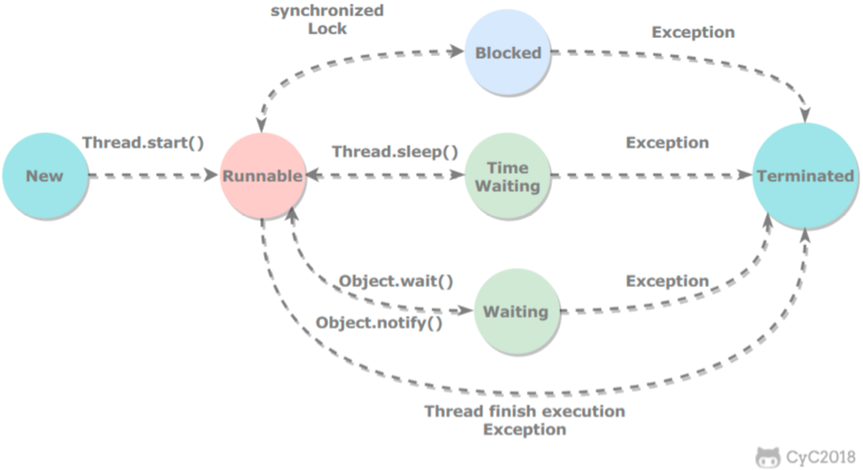

## 并发编程所面对的问题

### 1.上下文（线程）切换（Content Switch）

**任务从保存到再加载的过程就是一次上下文切换**，时间片调度算法带来的好处是能让单CPU“同时”执行多个任务，但是在进行任务切换（时间片用尽和竞争锁）的时候需要保存任务状态并加载任务，这个过程会带来一定的开销。因此多线程也不一定比单线程快。

解决方案：

- **无锁并发编程**：在面对锁竞争进行上下文切换时，通过对数据进行切分，让不同线程处理不同数据避免竞争锁。
- **CAS（Compare And Set or Swap）**：使用基于CPU指令的自旋算法避免加锁，但是自旋也会带来性能开销，在使用CAS可以尝试不是每一个操作都需要自旋的操作（eg：读写锁队列）。
- **减少线程数**：减少不必要的线程的创建。
- **协程**：（不太明白）在单线程里面实现多任务调度，并在单线程里维持多个任务间的切换

### 2.死锁

系统的资源不够或者系统的推进顺序不当导致整个系统不能推进下去

解决方案：

- 避免同一个线程获得多个锁
- 尽量保证一个锁只占用一个资源
- 一定时间未获得锁则释放相关资源，使用定时锁lock.tryLock(timeout)实现
- 数据库锁的加锁和解锁须在同一个数据库连接中实现

### 3.资源限制

整个程序的系统资源总数有限，多线程超过一定数量之后反而可能因为线程切换带来额外开销。

解决方案：依据最小资源（可能同时依赖多个资源）设置线程数。


## 线程的状态



### 新建（New）

完成创建并未运行

### 可运行（Runnable）

可能在运行，或者在等待CPU分配的时间片

包含了操作系统的Ready和Running两个状态

### 阻塞（Blocking）

等待获取排他锁，获得锁之后退出该状态

### 等待（Waiting）

包含限期等待（Timed Waiting）和无限期等待（Waiting）

- 限期等待（Timed Waiting）：无需其他线程对其唤醒，一定时间自动唤醒
- 无限期等待（Waiting）：需要其他线程显示进行唤醒

阻塞和等待的区别在于，阻塞是被动的，它是在等待获取一个排它锁。而等待是主动的，通过调用 Thread.sleep() 和 Object.wait() 等方法进入。

### 死亡（Terminated）

线程完成任务自动结束，或者线程发生异常而终止

## 线程使用

三种使用方法

- 实现 Runnable 接口；
- 实现 Callable 接口；
- 继承 Thread 类。

实现 Runnable 和 Callable 接口的类只能当做一个可以在线程中运行的任务，不是真正意义上的线程，因此最后还需要通过 Thread 来调用。可以说任务是通过线程驱动从而执行的。

### 实现Runnable接口

- 需要实现 run() 方法
- 通过 Thread 调用 start() 方法来启动线程

```java
public class MyRunnable implements Runnable{
    public void run(){
        //do something
    }
}

public static void main(String[] args){
    MyRunnable task = new MyRunnable();
    Thread thread = new Thread(task);
    thread.start();
}
```

### 实现Callable接口

和Runnable接口类似，但是不同的是Callable接口可以有返回值，返回值通过 FutureTask 进行封装。

```java
public class MyCallable implements Callable<Integer>{
    public Integer run(){
        //do something
        //return something
    }
}

public static void main(String[] args)throws ExecutionException, InterruptedException{
    MyCallable task = new MyCallable();
    FutureTask<Integer> result = new FutureTask<>(task);
    Thread thread = new Thread(result);
    thread.start();
    System.out.println(result.get());
}
```

### 继承Thread类

同样也是需要实现 run() 方法，因为 Thread 类也实现了 Runable 接口。

run()方法和start()的区别：run()方法仅仅是Thread类的方法，直接调用不涉及启动新线程，但是start()方法是启动新线程，运行的线程会执行run()方法。

```java
public class MyThread implements Thread{
    public void run(){
        //do somthing
    }
}
public static void main(String[] args){
    MyThread thread = new MyThread();
    thread.start();
}
```

### 继承Thread VS 实现接口

实现接口会更好一些，因为：

- Java 不支持多重继承，因此继承了 Thread 类就无法继承其它类，但是可以实现多个接口；
- 类可能只要求可执行就行，继承整个 Thread 类开销过大。