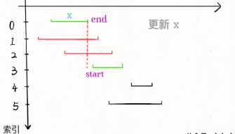
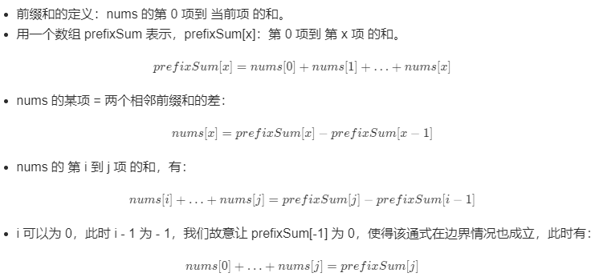

## 二分法

#### [33. 搜索旋转排序数组](https://leetcode-cn.com/problems/search-in-rotated-sorted-array/)

给你一个升序排列的整数数组 nums ，和一个整数 target 。假设按照升序排序的数组在预先未知的某个点上进行了旋转。（例如，数组 [0,1,2,4,5,6,7] 可能变为 [4,5,6,7,0,1,2] ）。

请你在数组中搜索 target ，如果数组中存在这个目标值，则返回它的索引，否则返回 -1 。

示例：

```html
输入：nums = [4,5,6,7,0,1,2], target = 0
输出：4

输入：nums = [4,5,6,7,0,1,2], target = 3
输出：-1
```

**思路**：旋转数组表示部分有序，有序就可以考虑二分法把时间复杂度变为logN，选择使用二分法，本题通过二分法找到有序区间，找到了有序区间，通过比较target与nums[left]、nums[right]找到目标区间（本题通过nums[mid]和nums[right]比较划分目标区间）。**还需要注意边界收缩的一致性，否则无法跳出循环。**

**关键**：**把比较好些的判断（`target` 落在有序的那部分）放在 `if` 的开头考虑，把剩下的情况放在 `else` 里面。**

**二分法本质**：找到目标区间，常规二分法通过nums[mid]和target比较划分目标区间。

**注意**

1.需要注意的是mid的取值

- mid = left + (right - left) / 2 ，取得是左中位数；
- mid = left + (right - left + 1) / 2 ，取得是右中位数；

2.关于while循环中是否取等号

- left < right：不取等号自动跳出，在循环外返回目标值
- left <= right：取等号，需要在循环内返回，不然死循环

```java
	public int search(int[] nums, int target) {
        if(nums.length == 0 || nums == null) return -1;
        int left = 0;
        int right = nums.length - 1;
        while(left < right){
            //使用左中位数
            int mid = left + (right - left) / 2;
			//int mid = left + (right - left + 1) / 2; 则使用是的右中位数
            
            //[mid, right]有序
            if(nums[mid] < nums[right]){
     
                //target在[mid, right],目的是判断target是否存在
                
                //nums[mid + 1] <= target是为了让大的if-else中左右边界收缩一致，
                //即在其中left = mid + 1和right = mid变化相同
                //否则当只有两个元素时，不会取到第一个元素，始终left < right，无法跳出循环
                if(nums[mid + 1] <= target && nums[right] >= target){
                    left = mid + 1;
                }else{
                    right = mid;
                }
            }
            //[left, mid]有序
            else{
                //target在[left, mid]
                if(nums[left] <= target && nums[mid] >= target){
                    right = mid;
                }else{
                    left = mid + 1;
                }
            } 
        }
        // if(target == nums[left]) return left;
        // return -1;
        return target == nums[left] ? left : -1;
    }
```


#### [剑指 Offer 53 - I. 在排序数组中查找数字 I](https://leetcode-cn.com/problems/zai-pai-xu-shu-zu-zhong-cha-zhao-shu-zi-lcof/)

统计一个数字在排序数组中出现的次数。

示例：

```html
输入: nums = [5,7,7,8,8,10], target = 8
输出: 2

输入: nums = [5,7,7,8,8,10], target = 6
输出: 0
```

思路：

有序数组，就要考虑是否二分法能解决，本题使用二分法找到target左边界。1.从左边界依次计算，2.从计算target + 1左边界，如果左边界，两者相减得到数量。

```java
	//find the left rang by binarySearch
    public static int binarySearch(int[] nums, int target){
        int left = 0;
        int right = nums.length - 1;
        while(left < right){
            int mid = left + (right - left) / 2;
            if(nums[mid] < target){
                left = mid + 1;
            }else{
                right = mid;
            }
        }
        return left;
    }
```


#### [剑指 Offer 53 - II. 0～n-1中缺失的数字](https://leetcode-cn.com/problems/que-shi-de-shu-zi-lcof/)

一个长度为n-1的递增排序数组中的所有数字都是唯一的，并且每个数字都在范围0～n-1之内。在范围0～n-1内的n个数字中有且只有一个数字不在该数组中，请找出这个数字。

```html
示例：
输入: [0,1,3]
输出: 2

输入: [0,1,2,3,4,5,6,7,9]
输出: 8
```

思路：部分有序，二分法

```java
	public int missingNumber(int[] nums) {
        int left = 0;
        int right = nums.length - 1;
        while(left <= right){
            int mid = left + (right - left ) / 2;

            if(nums[mid] == mid){
                left = mid + 1;               
            }
            else{
                right = mid - 1;
            }
        }
        return left;
    }
```


#### [34. 在排序数组中查找元素的第一个和最后一个位置](https://leetcode-cn.com/problems/find-first-and-last-position-of-element-in-sorted-array/)

给定一个按照升序排列的整数数组 nums，和一个目标值 target。找出给定目标值在数组中的开始位置和结束位置。

如果数组中不存在目标值 target，返回 [-1, -1]。

进阶：

你可以设计并实现时间复杂度为 O(log n) 的算法解决此问题吗？

示例：

```html
输入：nums = [5,7,7,8,8,10], target = 8
输出：[3,4]

输入：nums = [5,7,7,8,8,10], target = 6
输出：[-1,-1]
```

思路：

“有序”即可考虑二分查找

- 使用二分查找到target和target + 1最左起点的位置，然后得到index（等于两次二分查找，适用于target较多，数据量较大的情况）
- 二分查找到target位置index，从index开始遍历（适用于等于target数据较少的情况）

```java
    public int[] searchRange(int[] nums, int target) {
        int first = binarySearch(nums, target);
        //只要找到target后一个元素就行，target + 1可以不存在，反正都是下一个元素的第一个
        int last = binarySearch(nums, target + 1) - 1;
        
        if (first == nums.length || nums[first] != target) {
            return new int[]{-1, -1};
        } else {
            //max是为了判断只有一个情况
            return new int[]{first, Math.max(first, last)};
        }
    }
    private int binarySearch(int[] nums, int target) {
        //h为什么是这样的，很奇怪为了保存后面的index吗？
        int l = 0, h = nums.length; // 注意 h 的初始值
        while (l < h) {
            int m = l + (h - l) / 2;
            if (nums[m] >= target) {
                h = m;
            } else {
                l = m + 1;
            }
        }
        return l;
    }
```


## 贪心

贪心算法一般用来解决需要 “找到要做某事的最小数量” 或 “找到在某些情况下适合的最大物品数量”的问题，且提供的是无序的输入。

贪心算法的思想是每一步都选择最佳解决方案，最终获得全局最佳的解决方案。


#### [31. 下一个排列](https://leetcode-cn.com/problems/next-permutation/)

实现获取 下一个排列 的函数，算法需要将给定数字序列重新排列成字典序中下一个更大的排列。

如果不存在下一个更大的排列，则将数字重新排列成最小的排列（即升序排列）。

必须 原地 修改，只允许使用额外常数空间。

示例 1：

```html
输入：nums = [1,2,3]
输出：[1,3,2]

输入：nums = [3,2,1]
输出：[1,2,3]

输入：nums = [1,1,5]
输出：[1,5,1]
```

思路：

整体思路找到最小的升序的升序数组，

- 希望下一个数比当前数大，只需要将**后面的「大数」**与**前面的「小数」**交换
- 还希望下一个数**增加的幅度尽可能的小**，这样才满足“下一个排列与当前排列紧邻“的要求
  - 在尽可能靠右的低位进行交换，需要从后向前查找将一个
  - 尽可能小的「大数」 与前面的「小数」交换。比如 123465，下一个排列应该把 5 和 4 交换而不是把 6 和 4 交换
  - 将「大数」换到前面后，需要将「大数」后面的所有数重置为升序，升序排列就是最小的排列。以 123465 为例：首先按照上一步，交换 5 和 4，得到 123564；然后需要将 5 之后的数重置为升序，得到 123546。显然 123546 比 123564 更小，123546 就是 123465 的下一个排列


### 区间调度问题

有关于区间最优值的问题，通常使用到贪心算法

#### [435. 无重叠区间](https://leetcode-cn.com/problems/non-overlapping-intervals/)

给定一个区间的集合，找到需要移除区间的最小数量，使剩余区间互不重叠。

- 可以认为区间的终点总是大于它的起点。
- 区间 [1,2] 和 [2,3] 的边界相互“接触”，但没有相互重叠。

示例：

```html
输入: [ [1,2], [2,3], [3,4], [1,3] ]
输出: 1
解释: 移除 [1,3] 后，剩下的区间没有重叠。

输入: [ [1,2], [1,2], [1,2] ]
输出: 2
解释: 你需要移除两个 [1,2] 来使剩下的区间没有重叠。
```

思路：按照区间的**尾坐标**进行升序排列，然后从头开始遍历，`intervals[0][1] < end` 表示区间和前一个区间相交，计算最多不相交区间的个数，总数减不相交个数。

- 不选头坐标的原因：可能开始的很早，但是实际时间很长，导致错过一些中间部分区间。
- 不选短区间的原因：可能最短区间也会重叠多次



```java
	public int eraseOverlapIntervals(int[][] intervals) {
        if(intervals.length == 0){
            return 0;
        }
        Arrays.sort(intervals, new Comparator<int[]>(){
            @Override
            public int compare(int[] a, int[] b){
                return a[1] - b[1];
            }
        });
        //先计算最多能组成的不重叠区间个数，然后用区间总个数减去不重叠区间的个数
        int ans = 1;        
        int end = intervals[0][1];//记录当前end节点
        for(int i = 1; i < intervals.length; i++){
            if(intervals[i][0] < end){//如果在当前节点里面就跳过，不要管了，已经重叠了
                continue;
            }
            //不重叠，然后得到新的end节点
            ans++;
            end = intervals[i][1];
        }
        return intervals.length - ans;
    }
```


#### [452. 用最少数量的箭引爆气球](https://leetcode-cn.com/problems/minimum-number-of-arrows-to-burst-balloons/)

在二维空间中有许多球形的气球。对于每个气球，提供的输入是水平方向上，气球直径的开始和结束坐标。由于它是水平的，所以y坐标并不重要，因此只要知道开始和结束的x坐标就足够了。开始坐标总是小于结束坐标。平面内最多存在104个气球。

示例：

```html
输入:[[10,16], [2,8], [1,6], [7,12]]
输出:2
解释:对于该样例，我们可以在x = 6（射爆[2,8],[1,6]两个气球）和 x = 11（射爆另外两个气球）。
```

思路：

贪心思想，先排序，然后从头开始遍历，每次都让一只箭射爆最多的气球（当前end坐标与第i个气球的start坐标比较）

```java
public int findMinArrowShots(int[][] points) {
        //下面这个思路可做但是很麻烦，没有使用排序，要考虑前后两个坐标，排序后只需要考虑一个就行

        //从第一个区间射一支箭，然后依次找和第一个区间相交的区间，两个区间相交区间就是射箭区间，
        //再往后找直至没有，然后射第二支箭
        //用一个数组表示当前为位置气球爆没爆
    
    	// //当前气球的开始和结束
        // int xStart, xEnd = points[0][1];
        // //当前结束
        // int firstEnd = points[0][1];
        // for(int[] point: points){
        //     xStart = point[0];
        //     xEnd = point[1];
        //     if(xStart > firstEnd){
        //         arrows++;
        //         firstEnd = xEnd;
        //     }
        // }
       
        if (points.length == 0) return 0;
        Arrays.sort(points, new Comparator<int[]>(){
            @Override
            public int compare(int[] a, int[] b){
                return a[1]- b[1];
            }
        });
        int arrows = 1;
        int end = points[0][1];
        for(int i = 1; i < points.length; i++){
            if(points[i][0] <= end){
                continue;
            }
            arrows++;
            end = points[i][1];
        }
        return arrows;
    }
```


#### [56. 合并区间](https://leetcode-cn.com/problems/merge-intervals/)

给出一个区间的集合，请合并所有重叠的区间。

示例：

```html
输入: intervals = [[1,3],[2,6],[8,10],[15,18]]
输出: [[1,6],[8,10],[15,18]]
解释: 区间 [1,3] 和 [2,6] 重叠, 将它们合并为 [1,6].

输入: intervals = [[1,4],[4,5]]
输出: [[1,5]]
解释: 区间 [1,4] 和 [4,5] 可被视为重叠区间。
```

思路：**用的是start坐标去排序区间**，因为我们要用的是start+end构成新的区间。

```java
	public int[][] merge(int[][] intervals) {
        if(intervals.length < 1){
            return intervals;
        }
        Arrays.sort(intervals, new Comparator<int[]>(){
            @Override
            public int compare(int[] o1, int[] o2){
                return o1[0] - o2[0];
            }
        });
        List<int[]> list = new ArrayList<>();
        int start = intervals[0][0];
        int end = intervals[0][1];
        for(int i = 1; i < intervals.length; i++){
            //需要intervals[i][1] >= end，不然[1, 4] [2, 3]会输出[1, 3的情况]
            if(intervals[i][0] <= end && intervals[i][1] >= end){
                end = intervals[i][1];
            }
            //不能直接用else,会出现[1, 4] [2, 3]输出为[1, 4] [2, 3]
            else if(intervals[i][0] > end){
                list.add(new int[]{start, end});
                start = intervals[i][0];
                end = intervals[i][1];
            }
        }
        list.add(new int[]{start, end});
		
        //转换为int[][]结构
        int[][] res = new int[list.size()][2];
        for(int i = 0; i < list.size(); i++){
            res[i][0] = list.get(i)[0];
            res[i][1] = list.get(i)[1];
        }
        return res;
    }
```


#### 


## 动态规划

将暴力计算的方法抛弃，使用空间替代时间的思想，避免重复计算，从而降低时间复杂度。

#### [338. 比特位计数](https://leetcode-cn.com/problems/counting-bits/)

给定一个非负整数 num。对于 0 ≤ i ≤ num 范围中的每个数字 i ，计算其二进制数中的 1 的数目并将它们作为数组返回。

示例

```html
输入: 2
输出: [0,1,1]

输入: 5
输出: [0,1,1,2,1,2]
```

**思路：**

1. **动态规划**：二进制不同的数可以通过二进制进行关联, eg: 3 (110) 和 7 (1110)二进制仅增加一位1，而两者的十进制也可以相互联系， 避免计算每一个数的每一位二进制位。

2. **规律方法：**所有数字分为两类：奇数和偶数

   奇数：二进制表示中，奇数一定比前面那个偶数多一个 1，因为多的就是最低位的 1；

   偶数：二进制表示中，偶数中 1 的个数一定和除以 2 之后的那个数一样多。因为最低位是 0，除以 2 就是右移一位，也就是把那个 0 抹掉而已，所以 1 的个数是不变的。

   ```html
   0 = 0   1 = 1
   2 = 10  3 = 11
   
   2 = 10  4 = 100
   3 = 11  6 = 110
   ```

   

```java
	public int[] countBits(int num){
        //dp[i]表示第i数的二进制一共多少位
        int[] dp = new int[num + 1];
        int i = 0;
        dp[0] = 0;
        int b = 1;
        while(b <= num){
            // P(x+b)=P(x)+1, (b = 2^m, b > x)
            //每次以b = 2^m 为界，让 x++,从小的一直计算最大的，x不超过b
            //eg: b = 4, dp[0, 3]生成dp[4, 7]
            //	  b = 8, dp[0, 7]生成dp[8, 15]
            while(x + b <= num && x < b){
                dp[x + b] = dp[x] + 1;
                x++;
            }
            x = 0;
            b <<= 1;
        }
        return dp;
    }

	//规律方法：
	public int[] countBits(int num){
        int[] res = new int[num + 1];
        res[0] = 0;
        for(int i = 1; i <= num; i++){
            if(i / 2 == 0) res[i] = res[i/2];
            else res[i] = res[i-1] + 1;
        }
        return res;
    }
        

```


#### [32. 最长有效括号](https://leetcode-cn.com/problems/longest-valid-parentheses/)

给定一个只包含 `'('` 和 `')'` 的字符串，找出最长的包含有效括号的子串的长度。有效指的是：连续有效的括号（“(()）”和“()(())”）都是有效括号

示例

```html
输入: "(()"
输出: 2
解释: 最长有效括号子串为 "()"

输入: ")()())"
输出: 4
解释: 最长有效括号子串为 "()()"
```

思路：

- **动态规划**：dp[i]表示在第i个位置，有效括号数，注意分清边界和关系，如果s.charAt(i) == ' ) '才能和前面的构成括号，动手画一下看看具体情况，两种情况分别讨论，注意考虑相邻是否有成对括号时，注意 i 的取值范围不能越界。
  - ‘()()’
  - '()(())'
- **栈**：看官方解题思路
- **双指针**：用left和right，分别表示 '(' 和 ‘)’ 的个数，letf == right的时候两者括号最多匹配，当right超过left时两者无法匹配，都置为0从新开始，上述方法无法解决 '(()'的情况，需要从右边再遍历一次。

```java
	public int longestValidParentheses(String s) {
        int strLen = s.length();
        int[] dp = new int[strLen];
        int maxLen = 0;
        for(int i = 1; i < strLen; i++){
            if(s.charAt(i) == ')'){
                if(s.charAt(i-1) == '('){
                    //eg:'()()'dp[i-2]如果之前还有括号，加上之前的括号
                    dp[i] = i >= 2 ? dp[i-2] + 2 : 2;
                }
                else{
                    //(i - dp[i-1] - 1)为当前位置相对应位置,eg:'(())'
                    if((i - dp[i-1] - 1) >= 0 && s.charAt(i - dp[i-1] - 1) == '('){ 
                        dp[i] = dp[i-1] + 2;
                        //相邻之前的位置‘()(())’
                        if(i - dp[i-1] - 2 >= 0){
                            dp[i] = dp[i] + dp[i - dp[i-1] - 2];
                        }
                    }
                }
            }
            maxLen = Math.max(maxLen, dp[i]);
        }
        return maxLen;
    }


    //双指针
    public int longestValidParentheses(String s) {
        int left = 0;
        int right = 0;
        int maxLen = 0;
        for(int i = 0; i < s.length(); i++){
            if(s.charAt(i) == '(') left++;
            else right++;

            if(left == right){
                maxLen = Math.max(maxLen, 2 * right);
            }else if(right > left){
                left = 0;
                right = 0;
            }
            
        }
        left = 0;
        right = 0;

        //解决上面无法解决的'(()'的情况,再从右往左遍历一次
        for(int i = s.length() - 1; i >= 0; i--){
            if(s.charAt(i) == ')') left++;
            else right++;

            if(left == right){
                maxLen = Math.max(maxLen, 2 * right);
            }else if(right > left){
                left = 0;
                right = 0;
            }
        }
        return maxLen;

    }
```

#### [5. 最长回文子串](https://leetcode-cn.com/problems/longest-palindromic-substring/)

给定一个字符串 `s`，找到 `s` 中最长的回文子串。你可以假设 `s` 的最大长度为 1000。

**示例：**

```html
输入: "babad"
输出: "bab"
注意: "aba" 也是一个有效答案。

输入: "cbbd"
输出: "bb"
```

思路：

回文本身具有较好状态转移方式(即可以通过该可以通过相邻位置推导)

```java
    public String longestPalindrome(String s) {
        //第二题解的动态规划说的很好  整个方法就很巧
        //dp[i][j]表示从i~j为回文子串
        //dp[i][j] = dp[i+1][j-1] and s[i] = s[j]
        //dp[i+1][i-j]表示里面的dp[i][j]里面那段字符串
        int len = s.length();
        if(len < 2){
            return s;
        }
        boolean[][] dp = new boolean[len][len];
        //这儿maxlen必须初始化为1，因为在迭代带dp的时候根本就没有考虑对角线的值，如果结果是1就会报错
        int maxlen = 1;
        int begin = 0;
        //填充对角线
        for(int i = 0; i < len; i++){
            dp[i][i] = true;
        }
        //只填充右上角，因为dp[i][j] = dp[i+1][j-1]也就是和自己左下角的有关，所以从列开始遍历
        for(int j = 1; j < len; j++){
            for(int i = 0; i < j; i++){
                if(s.charAt(i) != s.charAt(j)){
                    dp[i][j] = false;
                }
                else{
                    //i - j < 3说明i, j之间只有1个或者0个数，两侧都相等了，说明必然是回文
                    if(j - i < 3){
                        dp[i][j] = true;
                    }
                    else{
                        dp[i][j] = dp[i+1][j-1];
                    }
                }
                if(j - i + 1 > maxlen && dp[i][j]){
                    maxlen = j - i + 1;
                    begin = i;
                }
            }
        }
        return s.substring(begin, begin+maxlen);
    }
```


#### [42. 接雨水](https://leetcode-cn.com/problems/trapping-rain-water/)

给定 *n* 个非负整数表示每个宽度为 1 的柱子的高度图，计算按此排列的柱子，下雨之后能接多少雨水。

[详解](https://leetcode-cn.com/problems/trapping-rain-water/solution/xiang-xi-tong-su-de-si-lu-fen-xi-duo-jie-fa-by-w-8/)很简单，别畏难。


**示例：**

```
输入：height = [0,1,0,2,1,0,1,3,2,1,2,1]
输出：6
解释：上面是由数组 [0,1,0,2,1,0,1,3,2,1,2,1] 表示的高度图，在这种情况下，可以接 6 个单位的雨水（蓝色部分表示雨水）。

输入：height = [4,2,0,3,2,5]
输出：9
```

**思路：**

- **按行计算**：分别计算0~1行接到多少雨水，再以此计算其他行，但是时间复杂度太高
- **按列计算**：计算每一列位置上能接到多少雨水，那么只要找到该列左右最高的列，然后再求最有最高列较小着，如果较小着大于该列高度，则可以接水
  - 暴力计算左右最高列：每次都找最有最高列，会出现重复计算的问题
  - 动态规划：分别从左右遍历计算出左右最高列
  - 动态空间优化：边移动需要计算列的位置，边结算左右最高列

```java
//动态规划
public int trap(int[] height) {
    int sum = 0;
    int[] max_left = new int[height.length];
    int[] max_right = new int[height.length];
    
    for (int i = 1; i < height.length - 1; i++) {
        max_left[i] = Math.max(max_left[i - 1], height[i - 1]);
    }
    for (int i = height.length - 2; i >= 0; i--) {
        max_right[i] = Math.max(max_right[i + 1], height[i + 1]);
    }
    for (int i = 1; i < height.length - 1; i++) {
        int min = Math.min(max_left[i], max_right[i]);
        if (min > height[i]) {
            sum = sum + (min - height[i]);
        }
    }
    return sum;
}

//动态规划空间优化（双指针）

//初步优化
public int trap(int[] height) {
    int sum = 0;
    int max_left = 0;
    int[] max_right = new int[height.length];
    for (int i = height.length - 2; i >= 0; i--) {
        max_right[i] = Math.max(max_right[i + 1], height[i + 1]);
    }
    for (int i = 1; i < height.length - 1; i++) {
        max_left = Math.max(max_left, height[i - 1]);
        int min = Math.min(max_left, max_right[i]);
        if (min > height[i]) {
            sum = sum + (min - height[i]);
        }
    }
    return sum;
}

//分别移动left和right指针（需要求的列）
//max_left和max_right还是表示左右最高的墙
//边移动需要计算列的位置，边结算左右最高列
public int trap(int[] height) {
    int sum = 0;
    int max_left = 0;
    int max_right = 0;
    int left = 1;
    int right = height.length - 2; // 加右指针进去
    for (int i = 1; i < height.length - 1; i++) {
        //从左到右更
        if (height[left - 1] < height[right + 1]) {
            max_left = Math.max(max_left, height[left - 1]);
            int min = max_left;
            if (min > height[left]) {
                sum = sum + (min - height[left]);
            }
            left++;
        //从右到左更
        } else {
            max_right = Math.max(max_right, height[right + 1]);
            int min = max_right;
            if (min > height[right]) {
                sum = sum + (min - height[right]);
            }
            right--;
        }
    }
    return sum;
}


```


#### [53. 最大子序和](https://leetcode-cn.com/problems/maximum-subarray/)

给定一个整数数组 `nums` ，找到一个具有最大和的连续子数组（子数组最少包含一个元素），返回其最大和。

**示例:**

```html
输入: [-2,1,-3,4,-1,2,1,-5,4]
输出: 6
解释: 连续子数组 [4,-1,2,1] 的和最大，为 6。
```

思路：

动态规划：dp[i]表示截至当前位置最大连续数组的最大长度，如果dp[i-1] + nums[i] < nums[i] 则之前的数对当前值没有任何增益，则取当前值，否则有增益

```java
    public int maxSubArray(int[] nums) {
        int len = nums.length;
        if(len == 0){
            return 0;
        }
        if(len == 1){
            return nums[0];
        }
        int[] dp = new int[len];
        dp[0] = nums[0];
        //关键问题，没说dp[i]或者dp[i][j]就是最后答案，要理清思路
        int max = dp[0];
        for(int i = 1; i < len; i++){
            dp[i] = Math.max(dp[i-1] + nums[i], nums[i]);
            max = Math.max(dp[i], max);
        }
        return max;
    }
```


## 数组问题

#### [48. 旋转图像](https://leetcode-cn.com/problems/rotate-image/)(旋转矩阵问题)

给定一个 n × n 的二维矩阵表示一个图像。

将图像顺时针旋转 90 度。

说明：

你必须在原地旋转图像，这意味着你需要直接修改输入的二维矩阵。请不要使用另一个矩阵来旋转图像。

示例:

```java
给定 matrix = 
[
  [1,2,3],
  [4,5,6],
  [7,8,9]
],

原地旋转输入矩阵，使其变为:
[
  [7,4,1],
  [8,5,2],
  [9,6,3]
]
```

思路：

宏观看待问题，设计每次旋转一层边的函数，用左上角和右下角坐标表示一层。

```java
    public void rotate(int[][] matrix) {
        int rows = matrix.length;
        int cols = matrix[0].length;
        if(rows != cols || rows < 1 || cols < 1){
            return;
        }
        int topR = 0;
        int topC = 0;
        int endR = rows - 1;
        int endC = cols - 1;
        while(topR < endR){
            rotateEdge(matrix, topR++, topC++, endR--, endC--);
        }

    }
    public void rotateEdge(int[][] matrix, int topR, int topC, int endR, int endC){
        int times = endC - topC;
        for(int i = 0; i < times; i++){
            int tmp = matrix[topR][topC + i];
            matrix[topR][topC + i] = matrix[endR - i][topC];
            matrix[endR - i][topC] = matrix[endR][endC - i];
            matrix[endR][endC - i] = matrix[topR + i][endC];
            matrix[topR + i][endC] = tmp; 
        }
    }
```


## 栈

#### [20. 有效的括号](https://leetcode-cn.com/problems/valid-parentheses/)

给定一个只包括 '('，')'，'{'，'}'，'['，']' 的字符串，判断字符串是否有效。

有效字符串需满足：

左括号必须用相同类型的右括号闭合。
左括号必须以正确的顺序闭合。
注意空字符串可被认为是有效字符串。

**示例:**

```html
输入: "()"
输出: true

输入: "()[]{}"
输出: true
```

**思路：**

栈：左括号压入，右括号栈弹出看是否和当前括号是否配对，为了方便使用hashmap保存配对的括号，注意为了防止栈空弹出错误，多加一个‘？’，最后看stack.size() == 1 。

```java
    public boolean isValid(String s) {
        HashMap<Character, Character> map = new HashMap<Character, Character>();
        map.put('(',')');
        map.put('[',']');
        map.put('{','}');
        //空栈弹出会报错
        map.put('?','?');
        //防止出现 “ *() ”问题出现
        if(s.length() > 0 && !map.containsKey(s.charAt(0))){
            return false;
        }

        Stack<Character> stack = new Stack<Character>();
        stack.push('?');
        for(char c : s.toCharArray()){
            if(map.containsKey(c)){
                stack.push(c);
            }
            else{
                if(c != map.get(stack.pop())){
                    return false;
                }
            }
        }
        return stack.size() == 1;

    }
```


## 链表

#### [19. 删除链表的倒数第N个节点](https://leetcode-cn.com/problems/remove-nth-node-from-end-of-list/)

给定一个链表，删除链表的倒数第 n 个节点，并且返回链表的头结点。

示例：

```html
给定一个链表: 1->2->3->4->5, 和 n = 2.

当删除了倒数第二个节点后，链表变为 1->2->3->5.
```

思路：

双指针：倒数找到K个节点的变体，本题一定保证n有效，最多删除的是头节点

```java
    public ListNode removeNthFromEnd(ListNode head, int n) {
        ListNode slow = head;
        ListNode fast = head;
        //主要问题是头节点
        while(n-->0){
            fast = fast.next;
        }
        //删除头节点(注意不是fast.next就是fast)(N一定有效，所以做多删除头节点)
        if(fast == null){
            return head.next;
        }else{
            //慢指针找到删除节点前一个节点，所以快指针多走一步
            fast = fast.next;
            while(fast != null){
                slow = slow.next;
                fast = fast.next;
            }
            //delete the node
            ListNode tmp = slow.next;
            slow.next = tmp.next;
            tmp.next = null;
        }
        return head;
    }
```


#### [21. 合并两个有序链表](https://leetcode-cn.com/problems/merge-two-sorted-lists/)

将两个升序链表合并为一个新的 **升序** 链表并返回。新链表是通过拼接给定的两个链表的所有节点组成的。 

**示例：**

```html
输入：1->2->4, 1->3->4
输出：1->1->2->3->4->4
```

思路：

双指针：分别指向两个链表，每次比较大小，放入新链表

```java
    public ListNode mergeTwoLists(ListNode l1, ListNode l2) {
        ListNode head = new ListNode(0);
        ListNode pre = head;
        while(l1 != null && l2 != null){
            if(l1.val < l2.val){
                pre.next = l1;
                pre = pre.next;
                l1 = l1.next;
            }else{
                pre.next = l2;
                pre = pre.next;
                l2 = l2.next;
            }
        }
        pre.next = l1 == null ? l2 : l1;
        return head.next;    
    }
```


#### [23. 合并K个升序链表](https://leetcode-cn.com/problems/merge-k-sorted-lists/)

给你一个链表数组，每个链表都已经按升序排列。

请你将所有链表合并到一个升序链表中，返回合并后的链表。

示例：

```html
输入：lists = [[1,4,5],[1,3,4],[2,6]]
输出：[1,1,2,3,4,4,5,6]
解释：链表数组如下：
[
  1->4->5,
  1->3->4,
  2->6
]
将它们合并到一个有序链表中得到。
1->1->2->3->4->4->5->6
```

思路：

先定义合并函数，然后每次两两合并，需要注意的是，每次将合并后链表放的位置

```java
    public ListNode mergeKLists(ListNode[] lists) {
        if (lists.length == 0) {
            return null;
        }
        int k = lists.length;
        while (k > 1) {
            int idx = 0;
            for (int i = 0; i < k; i += 2) {
                if (i == k - 1) {//当链表个数是奇数的时候
                    lists[idx++] = lists[i];
                } else {
                    lists[idx++] = mergeTwoLists(lists[i], lists[i + 1]);
                }
            }
            k = idx;
        }
        return lists[0];
    }

    public ListNode mergeTwoLists(ListNode l1, ListNode l2) {
        ListNode head = new ListNode(0);
        ListNode pre = head;
        while(l1 != null && l2 != null){
            if(l1.val < l2.val){
                pre.next = l1;
                pre = pre.next;
                l1 = l1.next;
            }else{
                pre.next = l2;
                pre = pre.next;
                l2 = l2.next;
            }
        }
        pre.next = l1 == null ? l2:l1;
        return head.next;    
    }
```


## 双指针

#### [11. 盛最多水的容器](https://leetcode-cn.com/problems/container-with-most-water/)

给你 n 个非负整数 a1，a2，...，an，每个数代表坐标中的一个点 (i, ai) 。在坐标内画 n 条垂直线，垂直线 i 的两个端点分别为 (i, ai) 和 (i, 0)。找出其中的两条线，使得它们与 x 轴共同构成的容器可以容纳最多的水。

说明：你不能倾斜容器，且 n 的值至少为 2。


示例：

```html
输入：[1,8,6,2,5,4,8,3,7]
输出：49
```

**思路**：

双指针：每次移动两个板中的短板不会影响最大值的获取,所以移动每次短板。如果相等随便移动那一个没有影响，因为我们取容量的时候只和两个之间最小值相关，和后面那个高无关。

```java
	public int maxArea(int[] height) {
        if(height == null || height.length < 2){
            return 0;
        }
        int left = 0;
        int right = height.length - 1;
        int maxCap = 0;
        while(left < right){
            int tmpCap = Math.min(height[left], height[right]) * (right - left);
            maxCap = Math.max(maxCap, tmpCap);
            if(height[left] < height[right]){
                left++;
            }else{
                right--;
            }
            // maxCap = Math.max(maxCap, 
            //                   height[left] < height[right] ? 
            //                   (right - left) * height[left++] : (right - left) * height[right--]
            //                   );

        }
        return maxCap;

    }
```

#### [165. 比较版本号](https://leetcode-cn.com/problems/compare-version-numbers/)

比较两个版本号 version1 和 version2。

如果 version1 > version2 返回 1，如果 version1 < version2 返回 -1， 除此之外返回 0。

示例

```html
输入: version1 = "0.1", version2 = "1.1"
输出: -1

输入: version1 = "1.0.1", version2 = "1"
输出: 1

输入: version1 = "7.5.2.4", version2 = "7.5.3"
输出: -1
```

思路：

- **分割+解析**：用小数点分割字符串，然后按位比较，但是需要注意的是小数点是特殊字符，要用转义符转义
- **双指针**：不对字符串分割，分别遍历字符串每一位，每找到一个小数点就看作为一个整数，两个整数做比较

```java
	public int compareVersion(String version1, String version2) {
        int len1 = version1.length();
        int len2 = version2.length();
        int startIndex1 = 0;
        int startIndex2 = 0;
        while(startIndex1 < len1 || startIndex2 < len2){//是 || 不要写成&&了，因为见测试用例2
            int num1 = 0;
            int num2 = 0;
            while(startIndex1 < len1 && version1.charAt(startIndex1) != '.'){
                num1 = num1 * 10 + version1.charAt(startIndex1) - '0';
                startIndex1++;
            }
            while(startIndex2 < len2 && version2.charAt(startIndex2) != '.'){
                num2 = num2 * 10 + version2.charAt(startIndex2) - '0';
                startIndex2++;
            }
            if(num1 > num2){
                return 1;
            }else if(num1 < num2){
                return -1;
            }
            startIndex1++;
            startIndex2++;
        }
        return 0;
    }
    // public int compareVersion(String version1, String version2) {
    //     String[] ver1Arr = version1.split("\\.");
    //     String[] ver2Arr = version2.split("\\.");
    //     int len1 = ver1Arr.length;
    //     int len2 = ver2Arr.length;
    //     int maxLen = Math.max(len1, len2);
    //     for(int i = 0; i < maxLen; i++){
    //         int ver1Num = i < len1 ? Integer.valueOf(ver1Arr[i]) : 0;
    //         int ver2Num = i < len2 ? Integer.valueOf(ver2Arr[i]) : 0;
    //         if( ver1Num > ver2Num){
    //             return 1;
    //         }else if(ver1Num < ver2Num){
    //             return -1;
    //         }
    //     }
    //     return 0;
    // }
```


#### [334. 递增的三元子序列](https://leetcode-cn.com/problems/increasing-triplet-subsequence/)

给定一个未排序的数组，判断这个数组中是否存在长度为 3 的递增子序列。

数学表达式如下:

如果存在这样的 i, j, k,  且满足 0 ≤ i < j < k ≤ n-1，使得 arr[i] < arr[j] < arr[k] ，返回 true ; 否则返回 false 。

说明: 要求算法的时间复杂度为 O(n)，空间复杂度为 O(1) 。

**示例:**

```html
输入: [1,2,3,4,5]
输出: true

输入: [5,4,3,2,1]
输出: false
```

思路：

**动态规划**：双层嵌套循环找到，比当前数小的元素个数，dp[i] = max(dp[i], dp[j] + 1); dp[i]>=3返回true。

**双指针**：small, mid保存两个较小数，找出一个同时大于small和mid的数即返回。

```java
    public boolean increasingTriplet(int[] nums) {
        //small, mid保存两个较小数，找出一个同时大于small和mid的数即返回。
        //对于[2,3,1,5]的情况，会把small更新为1,不影响后续结果，因为small = 1之后，保留了信息有一个大于small，小于mid的数在mid之前。
        //对于[4,5,1,2,3]的情况，如果不更新已有的small和mid序列，可能出现序列丢失。
        int small = Integer.MAX_VALUE;
        int mid = Integer.MAX_VALUE;
        for(int num : nums){
            if(small >= num) small = num;//严格递增，所以是大于等于
            else if(mid >= num) mid = num;
            else return true;
        }
        return false;
    }
```

#### [15. 三数之和](https://leetcode-cn.com/problems/3sum/)

给你一个包含 n 个整数的数组 nums，判断 nums 中是否存在三个元素 a，b，c ，使得 a + b + c = 0 ？请你找出所有满足条件且不重复的三元组。

注意：答案中不可以包含重复的三元组

示例：

```java
给定数组 nums = [-1, 0, 1, 2, -1, -4]，

满足要求的三元组集合为：
[
  [-1, 0, 1],
  [-1, -1, 2]
]
```

**思路**：

固定一个位置 + 双指针：提供的数组无序，要找出全部三元组的成本很高，所以选择先排序，先确定一个位置（从左往右遍历），然后确定位置的右边区间的左右位置使用双指针，将问题转化为两数之和了，注意去重操作。

```java
    public List<List<Integer>> threeSum(int[] nums) {
        //从i相邻的未查找区域的左右两端进行双指针移动
        //因为不是返回索引，所以可以排序
        //去重哪儿用的很巧
        List<List<Integer>> ans = new ArrayList();
        int len = nums.length;
        if(nums == null || len < 3){
            return ans;
        }
        Arrays.sort(nums);
        for(int i = 0; i < len - 2; i++){
            if(nums[i] > 0) break;//nums[i]是三个数中的第一个，如果第一个都大于了0，整体一定大于0；
            if(i> 0 && nums[i] == nums[i-1]) continue;//去重,i需要大于0
            int L = i + 1;
            int R = len -1;
            while(L < R){
                int sum = nums[i] + nums[L] +nums[R];
                if(sum == 0){
                    ans.add(Arrays.asList(nums[i],nums[L],nums[R]));
                    while (L<R && nums[L] == nums[L+1]) L++; // 去重
                    while (L<R && nums[R] == nums[R-1]) R--; // 去重
                    L++;
                    R--;
                }
                else if (sum < 0) L++;
                else if (sum > 0) R--;
            } 
        }
        return ans;
    }
```


## 字符串

#### [49. 字母异位词分组](https://leetcode-cn.com/problems/group-anagrams/)

给定一个字符串数组，将字母异位词组合在一起。字母异位词指字母相同，但排列不同的字符串。

示例：

```html
输入: ["eat", "tea", "tan", "ate", "nat", "bat"]
输出:
[
  ["ate","eat","tea"],
  ["nat","tan"],
  ["bat"]
]
```

思路：

如果采用两两比较，则需要每次都计算异位字符串，所以考虑使用HashMap存相同类型的字符串的Key，Value为异位字符串的集合，HashMap<String, List< String >>。

具体解法：对每一个字符串进行排序，方便判断是否是同一个字符串，然后添加到map中。

```java
	public List<List<String>> groupAnagrams(String[] strs) {
        HashMap<String, List<String>> map = new HashMap<>();
        for(int i = 0; i < strs.length; i++){
            char[] str_arr = strs[i].toCharArray();
            //字符串排序
            Arrays.sort(str_arr);
            //得到字符串的Key值
            String keyStr = String.valueOf(str_arr);
            //toString()是Object的方法，char[]是对象但是没有重写toString()方法
            // String keyStr = str_arr.toString();
            //插入map中
            if(map.containsKey(keyStr)){
                map.get(keyStr).add(strs[i]);
            }else{
                List<String> tmp = new ArrayList<>();
                tmp.add(strs[i]);
                map.put(keyStr, tmp);
            }
        }
        return new ArrayList<List<String>>(map.values());
    }
```


## 递归

#### [79. 单词搜索](https://leetcode-cn.com/problems/word-search/)

给定一个二维网格和一个单词，找出该单词是否存在于网格中。

单词必须按照字母顺序，通过相邻的单元格内的字母构成，其中“相邻”单元格是那些水平相邻或垂直相邻的单元格。同一个单元格内的字母不允许被重复使用。

示例：

```java
board =
[
  ['A','B','C','E'],
  ['S','F','C','S'],
  ['A','D','E','E']
]

给定 word = "ABCCED", 返回 true
给定 word = "SEE", 返回 true
给定 word = "ABCB", 返回 false

```

思路：

对每一个位置进行深度遍历，遍历的时候加上回溯并同时剪枝

```java
	public boolean exist(char[][] board, String word) {
        for(int i = 0; i < board.length; i++){
            for(int j = 0; j < board[0].length; j++){
                if(search(board, i , j, word.toCharArray(), 0)) return true;
            }
        }
        return false;
    }
    public boolean search(char[][] board, int i, int j, char[] word, int index){
        //board[i][j] != word[index] 要放在后面，不然边界出错，如果在遍历的时候就判断i,j是否合法有一定性能提升，但是写着不好看
        if( i >= board.length || i < 0 || j >= board[0].length || j < 0 || board[i][j] != word[index]){
            return false;
        }
        if(index == word.length - 1){
            return true;
        }

        char tmp = board[i][j];
        board[i][j] = '#';
        if(search(board, i - 1, j, word, index + 1) || search(board, i + 1, j, word, index + 1) || search(board, i , j - 1, word, index + 1) || search(board, i , j + 1, word, index + 1)){
            return true;
        }
        board[i][j] = tmp;
        return false;
    }
```


#### [22. 括号生成](https://leetcode-cn.com/problems/generate-parentheses/)

数字 *n* 代表生成括号的对数，请你设计一个函数，用于能够生成所有可能的并且 **有效的** 括号组合。

示例：

```html
输入：n = 3
输出：[
       "((()))",
       "(()())",
       "(())()",
       "()(())",
       "()()()"
     ]
```

思路：

用两个指针分别表示左右括号的数量，当左括号的数量大于右括号的数量说明分配错误，否则迭代分配

```java
    //思想挺简单的，只有右括号多于左括号就可以分裂下去
    public List<String> generateParenthesis(int n) {
        List<String> list = new ArrayList<>();
        if(n == 0) return list;
        dfs("", n, n, list);
        return list;

    }
    //left 当前可用左括号
    //right 当前可用右括号
    public static void dfs(String curStr, int left, int right, List<String> list){
        if(left == 0 && right == 0){
            list.add(curStr);
            return;
        }
        //当右括号数量小于左括号数量说明分配已经错误，必须要求右括号多于左括号
        if(left > right){
            return;
        }
        if(left > 0){
            dfs(curStr + '(', left - 1, right, list);
        }
        if(right > 0){
            dfs(curStr + ')', left, right - 1, list);
        }
    }
```


#### [39. 组合总和](https://leetcode-cn.com/problems/combination-sum/)

给定一个无重复元素的数组 candidates 和一个目标数 target ，找出 candidates 中所有可以使数字和为 target 的组合。

candidates 中的数字可以无限制重复被选取。

说明：

- 所有数字（包括 target）都是正整数。
- 解集不能包含重复的组合。 

示例：

```html
输入：candidates = [2,3,6,7], target = 7,
所求解集为：
[
  [7],
  [2,2,3]
]

输入：candidates = [2,3,5], target = 8,
所求解集为：
[
  [2,2,2,2],
  [2,3,3],
  [3,5]
]
```

**思路：**

**递归 + 回溯 + 剪枝**：和一共多少组合类似，但是不一样的地方是这儿元素可以重复使用，这样就不需要标记位判断元素是否使用过了，反而更加简单了

**关键点**：去重，如果先判断生成了再判断是否重复非常的费时，添加一个begin的index，说明下次应该遍历的位置，这样因为前面已经排序了，所以可以达到去重的效果。

```java
    public List<List<Integer>> combinationSum(int[] candidates, int target) {
        List<List<Integer>> res = new ArrayList<>();
        List<Integer> tmp = new ArrayList<>();
        int sum = 0;
        //提高速度
        Arrays.sort(candidates);
        getArr(candidates, target,sum, 0, tmp, res);
        return res;

    }
    //递归
    //为了去重多加一个参数begin,应该遍历的位置
    public static void getArr(int[] nums, int target, int sum, int begin, List<Integer> tmp, List<List<Integer>> res){
        //这个排序真的是超级费时

        // if(sum == target){
        //     //排序去重,用的是Collections.sort()
        //     Collections.sort(tmp);
        //     boolean flag = false;
        //     for(int i = 0; i < res.size(); i++){
        //         //不是基础类型，要用equals
        //         if(res.get(i).equals(tmp)){
        //             flag = true;
        //         }
        //     }
        //     if(flag == false){
        //         //非回溯
        //         res.add(tmp);
        //     }
            
            
        //     return;
        // }

        ////非回溯
        // if(sum == target){
        //     res.add(tmp);
        // }

        //回溯
        if(sum == target){
            res.add(new ArrayList<>(tmp));
        }


        for(int i = begin; i < nums.length; i++){
            
            //非回溯 + 先判断一个迭代的次数更少（剪枝）
            // if(sum + nums[i] <= target){
            //     List<Integer> newTmp = new ArrayList<>(tmp);
            //     newTmp.add(nums[i]);
            //     getArr(nums, target, sum + nums[i], i, newTmp, res);
            // }
            
            //回溯 + 剪枝(先剪枝比进入函数再剪枝成本低)
            if(sum + nums[i] <= target){
                tmp.add(nums[i]);
                getArr(nums, target, sum + nums[i], i, tmp, res);
                tmp.remove(tmp.size() - 1);
            }
        }
    }
```


#### [46. 全排列](https://leetcode-cn.com/problems/permutations/)

给定一个 **没有重复** 数字的序列，返回其所有可能的全排列。

示例:

```html
输入: [1,2,3]
输出:
[
  [1,2,3],
  [1,3,2],
  [2,1,3],
  [2,3,1],
  [3,1,2],
  [3,2,1]
]
```

思路：

深度优先遍历 + 回溯：没有重复数组则是不需要考虑去重的问题

```java
    public List<List<Integer>> permute(int[] nums) {
        //回溯就是每次遍历下去，然后把到最后，然后返回前面，每次保留已经遍历部分
        int len = nums.length;
        List<List<Integer>> res = new ArrayList<>();
        if(len == 0){
            return res;
        }
        boolean[] used = new boolean[len];
        
        List<Integer> path = new ArrayList<>();
        dfs(nums,used,path,0,res);
        
        return res;
    }
    public static void dfs(int[] nums, boolean[] used, List<Integer> path, int depth, List<List<Integer>> res){
        if(depth == nums.length){
            //这儿add时候需要新增new ArrayList因为不然一直是原来path这个
            //去看看不需要回溯的那个版本，第二方案的第二个方法，需要不断拷贝新的数组和对象
            res.add(new ArrayList<>(path));
            return;
        }
        for(int i = 0; i < nums.length; i++){
            if(!used[i]){
                path.add(nums[i]);
                used[i] = true;

                dfs(nums, used, path, depth + 1, res);
                
                //回溯
                path.remove(path.size() - 1);
                used[i] = false;

            }
        }     
    }
```


#### [199. 二叉树的右视图](https://leetcode-cn.com/problems/binary-tree-right-side-view/)

给定一棵二叉树，想象自己站在它的右侧，按照从顶部到底部的顺序，返回从右侧所能看到的节点值。

示例:

```java
输入: [1,2,3,null,5,null,4]
输出: [1, 3, 4]
解释:

   1            <---
 /   \
2     3         <---
 \     \
  5     4       <---
```

思路：

- 层次遍历：取该层最后一个数。

- 左视图类似


```java
	public List<Integer> rightSideView(TreeNode root) {
        List<Integer> res = new ArrayList<Integer>();
        if(root != null){
            Queue<TreeNode> queue = new LinkedList<TreeNode>();
            queue.add(root);
            while(!queue.isEmpty()){
                int size = queue.size();
                for(int i = 0; i < size; i++){
                    TreeNode node = queue.poll();
                    if(i == size - 1) res.add(node.val);
                    if(node.left != null) queue.add(node.left);
                    if(node.right != null) queue.add(node.right);
                }
                
            }
        }
        return res;
    }
```


#### [617. 合并二叉树](https://leetcode-cn.com/problems/merge-two-binary-trees/)

给定两个二叉树，想象当你将它们中的一个覆盖到另一个上时，两个二叉树的一些节点便会重叠。

你需要将他们合并为一个新的二叉树。合并的规则是如果两个节点重叠，那么将他们的值相加作为节点合并后的新值，否则**不为** NULL 的节点将直接作为新二叉树的节点。

示例：

```html
输入: 
	Tree 1                     Tree 2                  
          1                         2                             
         / \                       / \                            
        3   2                     1   3                        
       /                           \   \                      
      5                             4   7                  
输出: 
合并后的树:
	     3
	    / \
	   4   5
	  / \   \ 
	 5   4   7
```

思路：

- **递归**

```java
    public TreeNode mergeTrees(TreeNode t1, TreeNode t2) {
        if(t1 == null){
            return t2;
        }
        if(t2 == null){
            return t1;
        }
        t1.val += t2.val;
        t1.left = mergeTrees(t1.left, t2.left);
        t1.right = mergeTrees(t1.right, t2.right);
        return t1;
    }
```


## 单调栈

#### [739. 每日温度](https://leetcode-cn.com/problems/daily-temperatures/)

请根据每日 `气温` 列表，重新生成一个列表。对应位置的输出为：要想观测到更高的气温，至少需要等待的天数。如果气温在这之后都不会升高，请在该位置用 `0` 来代替。

示例：

```html
输入：temperatures = [73, 74, 75, 71, 69, 72, 76, 73]
输出：[1, 1, 4, 2, 1, 1, 0, 0]
```

思路：

正向暴力递归时间复杂度太高，因此可以想从后往前遍历，通过我们可以通过保存比前面节点大的信息，通过为了保存比当前大的，不是之后最大的，我们可以选用单调栈的方式。

本题选择从底到上单调递减的栈

```java
//错误方法：
//输出结果：[1,1,4,3,2,1,0,0]
//片面强调了单调栈，会忽略掉中间信息，比如75会盖掉71, 69, 72的信息
	public class Node{
        private int val;
        private int index;
        public Node(int val, int index){
            this.val = val;
            this.index = index;
        }
    }
    //单调栈：从底到上单调递减的栈
    public int[] dailyTemperatures(int[] T) {
        int len = T.length;
        int[] waitDays = new int[len];
        Stack<Node> stack = new Stack<>();
        stack.push(new Node(T[len - 1], len - 1));

        
        for(int i = len - 2; i >= 0; i--){
            if(T[i] <= stack.peek().val){
                stack.push(new Node(T[i], i));
            }else{
                while(!stack.isEmpty() && T[i] > stack.peek().val){
                    stack.pop();
                }
                stack.push(new Node(T[i], i));
            }
        }

        for(int i = 0; i < len; i++){
            while(!stack.isEmpty() && T[i] == stack.peek().val){
                stack.pop();
            }
            waitDays[i] = stack.isEmpty() ? 0 : stack.peek().index - i;
        }
        return waitDays;

    }


	//正确方法，从后向前遍历，找到每个节点对应的等待天数，我们在保存单调栈的时候就计算waitDays数组，就不会出现中间数据丢失的情况
    //单调栈中直接存索引，不需要额外的数据结构来存储温度和index
    public int[] dailyTemperatures(int[] T) {
        int len = T.length;
        int[] waitDays = new int[len];
        Stack<Integer> stack = new Stack<>();
        stack.push(len - 1);
        //waitDays[len-1] = 0;//默认为0

        for(int i = len - 2; i >= 0; i--){
            if(T[i] < T[stack.peek()]){
                waitDays[i] = stack.peek() - i;
                stack.push(i);
            }else{
                while(!stack.isEmpty() && T[i] >= T[stack.peek()]){
                    stack.pop();
                }
                waitDays[i] = stack.isEmpty() ? 0 : stack.peek() - i;
                stack.push(i);
            }
        }
        return waitDays;
    }

	//优化方法
	//正向遍历单调栈，当当前值大于栈顶值，说明我们找到了当前栈顶值的waitDays，弹出并更新栈顶值的waitDays
	//操作比逆向的复杂度要低一些
    public int[] dailyTemperatures(int[] T) {
        int len = T.length;
        int[] waitDays = new int[len];
        Stack<Integer> stack = new Stack<>();
        
        for(int i = 0; i < len; i++){
            while(!stack.isEmpty() && T[i] > T[stack.peek()]){
                int preIndex = stack.pop();
                waitDays[preIndex] = i - preIndex;
            }
            stack.push(i);
        }
        return waitDays;
    }
```


## 前缀

#### [560. 和为K的子数组](https://leetcode-cn.com/problems/subarray-sum-equals-k/)

给定一个整数数组和一个整数 **k，**你需要找到该数组中和为 **k** 的连续的子数组的个数。

示例 :

```html
输入:nums = [1,1,1], k = 2
输出: 2 , [1,1] 与 [1,1] 为两种不同的情况。
```

思路：

- **暴力**：固定左边界，移动右边界，查找和等于K的值

- **前缀和**：通过前缀和的定义将题目转化为，有几种 i、j 的组合，满足 prefixSum[j] - prefixSum[i - 1] == kprefixSum[j]−prefixSum[i−1]==k。再因为我们不考虑出现前缀和的具体情况，所以我们用hashmap存<前缀和，前缀和出现的次数>，map(prefixSum[i] - k)存在说明前缀和之差为 K 就存在，count++;

  

```java
    public int subarraySum(int[] nums, int k) {
        if(nums == null || nums.length == 0){
            return 0;
        }
        //暴力
        //固定左边界，查找右边界等于K的
        int count = 0;
        for(int left = 0; left < nums.length; left++){
            int sum = 0;
            for(int right = left; right < nums.length; right++){
                sum += nums[right];
                if(sum == k){
                    count++;
                }
            }
        }
        return count;

    }

    public int subarraySum(int[] nums, int k) {
        HashMap<Integer, Integer> map = new HashMap<>();
        int count = 0;
        int preSum  = 0;
        map.put(0, 1);//（必须），对于一开始的情况，下标 0 之前没有元素，可以认为前缀和为 0，个数为 1 个，解决前缀和即为K值的情况
        for(int i = 0; i < nums.length; i++){
            preSum += nums[i];
            if(map.containsKey(preSum - k)){
                count += map.get(preSum - k);
            }

            map.put(preSum, map.getOrDefault(preSum, 0) + 1);
        }
        return count;
    }
```

#### [437. 路径总和 III](https://leetcode-cn.com/problems/path-sum-iii/)

相关问题：[112. 路径总和](https://leetcode-cn.com/problems/path-sum/)   [113. 路径总和 II](https://leetcode-cn.com/problems/path-sum-ii/)

给定一个二叉树，它的每个结点都存放着一个整数值。

找出路径和等于给定数值的路径总数。

路径不需要从根节点开始，也不需要在叶子节点结束，但是路径方向必须是向下的（只能从父节点到子节点）。

二叉树不超过1000个节点，且节点数值范围是 [-1000000,1000000] 的整数。

示例：

```html
root = [10,5,-3,3,2,null,11,3,-2,null,1], sum = 8

	  10
	 /  \
	5   -3
   / \    \
  3   2   11
 / \   \
3  -2   1

返回 3。和等于 8 的路径有:

1.  5 -> 3
2.  5 -> 2 -> 1
3.  -3 -> 11
```

思路：

**暴力：**对每一个节点进行递归

**前缀和：**

- 前缀和定义：到达当前位置路径上，路径上所有元素之和
- 方法：如果两个节点的前缀总和是相同的，那么这些节点之间的元素总和为零。同样，在节点A和节点B处相差target，则位于节点A和节点B之间的元素之和是target。使用一个map存前缀和方便查询

```java
    public int pathSum(TreeNode root, int sum) {
        HashMap<Integer, Integer> map = new HashMap<>();
        map.put(0, 1);//和刚好为sum的，为了找到从根节点出发满足路径之和的
        return dfs(root, map, sum, 0);    
    }

    public int dfs(TreeNode root, Map<Integer, Integer> map, int sum, int currSum){
        if(root == null){
            return 0;
        }

        int res = 0;//出现的次数
        currSum += root.val;

        res += map.getOrDefault(currSum - sum, 0);

        map.put(currSum, map.getOrDefault(currSum, 0) + 1);

        res += dfs(root.left, map, sum, currSum);
        res += dfs(root.right, map, sum, currSum);

        map.put(currSum, map.get(currSum) - 1); //回溯
        
        return res;
    }
```


## 字典法

#### [1. 两数之和](https://leetcode-cn.com/problems/two-sum/)

给定一个无序整数数组 `nums` 和一个目标值 `target`，请你在该数组中找出和为目标值的那 **两个** 整数，并返回他们的数组下标。

示例:

```html
给定 nums = [2, 7, 11, 15], target = 9

因为 nums[0] + nums[1] = 2 + 7 = 9
所以返回 [0, 1]
```

思路：

字典法：使用一个hashmap<num[i], i>储存所有数，通过target - map.get(i)判断对象是否存在，**注意判断语句要放在map.put()之前。**

有序数组直接使用双指针

```java
    public int[] twoSum(int[] nums, int target) {
        //排序下标就变了，我们是要返回原始的下标的
        // Arrays.sort(nums);
        // int left = 0;
        // int right = nums.length - 1;
        // while(left < right){
        //     int sum = nums[left] + nums[right];
        //     if(sum == target){
        //         return new int[] {left, right};
        //     }else if(sum < target){
        //         left++;
        //     }else{
        //         right--;
        //     }
        // }
        // return new int[2];
        Map<Integer, Integer> map = new HashMap<>();
        for (int i = 0; i < nums.length; i++) {
            int tmp = target - nums[i];
            if(map.containsKey(tmp) && map.get(tmp) != i){
                return new int[] { i, map.get(tmp) };
            }
            map.put(nums[i], i);//必须放在if后面，因为存在nums={3,3} target = 6和有相同值的情况，hashmap会将其覆盖掉
        }
        return new int[2];    
    }
```


## 位运算

#### [2. 两数相加](https://leetcode-cn.com/problems/add-two-numbers/)

给出两个 非空 的链表用来表示两个非负的整数。其中，它们各自的位数是按照 逆序 的方式存储的，并且它们的每个节点只能存储 一位 数字。

如果，我们将这两个数相加起来，则会返回一个新的链表来表示它们的和。

您可以假设除了数字 0 之外，这两个数都不会以 0 开头。

**示例：**

```html
输入：(2 -> 4 -> 3) + (5 -> 6 -> 4)
输出：7 -> 0 -> 8
原因：342 + 465 = 807
```

思路：

双指针：分别指向两个链表，这儿需要注意进位（中间位的进位和最后一位的进位）和将两个链表变为等长放在同一个while进行相加。

```java
    public ListNode addTwoNumbers(ListNode l1, ListNode l2) {
        ListNode pre = new ListNode(0);
        ListNode cur = pre;
        int carry = 0;
        //如果按照相同部分在while相加，不同部分在不同while相加会出现如果相同部分的相加的仅为丢失
        //eg:{9 8}和{1}，所以放到一起
        while(l1 != null || l2 != null) {
            int x = l1 == null ? 0 : l1.val;
            int y = l2 == null ? 0 : l2.val;
            int sum = x + y + carry;
            
            carry = sum / 10;
            sum = sum % 10;
            cur.next = new ListNode(sum);

            cur = cur.next;
            if(l1 != null)
                l1 = l1.next;
            if(l2 != null)
                l2 = l2.next;
        }

        //最后一个相加有进位
        if(carry == 1){
            cur.next = new ListNode(carry);
        }
        //第一个节点为空，从第一个节点的下一个节点返回
        return pre.next;

    }
```


## 滑动窗口

#### [3. 无重复字符的最长子串](https://leetcode-cn.com/problems/longest-substring-without-repeating-characters/)

给定一个字符串，请你找出其中不含有重复字符的 **最长子串** 的长度。

示例:

```
输入: "abcabcbb"
输出: 3 
解释: 因为无重复字符的最长子串是 "abc"，所以其长度为 3。

输入: "bbbbb"
输出: 1
解释: 因为无重复字符的最长子串是 "b"，所以其长度为 1。

输入: "pwwkew"
输出: 3
解释: 因为无重复字符的最长子串是 "wke"，所以其长度为 3。
	 请注意，你的答案必须是 子串 的长度，"pwke" 是一个子序列，不是子串。
```

**思路：**

- **滑动窗口**：每次寻找当前子串未重复的左边界（左边界的右边都为重复），更新左边界，通过hashmap< Character, index >将字符和字符位置存下来，从左往右遍历，每次判断字符是否已经出现，出现则更新左边界。


```java
    public int lengthOfLongestSubstring(String s) {
        if (s.length()==0) return 0;
        HashMap<Character, Integer> map = new HashMap<>();
        int max = 0;
        int left = 0;
        for(int i = 0; i < s.length(); i++){
            if(map.containsKey(s.charAt(i))){
                left = Math.max(left, map.get(s.charAt(i)) + 1);//更新左边界，把left放在里面是因为可能其他字符也在更新左边界，防止左边界左移。
            }
            map.put(s.charAt(i), i);
            max = Math.max(max, i - left + 1);
        }
        return max;
    }
```


链表

#### [25. K 个一组翻转链表](https://leetcode-cn.com/problems/reverse-nodes-in-k-group/)

给你一个链表，每 k 个节点一组进行翻转，请你返回翻转后的链表。

k 是一个正整数，它的值小于或等于链表的长度。

如果节点总数不是 k 的整数倍，那么请将最后剩余的节点保持原有顺序。

```html
给你这个链表：1->2->3->4->5

当 k = 2 时，应当返回: 2->1->4->3->5

当 k = 3 时，应当返回: 3->2->1->4->5
```


```java
public ListNode reverseKGroup(ListNode head, int k) {
    ListNode dummy = new ListNode(0);
    dummy.next = head;

    ListNode pre = dummy;
    ListNode end = dummy;

    while (end.next != null) {
        for (int i = 0; i < k && end != null; i++) end = end.next;
        if (end == null) break;
        
        ListNode start = pre.next;
        ListNode next = end.next;
        end.next = null;
        
        pre.next = reverse(start);
        start.next = next;
        pre = start;

        end = pre;
    }
    return dummy.next;
}

private ListNode reverse(ListNode head) {
    ListNode pre = null;
    ListNode curr = head;
    while (curr != null) {
        ListNode next = curr.next;
        curr.next = pre;
        pre = curr;
        curr = next;
    }
    return pre;
}

```


#### [146. LRU 缓存机制](https://leetcode-cn.com/problems/lru-cache/)

运用你所掌握的数据结构，设计和实现一个  LRU (最近最少使用) 缓存机制 。
实现 LRUCache 类：

LRUCache(int capacity) 以正整数作为容量 capacity 初始化 LRU 缓存
int get(int key) 如果关键字 key 存在于缓存中，则返回关键字的值，否则返回 -1 。
void put(int key, int value) 如果关键字已经存在，则变更其数据值；如果关键字不存在，则插入该组「关键字-值」。当缓存容量达到上限时，它应该在写入新数据之前删除最久未使用的数据值，从而为新的数据值留出空间。

进阶：你是否可以在 O(1) 时间复杂度内完成这两种操作？

思路：

**hashmap + 有序（访问）链表**：使用hashmap判断元素是否存在，有序链表维持使用顺序，hashmap不需要我们太多操作，我们主要操作有序（访问）链表

```java
class LRUCache {
    class DLinkNode{
        int key;
        int value;
        DLinkNode pre;
        DLinkNode next;
        public DLinkNode(){}
        public DLinkNode(int key, int value){this.key = key; this.value = value;}
    }
    //这儿的实现不是HashMap的那种拉链法  hashMap是个一个key 为Int  value 为DLinkNode的Map
    //我们把LinkNode有序了
    private HashMap<Integer, DLinkNode> cache = new HashMap<Integer, DLinkNode>();
    private int size;
    private int capacity;
    private DLinkNode head, tail;

    public LRUCache(int capacity) {
        this.size = 0;
        this.capacity = capacity;
        head = new DLinkNode();
        tail = new DLinkNode();
        //这儿头部和尾部都是伪的
        //这两个参数很重要
        head.next = tail;
        tail.pre = head;

    }
    
    public int get(int key) {
        DLinkNode node = cache.get(key);
        if(node == null){
            return -1;
        }
        moveToHead(node);
        return node.value;

    }
    
    public void put(int key, int value) {
        DLinkNode node = cache.get(key);
        if(node != null){
            node.value = value;
            moveToHead(node);
            //removeNode(node);
            //moveToHead(new DLinkNode(key ,value));  
        }
        else{
            DLinkNode newNode = new DLinkNode(key, value);
            // 需要先添加进HashMap
            cache.put(key, newNode);
            //再添加到有序链表中
            addToHead(newNode);
            size++;
            if(size > capacity){
                //从链表中移除
                DLinkNode realTail = romoveTail();
                //这儿容易忘还要移除HashMap里面的值
                cache.remove(realTail.key);
                size--;
            }
            // addToHead(new DLinkNode(key ,value));
            // size++;
            // if(size > capacity){
            //     romoveTail();
            // }
        }

    }
    //这四个函数用的好
    public void addToHead(DLinkNode node){
        //把他插到head的后面

        //插入两个节点中间，修改四个指针
        node.next = head.next;
        node.pre = head;

        head.next.pre = node;
        head.next = node;

    }
    //移除节点
    public void removeNode(DLinkNode node){
        node.pre.next = node.next;
        node.next.pre = node.pre;
    }

    //移动到头节点
    public void moveToHead(DLinkNode node){
        removeNode(node);
        addToHead(node);
    }

    //删除尾节点
    public DLinkNode romoveTail(){
        //tail始终指的是Null
        DLinkNode res = tail.pre;
        //移除之后tail自动前移了
        removeNode(res);
        return res;
    }
}
```

