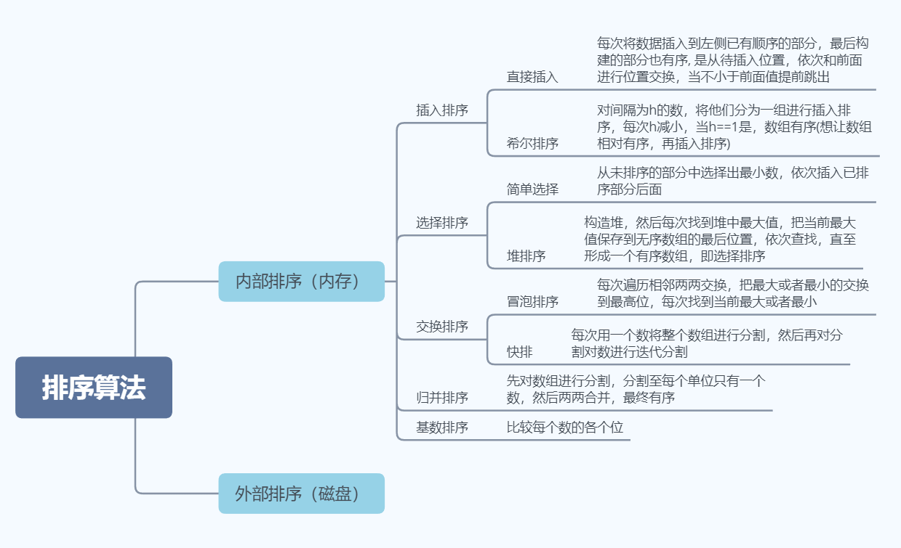
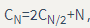

## 概括



## 插入排序

思想：每次将数据插入到左侧已有顺序的部分，最后构建的部分也有序, 是从待插入位置，依次和前面进行位置交换，当不小于前面值提前跳出
空间复杂度：o(1)
时间复杂度：o(n^2)
是否稳定：稳定

```java
	public static void insertSort(int[] nums){
        for (int i = 1; i < nums.length; i++)//留意也是从 i = 1开始的
            for (int j = i; j > 0 && nums[j] < nums[j-1]; j--){
                swap(nums, j, j-1);
            }
        }

    }

    public static void swap(int[] nums, int a, int b){
        int tmp = nums[a];
        nums[a] = nums[b];
        nums[b] = tmp;
    }
```


## 希尔排序

思想：对间隔为h的数，将他们分为一组进行插入排序，每次h减小，当h==1是，数组有序(想让数组相对有序，再插入排序)
空间复杂度：o(1)
时间复杂度：o(n^2)
是否稳定：不稳定

```java
	public static void shellSort(int[] nums){
        int h = 1;
        while(h < nums.length / 3){
            h = h * 3 + 1;  //要保证最后h = 1
        }
        while(h >= 1){
            for (int i = h; i < nums.length; i++){						//把h后每一个数都与前面自己一组的数做插入排序
                for (int j = i; j >= h && nums[j] < nums[j-h]; j -= h){ //j >= h和是因为j和j-h在比较
                                                                        //nums[j] < nums[j-h]是不小于前面的数就早停了
                    swap(nums, j, j-h);
                }
            }
            h = h / 3;
        }
    }
```


## 选择排序

 思想：从未排序的部分中选择出最小数，依次插入已排序部分后面
 空间复杂度： o(1)
 时间复杂度： o(n^2)
 是否稳定：不稳定

```java
	public static void selectSort(int[] nums){

        for (int i = 0; i < nums.length; i++){
            int minIndex = i;
            for (int j = i; j < nums.length; j++){
                if (nums[j] < nums[minIndex]){
                    minIndex = j;
                }
            }
            swap(nums, i, minIndex);

        }
    }
    public static void swap(int[] nums, int a, int b){
        int tmp = nums[a];
        nums[a] = nums[b];
        nums[b] = tmp;
    }
```


## 堆排序

### 1. 堆

堆中某个节点的值总是大于等于（小于等于）其子节点的值，叫做大根堆（或者小根堆），最大（或者）最小的数在最上面

堆是一颗**完全二叉树**。

堆可以用数组来表示，这是因为堆是完全二叉树，而完全二叉树很容易就存储在数组中。位置 k 的节点的父节点位置为 k/2，而它的两个子节点的位置分别为 2k 和 2k+1。这里不使用数组索引为 0 的位置，是为了更清晰地描述节点的位置关系。

### 2. 上浮和下沉

这儿针对的是小根堆

- **上浮**：在堆中，当一个节点比父节点小，那么需要交换这个两个节点。交换后还可能比它新的父节点小，因此需要不断地进行比较和交换操作。
- **下沉**：当一个节点比子节点来得大，也需要不断地向下进行比较和交换操作。
  - 一个节点如果有两个子节点，应当与两个子节点中最小那个节点进行交换。

### 3. 插入和删除数据

- 插入：把数据插到数组最后，然后进行上浮，维持堆结构；
- 删除：将最后一个元素放在堆顶，然后进行下沉，维持堆结构

### 4. 堆排序

针对大顶堆，把最大元素和**当前堆中**数组的最后一个元素交换位置，每次找到当前堆中最大值放到 i 位置，从而得到一个递增序列，这就是堆排序。

堆排序需要两步实现：初始化堆 + 交换堆顶元素与最后一个元素

- **初始化堆**：构建一个堆，但是堆中数据还没有顺序，有两种上浮和下沉方案实现，下沉效率更高
- **交换堆顶元素与最后一个元素**：不断交换，不断下沉最终完全有序

#### 4.1. 初始化堆

- **上浮建堆**：最直接的方法是从左到右遍历数组进行上浮操作
- **下沉建堆**：从右至左进行下沉操作，如果一个节点的两个节点都已经是堆有序，那么进行下沉操作可以使得这个节点为根节点的堆有序。叶子节点不需要进行下沉操作，可以忽略叶子节点的元素，因此只需要遍历一半的元素即可。

#### 4.2. 交换堆顶元素与最后一个元素

针对大顶堆，每次找到当前堆中的最大值，交换到未排序的最后一个位置

```java
	public static void main(String[] args) {
         int[] nums = {2, 1, 4, 11, 2, 6, 5, 10, 3};
         heapSort(nums);
         System.out.println(Arrays.toString(nums));

     }
     public static void heapSort(int[] nums){
         int N = nums.length - 1;
         for (int k = N / 2; k >= 0; k--)
             sink(nums, k, N);
         while (N > 0) {
             swap(nums, 0, N--);
             sink(nums, 0, N);
         }

     }


     public static void sink(int[] nums, int k, int N){
         while(2 * k < N){
             int j = k == 0 ? 1 : 2 * k;//因为第一个数位置是0, 2*0仍然是0，所以人为找到0位置的左孩子
             if (j + 1 < N && nums[j] < nums[j + 1]){
                 j++;
             }
             if (nums[j] < nums[k]){//因为是大顶堆，如果nums[j]都小于nums[k]，即最大孩子已经小于父节点就不需要再交换下去了
                 break;
             }
             swap(nums, k, j);
             k = j;
         }
     }

     public static void swap(int[] nums, int a, int b){
        int tmp = nums[a];
        nums[a] = nums[b];
        nums[b] = tmp;
     }
```


### 分析

一个堆的高度为 logN，因此在堆中插入元素和删除最大元素的复杂度都为 logN。

对于堆排序，由于要对 N 个节点进行下沉操作，因此复杂度为 NlogN。

堆排序是一种原地排序，没有利用额外的空间。

现代操作系统很少使用堆排序，因为它无法利用局部性原理进行缓存，也就是数组元素很少和相邻的元素进行比较和交换。


## 冒泡排序

思想：每次遍历相邻两两交换，把最大或者最小的交换到最高位，每次找到当前最大或者最小

空间复杂度：o(1)

时间复杂度：o(n^2)

是否稳定：稳定

```java
	public static void bubbleSort(int[] nums){
        boolean flag = false;//如果那一次排序没有交换说明数组已经有序了，不需要再排了
        for (int i = nums.length - 1; i > 0 && !flag; i--){//n个数只需要排n-1即可,从后往前看好理解一点
            flag = true;
            for (int j = 0; j < i; j++){//从后往前看第i个数只需要排i-1次就可以找到
                if (nums[j] > nums[j + 1]){
                    swap(nums, j, j + 1);
                    flag = false;
                }
            }
        }
    }
    public static void swap(int[] nums, int a, int b){
        int tmp = nums[a];
        nums[a] = nums[b];
        nums[b] = tmp;
    }
```


## 快排

思想：每次用一个数将整个数组进行分割，然后再对分割对数进行迭代分割

空间复杂度：O(1)

时间复杂度：O(NlogN)

是否稳定：不稳定

### 性能分析

**最好情况 O(NlogN)**：快速排序最好的情况下是每次都正好将数组对半分，这样递归调用次数才是最少的。这种情况下比较次数为 ，复杂度为 O(NlogN)。

**最坏情况O(N^2)**：即数组已经有序，最坏的情况下，第一次从最小的元素切分，第二次从第二小的元素切分，如此这般。因此最坏的情况下需要比较 N^2 / 2。为了防止数组最开始就是有序的，在进行快速排序时需要随机打乱数组。

快速排序是原地排序，不需要辅助数组，但是递归调用需要辅助栈。

```java
	//递归	
	public static void quicktSort(int[] nums, int left, int right){
        if (left >= right) return;
        int mid = partition(nums, left, right);
        quicktSort(nums, left, mid - 1);
        quicktSort(nums, mid + 1, right);
    }
	//非递归
	public static void quicktSort(int[] nums, int left, int right){
        if (left >= right) return;
        int i = left;
        int j = right;
        int value = nums[left];
        while(i < j){
            while(i < j && nums[j] >= value) j--; //这儿需要等号，不然相等的数始终在哪儿交换
            while(i < j && nums[i] <= value) i++;
            swap(nums, i, j);
        }
        swap(nums, i, left);
        quicktSort(nums, left, i - 1);
        quicktSort(nums, i + 1, right);
    }


    public static int TopK_PriorityQueue(int[] nums, int k){
        PriorityQueue<Integer> heap = new PriorityQueue<>();
        for (int i = 0; i < nums.length; i++){
            heap.add(nums[i]);
            if (heap.size() > k) {
               heap.poll(); 
            }
        }
        return heap.peek();
    }


    public static int TopK(int[] nums, int numK){
        int left = 0;
        int right = nums.length - 1;
        int k = nums.length - numK; //第K大的数是从最大数往最小数计数的
        while(left < right){
            int mid = partition(nums, left, right);
            if (mid == k){
                return nums[mid];
            }else if (mid < k){
                left = mid + 1;
            }else{
                right = mid - 1;
            }
        }
        return nums[k];

    }


    public static int partition(int[] nums, int left, int right){
        int i = left;
        int j = right;
        int value = nums[left];
        while(i < j){
            while(i < j && nums[j] >= value) j--; //这儿需要等号，不然相等的数始终在哪儿交换
            while(i < j && nums[i] <= value) i++;
            swap(nums, i, j);
        }
        swap(nums, i, left);
        return i;
    }

    public static void swap(int[] nums, int a, int b){
        int tmp = nums[a];
        nums[a] = nums[b];
        nums[b] = tmp;
    }
```

### 算法改进

#### 1. 切换到插入排序

因为快速排序在小数组中也会递归调用自己，对于小数组，插入排序比快速排序的性能更好，因此在小数组中可以切换到插入排序。

#### 2. 三数取中

最好的情况下是每次都能取数组的中位数作为切分元素，但是计算中位数的代价很高。一种折中方法是取 3 个元素，并将大小居中的元素作为切分元素。

#### 3. 三向切分

对于有大量重复元素的数组，可以将数组切分为三部分，分别对应小于、等于和大于切分元素。

三向切分快速排序对于有大量重复元素的随机数组可以在线性时间内完成排序。


## 归并排序

思想：先对数组进行分割，分割至每个单位只有一个数，然后两两合并，最终有序
空间复杂度：o(N)
时间复杂度：o(NlogN)
是否稳定：稳定

```java
	public static void mergeSort(int[] nums, int left, int right){
        //不再分割
        if (left >= right){
            return;
        }
        int mid = left + (right - left) / 2;
        mergeSort(nums, left, mid);
        mergeSort(nums, mid + 1, right);
        merge(nums, left, mid, right);

    }
    //合并2个有序数组
    public static void merge(int[] nums, int left, int mid, int right){
        int[] tmp = new int[right - left + 1];//辅助数组
        int left_index = left;
        int right_index = mid + 1;
        int index = 0;
        while(left_index <= mid && right_index <= right){
            if (nums[left_index] < nums[right_index]){
                tmp[index++] = nums[left_index++];
            }else{
                tmp[index++] = nums[right_index++];
            }
        }
        while(left_index <= mid){
            tmp[index++] = nums[left_index++];
        }
        while(right_index <= right){
            tmp[index++] = nums[right_index++];
        }
        //赋值回原数组
        for (int i = left; i <= right; i++){
            nums[i] = tmp[i - left];
        }

    }
```


## 排序算法的比较

|       算法       | 稳定性 |          时间复杂度          | 空间复杂度 |           备注           |
| :--------------: | :----: | :--------------------------: | :--------: | :----------------------: |
|     选择排序     |   ×    |              N2              |     1      |                          |
|     冒泡排序     |   √    |              N2              |     1      |                          |
|     插入排序     |   √    |            N ~ N2            |     1      | 时间复杂度和初始顺序有关 |
|     希尔排序     |   ×    | N 的若干倍乘于递增序列的长度 |     1      |      改进版插入排序      |
|     快速排序     |   ×    |            NlogN             |    logN    |                          |
| 三向切分快速排序 |   ×    |          N ~ NlogN           |    logN    |   适用于有大量重复主键   |
|     归并排序     |   √    |            NlogN             |     N      |                          |
|      堆排序      |   ×    |            NlogN             |     1      |    无法利用局部性原理    |

快速排序是最快的通用排序算法，它的内循环的指令很少，而且它还能利用缓存，因为它总是顺序地访问数据。它的运行时间近似为 ~cNlogN，这里的 c 比其它线性对数级别的排序算法都要小。

使用三向切分快速排序，实际应用中可能出现的某些分布的输入能够达到线性级别，而其它排序算法仍然需要线性对数时间。


