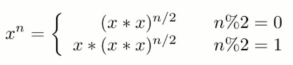

#### [03. 数组中重复的数字](https://leetcode-cn.com/problems/shu-zu-zhong-zhong-fu-de-shu-zi-lcof/)

找出数组中重复的数字。

在一个长度为 n 的数组 nums 里的所有数字都在 0～n-1 的范围内。数组中某些数字是重复的，但不知道有几个数字重复了，也不知道每个数字重复了几次。请找出数组中任意一个重复的数字。

**示例**

```html
输入：[2, 3, 1, 0, 2, 5, 3]
输出：2 或 3 
```

思路：关键点长度为n，所有数字都在0~n-1的范围内，将遍历的数字i交换到第i个位置，出现冲突则重复。时间复杂度：O(n)，空间复杂度：O(1)

错误思路：把遍历过的数字记录下来，用位置去记录（把遍历到的数字作为索引，将该位置的数只为负值，表示该数已经出现，如果出现索引位置数已经为负值时，表示该数重复）。但是该方法**无法处理0重复**的情况。


```java
public int findRepeatNumber(int[] nums){
    if(nums.length == 0 || nums == null){
        return -1;
    }
    for(int i = 0; i < nums.length; i++){
        while(nums[i] != i){
            if(nums[i] == nums[nums[i]]){
                return nums[i];
            }
            swap(nums, i, nums[i]);
        }
        
    }
    return -1;
    
}

public void swap(int[] nums, int i , int j){
    int tmp = nums[i];
    nums[i] = nums[j];
    nums[j] = tmp;
}
```


#### [04. 二维数组中的查找](https://leetcode-cn.com/problems/er-wei-shu-zu-zhong-de-cha-zhao-lcof/)

在一个 n * m 的二维数组中，每一行都按照从左到右递增的顺序排序，每一列都按照从上到下递增的顺序排序。请完成一个函数，输入这样的一个二维数组和一个整数，判断数组中是否含有该整数。

**示例:**

```html
现有矩阵 matrix 如下：
[
  [1,   4,  7, 11, 15],
  [2,   5,  8, 12, 19],
  [3,   6,  9, 16, 22],
  [10, 13, 14, 17, 24],
  [18, 21, 23, 26, 30]
]

给定 target = 5，返回 true。
给定 target = 20，返回 false。
```

思路：从左到右和从上到下是有序的，选择从从左下或者从右上开始比对，除了等于每次大于小于排除部分数据，改变移动方向，最终越界则未找到。时间复杂度：O(M + N)，空间复杂度：O(1)

```java
public boolean findNumberIn2DArray(int[][] matrix, int target) {
        if (matrix == null || matrix.length == 0 || matrix[0].length == 0) {
            return false;
        }
        //从右上角开始移动
        int i = 0, j = matrix[0].length - 1; 
        while(i < matrix.length && j >= 0){
            if(target < matrix[i][j]){
                j--;
            }
            else if(target > matrix[i][j]){
                i++;
            }
            else{
        		return true;
            }
        }
    	return false;
}
```


#### [05. 替换空格](https://leetcode-cn.com/problems/ti-huan-kong-ge-lcof/)

请实现一个函数，把字符串 `s` 中的每个空格替换成"%20"。

**示例 ：**

```html
输入：s = "We are happy."
输出："We%20are%20happy."
```

思路：创建一个StringBuilder  str，遍历s，如果i位置是字符则直接添加到str，是空格则添加"%20"。时间复杂度：O(N)，空间复杂度：O(N)

```java
public String replaceSpace(String s) {
    StringBuilder str = new StringBuilder();
    for(Character c : s.toCharArray()){
        if( c == ' '){
            str.append("%20");
        }else{
            str.append(c);
        }
    }
    return str.toString();
}
```


#### [06. 从尾到头打印链表](https://leetcode-cn.com/problems/cong-wei-dao-tou-da-yin-lian-biao-lcof/)

输入一个链表的头节点，从尾到头反过来返回每个节点的值（用数组返回）。

**示例**

```html
输入：head = [1,3,2]
输出：[2,3,1]
```

思路：

1. 不使用辅助栈，反转链表，再从头打印，最后再将链表反转。时间复杂度：O(N)，空间复杂度：O(1)
2. 使用辅助栈，反转链表，再从头打印，最后再将链表反转。时间复杂度：O(N)，空间复杂度：O(N)

```java
public int[] reversePrint(ListNode head) {
        Stack<Integer> stack = new Stack<Integer>();
        ListNode tmp = head;
        //int len = 0;
        while(tmp != null){
            stack.push(tmp.val);
            tmp = tmp.next;
            //len++;
        }
        int size = stack.size();
        int[] res = new int[size];
        //int i = 0;
        //while(!stack.isEmpty()){
        for(int i = 0; i < size; i++){
            res[i] = stack.pop();
        }
        return res;
}
```


#### [07. 重建二叉树](https://leetcode-cn.com/problems/zhong-jian-er-cha-shu-lcof/)

输入某二叉树的前序遍历和中序遍历的结果，请重建该二叉树。假设输入的前序遍历和中序遍历的结果中都不含重复的数字。

**示例**

```html
前序遍历 preorder = [3,9,20,15,7]
中序遍历 inorder = [9,3,15,20,7]
返回如下的二叉树：
    3
   / \
  9  20
    /  \
   15   7
```
思路：与手动推倒二叉树是一致的，通过前序或者后续的根节点去分割中序二叉树，做递归，生成子树，为了更好的找到中序的根节点，使用HashMap<value, index>将数据进行存储，方便快速查找。时间复杂度：O(N)，空间复杂度：O(N)

此题已知前序和中序推导后续思路是一致的。

```java
HashMap<Integer, Integer> map = new HashMap<>();
public TreeNode buildTree(int[] preorder, int[] inorder) {
    int len = preorder.length;
    for(int i = 0; i < len; i++){
        map.put(inorder[i], i);
    }
    return buildTree(preorder, 0, len - 1, inorder, 0, len - 1);
}
public TreeNode buildTree(int[] pre, int preStart, int preEnd, int[] in, int inStart, int inEnd){
    //不能是 ">=" ，"="则无法输出叶子节点
    if(preStart > preEnd){
        return null;
    }
    int preRoot = pre[preStart];            //find pre root
    int inRoot = map.get(preRoot);          //find the index  of in root
    int leftChildSize = inRoot - inStart;   //the left child size
    TreeNode root =  new TreeNode(preRoot); //build the root of tree
    root.left = buildTree(pre, preStart + 1, preStart + leftChildSize, in, inStart, inRoot - 1);
    root.right = buildTree(pre, preStart + leftChildSize + 1, preEnd, in, inRoot + 1, inEnd);
    return root;
    
}
```

**已知前序和中序，输出后续**

```java
static HashMap<Character, Integer> map = new HashMap<>();

    public static void main(String[] args) {
        String preStr = "GDAFEMHZ";
        String inStr = "ADEFGHMZ";
        char[] pre = preStr.toCharArray();
        char[] in = inStr.toCharArray();
        for(int i= 0; i < in.length; i++){
            map.put(in[i], i);
        }
        pos(pre, in, 0, pre.length - 1, 0, pre.length - 1);
    }

    public static void pos(char[] pre, char[] in, int preStart, int preEnd, int inStart, int inEnd){
        //if(preStart >= preEnd)  错在多了一个等于，导致叶子节点打印不出来，可笑可笑
        if(preStart > preEnd){
            return;
        }
        char root = pre[preStart];
        int inRoot = map.get(root);
        int leftChildSize = inRoot - inStart;
        pos(pre, in, preStart + 1, preStart + leftChildSize, inStart, inRoot - 1);
        pos(pre, in, preStart + leftChildSize + 1, preEnd, inRoot + 1, inEnd);
        System.out.print(root + " ");

    }
```


#### [09. 用两个栈实现队列](https://leetcode-cn.com/problems/yong-liang-ge-zhan-shi-xian-dui-lie-lcof/)

思路：队列是先入先出，栈是先入后出，所以用两个栈将数据进行反转，得到数据的输入输出顺序就是先入先出

pushStack栈将数据”倒入“popStack时遵循两个原则：1.popStack为空时才能倒出，2.一次性“倒出”pushStack全部数据。

```java
public static class StackToQueue{
        private Stack<Integer> pushStack;
        private Stack<Integer> popStack;

        public StackToQueue(){
            this.pushStack = new Stack<Integer>();
            this.popStack = new Stack<Integer>();
        }

        public void push(int obj){
            pushStack.push(obj);
        }
        public int poll(){
            //“倒出”数据
            if(popStack.isEmpty()){
                while(!pushStack.isEmpty()){
                    popStack.push(pushStack.pop());
                }
            }
            return popStack.pop();

        }
        public int peek(){
            //“倒出”数据
            if (popStack.isEmpty()){
                while(!pushStack.isEmpty()){
                    popStack.push(pushStack.pop());
                }
            }
            return popStack.peek();
        }
        public boolean isEmpty(){
            return popStack.isEmpty() && pushStack.isEmpty();
        }

    }
```

**相关问题**：同两个队列实现一个栈

思路：记住栈与队列数据输入输出顺序，dataQueue用于存储数据，helpQueue用于暂存数据，每次将dataQueue中的数据只保留一个，其他全部输入helpQueue中，然后输出dataQueue中的最后一个数据，最后交换两个队列引用。

```java
public static class QueueToStack{
        private Queue<Integer> data;
        private Queue<Integer> help;

        public QueueToStack(){
            this.data = new LinkedList<Integer>();
            this.help = new LinkedList<Integer>();
        }

        public void push(int obj){
            data.add(obj);
        }

        public Integer pop(){
            if(!data.isEmpty()){
                while(data.size() > 1){
                    help.add(data.poll());
                }
                int tmp = data.poll();
                Queue<Integer> tmpQueue = data;
                data = help;
                help = tmpQueue;
                return tmp;
                
            }
        }
        public int peek(){
            if (!data.isEmpty()){
                while(data.size() > 1){
                    help.add(data.poll());
                }
                int tmp = data.peek();
                help.add(data.poll());
                Queue<Integer> tmpQueue = data;
                data = help;
                help = tmpQueue;
                return tmp;
            }
        }
    }
```


#### [10- I. 斐波那契数列](https://leetcode-cn.com/problems/fei-bo-na-qi-shu-lie-lcof/)

写一个函数，输入 n ，求斐波那契（Fibonacci）数列的第 n 项。斐波那契数列的定义如下：

F(0) = 0,   F(1) = 1
F(N) = F(N - 1) + F(N - 2), 其中 N > 1.
斐波那契数列由 0 和 1 开始，之后的斐波那契数就是由之前的两数相加而得出。

**示例**

```java
输入：n = 2  输出：1
输入：n = 5  输出：5
```

思路：动态规划，用空间换时间

```java
public int fib(int n) {
        if(n < 2){
            return n;
        }
        int[] arr = new int[n+1];
        arr[0] = 0;
        arr[1] = 1;
        for(int i = 2; i < n + 1; i++){
            arr[i] = (arr[i-1] + arr[i-2]);
        }
        return arr[n] ;
}
```


#### [10- II. 青蛙跳台阶问题](https://leetcode-cn.com/problems/qing-wa-tiao-tai-jie-wen-ti-lcof/)

一只青蛙一次可以跳上1级台阶，也可以跳上2级台阶。求该青蛙跳上一个 `n` 级的台阶总共有多少种跳法。

思路：动态规划的思想，将问题转化为子问题，将子问题的结果缓存起来，避免重复求解子问题。只能从第i - 2和i - 1跳到第 i 阶，

递归也是将问题划分为子问题，但是未将结果缓存下来。


#### [11. 旋转数组的最小数字](https://leetcode-cn.com/problems/xuan-zhuan-shu-zu-de-zui-xiao-shu-zi-lcof/)

把一个数组最开始的若干个元素搬到数组的末尾，我们称之为数组的旋转。输入一个递增排序的数组的一个旋转，输出旋转数组的最小元素。例如，数组 [3,4,5,1,2] 为 [1,2,3,4,5] 的一个旋转，该数组的最小值为1。  

示例 1：

```html
输入：[3,4,5,1,2]
输出：1
```

示例 2：

```html
输入：[2,2,2,0,1]
输出：0
```

思路：旋转后依部分有序，通过二分法进行查找，mid与right进行比较。时间复杂度：O(logN)，空间复杂度：O(1)

- nums[mid] < nums[right]，目标值在[left，mid - 1]内；
- nums[mid] > nums[right]，目标值在[mid + 1, right]内；
- nums[mid] == nums[right]，不确定目标值在那个范围，所以减小区间 right= right- 1（保证了目标值还在[left, right]中），证明见leetcode。

为什么不使用nums[left]与nums[mid]比较，因为当nums[left] < nums[mid]时无法确定目标值在那个区间。

```html
举例：
[1,2,3,4,5] 
[3,4,5,1,2]
```

```java
     public  int binarySearch(int[] nums){
        int left = 0;
        int right = nums.length - 1;
        //当 left = right时跳出二分循环，并返回 numbers[left] 即可。
        while(left < right){
            int mid = left + (right - left) / 2;    
            if(nums[mid] > nums[right]){
                left = mid + 1;
            }else if(nums[mid] < nums[right]){
                right = mid;
            }else{
                right--;
            }

        }
        return nums[left];
     }
```


#### [12. 矩阵中的路径](https://leetcode-cn.com/problems/ju-zhen-zhong-de-lu-jing-lcof/)

判断在一个矩阵中是否存在一条包含某字符串所有字符的路径。路径可以从矩阵中的任意一个格子开始，每一步可以在矩阵中向上下左右移动一个格子。如果一条路径经过了矩阵中的某一个格子，则该路径不能再进入该格子。

[["a","**b**","c","e"],
["s","**f**","**c**","s"],
["a","d","**e**","e"]]

但矩阵中不包含字符串“abfb”的路径，因为字符串的第一个字符b占据了矩阵中的第一行第二个格子之后，路径不能再次进入这个格子。

思路：类似岛屿问题，对所有位置使用回溯法（推荐）/暴力递归，这儿需要注意是，不能走回头路，所以我们需要把访问过的位置置为特殊标记，同时回溯法要求把值修改回原来的值。

```java
    public boolean exist(char[][] board, String word) {
        char[] str = word.toCharArray();
        int rows = board.length;
        int cols = board[0].length;

        if(rows * cols < str.length || rows == 0 || cols == 0 || str.length == 0){
            return false;
        }

        int index = 0;
        for(int i = 0; i < rows; i++){
            for(int j = 0; j < cols; j++){
                if(dfs(board, str, i, j, index)){
                    return true;
                }
            }
        }
        return false;

    }
    //每个位置深度优先遍历
    public boolean dfs(char[][] board, char[] str, int i, int j, int index){
        if(i < 0 || j < 0 || i == board.length || j == board[0].length || board[i][j] != str[index]){
            return false;
        }
        if(index == str.length - 1 && str[index] == board[i][j]){
            return true;
        }
        
        //当前遍历下，这个位置已经访问过了，不能访问了
        //不能让他走回头路，和岛屿问题类似，把当前位置置为特殊字符
        //只是当前字符和下一个字符之间不能走回头路，所以把它改了之后要还原回来，不然其他位置也访问不了这个位置了  
        char tmp = board[i][j];
        board[i][j] = '#';

        boolean res = (dfs(board, str, i + 1, j, index + 1) || dfs(board, str, i - 1, j, index + 1) ||
        dfs(board, str, i, j + 1, index + 1) || dfs(board, str, i, j - 1, index + 1));

        board[i][j] = tmp;

        return res;
    }
```


#### [13. 机器人的运动范围](https://leetcode-cn.com/problems/ji-qi-ren-de-yun-dong-fan-wei-lcof/)

地上有一个m行n列的方格，从坐标 [0,0] 到坐标 [m-1,n-1] 。一个机器人从坐标 [0, 0] 的格子开始移动，它每次可以向左、右、上、下移动一格（不能移动到方格外），也不能进入行坐标和列坐标的数位之和大于k的格子。

例如，当 k 为 18 时，机器人能够进入方格 (35,37)，因为 3+5+3+7=18。但是，它不能进入方格 (35,38)，因为 3+5+3+8=19。请问该机器人能够达到多少个格子？

思路：深度优先遍历DFS，不要当前位置每一位数，当前位置是可以通过前一个位置计算的。

- 深度优先搜索： 可以理解为暴力法模拟机器人在矩阵中的所有路径。DFS 通过递归，先朝一个方向搜到底，再回溯至上个节点，沿另一个方向搜索，以此类推；
- 剪枝： 在搜索中，遇到数位和超出目标值、此元素已访问，则应立即返回。

```java
    int m, n, k;
    boolean[][] visited;
    public int movingCount(int m, int n, int k) {
        this.m = m; this.n = n; this.k = k;
        this.visited = new boolean[m][n];
        return dfs(0, 0, 0, 0);
    }
	//i,j当前位置，si行数各位之和，sj列数各位之和，visited当前位置是否被访问
    public int dfs(int i, int j, int si, int sj) {
        if(i >= m || j >= n || k < si + sj || visited[i][j]) return 0;
        visited[i][j] = true;
        return 1 + dfs(i + 1, j, (i + 1) % 10 != 0 ? si + 1 : si - 8, sj) + dfs(i, j + 1, si, (j + 1) % 10 != 0 ? sj + 1 : sj - 8);
    }
```


#### [14- I. 剪绳子](https://leetcode-cn.com/problems/jian-sheng-zi-lcof/)

给你一根长度为 n 的绳子，请把绳子剪成整数长度的 m 段（m、n都是整数，n>1并且m>1），每段绳子的长度记为 k[0],k[1]...k[m-1] 。请问 k[0]*k[1]*...*k[m-1] 可能的最大乘积是多少？例如，当绳子的长度是8时，我们把它剪成长度分别为2、3、3的三段，此时得到的最大乘积是18。

示例：

```html
输入: 2
输出: 1
解释: 2 = 1 + 1, 1 × 1 = 1
```

思路：这儿需要知道一个大前提：一个数切分为尽可能多的“3”时，其乘积有最大值，严格证明需要数学推导。同时出现1的时候，取出一个3，变为2*2。

```java
	public int cuttingRope(int n) {
        if(n <= 3){
            return n - 1;
        }
        int num = n / 3;
        if(n % 3 == 0){
            return (int)Math.pow(3, num);
        }else if(n % 3 == 1){
            return (int)(Math.pow(3, num - 1) * 4);
        }else{
            return (int)(Math.pow(3, num) * 2);
        }

    }
```


#### [14- II. 剪绳子 II](https://leetcode-cn.com/problems/jian-sheng-zi-ii-lcof/)

题目同上，主要是N值过大，乘积超出int取值范围，甚至long范围。

思路：主要考察大数求余（循环求余，快速求余（推荐））。

快速求余：


```java
	public int cuttingRope(int n) {
        //数太大会越界超过，甚至超过long，所以换一种求余的方式
        if(n <= 3) return n - 1;
        int b = n % 3, p = 1000000007;

        long res = 1, x = 3;
        //a = n / 3 - 1  是在计算有余数的时候，方便计算
        for(int a = n / 3 - 1; a > 0; a /= 2) {
            if(a % 2 == 1) res = (res * x) % p;
            x = (x * x) % p;
        }
		//保留了一个3，不需要太麻烦的计算
        if(b == 0) return (int)(res * 3 % p);
        if(b == 1) return (int)(res * 4 % p);
        return (int)(res * 6 % p);
    }
```


#### [15. 二进制中1的个数](https://leetcode-cn.com/problems/er-jin-zhi-zhong-1de-ge-shu-lcof/)

请实现一个函数，输入一个整数，输出该数二进制表示中 1 的个数。例如，把 9 表示成二进制是 1001，有 2 位是 1。因此，如果输入 9，则该函数输出 2。

示例：

```html
输入：00000000000000000000000000001011
输出：3
解释：输入的二进制串 00000000000000000000000000001011 中，共有三位为 '1'。

```

思路：不要考虑手动一位一位的计算，位运算很多时候很有用处。

1.逐位判断（基础）：

- 若n & 1 = 0，则 n二进制 最右一位 为 0
- 若 n \& 1 = 1，则 n二进制最右一位为 1 

2.n & ( n - 1 )(推荐)：

- n - 1：二进制数字n最右边的 1 变成 0 ，此1右边的 0 都变成1
- n & ( n − 1) ：二进制数字 n 最右边的 1 变成 0 ，其余不变


```java
	//逐位判断
	public int hammingWeight(int n) {
    	int res = 0;
     	while(n != 0) {
         	res += n & 1;
         	n >>>= 1;
     	}
     	return res;
 	}
	//n & ( n - 1 )
	public int hammingWeight(int n) {
         int count = 0;
         //输入的是一串数组，不能用 n > 0 判断
         while(n != 0){
             n = n & (n - 1);
             count++;
         }
         return count;
 	}
```


#### [16. 数值的整数次方](https://leetcode-cn.com/problems/shu-zhi-de-zheng-shu-ci-fang-lcof/)

实现函数double Power(double base, int exponent)，求base的exponent次方。不得使用库函数，同时不需要考虑大数问题。

示例：

```html
输入: 2.00000, 10
输出: 1024.00000

输入: 2.00000, -2
输出: 0.25000
解释: 2-2 = 1/22 = 1/4 = 0.25
```

思路：仍然是快速求余幂指数算法，大数问题用double类型解决。



```java
	public double myPow(double x, int n) {
        if(x == 0) return 0;
        //为了防止n = -2^32转化为2^32越界，用long类型暂存
        long b = n;
        if(b < 0){
            x = 1 / x;
            b = -b;
        }
        double res = 1.0;
        for(long i = b; i > 0;  i /= 2){
			//快速求幂
            if(i % 2 == 1){
                res *= x;
            }
            x = x * x;
            
        }
        return res;
    }
```

#### [17. 打印从1到最大的n位数](https://leetcode-cn.com/problems/da-yin-cong-1dao-zui-da-de-nwei-shu-lcof/)

输入数字 `n`，按顺序打印出从 1 到最大的 n 位十进制数。比如输入 3，则打印出 1、2、3 一直到最大的 3 位数 999。

示例：

```html
输入: n = 1
输出: [1,2,3,4,5,6,7,8,9]
```

```html
	public int[] printNumbers(int n) {
        int len = (int)Math.pow(10,n);
        int[] res = new int[len-1];
        for(int i = 0; i < len-1; i++){
            res[i] = i + 1;
        }
        return res;

    }
```

#### [18. 删除链表的节点](https://leetcode-cn.com/problems/shan-chu-lian-biao-de-jie-dian-lcof/)

给定单向链表的头指针和一个要删除的节点的值，定义一个函数删除该节点。返回删除后的链表的头节点。

示例：

```html
输入: head = [4,5,1,9], val = 5
输出: [4,1,9]
解释: 给定你链表中值为 5 的第二个节点，那么在调用了你的函数之后，该链表应变为 4 -> 1 -> 9.
```

思路：找到删除节点的前一个节点，如果不用两个节点，则需要考虑如果删除的是最后一个节点，节点移动需要注意一下。

```java
	public ListNode deleteNode(ListNode head, int val) {
        ListNode tmp = head;
        
        //特例：删除的是头节点
        if(tmp.val == val) return head.next;

        while(tmp.next != null){
            if(tmp.next.val == val){
                //需要一个辅助节点才行
                ListNode delNode = tmp.next;
                tmp.next = delNode.next;
                delNode.next = null;
            }
            //如果删除的最后一个节点会出现,tmp.next == null的问题，所以要先判断一下
            if(tmp.next != null){
                tmp = tmp.next;
            }
            
        }
        return head;
    }
```


#### [未---19. 正则表达式匹配](https://leetcode-cn.com/problems/zheng-ze-biao-da-shi-pi-pei-lcof/)

请实现一个函数用来匹配包含'. '和'*'的正则表达式。模式中的字符'.'表示任意一个字符，而'*'表示它前面的字符可以出现任意次（含0次）。在本题中，匹配是指字符串的所有字符匹配整个模式。例如，字符串"aaa"与模式"a.a"和"ab*ac*a"匹配，但与"aa.a"和"ab*a"均不匹配。

示例：

```html
输入:
s = "ab"
p = ".*"
输出: true
解释: ".*" 表示可匹配零个或多个（'*'）任意字符（'.'）。

输入:
s = "aa"
p = "a*"
输出: true
解释: 因为 '*' 代表可以匹配零个或多个前面的那一个元素, 在这里前面的元素就是 'a'。因此，字符串 "aa" 可被视为 'a' 重复了一次。
```


#### [未---20. 表示数值的字符串](https://leetcode-cn.com/problems/biao-shi-shu-zhi-de-zi-fu-chuan-lcof/)

请实现一个函数用来判断字符串是否表示数值（包括整数和小数）。例如，字符串"+100"、"5e2"、"-123"、"3.1416"、"-1E-16"、"0123"都表示数值，但"12e"、"1a3.14"、"1.2.3"、"+-5"及"12e+5.4"都不是。


#### [21. 调整数组顺序使奇数位于偶数前面](https://leetcode-cn.com/problems/diao-zheng-shu-zu-shun-xu-shi-qi-shu-wei-yu-ou-shu-qian-mian-lcof/)

输入一个整数数组，实现一个函数来调整该数组中数字的顺序，使得所有奇数位于数组的前半部分，所有偶数位于数组的后半部分。

**示例：**

```html
输入：nums = [1,2,3,4]
输出：[1,3,2,4] 
注：[3,1,2,4] 也是正确的答案之一。
```

**思路：**

类似于快速排序的思想，使用两个指针分别从头尾开始遍历，每次找到一个奇偶数将其做交换直至相撞


```java
	public int[] exchange(int[] nums) {
        int left = 0;
        int right = nums.length - 1;
        while(left < right){
            //不要手贱把++ --操作放到判断语句里面
            //这儿需要加上left < right判断条件，不加会不满足left<right条件，中间那对会交换
            while(left < right && nums[right] % 2 == 0)right--;
            while(left < right && nums[left]  % 2 == 1)left++;
            
            swap(nums, left,right);
        }
        return nums;
        


    }
    public static void swap(int[] nums, int a, int b){
        int temp = nums[a];
        nums[a] = nums[b];
        nums[b] = temp;
    }
```


#### [22. 链表中倒数第k个节点](https://leetcode-cn.com/problems/lian-biao-zhong-dao-shu-di-kge-jie-dian-lcof/)

输入一个链表，输出该链表中倒数第k个节点。为了符合大多数人的习惯，本题从1开始计数，即链表的尾节点是倒数第1个节点。例如，一个链表有6个节点，从头节点开始，它们的值依次是1、2、3、4、5、6。这个链表的倒数第3个节点是值为4的节点。

**示例：**

```html
给定一个链表: 1->2->3->4->5, 和 k = 2.

返回链表 4->5.
```

**思路：**

- ~~两次遍历：先遍历整个链表长度，计算出倒数第K个的位置~~
- 快慢指针：快指针比慢指针快K步，快指针到达最后的位置，慢指针为倒数第K个位置

```java
	public ListNode getKthFromEnd(ListNode head, int k) {
        ListNode fast = head;
        ListNode slow = head;
        if(k < 1){
            return new ListNode();
        }

        while(k-- != 0){
            if(fast == null) return new ListNode();
            fast = fast.next;
        }

        while(fast != null){
            fast = fast.next;
            slow = slow.next;
        }
        return slow;   
    }
```


#### [24. 反转链表](https://leetcode-cn.com/problems/fan-zhuan-lian-biao-lcof/)

定义一个函数，输入一个链表的头节点，反转该链表并输出反转后链表的头节点。

**示例:**

```java
输入: 1->2->3->4->5->NULL
输出: 5->4->3->2->1->NULL
```

**思路：**

1. 记录当前节点的下一个节点
2. 改变当前节点的指针指向（双向链表亦如此）
3. 移动当前节点和新节点

```java
	public ListNode reverseList(ListNode head) {
        ListNode pre = null;
        ListNode next = null;
        while(head != null){
            next = head.next;
            
            head.next = pre;

            pre = head;
            head = next;        
        }
        return pre;
    }
```

#### [25. 合并两个排序的链表](https://leetcode-cn.com/problems/he-bing-liang-ge-pai-xu-de-lian-biao-lcof/)

输入两个递增排序的链表，合并这两个链表并使新链表中的节点仍然是递增排序的。

示例：

```html
输入：1->2->4, 1->3->4
输出：1->1->2->3->4->4
```

**思路：**

使用三个指针分别指向三个链表，比较两个原始链表当前节点的大小，将小者放到新节点位置，直至遍历结束。

```java
	public ListNode mergeTwoLists(ListNode l1, ListNode l2) {
        //new 2 node,一个遍历一个返回
        //伪头节点
        ListNode head = new ListNode(0);
        ListNode tmp =  head;
        while(l1 != null && l2 != null){
            if(l1.val < l2.val){
                tmp.next = l1;
                l1 = l1.next;
            }else{
                tmp.next = l2;
                l2 = l2.next;
            }
            tmp = tmp.next;
        }
        if(l1 != null){
            tmp.next = l1;
        }else{
            tmp.next = l2;
        }
        return head.next;
    }
```


#### [26. 树的子结构](https://leetcode-cn.com/problems/shu-de-zi-jie-gou-lcof/)

输入两棵二叉树A和B，判断B是不是A的子结构。(约定空树不是任意一个树的子结构)，B是A的子结构， 即 A中有出现和B相同的结构和节点值。

示例：

```html
给定的树 A:

     3
    / \
   4   5
  / \
 1   2
给定的树 B：

   4 
  /
 1
返回 true，因为 B 与 A 的一个子树拥有相同的结构和节点值。
```

**思路：**

- ~~遍历：将结果遍历出来，然后看B的结果是不是A的连续子串~~
- 递归：从root节点开始遍历，如果两个节点相同，判断其子结构也完全相同

```java
	public boolean isSubStructure(TreeNode A, TreeNode B) {
        //先序遍历
        //遍历的节点，是查看B是否是节点的子树，查看B的子节点和A的子节点，再去用isEqual校对，所以遍历的时候(A != null && B != null)对前中后序都成立 
        return (A != null && B != null) && (isEqual(A, B) || isSubStructure(A.left,B) || isSubStructure(A.right,B));

    }
    public static boolean isEqual(TreeNode A, TreeNode B){
        if(B == null){
            return true;
        }
        else if(A == null || A.val != B.val){
            return false;
        }
        else{
            return isEqual(A.left, B.left) && isEqual(A.right, B.right);
        }
    }
```

#### [27. 二叉树的镜像](https://leetcode-cn.com/problems/er-cha-shu-de-jing-xiang-lcof/)

请完成一个函数，输入一个二叉树，该函数输出它的镜像。

示例：

```html
输入：

     4
   /   \
  2     7
 / \   / \
1   3 6   9
镜像输出：

     4
   /   \
  7     2
 / \   / \
9   6 3   1
```

**思路：**

递归：每次将原来数的左右子树进行交换

```java
	public TreeNode mirrorTree(TreeNode root) {
        if(root == null){
            return null;
        }
        //和leetcode101不同， 101是二叉树自己对称镜像，而这儿是两个二叉树为镜像
        TreeNode head = new TreeNode(root.val);

        head.left = mirrorTree(root.right);
        head.right = mirrorTree(root.left);
        return head;
    }
```

#### [28. 对称的二叉树](https://leetcode-cn.com/problems/dui-cheng-de-er-cha-shu-lcof/)。

请实现一个函数，用来判断一棵二叉树是不是对称的。如果一棵二叉树和它的镜像一样，那么它是对称的。

例如，二叉树 [1,2,2,3,4,4,3] 是对称的。

```html
   1
  / \
  2   2
 / \ / \
3  4 4  3
```

但是下面这个 [1,2,2,null,3,null,3] 则不是镜像对称的:

```html
   1
  / \
  2   2
   \   \
   3    3
```
**思路：**

递归：但是我们左右分支是相反的，node1.right = node2. left  && node1.left = node2. right 

```java
	public boolean isSymmetric(TreeNode root) {
        return check(root, root);
    }

    public boolean check(TreeNode p, TreeNode q) {
        if (p == null && q == null) {
            return true;
        }
        if (p == null || q == null) {
            return false;
        }
        return p.val == q.val && check(p.left, q.right) && check(p.right, q.left);
    }

    //这样就错了，成了判断子树是否对称了
    // public boolean isSymmetric(TreeNode root) {
    //     if(root.left == null && root.right == null){
    //         return true;
    //     }
    //     if(root.left == null || root.right == null){
    //         return false;
    //     }
    //     return root.left.val == root.right.val && isSymmetric(root.left) && isSymmetric(root.right); 
    // }
}
```


#### [29. 顺时针打印矩阵](https://leetcode-cn.com/problems/shun-shi-zhen-da-yin-ju-zhen-lcof/)

输入一个矩阵，按照从外向里以顺时针的顺序依次打印出每一个数字。

示例：

```html
输入：matrix = [[1,2,3],[4,5,6],[7,8,9]]
输出：[1,2,3,6,9,8,7,4,5]

输入：matrix = [[1,2,3,4],[5,6,7,8],[9,10,11,12]]
输出：[1,2,3,4,8,12,11,10,9,5,6,7]
```

**思路：**

宏观的看待问题，不要局限在每一层坐标变换上，把层的坐标变换抽象出来

```java
	public int[] spiralOrder(int[][] matrix) {
        if(matrix.length == 0 || matrix[0].length == 0){
            return new int[]{};
        }
        int tr = 0;
        int tc = 0;
        int dr = matrix.length - 1;
        int dc = matrix[0].length - 1;
        int[]  arr = new int[matrix.length * matrix[0].length];
        int index = 0;
        while(tc <= dc && tr <= dr){
            index = printEdge(matrix, tr++, tc++, dr--, dc--, arr, index);
        }
        return arr;
    }


    //传入的是引用，如果不需要新的集合，不用去返回新的引用
    public static int printEdge(int[][] matrix, int tr, int tc, int dr, int dc, int[] arr, int index){
        if(tr == dr){
            while(tc <= dc){
                arr[index++] = matrix[tr][tc++];
            }
        }else if(tc == dc){
            while(tr <= dr){
                arr[index++] = matrix[tr++][tc];
            }
        }else{
            int curR = tr;
            int curC = tc;
            
            //print top edge
            while(curC < dc){
                arr[index++] = matrix[tr][curC++];
            }
            while(curR < dr){
                //不要写错了，每个参数里面只有一个能动，另外一个是根据开始给定两个固定点的一个
                arr[index++] = matrix[curR++][dc];
            }
            while(tc < curC){
                arr[index++] = matrix[dr][curC--];
            }
            while(tr < curR){
                arr[index++] = matrix[curR--][tc];
            }
        }
        return index;
    }
```


#### [30. 包含min函数的栈](https://leetcode-cn.com/problems/bao-han-minhan-shu-de-zhan-lcof/)

定义栈的数据结构，请在该类型中实现一个能够得到栈的最小元素的 min 函数在该栈中，调用 min、push 及 pop 的时间复杂度都是 O(1)。

**思路：**

- 辅助栈：用辅助栈存每一个位置上最小值。空间复杂度O(N)，时间复杂度O(1);
- 辅助数：用变量存当前最小值，当出现比当前变量小的数时，将之前变量压入栈中，更新最小变量，当弹出值等于最小值时，返回再弹出一个数，该数为当前最小值。空间复杂度O(1)，时间复杂度O(1);

```java
public class MinStack {
    private Stack<Integer> data;
    private int min;

    public MinStack() {
        data = new Stack<>();
        this.min = Integer.MAX_VALUE;
    }
    public void push(int x) {
        if(x <= min){
            data.add(min);
            min = x;
        }
        data.add(x);  
    }
    public void pop() {
        if(!data.isEmpty()){
            int tmp = data.pop();
            if(tmp == min){
                min = data.pop();
            }
        }
    }
    public int top() {
        if(data.isEmpty()){
            throw new RuntimeException("栈中元素为空，此操作非法"); 
        }
        return data.peek();   
    }
    public int getMin() {
        if(data.isEmpty()){
            throw new RuntimeException("栈中元素为空，此操作非法");
        }
        return min; 
    }
}
```

**相关问题最大队列**

#### [31. 栈的压入、弹出序列](https://leetcode-cn.com/problems/zhan-de-ya-ru-dan-chu-xu-lie-lcof/)

输入两个整数序列，第一个序列表示栈的压入顺序，请判断第二个序列是否为该栈的弹出顺序。假设压入栈的所有数字均不相等。例如，序列 {1,2,3,4,5} 是某栈的压栈序列，序列 {4,5,3,2,1} 是该压栈序列对应的一个弹出序列，但 {4,3,5,1,2} 就不可能是该压栈序列的弹出序列。

示例：

```html
输入：pushed = [1,2,3,4,5], popped = [4,5,3,2,1]
输出：true
解释：我们可以按以下顺序执行：
push(1), push(2), push(3), push(4), pop() -> 4,
push(5), pop() -> 5, pop() -> 3, pop() -> 2, pop() -> 1
```

思路：

用栈模拟栈的压入和弹出，看是否一致，注意每次弹出可能不止一个

```java
	public boolean validateStackSequences(int[] pushed, int[] popped) {
        //思想：用一个辅助栈去模拟整个弹出过程
        //具体方法就是每次popped等于栈顶就弹出数据
        Stack<Integer> stack = new Stack<>();
        int popIndex = 0;
        for(int i = 0; i < pushed.length; i++){
            stack.push(pushed[i]);
            //！！！这儿不能使用if,因为中途弹出可能弹出的不止一个，if只是弹出了一个
            //！！！第二个就是这儿既然有了while弹出，那么最后一次性弹出了也会在最后一次弹出，所以不需要下面那个while循环了
            while(!stack.isEmpty() && stack.peek() == popped[popIndex]){
                stack.pop();
                popIndex++;
            }
        }
        // while(popIndex < popped.length){
        //     if(stack.pop() != popped[popIndex++]){
        //         return false;
        //     }
        // }
        // return true;

        return stack.size() == 0 ? true : false;
    }
```


#### [32 - I. 从上到下打印二叉树](https://leetcode-cn.com/problems/cong-shang-dao-xia-da-yin-er-cha-shu-lcof/)

从上到下打印出二叉树的每个节点，同一层的节点按照从左到右的顺序打印。

示例：

```html
给定二叉树: [3,9,20,null,null,15,7]
	3
   / \
  9  20
    /  \
   15   7
输出：[3,9,20,15,7]  
```

**思路：**

层次遍历

```java
    public int[] levelOrder(TreeNode root) {
        List<Integer> res = new ArrayList<>();
        if(root == null){
            return new int[]{};
        }
        
        Queue<TreeNode> queue1 = new LinkedList<>();
        queue1.offer(root);
        TreeNode left;
        TreeNode right;
        TreeNode head;
        while(!queue1.isEmpty()){
            head = queue1.poll();
            left = head.left;
            right = head.right;
            if(left != null){
                queue1.offer(left);
            }
            if(right != null){
                queue1.offer(right);
            }
            res.add(head.val);
        }
        //int[] arr = new int[res.size()];
        //String类型可以这样用,int类型不能这样转换
        // arr = res.toArray(new int[res.size()]);
        
        //这样可以用但是很麻烦
        //int[] arr = res.stream().mapToInt(Integer::valueOf).toArray();

        //所以用下面这种方法吧
        int[] arr = new int[res.size()];
        for(int i = 0; i < res.size(); i++){
            arr[i] = res.get(i);
        }
        return arr; 
    }
```


#### [32 - II. 从上到下打印二叉树 II](https://leetcode-cn.com/problems/cong-shang-dao-xia-da-yin-er-cha-shu-ii-lcof/)

从上到下按层打印二叉树，同一层的节点按从左到右的顺序打印，每一层打印到一行。

示例：

```html
给定二叉树: [3,9,20,null,null,15,7]
    3
   / \
  9  20
    /  \
   15   7
输出：
[
  [3],
  [9,20],
  [15,7]
]
```

**思路：**

使用辅助队列的思想

- 两个辅助队列：两个栈分别存上下两层，每次遍历完最后一层之后交换引用
- 单个辅助队列 + size变量：上下两层用同一个队列存储，用size确定前一层大小

```java
    public List<List<Integer>> levelOrder(TreeNode root) {
        List<List<Integer>> res = new ArrayList<>();
        if(root == null){
            return res;
        }
        
        //因为每个一层数据都要打印进数组，所以用两个list分别存上下两排或者一个list，两个list最后需要交换索引，一个list需要搭配size变量使用，
        //前一层全部打印了，把后一层又赋值给他
        Queue<TreeNode> queue = new LinkedList<>();
        TreeNode l;
        TreeNode r;
        queue.offer(root);
        while(!queue.isEmpty()){
            List<Integer> tmp = new ArrayList<>();
            //用size标记前一层节点的个数，从而减少一个list的使用
            int size = queue.size();
            for(int i = 0; i < size; i++){
                root = queue.poll();
                l = root.left;
                r = root.right;
                if(l != null){
                    queue.offer(l);
                }
                if(r != null){
                    queue.offer(r);
                }
                tmp.add(root.val);
            }
            res.add(new ArrayList<>(tmp));
 
        }
        return res;
    }
```


#### [剑指 Offer 32 - III. 从上到下打印二叉树 III](https://leetcode-cn.com/problems/cong-shang-dao-xia-da-yin-er-cha-shu-iii-lcof/)

请实现一个函数按照之字形顺序打印二叉树，即第一行按照从左到右的顺序打印，第二层按照从右到左的顺序打印，第三行再按照从左到右的顺序打印，其他行以此类推。

示例：

```html
给定二叉树: [3,9,20,null,null,15,7]
    3
   / \
  9  20
    /  \
   15   7
输出：
[
  [3],
  [20,9],
  [15,7]
]
```

**思路：**

在上一题的基础上，使用一个双端序列，奇偶层分别从头尾插入数据，即可实现换向打印

```java
    public List<List<Integer>> levelOrder(TreeNode root) {
        List<List<Integer>> res = new ArrayList<>();
        if(root == null){
            return res;
        }
        
        Queue<TreeNode> queue1 = new LinkedList<>();
        queue1.offer(root);
        TreeNode left;
        TreeNode right;
        TreeNode head;
        boolean flag = false;
        while(!queue1.isEmpty()){
            //注意这儿是LinkedList<Integer> tmp
            LinkedList<Integer> tmp = new LinkedList<Integer>();
            int size = queue1.size();
            for(int i = 0; i < size; i++){
                head = queue1.poll();
                left = head.left;
                right = head.right;
                if(left != null){
                    queue1.offer(left);
                }
                if(right != null){
                    queue1.offer(right);
                }
                //利用双端队列，不同层从首尾地方添加
                //这儿要注意一下，LinkedList<Integer> tmp 不能用Queue<TreeNode>，要强调是LinkedList
                if(res.size() % 2 == 0) tmp.addLast(head.val); // 偶数层 -> 队列头部
                else tmp.addFirst(head.val); // 奇数层 -> 队列尾部
                
            }
            res.add(tmp);

        }
        return res;
    }
```


#### [剑指 Offer 33. 二叉搜索树的后序遍历序列](https://leetcode-cn.com/problems/er-cha-sou-suo-shu-de-hou-xu-bian-li-xu-lie-lcof/)

输入一个整数数组，判断该数组是不是某二叉搜索树的后序遍历结果。如果是则返回 `true`，否则返回 `false`。假设输入的数组的任意两个数字都互不相同。

示例：

```html
     5
    / \
   2   6
  / \
 1   3
输入: [1,6,3,2,5]
输出: false
输入: [1,3,2,6,5]
输出: true
```

思路：

相邻节点比较：后续遍历，会出现相邻的三个节点 a[i] < a[i+2]  && a[i+2]  <  a[i+1] (**本方法是错误**，因为太难缺点相邻节点之间的关系了)

递归分治：根据二叉搜索树的定义，可以通过递归，判断所有子树的 正确性 （即其后序遍历是否满足二叉搜索树的定义：根（当前最后节点）大于当前节点左孩子，小于当前节点右孩子） ，若所有子树都正确，则此序列为二叉搜索树的后序遍历。

**单调栈：**

```java
	public boolean verifyPostorder(int[] postorder) {
        return rec(postorder, 0, postorder.length - 1);
    }

    public static boolean rec(int[] postorder, int left, int right){
        // 当 left >= right ，说明此子树节点数量 <1 ，无需判别正确性，因此直接返回 true ；
        if(left >= right){
            return true;
        }
        //根节点
        //用m分割左右子树  [left, m]左子树 [m, right]右子树
        int m = left;
        while(postorder[m] < postorder[right]) m++;
        //找m分割点的时候等于已经把左子树判断了一次,不需要判断第二次了
        //p = m 判断右子树
        int p = m;
        while(postorder[p] > postorder[right]) p++;
        //p == j判断右子树   right - 1去除本次根节点
        return p == right && rec(postorder, left, m-1) && rec(postorder, m, right - 1);
    }
```


#### [43. 1～n 整数中 1 出现的次数](https://leetcode-cn.com/problems/1nzheng-shu-zhong-1chu-xian-de-ci-shu-lcof/)

输入一个整数 n ，求1～n这n个整数的十进制表示中1出现的次数。

示例：

```html
输入：n = 12
输出：5
解释：1，10，11，12
```

思路：对n的每一位的计算，找规律。详情见题解。

```java
	public int countDigitOne(int n) {
        int digit = 1, res = 0;
        int high = n / 10, cur = n % 10, low = 0;
        while(high != 0 || cur != 0) {
            if(cur == 0) res += high * digit;
            else if(cur == 1) res += high * digit + low + 1;
            else res += (high + 1) * digit;
            low += cur * digit;
            cur = high % 10;
            high /= 10;
            digit *= 10;
        }
        return res;
    }
```


#### [49. 丑数](https://leetcode-cn.com/problems/chou-shu-lcof/)

我们把只包含质因子 2、3 和 5 的数称作丑数（Ugly Number）。求按从小到大的顺序的第 n 个丑数。

示例：

```html
输入: n = 10
输出: 12
解释: 1, 2, 3, 4, 5, 6, 8, 9, 10, 12 是前 10 个丑数。
```

思路：大丑数是根据小的丑数* 2/3/5来的，所以我们使用三个指针去依次遍历

```java
	public int nthUglyNumber(int n) {
		//思想还是大丑数是根据小的丑数* 2/3/5来的，所以我们使用三个指针去依次遍历
        int[] dp = new int[n];
        int p2 = 0, p3 = 0, p5 = 0;
        dp[0] = 1;
        
        for(int i  = 1; i < n; i++){
            dp[i] = Math.min(dp[p2] * 2, Math.min(dp[p3] * 3, dp[p5] * 5));
            //如果第K个丑数==2*p2，也就是说前面0-p2个丑数*2不可能产生比第K个丑数更大的丑数了，所以p2++
            //p2 p3 p5是在n依次增加,是在dp已有数据里面遍历，解决了双重循环不能解决2*5 > 3*3的问题
            if(dp[i] == dp[p2] * 2)p2++;
            if(dp[i] == dp[p3] * 3)p3++;
            if(dp[i] == dp[p5] * 5)p5++;
        }
        return dp[n-1];
	}
```

