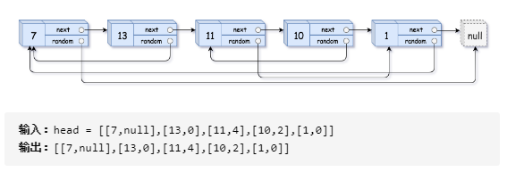

#### [03. 数组中重复的数字](https://leetcode-cn.com/problems/shu-zu-zhong-zhong-fu-de-shu-zi-lcof/)

找出数组中重复的数字。

在一个长度为 n 的数组 nums 里的所有数字都在 0～n-1 的范围内。数组中某些数字是重复的，但不知道有几个数字重复了，也不知道每个数字重复了几次。请找出数组中任意一个重复的数字。

**示例**

```html
输入：[2, 3, 1, 0, 2, 5, 3]
输出：2 或 3 
```

**思路**

关键点长度为n，所有数字都在0~n-1的范围内，将遍历的数字i交换到第i个位置，出现冲突则重复。

时间复杂度：O(n)，空间复杂度：O(1)

错误思路：把遍历过的数字记录下来，用位置去记录（把遍历到的数字作为索引，将该位置的数只为负值，表示该数已经出现，如果出现索引位置数已经为负值时，表示该数重复）。但是该方法**无法处理0重复**的情况。


```java
public int findRepeatNumber(int[] nums){
    if(nums.length == 0 || nums == null){
        return -1;
    }
    for(int i = 0; i < nums.length; i++){
        while(nums[i] != i){
            if(nums[i] == nums[nums[i]]){
                return nums[i];
            }
            swap(nums, i, nums[i]);
        }
        
    }
    return -1;    
}

public void swap(int[] nums, int i , int j){
    int tmp = nums[i];
    nums[i] = nums[j];
    nums[j] = tmp;
}
```


#### [04. 二维数组中的查找](https://leetcode-cn.com/problems/er-wei-shu-zu-zhong-de-cha-zhao-lcof/)

在一个 n * m 的二维数组中，每一行都按照从左到右递增的顺序排序，每一列都按照从上到下递增的顺序排序。请完成一个函数，输入这样的一个二维数组和一个整数，判断数组中是否含有该整数。

**示例:**

```html
现有矩阵 matrix 如下：
[
  [1,   4,  7, 11, 15],
  [2,   5,  8, 12, 19],
  [3,   6,  9, 16, 22],
  [10, 13, 14, 17, 24],
  [18, 21, 23, 26, 30]
]

给定 target = 5，返回 true。
给定 target = 20，返回 false。
```

**思路**：

从左到右和从上到下是有序的，选择从从左下或者从右上开始比对，除了等于每次大于小于排除部分数据，改变移动方向，最终越界则未找到。

时间复杂度：O(M + N)，空间复杂度：O(1)

```java
public boolean findNumberIn2DArray(int[][] matrix, int target) {
        if (matrix == null || matrix.length == 0 || matrix[0].length == 0) {
            return false;
        }
        //从右上角开始移动
        int i = 0, j = matrix[0].length - 1; 
        while(i < matrix.length && j >= 0){
            if(target < matrix[i][j]){
                j--;
            }
            else if(target > matrix[i][j]){
                i++;
            }
            else{
        		return true;
            }
        }
    	return false;
}
```


#### [05. 替换空格](https://leetcode-cn.com/problems/ti-huan-kong-ge-lcof/)

请实现一个函数，把字符串 `s` 中的每个空格替换成"%20"。

**示例 ：**

```html
输入：s = "We are happy."
输出："We%20are%20happy."
```

思路：

创建一个StringBuilder  str，遍历s，如果i位置是字符则直接添加到str，是空格则添加"%20"。

时间复杂度：O(N)，空间复杂度：O(N)

```java
public String replaceSpace(String s) {
    StringBuilder str = new StringBuilder();
    for(Character c : s.toCharArray()){
        if( c == ' '){
            str.append("%20");
        }else{
            str.append(c);
        }
    }
    return str.toString();
}
```


#### [06. 从尾到头打印链表](https://leetcode-cn.com/problems/cong-wei-dao-tou-da-yin-lian-biao-lcof/)

输入一个链表的头节点，从尾到头反过来返回每个节点的值（用数组返回）。

**示例**

```html
输入：head = [1,3,2]
输出：[2,3,1]
```

思路：

1. 不使用辅助栈，反转链表，再从头打印，最后再将链表反转。时间复杂度：O(N)，空间复杂度：O(1)
2. 使用辅助栈，反转链表，再从头打印，最后再将链表反转。时间复杂度：O(N)，空间复杂度：O(N)

```java
public int[] reversePrint(ListNode head) {
        Stack<Integer> stack = new Stack<Integer>();
        ListNode tmp = head;
        //int len = 0;
        while(tmp != null){
            stack.push(tmp.val);
            tmp = tmp.next;
            //len++;
        }
        int size = stack.size();
        int[] res = new int[size];
        //int i = 0;
        //while(!stack.isEmpty()){
        for(int i = 0; i < size; i++){
            res[i] = stack.pop();
        }
        return res;
}
```


#### [07. 重建二叉树](https://leetcode-cn.com/problems/zhong-jian-er-cha-shu-lcof/)

输入某二叉树的前序遍历和中序遍历的结果，请重建该二叉树。假设输入的前序遍历和中序遍历的结果中都不含重复的数字。

**示例**

```html
前序遍历 preorder = [3,9,20,15,7]
中序遍历 inorder = [9,3,15,20,7]
返回如下的二叉树：
    3
   / \
  9  20
    /  \
   15   7
```
**思路：**

与手动推倒二叉树是一致的，通过前序或者后续的根节点去分割中序二叉树，做递归，生成子树，为了更好的找到中序的根节点，使用HashMap<value, index>将数据进行存储，方便快速查找。

时间复杂度：O(N)，空间复杂度：O(N)

此题已知前序和中序推导后续思路是一致的。

```java
HashMap<Integer, Integer> map = new HashMap<>();
public TreeNode buildTree(int[] preorder, int[] inorder) {
    int len = preorder.length;
    for(int i = 0; i < len; i++){
        map.put(inorder[i], i);
    }
    return buildTree(preorder, 0, len - 1, inorder, 0, len - 1);
}

public TreeNode buildTree(int[] pre, int preStart, int preEnd, int[] in, int inStart, int inEnd){
    //不能是 ">=" ，"="则无法输出叶子节点
    if(preStart > preEnd){
        return null;
    }
    int preRoot = pre[preStart];            //find pre root
    int inRoot = map.get(preRoot);          //find the index  of in root
    int leftChildSize = inRoot - inStart;   //the left child size
    TreeNode root =  new TreeNode(preRoot); //build the root of tree
    root.left = buildTree(pre, preStart + 1, preStart + leftChildSize, in, inStart, inRoot - 1);
    root.right = buildTree(pre, preStart + leftChildSize + 1, preEnd, in, inRoot + 1, inEnd);
    return root; 
}
```

**已知前序和中序，输出后续**

```java
	static HashMap<Character, Integer> map = new HashMap<>();

    public static void main(String[] args) {
        String preStr = "GDAFEMHZ";
        String inStr = "ADEFGHMZ";
        char[] pre = preStr.toCharArray();
        char[] in = inStr.toCharArray();
        for(int i= 0; i < in.length; i++){
            map.put(in[i], i);
        }
        pos(pre, in, 0, pre.length - 1, 0, pre.length - 1);
    }

    public static void pos(char[] pre, char[] in, int preStart, int preEnd, int inStart, int inEnd){
        //if(preStart >= preEnd)  错在多了一个等于，导致叶子节点打印不出来，可笑可笑
        if(preStart > preEnd){
            return;
        }
        char root = pre[preStart];
        int inRoot = map.get(root);
        int leftChildSize = inRoot - inStart;
        pos(pre, in, preStart + 1, preStart + leftChildSize, inStart, inRoot - 1);
        pos(pre, in, preStart + leftChildSize + 1, preEnd, inRoot + 1, inEnd);
        System.out.print(root + " ");

    }
```


#### [09. 用两个栈实现队列](https://leetcode-cn.com/problems/yong-liang-ge-zhan-shi-xian-dui-lie-lcof/)

思路：

队列是先入先出，栈是先入后出，所以用两个栈将数据进行反转，得到数据的输入输出顺序就是先入先出。

pushStack栈将数据”倒入“popStack时遵循两个原则：1.popStack为空时才能倒出，2.一次性“倒出”pushStack全部数据。

```java
public static class StackToQueue{
        private Stack<Integer> pushStack;
        private Stack<Integer> popStack;

        public StackToQueue(){
            this.pushStack = new Stack<Integer>();
            this.popStack = new Stack<Integer>();
        }

        public void push(int obj){
            pushStack.push(obj);
        }
        public int poll(){
            //“倒出”数据
            if(popStack.isEmpty()){
                while(!pushStack.isEmpty()){
                    popStack.push(pushStack.pop());
                }
            }
            return popStack.pop();

        }
        public int peek(){
            //“倒出”数据
            if (popStack.isEmpty()){
                while(!pushStack.isEmpty()){
                    popStack.push(pushStack.pop());
                }
            }
            return popStack.peek();
        }
        public boolean isEmpty(){
            return popStack.isEmpty() && pushStack.isEmpty();
        }

    }
```

**相关问题**：同两个队列实现一个栈

思路：记住栈与队列数据输入输出顺序，dataQueue用于存储数据，helpQueue用于暂存数据，每次将dataQueue中的数据只保留一个，其他全部输入helpQueue中，然后输出dataQueue中的最后一个数据，最后交换两个队列引用。

```java
public static class QueueToStack{
        private Queue<Integer> data;
        private Queue<Integer> help;

        public QueueToStack(){
            this.data = new LinkedList<Integer>();
            this.help = new LinkedList<Integer>();
        }

        public void push(int obj){
            data.add(obj);
        }

        public Integer pop(){
            if(!data.isEmpty()){
                while(data.size() > 1){
                    help.add(data.poll());
                }
                int tmp = data.poll();
                Queue<Integer> tmpQueue = data;
                data = help;
                help = tmpQueue;
                return tmp;
                
            }
        }
        public int peek(){
            if (!data.isEmpty()){
                while(data.size() > 1){
                    help.add(data.poll());
                }
                int tmp = data.peek();
                help.add(data.poll());
                Queue<Integer> tmpQueue = data;
                data = help;
                help = tmpQueue;
                return tmp;
            }
        }
    }
```


#### [10- I. 斐波那契数列](https://leetcode-cn.com/problems/fei-bo-na-qi-shu-lie-lcof/)

写一个函数，输入 n ，求斐波那契（Fibonacci）数列的第 n 项。斐波那契数列的定义如下：

F(0) = 0,   F(1) = 1
F(N) = F(N - 1) + F(N - 2), 其中 N > 1.
斐波那契数列由 0 和 1 开始，之后的斐波那契数就是由之前的两数相加而得出。

**示例**

```java
输入：n = 2  输出：1
输入：n = 5  输出：5
```

思路：动态规划，用空间换时间

```java
public int fib(int n) {
        if(n < 2){
            return n;
        }
        int[] arr = new int[n+1];
        arr[0] = 0;
        arr[1] = 1;
        for(int i = 2; i < n + 1; i++){
            arr[i] = (arr[i-1] + arr[i-2]);
        }
        return arr[n] ;
}
```


#### [10- II. 青蛙跳台阶问题](https://leetcode-cn.com/problems/qing-wa-tiao-tai-jie-wen-ti-lcof/)

一只青蛙一次可以跳上1级台阶，也可以跳上2级台阶。求该青蛙跳上一个 `n` 级的台阶总共有多少种跳法。

思路：动态规划的思想，将问题转化为子问题，将子问题的结果缓存起来，避免重复求解子问题。只能从第i - 2和i - 1跳到第 i 阶，

递归也是将问题划分为子问题，但是未将结果缓存下来。


#### [11. 旋转数组的最小数字](https://leetcode-cn.com/problems/xuan-zhuan-shu-zu-de-zui-xiao-shu-zi-lcof/)

把一个数组最开始的若干个元素搬到数组的末尾，我们称之为数组的旋转。输入一个递增排序的数组的一个旋转，输出旋转数组的最小元素。例如，数组 [3,4,5,1,2] 为 [1,2,3,4,5] 的一个旋转，该数组的最小值为1。

示例 ：

```html
输入：[3,4,5,1,2]
输出：1

输入：[2,2,2,0,1]
输出：0
```

**思路**

旋转后依部分有序，通过二分法进行查找，mid与right进行比较。

时间复杂度：O(log N)，空间复杂度：O(1)

- nums[mid] < nums[right]，目标值在[left，mid - 1]内；
- nums[mid] > nums[right]，目标值在[mid + 1, right]内；
- **nums[mid] == nums[right]**，不确定目标值在那个范围，所以减小区间 right= right- 1（保证了目标值还在[left, right]中），证明见leetcode。

为什么不使用nums[left]与nums[mid]比较，因为当nums[left] < nums[mid]时无法确定目标值在那个区间。

```html
举例：
[1,2,3,4,5] 
[3,4,5,1,2]
```

```java
     public  int binarySearch(int[] nums){
        int left = 0;
        int right = nums.length - 1;
        //当 left = right时跳出二分循环，并返回 numbers[left] 即可。
        while(left < right){
            int mid = left + (right - left) / 2;    
            if(nums[mid] > nums[right]){
                left = mid + 1;
            }else if(nums[mid] < nums[right]){
                right = mid;
            }else{
                right--;
            }
        }
        return nums[left];
     }
```


#### [12. 矩阵中的路径](https://leetcode-cn.com/problems/ju-zhen-zhong-de-lu-jing-lcof/)

判断在一个矩阵中是否存在一条包含某字符串所有字符的路径。路径可以从矩阵中的任意一个格子开始，每一步可以在矩阵中向上下左右移动一个格子。如果一条路径经过了矩阵中的某一个格子，则该路径不能再进入该格子。

[["a","**b**","c","e"],
["s","**f**","**c**","s"],
["a","d","**e**","e"]]

但矩阵中不包含字符串“abfb”的路径，因为字符串的第一个字符b占据了矩阵中的第一行第二个格子之后，路径不能再次进入这个格子。

思路：类似岛屿问题，对所有位置使用回溯法（推荐）/暴力递归，这儿需要注意是，不能走回头路，所以我们需要把访问过的位置置为特殊标记，同时回溯法要求把值修改回原来的值。

```java
    public boolean exist(char[][] board, String word) {
        char[] str = word.toCharArray();
        int rows = board.length;
        int cols = board[0].length;

        if(rows * cols < str.length || rows == 0 || cols == 0 || str.length == 0){
            return false;
        }

        int index = 0;
        for(int i = 0; i < rows; i++){
            for(int j = 0; j < cols; j++){
                if(dfs(board, str, i, j, index)){
                    return true;
                }
            }
        }
        return false;

    }
    //每个位置深度优先遍历
    public boolean dfs(char[][] board, char[] str, int i, int j, int index){
        if(i < 0 || j < 0 || i == board.length || j == board[0].length || board[i][j] != str[index]){
            return false;
        }
        if(index == str.length - 1 && str[index] == board[i][j]){
            return true;
        }
        
        //当前遍历下，这个位置已经访问过了，不能访问了
        //不能让他走回头路，和岛屿问题类似，把当前位置置为特殊字符
        //只是当前字符和下一个字符之间不能走回头路，所以把它改了之后要还原回来，不然其他位置也访问不了这个位置了  
        char tmp = board[i][j];
        board[i][j] = '#';

        boolean res = (dfs(board, str, i + 1, j, index + 1) || dfs(board, str, i - 1, j, index + 1) ||
        dfs(board, str, i, j + 1, index + 1) || dfs(board, str, i, j - 1, index + 1));

        board[i][j] = tmp;

        return res;
    }
```


#### [13. 机器人的运动范围](https://leetcode-cn.com/problems/ji-qi-ren-de-yun-dong-fan-wei-lcof/)

地上有一个m行n列的方格，从坐标 [0,0] 到坐标 [m-1,n-1] 。一个机器人从坐标 [0, 0] 的格子开始移动，它每次可以向左、右、上、下移动一格（不能移动到方格外），也不能进入行坐标和列坐标的数位之和大于k的格子。

例如，当 k 为 18 时，机器人能够进入方格 (35,37)，因为 3+5+3+7=18。但是，它不能进入方格 (35,38)，因为 3+5+3+8=19。请问该机器人能够达到多少个格子？

**思路**

深度优先遍历DFS，不要当前位置每一位数，当前位置是可以通过前一个位置计算的。

- 深度优先搜索： 可以理解为暴力法模拟机器人在矩阵中的所有路径。DFS 通过递归，先朝一个方向搜到底，再回溯至上个节点，沿另一个方向搜索，以此类推；
- 剪枝： 在搜索中，遇到数位和超出目标值、此元素已访问，则应立即返回。

```java
    int m, n, k;
    boolean[][] visited;
    public int movingCount(int m, int n, int k) {
        this.m = m; this.n = n; this.k = k;
        this.visited = new boolean[m][n];
        return dfs(0, 0, 0, 0);
    }
	//i,j当前位置，si行数各位之和，sj列数各位之和，visited当前位置是否被访问
    public int dfs(int i, int j, int si, int sj) {
        if(i >= m || j >= n || k < si + sj || visited[i][j]) return 0;
        visited[i][j] = true;
        return 1 + dfs(i + 1, j, (i + 1) % 10 != 0 ? si + 1 : si - 8, sj) + dfs(i, j + 1, si, (j + 1) % 10 != 0 ? sj + 1 : sj - 8);
    }
```


#### [14- I. 剪绳子](https://leetcode-cn.com/problems/jian-sheng-zi-lcof/)

给你一根长度为 n 的绳子，请把绳子剪成整数长度的 m 段（m、n都是整数，n>1并且m>1），每段绳子的长度记为 k[0],k[1]...k[m-1] 。请问 k[0]*k[1]*...*k[m-1] 可能的最大乘积是多少？例如，当绳子的长度是8时，我们把它剪成长度分别为2、3、3的三段，此时得到的最大乘积是18。

示例：

```html
输入: 2
输出: 1
解释: 2 = 1 + 1, 1 × 1 = 1
```

**思路**

这儿需要知道一个大前提：一个数切分为尽可能多的“3”时，其乘积有最大值，严格证明需要数学推导。同时出现1的时候，取出一个3，变为2*2。

```java
	public int cuttingRope(int n) {
        if(n <= 3){
            return n - 1;
        }
        int num = n / 3;
        if(n % 3 == 0){
            return (int)Math.pow(3, num);
        }else if(n % 3 == 1){
            return (int)(Math.pow(3, num - 1) * 4);
        }else{
            return (int)(Math.pow(3, num) * 2);
        }

    }
```


#### [14- II. 剪绳子 II](https://leetcode-cn.com/problems/jian-sheng-zi-ii-lcof/)

题目同上，主要是N值过大，乘积超出int取值范围，甚至long范围。

**思路：**

主要考察大数求余（循环求余，快速求余（推荐））

**快速求余**：


```java
	public int cuttingRope(int n) {
        //数太大会越界超过，甚至超过long，所以换一种求余的方式
        if(n <= 3) return n - 1;
        int b = n % 3, p = 1000000007;

        long res = 1, x = 3;
        //a = n / 3 - 1  是在计算有余数的时候，方便计算
        for(int a = n / 3 - 1; a > 0; a /= 2) {
            if(a % 2 == 1) res = (res * x) % p;
            x = (x * x) % p;
        }
		//保留了一个3，不需要太麻烦的计算
        if(b == 0) return (int)(res * 3 % p);
        if(b == 1) return (int)(res * 4 % p);
        return (int)(res * 6 % p);
    }
```


#### [15. 二进制中1的个数](https://leetcode-cn.com/problems/er-jin-zhi-zhong-1de-ge-shu-lcof/)

请实现一个函数，输入一个整数，输出该数二进制表示中 1 的个数。例如，把 9 表示成二进制是 1001，有 2 位是 1。因此，如果输入 9，则该函数输出 2。

示例：

```html
输入：00000000000000000000000000001011
输出：3
解释：输入的二进制串 00000000000000000000000000001011 中，共有三位为 '1'。

```

**思路**

不要考虑手动一位一位的计算，位运算很多时候很有用处。

1.逐位判断（基础）：

- 若n & 1 = 0，则 n二进制 最右一位 为 0
- 若 n \& 1 = 1，则 n二进制最右一位为 1 

2.n & ( n - 1 )(推荐)：

- n - 1：二进制数字n最右边的 1 变成 0 ，此1右边的 0 都变成1
- n & ( n − 1) ：二进制数字 n 最右边的 1 变成 0 ，其余不变


```java
	//逐位判断
	public int hammingWeight(int n) {
    	int res = 0;
     	while(n != 0) {
         	res += n & 1;
         	n >>>= 1;
     	}
     	return res;
 	}
	//n & ( n - 1 )
	public int hammingWeight(int n) {
         int count = 0;
         //输入的是一串数组，不能用 n > 0 判断
         while(n != 0){
             n = n & (n - 1);
             count++;
         }
         return count;
 	}
```


#### [16. 数值的整数次方](https://leetcode-cn.com/problems/shu-zhi-de-zheng-shu-ci-fang-lcof/)

实现函数double Power(double base, int exponent)，求base的exponent次方。不得使用库函数，同时不需要考虑大数问题。

示例：

```html
输入: 2.00000, 10
输出: 1024.00000

输入: 2.00000, -2
输出: 0.25000
解释: 2-2 = 1/22 = 1/4 = 0.25
```

**思路**

仍然是快速求余幂指数算法，大数问题用double类型解决。


```java
	public double myPow(double x, int n) {
        if(x == 0) return 0;
        //为了防止n = -2^32转化为2^32越界，用long类型暂存
        long b = n;
        if(b < 0){
            x = 1 / x;
            b = -b;
        }
        double res = 1.0;
        for(long i = b; i > 0;  i /= 2){
			//快速求幂
            if(i % 2 == 1){
                res *= x;
            }
            x = x * x;
            
        }
        return res;
    }
```

#### [17. 打印从1到最大的n位数](https://leetcode-cn.com/problems/da-yin-cong-1dao-zui-da-de-nwei-shu-lcof/)

输入数字 `n`，按顺序打印出从 1 到最大的 n 位十进制数。比如输入 3，则打印出 1、2、3 一直到最大的 3 位数 999。

示例：

```html
输入: n = 1
输出: [1,2,3,4,5,6,7,8,9]
```

```html
	public int[] printNumbers(int n) {
        int len = (int)Math.pow(10,n);
        int[] res = new int[len-1];
        for(int i = 0; i < len-1; i++){
            res[i] = i + 1;
        }
        return res;

    }
```

#### [18. 删除链表的节点](https://leetcode-cn.com/problems/shan-chu-lian-biao-de-jie-dian-lcof/)

给定单向链表的头指针和一个要删除的节点的值，定义一个函数删除该节点。返回删除后的链表的头节点。

示例：

```html
输入: head = [4,5,1,9], val = 5
输出: [4,1,9]
解释: 给定你链表中值为 5 的第二个节点，那么在调用了你的函数之后，该链表应变为 4 -> 1 -> 9.
```

**思路**

找到删除节点的前一个节点，如果不用两个节点，则需要考虑如果删除的是最后一个节点，节点移动需要注意一下。

```java
	public ListNode deleteNode(ListNode head, int val) {
        ListNode tmp = head;
        
        //特例：删除的是头节点
        if(tmp.val == val) return head.next;

        while(tmp.next != null){
            if(tmp.next.val == val){
                //需要一个辅助节点才行
                ListNode delNode = tmp.next;
                tmp.next = delNode.next;
                delNode.next = null;
            }
            //如果删除的最后一个节点会出现,tmp.next == null的问题，所以要先判断一下
            if(tmp.next != null){
                tmp = tmp.next;
            }
            
        }
        return head;
    }
```


#### [未---19. 正则表达式匹配](https://leetcode-cn.com/problems/zheng-ze-biao-da-shi-pi-pei-lcof/)

请实现一个函数用来匹配包含'. '和'*'的正则表达式。模式中的字符'.'表示任意一个字符，而'*'表示它前面的字符可以出现任意次（含0次）。在本题中，匹配是指字符串的所有字符匹配整个模式。例如，字符串"aaa"与模式"a.a"和"ab*ac*a"匹配，但与"aa.a"和"ab*a"均不匹配。

示例：

```html
输入:
s = "ab"
p = ".*"
输出: true
解释: ".*" 表示可匹配零个或多个（'*'）任意字符（'.'）。

输入:
s = "aa"
p = "a*"
输出: true
解释: 因为 '*' 代表可以匹配零个或多个前面的那一个元素, 在这里前面的元素就是 'a'。因此，字符串 "aa" 可被视为 'a' 重复了一次。
```


#### [未---20. 表示数值的字符串](https://leetcode-cn.com/problems/biao-shi-shu-zhi-de-zi-fu-chuan-lcof/)

请实现一个函数用来判断字符串是否表示数值（包括整数和小数）。例如，字符串"+100"、"5e2"、"-123"、"3.1416"、"-1E-16"、"0123"都表示数值，但"12e"、"1a3.14"、"1.2.3"、"+-5"及"12e+5.4"都不是。


#### [21. 调整数组顺序使奇数位于偶数前面](https://leetcode-cn.com/problems/diao-zheng-shu-zu-shun-xu-shi-qi-shu-wei-yu-ou-shu-qian-mian-lcof/)

输入一个整数数组，实现一个函数来调整该数组中数字的顺序，使得所有奇数位于数组的前半部分，所有偶数位于数组的后半部分。

**示例：**

```html
输入：nums = [1,2,3,4]
输出：[1,3,2,4] 
注：[3,1,2,4] 也是正确的答案之一。
```

**思路：**

类似于快速排序的思想，使用两个指针分别从头尾开始遍历，每次找到一个奇偶数将其做交换直至相撞


```java
	public int[] exchange(int[] nums) {
        int left = 0;
        int right = nums.length - 1;
        while(left < right){
            //不要手贱把++ --操作放到判断语句里面
            //这儿需要加上left < right判断条件，不加会不满足left<right条件，中间那对会交换
            while(left < right && nums[right] % 2 == 0)right--;
            while(left < right && nums[left]  % 2 == 1)left++;
            
            swap(nums, left,right);
        }
        return nums;
        


    }
    public static void swap(int[] nums, int a, int b){
        int temp = nums[a];
        nums[a] = nums[b];
        nums[b] = temp;
    }
```


#### [22. 链表中倒数第k个节点](https://leetcode-cn.com/problems/lian-biao-zhong-dao-shu-di-kge-jie-dian-lcof/)

输入一个链表，输出该链表中倒数第k个节点。为了符合大多数人的习惯，本题从1开始计数，即链表的尾节点是倒数第1个节点。例如，一个链表有6个节点，从头节点开始，它们的值依次是1、2、3、4、5、6。这个链表的倒数第3个节点是值为4的节点。

**示例：**

```html
给定一个链表: 1->2->3->4->5, 和 k = 2.

返回链表 4->5.
```

**思路：**

- 两次遍历：先遍历整个链表长度，计算出倒数第K个的位置
- **快慢指针**：快指针比慢指针快K步，快指针到达最后的位置，慢指针为倒数第K个位置

```java
	public ListNode getKthFromEnd(ListNode head, int k) {
        ListNode fast = head;
        ListNode slow = head;
        if(k < 1){
            return new ListNode();
        }

        while(k-- != 0){
            if(fast == null) return new ListNode();
            fast = fast.next;
        }

        while(fast != null){
            fast = fast.next;
            slow = slow.next;
        }
        return slow;   
    }
```


#### [24. 反转链表](https://leetcode-cn.com/problems/fan-zhuan-lian-biao-lcof/)

定义一个函数，输入一个链表的头节点，反转该链表并输出反转后链表的头节点。

**示例:**

```java
输入: 1->2->3->4->5->NULL
输出: 5->4->3->2->1->NULL
```

**思路：**

1. 记录当前节点的下一个节点
2. 改变当前节点的指针指向（双向链表亦如此）
3. 移动当前节点和新节点

```java
	public ListNode reverseList(ListNode head) {
        ListNode pre = null;
        ListNode next = null;
        while(head != null){
            next = head.next;
            
            head.next = pre;

            pre = head;
            head = next;        
        }
        return pre;
    }
```

#### [25. 合并两个排序的链表](https://leetcode-cn.com/problems/he-bing-liang-ge-pai-xu-de-lian-biao-lcof/)

输入两个递增排序的链表，合并这两个链表并使新链表中的节点仍然是递增排序的。

示例：

```html
输入：1->2->4, 1->3->4
输出：1->1->2->3->4->4
```

**思路：**

使用三个指针分别指向三个链表，比较两个原始链表当前节点的大小，将小者放到新节点位置，直至遍历结束。

```java
	public ListNode mergeTwoLists(ListNode l1, ListNode l2) {
        //new 2 node,一个遍历一个返回
        //伪头节点
        ListNode head = new ListNode(0);
        ListNode tmp =  head;
        while(l1 != null && l2 != null){
            if(l1.val < l2.val){
                tmp.next = l1;
                l1 = l1.next;
            }else{
                tmp.next = l2;
                l2 = l2.next;
            }
            tmp = tmp.next;
        }
        if(l1 != null){
            tmp.next = l1;
        }else{
            tmp.next = l2;
        }
        return head.next;
    }
```


#### [26. 树的子结构](https://leetcode-cn.com/problems/shu-de-zi-jie-gou-lcof/)

输入两棵二叉树A和B，判断B是不是A的子结构。(约定空树不是任意一个树的子结构)，B是A的子结构， 即 A中有出现和B相同的结构和节点值。

示例：

```html
给定的树 A:

     3
    / \
   4   5
  / \
 1   2
给定的树 B：

   4 
  /
 1
返回 true，因为 B 与 A 的一个子树拥有相同的结构和节点值。
```

**思路：**

- 遍历：将结果遍历出来，然后看B的结果是不是A的连续子串
- **递归**：从root节点开始遍历，如果两个节点相同，判断其子结构也完全相同

```java
	public boolean isSubStructure(TreeNode A, TreeNode B) {
        //先序遍历
        //遍历的节点，是查看B是否是节点的子树，查看B的子节点和A的子节点，再去用isEqual校对，所以遍历的时候(A != null && B != null)对前中后序都成立 
        return (A != null && B != null) && (isEqual(A, B) || isSubStructure(A.left,B) || isSubStructure(A.right,B));

    }
    public static boolean isEqual(TreeNode A, TreeNode B){
        if(B == null){
            return true;
        }
        else if(A == null || A.val != B.val){
            return false;
        }
        else{
            return isEqual(A.left, B.left) && isEqual(A.right, B.right);
        }
    }
```

#### [27. 二叉树的镜像](https://leetcode-cn.com/problems/er-cha-shu-de-jing-xiang-lcof/)

请完成一个函数，输入一个二叉树，该函数输出它的镜像。

示例：

```html
输入：

     4
   /   \
  2     7
 / \   / \
1   3 6   9
镜像输出：

     4
   /   \
  7     2
 / \   / \
9   6 3   1
```

**思路：**

递归：每次将原来数的左右子树进行交换

```java
	public TreeNode mirrorTree(TreeNode root) {
        if(root == null){
            return null;
        }
        //和leetcode101不同， 101是二叉树自己对称镜像，而这儿是两个二叉树为镜像
        TreeNode head = new TreeNode(root.val);

        head.left = mirrorTree(root.right);
        head.right = mirrorTree(root.left);
        return head;
    }
```

#### [28. 对称的二叉树](https://leetcode-cn.com/problems/dui-cheng-de-er-cha-shu-lcof/)。

请实现一个函数，用来判断一棵二叉树是不是对称的。如果一棵二叉树和它的镜像一样，那么它是对称的。

例如，二叉树 [1,2,2,3,4,4,3] 是对称的。

```html
   1
  / \
  2   2
 / \ / \
3  4 4  3
```

但是下面这个 [1,2,2,null,3,null,3] 则不是镜像对称的:

```html
   1
  / \
  2   2
   \   \
    3   3
```
**思路：**

递归：但是我们左右分支是相反的，node1.right = node2. left  && node1.left = node2. right 

```java
	public boolean isSymmetric(TreeNode root) {
        return check(root, root);
    }

    public boolean check(TreeNode p, TreeNode q) {
        if (p == null && q == null) {
            return true;
        }
        if (p == null || q == null) {
            return false;
        }
        return p.val == q.val && check(p.left, q.right) && check(p.right, q.left);
    }

    // 这样就错了，成了判断子树是否对称了
    // public boolean isSymmetric(TreeNode root) {
    //     if(root.left == null && root.right == null){
    //         return true;
    //     }
    //     if(root.left == null || root.right == null){
    //         return false;
    //     }
    //     return root.left.val == root.right.val && isSymmetric(root.left) && isSymmetric(root.right); 
    // }
}
```


#### [29. 顺时针打印矩阵](https://leetcode-cn.com/problems/shun-shi-zhen-da-yin-ju-zhen-lcof/)

输入一个矩阵，按照从外向里以顺时针的顺序依次打印出每一个数字。

示例：

```html
输入：matrix = [[1,2,3],[4,5,6],[7,8,9]]
输出：[1,2,3,6,9,8,7,4,5]

输入：matrix = [[1,2,3,4],[5,6,7,8],[9,10,11,12]]
输出：[1,2,3,4,8,12,11,10,9,5,6,7]
```

**思路：**

宏观的看待问题，不要局限在每一层坐标变换上，把层的坐标变换抽象出来

```java
	public int[] spiralOrder(int[][] matrix) {
        if(matrix.length == 0 || matrix[0].length == 0){
            return new int[]{};
        }
        int tr = 0;
        int tc = 0;
        int dr = matrix.length - 1;
        int dc = matrix[0].length - 1;
        int[]  arr = new int[matrix.length * matrix[0].length];
        int index = 0;
        while(tc <= dc && tr <= dr){
            index = printEdge(matrix, tr++, tc++, dr--, dc--, arr, index);
        }
        return arr;
    }


    //传入的是引用，如果不需要新的集合，不用去返回新的引用
    public static int printEdge(int[][] matrix, int tr, int tc, int dr, int dc, int[] arr, int index){
        if(tr == dr){
            while(tc <= dc){
                arr[index++] = matrix[tr][tc++];
            }
        }else if(tc == dc){
            while(tr <= dr){
                arr[index++] = matrix[tr++][tc];
            }
        }else{
            int curR = tr;
            int curC = tc;
            
            //print top edge
            while(curC < dc){
                arr[index++] = matrix[tr][curC++];
            }
            while(curR < dr){
                //不要写错了，每个参数里面只有一个能动，另外一个是根据开始给定两个固定点的一个
                arr[index++] = matrix[curR++][dc];
            }
            while(tc < curC){
                arr[index++] = matrix[dr][curC--];
            }
            while(tr < curR){
                arr[index++] = matrix[curR--][tc];
            }
        }
        return index;
    }
```


#### [30. 包含min函数的栈](https://leetcode-cn.com/problems/bao-han-minhan-shu-de-zhan-lcof/)

定义栈的数据结构，请在该类型中实现一个能够得到栈的最小元素的 min 函数在该栈中，调用 min、push 及 pop 的时间复杂度都是 O(1)。

**思路：**

- 辅助栈：用辅助栈存每一个位置上最小值。空间复杂度O(N)，时间复杂度O(1);
- **辅助数**：用变量存当前最小值，当出现比当前变量小的数时，将之前变量压入栈中，更新最小变量，当弹出值等于最小值时，返回再弹出一个数，该数为当前最小值。空间复杂度O(1)，时间复杂度O(1);

```java
public class MinStack {
    private Stack<Integer> data;
    private int min;

    public MinStack() {
        data = new Stack<>();
        this.min = Integer.MAX_VALUE;
    }
    public void push(int x) {
        if(x <= min){
            data.add(min);
            min = x;
        }
        data.add(x);  
    }
    public void pop() {
        if(!data.isEmpty()){
            int tmp = data.pop();
            if(tmp == min){
                min = data.pop();
            }
        }
    }
    public int top() {
        if(data.isEmpty()){
            throw new RuntimeException("栈中元素为空，此操作非法"); 
        }
        return data.peek();   
    }
    public int getMin() {
        if(data.isEmpty()){
            throw new RuntimeException("栈中元素为空，此操作非法");
        }
        return min; 
    }
}
```

**相关问题最大队列**

#### [31. 栈的压入、弹出序列](https://leetcode-cn.com/problems/zhan-de-ya-ru-dan-chu-xu-lie-lcof/)

输入两个整数序列，第一个序列表示栈的压入顺序，请判断第二个序列是否为该栈的弹出顺序。假设压入栈的所有数字均不相等。例如，序列 {1,2,3,4,5} 是某栈的压栈序列，序列 {4,5,3,2,1} 是该压栈序列对应的一个弹出序列，但 {4,3,5,1,2} 就不可能是该压栈序列的弹出序列。

示例：

```html
输入：pushed = [1,2,3,4,5], popped = [4,5,3,2,1]
输出：true
解释：我们可以按以下顺序执行：
push(1), push(2), push(3), push(4), pop() -> 4,
push(5), pop() -> 5, pop() -> 3, pop() -> 2, pop() -> 1
```

思路：

用栈模拟栈的压入和弹出，看是否一致，注意每次弹出可能不止一个

```java
	public boolean validateStackSequences(int[] pushed, int[] popped) {
        //思想：用一个辅助栈去模拟整个弹出过程
        //具体方法就是每次popped等于栈顶就弹出数据
        Stack<Integer> stack = new Stack<>();
        int popIndex = 0;
        for(int i = 0; i < pushed.length; i++){
            stack.push(pushed[i]);
            //！！！这儿不能使用if,因为中途弹出可能弹出的不止一个，if只是弹出了一个
            //！！！第二个就是这儿既然有了while弹出，那么最后一次性弹出了也会在最后一次弹出，所以不需要下面那个while循环了
            while(!stack.isEmpty() && stack.peek() == popped[popIndex]){
                stack.pop();
                popIndex++;
            }
        }
        // while(popIndex < popped.length){
        //     if(stack.pop() != popped[popIndex++]){
        //         return false;
        //     }
        // }
        // return true;

        return stack.size() == 0 ? true : false;
    }
```


#### [32 - I. 从上到下打印二叉树](https://leetcode-cn.com/problems/cong-shang-dao-xia-da-yin-er-cha-shu-lcof/)

从上到下打印出二叉树的每个节点，同一层的节点按照从左到右的顺序打印。

示例：

```html
给定二叉树: [3,9,20,null,null,15,7]
	3
   / \
  9  20
    /  \
   15   7
输出：[3,9,20,15,7]  
```

**思路：**

层次遍历

```java
    public int[] levelOrder(TreeNode root) {
        List<Integer> res = new ArrayList<>();
        if(root == null){
            return new int[]{};
        }
        
        Queue<TreeNode> queue1 = new LinkedList<>();
        queue1.offer(root);
        TreeNode left;
        TreeNode right;
        TreeNode head;
        while(!queue1.isEmpty()){
            head = queue1.poll();
            left = head.left;
            right = head.right;
            if(left != null){
                queue1.offer(left);
            }
            if(right != null){
                queue1.offer(right);
            }
            res.add(head.val);
        }
        //int[] arr = new int[res.size()];
        //String类型可以这样用,int类型不能这样转换
        // arr = res.toArray(new int[res.size()]);
        
        //这样可以用但是很麻烦
        //int[] arr = res.stream().mapToInt(Integer::valueOf).toArray();

        //所以用下面这种方法吧
        int[] arr = new int[res.size()];
        for(int i = 0; i < res.size(); i++){
            arr[i] = res.get(i);
        }
        return arr; 
    }
```


#### [32 - II. 从上到下打印二叉树 II](https://leetcode-cn.com/problems/cong-shang-dao-xia-da-yin-er-cha-shu-ii-lcof/)

从上到下按层打印二叉树，同一层的节点按从左到右的顺序打印，每一层打印到一行。

示例：

```html
给定二叉树: [3,9,20,null,null,15,7]
    3
   / \
  9  20
    /  \
   15   7
输出：
[
  [3],
  [9,20],
  [15,7]
]
```

**思路：**

使用辅助队列的思想

- 两个辅助队列：两个栈分别存上下两层，每次遍历完最后一层之后交换引用
- 单个辅助队列 + size变量：上下两层用同一个队列存储，用size确定前一层大小

```java
    public List<List<Integer>> levelOrder(TreeNode root) {
        List<List<Integer>> res = new ArrayList<>();
        if(root == null){
            return res;
        }
        
        //因为每个一层数据都要打印进数组，所以用两个list分别存上下两排或者一个list，两个list最后需要交换索引，一个list需要搭配size变量使用，
        //前一层全部打印了，把后一层又赋值给他
        Queue<TreeNode> queue = new LinkedList<>();
        TreeNode l;
        TreeNode r;
        queue.offer(root);
        while(!queue.isEmpty()){
            List<Integer> tmp = new ArrayList<>();
            //用size标记前一层节点的个数，从而减少一个list的使用
            int size = queue.size();
            for(int i = 0; i < size; i++){
                root = queue.poll();
                l = root.left;
                r = root.right;
                if(l != null){
                    queue.offer(l);
                }
                if(r != null){
                    queue.offer(r);
                }
                tmp.add(root.val);
            }
            res.add(new ArrayList<>(tmp));
 
        }
        return res;
    }
```


#### [32 - III. 从上到下打印二叉树 III](https://leetcode-cn.com/problems/cong-shang-dao-xia-da-yin-er-cha-shu-iii-lcof/)

请实现一个函数按照之字形顺序打印二叉树，即第一行按照从左到右的顺序打印，第二层按照从右到左的顺序打印，第三行再按照从左到右的顺序打印，其他行以此类推。

示例：

```html
给定二叉树: [3,9,20,null,null,15,7]
    3
   / \
  9  20
    /  \
   15   7
输出：
[
  [3],
  [20,9],
  [15,7]
]
```

**思路：**

在上一题的基础上，使用一个双端序列，奇偶层分别从头尾插入数据，即可实现换向打印

```java
    public List<List<Integer>> levelOrder(TreeNode root) {
        List<List<Integer>> res = new ArrayList<>();
        if(root == null){
            return res;
        }
        
        Queue<TreeNode> queue1 = new LinkedList<>();
        queue1.offer(root);
        TreeNode left;
        TreeNode right;
        TreeNode head;
        boolean flag = false;
        while(!queue1.isEmpty()){
            //注意这儿是LinkedList<Integer> tmp
            LinkedList<Integer> tmp = new LinkedList<Integer>();
            int size = queue1.size();
            for(int i = 0; i < size; i++){
                head = queue1.poll();
                left = head.left;
                right = head.right;
                if(left != null){
                    queue1.offer(left);
                }
                if(right != null){
                    queue1.offer(right);
                }
                //利用双端队列，不同层从首尾地方添加
                //这儿要注意一下，LinkedList<Integer> tmp 不能用Queue<TreeNode>，要强调是LinkedList
                if(res.size() % 2 == 0) tmp.addLast(head.val); // 偶数层 -> 队列头部
                else tmp.addFirst(head.val); // 奇数层 -> 队列尾部
                
            }
            res.add(tmp);

        }
        return res;
    }
```


#### [33. 二叉搜索树的后序遍历序列](https://leetcode-cn.com/problems/er-cha-sou-suo-shu-de-hou-xu-bian-li-xu-lie-lcof/)

输入一个整数数组，判断该数组是不是某二叉搜索树的后序遍历结果。如果是则返回 `true`，否则返回 `false`。假设输入的数组的任意两个数字都互不相同。

示例：

```html
     5
    / \
   2   6
  / \
 1   3
输入: [1,6,3,2,5]
输出: false
输入: [1,3,2,6,5]
输出: true
```

思路：

- 相邻节点比较：后续遍历，会出现相邻的三个节点 a[i] < a[i+2]  && a[i+2]  <  a[i+1] (**本方法是错误**，因为太难缺点相邻节点之间的关系了)
- 递归分治：根据二叉搜索树的定义，可以通过递归，判断所有子树的 正确性 （即其后序遍历是否满足二叉搜索树的定义：根（当前最后节点）大于当前节点左孩子，小于当前节点右孩子） ，若所有子树都正确，则此序列为二叉搜索树的后序遍历。
- **单调栈：**后续遍历倒序（根，右，左），搜索二叉树（左 < 根 < 右）


```java
	//单调栈


	


	


	//递归分治
	public boolean verifyPostorder(int[] postorder) {
        return rec(postorder, 0, postorder.length - 1);
    }

    public static boolean rec(int[] postorder, int left, int right){
        // 当 left >= right ，说明此子树节点数量 <1 ，无需判别正确性，因此直接返回 true ；
        if(left >= right){
            return true;
        }
        //根节点
        //用m分割左右子树  [left, m]左子树 [m, right]右子树
        int m = left;
        while(postorder[m] < postorder[right]) m++;
        //找m分割点的时候等于已经把左子树判断了一次,不需要判断第二次了
        //p = m 判断右子树
        int p = m;
        while(postorder[p] > postorder[right]) p++;
        //p == j判断右子树   right - 1去除本次根节点
        return p == right && rec(postorder, left, m-1) && rec(postorder, m, right - 1);
    }
```


#### [34. 二叉树中和为某一值的路径](https://leetcode-cn.com/problems/er-cha-shu-zhong-he-wei-mou-yi-zhi-de-lu-jing-lcof/)

输入一棵二叉树和一个整数，打印出二叉树中节点值的和为输入整数的所有路径。从树的根节点开始往下一直到叶节点所经过的节点形成一条路径。

示例：

```html
给定如下二叉树，以及目标和 sum = 22，

              5
             / \
            4   8
           /   / \
          11  13  4
         /  \    / \
        7    2  5   1
返回:

[
   [5,4,11,2],
   [5,8,4,5]
]
```

思路：

对每一个节点进行dfs搜索，其中使用回溯和剪枝

```java
	public List<List<Integer>> pathSum(TreeNode root, int sum) {
        List<List<Integer>> res = new ArrayList<>();
        if(root == null){
            return res;
        }
        List<Integer> tmp = new ArrayList<>();
        dfs(root, sum, res, tmp, 0);
        
        return res;
    }
    
    public static void dfs(TreeNode root, int sum, List<List<Integer>> res, List<Integer> tmp, int count){
        
        tmp.add(root.val);
        count += root.val;
        //考虑sum为负数的情况， 
        //可能树上有正数有负数，不能用大于判断，必须全部遍历
        // if(Math.abs(count) > Math.abs(sum)){
        //     return;
        // }
        if(count == sum && root.left == null && root.right == null){
            res.add(new ArrayList<>(tmp));
        }
        
        //这儿需要是新建tmp,不然始终调用的是那个一个tmp;
        //用回溯的话，不用新建tmp，时间短一些
        if(root.left != null){
            //dfs(root.left, sum, res, new ArrayList<>(tmp),count);
            dfs(root.left, sum, res, tmp,count);
        }
        if(root.right != null){
            //dfs(root.right, sum, res, new ArrayList<>(tmp),count);
            dfs(root.right, sum, res, tmp,count);
        }

        tmp.remove(tmp.size() - 1);


    }
```


#### [35. 复杂链表的复制](https://leetcode-cn.com/problems/fu-za-lian-biao-de-fu-zhi-lcof/)

请实现 copyRandomList 函数，复制一个复杂链表。在复杂链表中，每个节点除了有一个 next 指针指向下一个节点，还有一个 random 指针指向链表中的任意节点或者 null。

示例：



思路：

问题的核心：如果找到复制后的节点，把他们链接起来。

- HashMap：将原节点和复制节点视为<key, value>，通过key，查找value
- 插入法：将复制后的节点放在原节点之后，这样就可以通过原节点找到复制后的节点

```java
	public Node copyRandomList(Node head) {        
        if(head == null){
            return head;
        }
        HashMap<Node, Node> map = new HashMap<Node, Node>();
        Node tmp = head;
        while(tmp != null){
            Node copy = new Node(tmp.val);
            map.put(tmp, copy);
            tmp = tmp.next;
        }

        tmp = head;
        //不用想着在新建一个节点，然后返回新的节点，因为直接可以根据map获取新的节点
        //一定要切记
//        Node newHead = new Node(0);
//        Node copy  = new Node(0);
//        newHead.next = copy;
        while(tmp != null){
            Node copy = map.get(tmp);
            copy.next = map.get(tmp.next);
            copy.random = map.get(tmp.random);
            tmp = tmp.next;
            copy = copy.next;
        }
        return map.get(head);

        
    }
```


#### [36. 二叉搜索树与双向链表](https://leetcode-cn.com/problems/er-cha-sou-suo-shu-yu-shuang-xiang-lian-biao-lcof/)

输入一棵二叉搜索树，将该二叉搜索树转换成一个排序的循环双向链表。要求不能创建任何新的节点，只能调整树中节点指针的指向。

示例：

```html
     5
    / \
   2   6
  / \
 1   3
输出：1—>2—>3—>5—>6(双向)
```

思路：

使用中序遍历，将前驱pre节点和当前节点进行连接

```java
	Node pre, head;
    public Node treeToDoublyList(Node root) {
        if(root == null) return null;
        dfs(root);
        //connect head and last
        head.left = pre;
        pre.right = head;

        return head;
    }
    void dfs(Node cur) {
        if(cur == null) return;
        
        dfs(cur.left);//deal the left child
        
        if(pre == null) head = cur;// find the head node
        
        //connect pre and cur
        else pre.right = cur;
        cur.left = pre;
        pre = cur;

        dfs(cur.right);
    }
```


#### [37. 序列化二叉树](https://leetcode-cn.com/problems/xu-lie-hua-er-cha-shu-lcof/)

请实现两个函数，分别用来序列化和反序列化二叉树。

思路：

按照一定规则进行序列化，然后按照相同规则进行反序列化。#表示空位置，!用于分割

```java
    public String serialize(TreeNode root) {
        if(root == null){
            return "#!";
        }
        String str = String.valueOf(root.val) + '!';
        str += serialize(root.left);
        str += serialize(root.right);
        return str;
        
    }

    public TreeNode deserialize(String data) {
        if(data.length() == 0){
            return new TreeNode();
        }
        //用string好一点
        String[] strArr = data.split("!");
        //用Queue好运算和使用，如果直接用String[]，你不好找后面的数据
        Queue<String> queue = new LinkedList<>();
        for(int i = 0; i < strArr.length; i++){
            queue.offer(strArr[i]);
        }
        return rec(queue);


    }
    public TreeNode rec(Queue<String> queue){
        String value = queue.poll();
        if(value.equals("#")){
            return null;
        }
        TreeNode head = new TreeNode(Integer.valueOf(value));
        //之所以这么写是因为，如何序列化的就如何反序化
        //为什么都是处理一个queue呢？因为我们开始序列化的时候也是这样的，先序后面的数据是左边存完，再存右边的，所以我们也先处理左边，再处理右边即可
        head.left = rec(queue);
        head.right = rec(queue);
        return head;
    }
```


#### [38. 字符串的排列](https://leetcode-cn.com/problems/zi-fu-chuan-de-pai-lie-lcof/)

输入一个字符串，打印出该字符串中字符的所有排列。

你可以以任意顺序返回这个字符串数组，但里面不能有重复元素。

示例：

```html
输入：s = "abc"
输出：["abc","acb","bac","bca","cab","cba"]
```

思路：

全排列（dfs + 回溯） + 去重

去重的思路：

- 使用额外的Hashset判断是否重复
- 直接使用Hashset存储


```java
	HashSet<String> set = new HashSet<>();
    public String[] permutation(String s) {
        if(s.length() == 0){
            return new String[]{};
        }
        // List<String> res = new ArrayList<String>();
        boolean[] used = new boolean[s.length()];
        String tmp = new String();
        int deep = 0;
        
        dfs(s, used, tmp, deep);
        return set.toArray(new String[set.size()]);
        // dfs(s, used, res, tmp, deep);
        // return (String[])res.toArray(new String[res.size()]);

    }
    public void dfs(String s, boolean[] used, String tmp, int deep){
    // public void dfs(String s, boolean[] used, List<String> res, String tmp, int deep){
        if(deep == s.length()){
            String str = new String(tmp);
            set.add(str);     
            // if(!set.contains(str)){
            //     res.add(str);
            //     set.add(str);
            // }
            return;
        }
        for(int i = 0; i < s.length(); i++){
            if(!used[i]){
                
                used[i] = true;
                // dfs(s, used, res, tmp + s.charAt(i), deep + 1);
                dfs(s, used, tmp + s.charAt(i), deep + 1);
                used[i] = false;
            }
        }
    }
```


#### [39. 数组中出现次数超过一半的数字](https://leetcode-cn.com/problems/shu-zu-zhong-chu-xian-ci-shu-chao-guo-yi-ban-de-shu-zi-lcof/)

数组中有一个数字出现的次数超过数组长度的一半，请找出这个数字。

可以假设数组是非空的，并且给定的数组总是存在多数元素。

**示例 1:**

```html
输入: [1, 2, 3, 2, 2, 2, 5, 4, 2]
输出: 2
```

思路：

- 快排：出现超过一半数字，那么如果数组有序或者部分有序，nums[lengt h / 2]一定是这个数
- 投票法：目标数和当前数相同则票数加一，不同则减一，票数为0时，修改目标数，最后剩下一定是该数。

```java
	// //投票的方法也很秀
    // public int majorityElement(int[] nums) {
    //     int votes = 0;
    //     int x = nums[0];
    //     for(int num : nums){
    //         if(votes == 0){
    //             x = num;
    //         }
    //         votes += (x == num) ? 1 :-1;
    //     }
    //     int count = 0;
    //     // 验证 x 是否为众数
    //     for(int num : nums)
    //         if(num == x) count++;
    //     return count > nums.length / 2 ? x : 0; // 当无众数时返回 0
    // }
        


    //快排就好了，因为找的是出现超过一半的，如果存在数组中出现次数超过一半的数字, 那么k = nums.length / 2;一定是整个数，奇偶都是这样
    public int majorityElement(int[] nums) {
        //规范一点都这么写
        //这儿实际上是求k大的数
        int left = 0;
        int right = nums.length - 1;
        int k = nums.length / 2;
        while(left < right){
            int mid = partition(nums, left, right);
            if (mid < k){
                left = mid + 1;
            }else if (mid > k){
                right = mid - 1;
            }else{
                return nums[k];
            }
        }
        return nums[k];
        
    }

    public static int partition(int[] nums, int left, int right){
        int i = left;
        int j = right;
        int value = nums[left];
        while(i < j){
            while(i < j && nums[j] >= value) j--;
            while(i < j && nums[i] <= value) i++;
            swap(nums, i, j);
        }
        swap(nums, i, left);
        return i;
    }
    
    public static void swap(int[] nums, int a, int b){
        int tmp = nums[a];
        nums[a] = nums[b];
        nums[b] = tmp;        
    }
```


#### [40. 最小的k个数](https://leetcode-cn.com/problems/zui-xiao-de-kge-shu-lcof/)

输入整数数组 arr ，找出其中最小的 k 个数。例如，输入4、5、1、6、2、7、3、8这8个数字，则最小的4个数字是1、2、3、4。

**示例 1：**

```html
输入：arr = [3,2,1], k = 2
输出：[1,2] 或者 [2,1]
```

思路：

TopK的问题。

- **快排**：趋于线性的复杂度O(N)
- **堆**：使用大根堆/小根堆对数据排序，K为堆的大小，这样得到TopK，时间复杂度Nlogk

```java
    public int[] getLeastNumbers(int[] arr, int k) {
        int left = 0;
        int right = arr.length - 1;
        while(left < right){
            int mid = partition(arr, left, right);
            if(mid == k){
                break;
            }else if(mid > k){
                right = mid - 1; 
            }else{
                left = mid + 1;
            }
        }
        int[] res = new int[k];
        for(int  i = 0; i < k; i++){
            res[i] = arr[i];
        }
        return res;


    }
    public static int partition(int[] arr, int left, int right){
        int i= left;
        int j =right;
        int value = arr[left];
        while(i < j){
            while(arr[j] >= value && i < j)j--;
            while(arr[i] <= value && i < j)i++;
            if(i < j){
                swap(arr, i, j);
            }
        }
        swap(arr, i, left);
        return i;
    }
    public static void swap(int[] arr, int a, int b){
        int tmp = arr[a];
        arr[a] = arr[b];
        arr[b] = tmp;
    }
```


#### [41. 数据流中的中位数](https://leetcode-cn.com/problems/shu-ju-liu-zhong-de-zhong-wei-shu-lcof/)

如何得到一个数据流中的中位数？如果从数据流中读出奇数个数值，那么中位数就是所有数值排序之后位于中间的数值。如果从数据流中读出偶数个数值，那么中位数就是所有数值排序之后中间两个数的平均值。

示例：

```html
[2,3,4] 的中位数是 3
[2,3] 的中位数是 (2 + 3) / 2 = 2.5
```

**思路**

**将数据插入到一个有序列表中，然后去查询中位数。**

为了优化有序列表和中位数查询，使用堆结构构成有序列表，同时为了减少查询的时间复杂度，使用两个堆（小根堆存较大部分，大根堆存较小部分），两个堆形成一个有序集合

**细节**：总个数为奇数时，小根堆多存一个。

插入：


```java
    Queue<Integer> smallQueue;
    Queue<Integer> bigQueue;

    /** initialize your data structure here. */
    public MedianFinder() {
        this.smallQueue = new PriorityQueue<Integer>();
        this.bigQueue = new PriorityQueue<Integer>((x, y) -> (y - x));
    }
    
    public void addNum(int num) {
        if(smallQueue.size() == bigQueue.size()){
            bigQueue.add(num);
            smallQueue.add(bigQueue.poll());
        }else{
            smallQueue.add(num);
            bigQueue.add(smallQueue.poll());
        }

    }
    
    public double findMedian() {
        //注意相等时需要除2.0，不然会舍弃小数
        return smallQueue.size() == bigQueue.size() ? (smallQueue.peek() + bigQueue.peek()) / 2.0 : smallQueue.peek();
    }
```


#### [42. 连续子数组的最大和](https://leetcode-cn.com/problems/lian-xu-zi-shu-zu-de-zui-da-he-lcof/)

输入一个整型数组，数组中的一个或连续多个整数组成一个子数组。求所有子数组的和的最大值。

要求时间复杂度为O(n)。

示例:

```html
输入: nums = [-2,1,-3,4,-1,2,1,-5,4]
输出: 6
解释: 连续子数组 [4,-1,2,1] 的和最大，为 6。
```

思路：

- 暴力：计算每一个i~j区间的和
- DP：计算当前序列下之和，不一定是最大值，但是确定当前序列下连续子序列之和，更新公式：max(当前子序列, 当前位置)，因为当前位置都大于当前子序列说明当前值比前方序列一定大

```java
	public int maxSubArray(int[] nums) {
        //dp表示i个位置最大连续子数组之和 dp[i] = Math.max(dp[i-1] + nums[i], nums[i]);
        int[] dp = new int[nums.length];
        dp[0] = nums[0];
        int max = dp[0];
        for(int i = 1; i < nums.length; i++){
            dp[i] = Math.max(dp[i-1] + nums[i], nums[i]);
            max = Math.max(max, dp[i]);
        }
        return max;

    }
```


#### [43. 1～n 整数中 1 出现的次数](https://leetcode-cn.com/problems/1nzheng-shu-zhong-1chu-xian-de-ci-shu-lcof/)

输入一个整数 n ，求1～n这n个整数的十进制表示中1出现的次数。

示例：

```html
输入：n = 12
输出：5
解释：1，10，11，12
```

思路：对n的每一位的计算，找规律。详情见题解。

```java
	public int countDigitOne(int n) {
        int digit = 1, res = 0;
        int high = n / 10, cur = n % 10, low = 0;
        while(high != 0 || cur != 0) {
            if(cur == 0) res += high * digit;
            else if(cur == 1) res += high * digit + low + 1;
            else res += (high + 1) * digit;
            low += cur * digit;
            cur = high % 10;
            high /= 10;
            digit *= 10;
        }
        return res;
    }
```


#### [44. 数字序列中某一位的数字](https://leetcode-cn.com/problems/shu-zi-xu-lie-zhong-mou-yi-wei-de-shu-zi-lcof/)

数字以0123456789101112131415…的格式序列化到一个字符序列中。在这个序列中，第5位（从下标0开始计数）是5，第13位是1，第19位是4，等等。

请写一个函数，求任意第n位对应的数字。

示例 ：

```html
输入：n = 3
输出：3
```

```java
    public int findNthDigit(int n) {
        int digit = 1;
        long start = 1;
        long count = 9;
        while (n > count) { // 1.
            n -= count;
            digit += 1;
            start *= 10;
            count = digit * start * 9;
        }
        long num = start + (n - 1) / digit; // 2.
        return Long.toString(num).charAt((n - 1) % digit) - '0'; // 3.
    }
```


#### [45. 把数组排成最小的数](https://leetcode-cn.com/problems/ba-shu-zu-pai-cheng-zui-xiao-de-shu-lcof/)

输入一个非负整数数组，把数组里所有数字拼接起来排成一个数，打印能拼接出的所有数字中最小的一个。

示例 :

```html
输入: [10,2]
输出: "102"

输入: [3,30,34,5,9]
输出: "3033459"
```

**思路：**

本质是一个排序问题，但是我们比较的是(str[i] + str[j]) 与(str[j] + str[i])进行比较，所以将数字转化为字符串然后排序，最后拼接即可。

排序：

- 使用Arrays.sort()进行字典序排序
- 自定义快排，要快一点，但是无伤大雅

```java
	public String minNumber(int[] nums) {
        //本质是一个排序问题
        //让(str[i] + str[j]) 与(str[j] + str[i])进行比较，如果(str[i] + str[j]) 大，说明str[i]大
        //只不过我们这儿用的是快排而已

        //方案一，使用Arrays.sort()进行排序
        //方案二，使用自定义快排
        //但是记住本质是(str1+str2) 与 （str2+str1）的大小比较

        int len = nums.length;
        String[] strs = new String[len];
        for(int i = 0; i < len; i++){
            strs[i] = String.valueOf(nums[i]);
        }
        //quickSort(strs, 0, len-1);
        Arrays.sort(strs, (x,y) -> (x+y).compareTo(y+x));  //这样也是可以的，只是我们使用了内置的函数儿
        StringBuilder res = new StringBuilder();
        for(String str : strs){
            res.append(str);
        }
        return res.toString();

    }
    public static void quickSort(String[] str, int left, int right){
        if(left >= right){
            return;
        }
        int i = left;
        int j = right;
        String value = str[left];
        while(i < j){
            //注意这儿compareTo()的用法
            while(i < j && (str[j] + value).compareTo(value + str[j]) >= 0) j--;
            while(i < j && (str[i] + value).compareTo(value + str[i]) <= 0) i++;

            String tmp = str[i];
            str[i] = str[j];
            str[j] = tmp;
        }
        String tmp = str[left];
        str[left] = str[i];
        str[i] = tmp;
        //递归
        quickSort(str, left, i-1);
        quickSort(str, i+1, right);
    }
```


#### [46. 把数字翻译成字符串](https://leetcode-cn.com/problems/ba-shu-zi-fan-yi-cheng-zi-fu-chuan-lcof/)

给定一个数字，我们按照如下规则把它翻译为字符串：0 翻译成 “a” ，1 翻译成 “b”，……，11 翻译成 “l”，……，25 翻译成 “z”。一个数字可能有多个翻译。请编程实现一个函数，用来计算一个数字有多少种不同的翻译方法。

示例：

```html
输入: 12258
输出: 5
解释: 12258有5种不同的翻译，分别是"bccfi", "bwfi", "bczi", "mcfi"和"mzi"
```

思路：

- **暴力回溯**：对每一个位置分别进行回溯
- **动态规划**：可以将大问题拆分为小问题，因为翻译的数字最大不超过25，所以只考虑相邻两位即可。


```java
	public int translateNum(int num) {
        String str = String.valueOf(num);
        // dp[i]到前i位置为止一共有多少中翻译方法，不是截至第i个位置是因为无法通过dp[i]求dp[i]
        // 状态转移方程：dp[i] = (num[i-2] + num[i-1])是否构成数字 ？ dp[i-2] + dp[i-1] ： dp[i-1]
        // i-2为0则不能翻译为数字 eg: 02 01 09, 所以9 < num(i-2)num(i-1) < 26
        
        // int[] dp = new int[str.length() + 1];
        // dp[0] = 1;
        // dp[1] = 1;
        int num_i_2 = 1;
        int num_i_1 = 1;
        int cur = 1;
        for(int i = 2; i <= str.length(); i++){
            int tmp = Integer.valueOf(str.substring(i-2, i));
            cur = (tmp > 9 && tmp < 26) ? num_i_2 + num_i_1 : num_i_1;
            num_i_2 = num_i_1;
            num_i_1 = cur;
        }
        // return dp[str.length()];
        return cur;
    }
```

还可以省去dp[]的存储空间，因为每个状态只和前两个位置相关。

还可以省去str的存储空间，通过将num取余操作每次都到i-2和i-1的位置。


#### [47. 礼物的最大价值](https://leetcode-cn.com/problems/li-wu-de-zui-da-jie-zhi-lcof/)

在一个 m*n 的棋盘的每一格都放有一个礼物，每个礼物都有一定的价值（价值大于 0）。你可以从棋盘的左上角开始拿格子里的礼物，并每次向右或者向下移动一格、直到到达棋盘的右下角。给定一个棋盘及其上面的礼物的价值，请计算你最多能拿到多少价值的礼物？

示例：

```html
输入: 
[
  [1,3,1],
  [1,5,1],
  [4,2,1]
]
输出: 12
解释: 路径 1→3→5→2→1 可以拿到最多价值的礼物
```

思路：

动态规划：每次找到当前位置最大值，可以通过把初始化放到最终大循环里面进行优化

```java
	public int maxValue(int[][] grid) {
        int rows = grid.length;
        int clows = grid[0].length; 
        int[][] dp = new int[rows][clows];
        // //inital
        // dp[0][0] = grid[0][0];
        // for(int i = 1; i < clows; i++){
        //     dp[0][i] = dp[0][i-1] + grid[0][i];
        // }
        // //inital
        // for(int i = 1; i < rows; i++){
        //     dp[i][0] = dp[i-1][0] + grid[i][0];
        // }

        // for(int i = 1; i < rows; i++){
        //     for(int j = 1; j < clows; j++){
        //         dp[i][j] = Math.max(dp[i-1][j], dp[i][j-1]) + grid[i][j];
        //     }
        // }
        //把上面的操作放到同一个两层循环里面
        for(int i = 0; i < rows; i++){
            for(int j = 0; j < clows; j++){
                if(i == 0 && j == 0) dp[i][j] = grid[i][j];
                else if(i == 0) dp[i][j] = dp[i][j-1] + grid[i][j];
                else if(j == 0) dp[i][j] = dp[i-1][j] + grid[i][j];
                else dp[i][j] = Math.max(dp[i-1][j], dp[i][j-1]) + grid[i][j];
            }
        }
        return dp[rows-1][clows-1];
    }
```


#### [48. 最长不含重复字符的子字符串](https://leetcode-cn.com/problems/zui-chang-bu-han-zhong-fu-zi-fu-de-zi-zi-fu-chuan-lcof/)

请从字符串中找出一个最长的不包含重复字符的子字符串，计算该最长子字符串的长度。

示例

```html
输入: "abcabcbb"
输出: 3 
解释: 因为无重复字符的最长子串是 "abc"，所以其长度为 3。

输入: "bbbbb"
输出: 1
解释: 因为无重复字符的最长子串是 "b"，所以其长度为 1。
```

思路：

动态规划：遍历字符串，用hashmap存当前字符<char, index>, 遇见相同字符就调整目前字符串的开始index

```java
	public int lengthOfLongestSubstring(String s) {
        HashMap<Character, Integer> map = new HashMap<>();
        int res = 0;
        int tmp = 0;
        for(int j = 0; j < s.length(); j++){
            //获取当前字符在的index，如果没有则设置为-1
            int index = map.getOrDefault(s.charAt(j), -1);
			//放入map
            map.put(s.charAt(j), j);
            //判断是否在当前字符串中重复
            tmp = tmp < j - index ? tmp + 1 : j - index;
            res = Math.max(tmp, res);
        }
        return res;
    }
```


#### [49. 丑数](https://leetcode-cn.com/problems/chou-shu-lcof/)

我们把只包含质因子 2、3 和 5 的数称作丑数（Ugly Number）。求按从小到大的顺序的第 n 个丑数。

示例：

```html
输入: n = 10
输出: 12
解释: 1, 2, 3, 4, 5, 6, 8, 9, 10, 12 是前 10 个丑数。
```

思路

大丑数是根据小的丑数* 2/3/5来的，所以我们使用三个指针去依次遍历

```java
	public int nthUglyNumber(int n) {
		//思想还是大丑数是根据小的丑数* 2/3/5来的，所以我们使用三个指针去依次遍历
        int[] dp = new int[n];
        int p2 = 0, p3 = 0, p5 = 0;
        dp[0] = 1;
        
        for(int i  = 1; i < n; i++){
            dp[i] = Math.min(dp[p2] * 2, Math.min(dp[p3] * 3, dp[p5] * 5));
            //如果第K个丑数==2*p2，也就是说前面0-p2个丑数*2不可能产生比第K个丑数更大的丑数了，所以p2++
            //p2 p3 p5是在n依次增加,是在dp已有数据里面遍历，解决了双重循环不能解决2*5 > 3*3的问题
            if(dp[i] == dp[p2] * 2)p2++;
            if(dp[i] == dp[p3] * 3)p3++;
            if(dp[i] == dp[p5] * 5)p5++;
        }
        return dp[n-1];
	}
```


#### [50. 第一个只出现一次的字符](https://leetcode-cn.com/problems/di-yi-ge-zhi-chu-xian-yi-ci-de-zi-fu-lcof/)

在字符串 s 中找出第一个只出现一次的字符。如果没有，返回一个单空格。 s 只包含小写字母。

示例:

```html
s = "abaccdeff"
返回 "b"

s = "" 
返回 " "
```

思路：

- 哈希表：每一个字符和出现的次数存为<key, value>，遍历两次
- 数组：类似于hash表，但是key用数组位置表示了

```java
	public char firstUniqChar(String s) {
        int[] count = new int[26];
        char[] chars = s.toCharArray();
        
        for(char c : chars)
            count[c - 'a']++;
        //不是根据count[]遍历的，还是按照原来str字符的顺序遍历的，所以两次遍历时ok的
        for(char c : chars){
            if(count[c - 'a'] == 1)
                return c;
        }

        // 虽然没有占空间，但是时间复杂度增加了
        // for(int i = 0; i < s.length(); i++){
        //     count[s.charAt(i) - 'a']++;
        // }
        // for(int i = 0; i < s.length(); i++){
        //     if(count[s.charAt(i) - 'a'] == 1)
        //         return s.charAt(i);
        // }

        return ' ';
    }
```


#### [未--51. 数组中的逆序对](https://leetcode-cn.com/problems/shu-zu-zhong-de-ni-xu-dui-lcof/)

在数组中的两个数字，如果前面一个数字大于后面的数字，则这两个数字组成一个逆序对。输入一个数组，求出这个数组中的逆序对的总数。

示例:

```html
输入: [7,5,6,4]
输出: 5
```

思路：


#### [52. 两个链表的第一个公共节点](https://leetcode-cn.com/problems/liang-ge-lian-biao-de-di-yi-ge-gong-gong-jie-dian-lcof/)

输入两个链表，找出它们的第一个公共节点。

思路：

本题是单链表，先判断两个链表的尾节点是否相同（同时计算链表长度lenA, lenB），不相同则不相交，相交通过长的先走Math.abs（lenA - lenB）长度，然后一起移动，第一相遇点即为第一个公共点。

```java
	public ListNode getIntersectionNode(ListNode headA, ListNode headB) {
        int lenA = 0;
        int lenB = 0;
        ListNode tmpA = headA;
        ListNode tmpB = headB;
        while(tmpA != null){
            tmpA = tmpA.next;
            lenA++;
        }
        while(tmpB != null){
            tmpB = tmpB.next;
            lenB++;
        }
        //不相交
        if(tmpA != tmpB){
            return null;
        }

        tmpA = headA;
        tmpB = headB;
        int tmp = Math.abs(lenA - lenB);
        while(tmp-- != 0){
            if(lenA > lenB){
                tmpA = tmpA.next;
            }
            else{
                tmpB = tmpB.next;
            }
        }
        int min = Math.min(lenA,lenB);
        while(min-- != 0){
            if(tmpA == tmpB){
                return tmpA;
            }
            tmpA = tmpA.next;
            tmpB = tmpB.next;

        }
        return null;
    }
```


#### [53 - I. 在排序数组中查找数字 I](https://leetcode-cn.com/problems/zai-pai-xu-shu-zu-zhong-cha-zhao-shu-zi-lcof/)

统计一个数字在排序数组中出现的次数。

示例:

```html
输入: nums = [5,7,7,8,8,10], target = 8
输出: 2

输入: nums = [5,7,7,8,8,10], target = 6
输出: 0
```

思路：

二分法查找数的左边界

```java
	public int search(int[] nums, int target) {
        if(nums.length == 0){
            return 0;
        }
        //left range index
        int index = binarySearch(nums, target);
        int count = 0;
        if(nums[index] == target){
            for(int i = index; i < nums.length; i++){
                if(nums[i] == target){
                    count++;
                }
                else{
                    return count;
                }
                
            }
        }
        return count;

    }
    //left range index binarySearch
    public static int binarySearch(int[] nums, int target){
        int left = 0;
        int right = nums.length - 1;
        while(left < right){
            int mid = left + (right - left) / 2;
            if(nums[mid] < target){
                left = mid + 1;
            }else{
                right = mid;
            }
        }
        return left;
    }
```


#### [53 - II. 0～n-1中缺失的数字](https://leetcode-cn.com/problems/que-shi-de-shu-zi-lcof/)

一个长度为n-1的递增排序数组中的所有数字都是唯一的，并且每个数字都在范围0～n-1之内。在范围0～n-1内的n个数字中有且只有一个数字不在该数组中，请找出这个数字。

示例:

```html
输入: [0,1,3]
输出: 2

输入: [0,1,2,3,4,5,6,7,9]
输出: 8
```

思路：

二分法：比较的判断标准是当前位置的index和数是否相等，相等说明数在后半部分，否则在前半部分、

```java
	public int missingNumber(int[] nums) {
        return binarySearch(nums);
    }

    public static int binarySearch(int[] nums){
        int left = 0;
        int right = nums.length - 1;
        while(left <= right){
            int mid = left + (right - left ) / 2;

            if(nums[mid] == mid){
                left = mid + 1;
            }
            else{
                right = mid - 1;
            }
        }
        return left;
    }
}
```


#### [54. 二叉搜索树的第k大节点](https://leetcode-cn.com/problems/er-cha-sou-suo-shu-de-di-kda-jie-dian-lcof/)

给定一棵二叉搜索树，请找出其中第k大的节点。

示例:

```html
输入: root = [3,1,4,null,2], k = 1
   3
  / \
 1   4
  \
   2
输出: 4
```

思路：

倒中序遍历：中序遍历是递增序列，中序遍历的倒叙即为递减，方法就是用right节点将二叉树分割。

```java
	public int kthLargest(TreeNode root, int k) {
        Stack<TreeNode> stack = new Stack<>();
        //把中序遍历倒过来, 就是该一下用right去切割二叉树
        int count = 0;
        if(root != null){
            while(!stack.isEmpty() || root != null){
                if(root != null){
                    stack.push(root);
                    root = root.right;
                }else{
                    TreeNode tmp = stack.pop();
                    count++;
                    if(count == k){
                        return tmp.val;
                    }
                    root = tmp.left;
                }                
            }
        }
        return -1;
    }
```


#### [55 - I. 二叉树的深度](https://leetcode-cn.com/problems/er-cha-shu-de-shen-du-lcof/)

输入一棵二叉树的根节点，求该树的深度。从根节点到叶节点依次经过的节点（含根、叶节点）形成树的一条路径，最长路径的长度为树的深度。

示例：

```
给定二叉树：[3,9,20,null,null,15,7]
	3
   / \
  9  20
    /  \
   15   7
返回它的最大深度 3 
```

思路：

递归：从最底层开始递归，每次返回两个孩子节点中最大深度的值

```java
	public int maxDepth(TreeNode root) {
        if(root == null){
            return 0;
        }
        int left = 0;
        int right = 0;
        if(root.left != null){
        	left = maxDepth(root.left);
        }
        if(root.right != null){
        	right = maxDepth(root.right);
        }
        return Math.max(left, right) + 1;
    }
```


#### [55 - II. 平衡二叉树](https://leetcode-cn.com/problems/ping-heng-er-cha-shu-lcof/)

输入一棵二叉树的根节点，判断该树是不是平衡二叉树。如果某二叉树中任意节点的左右子树的深度相差不超过1，那么它就是一棵平衡二叉树。

示例：

```html
	3
   / \
  9  20
    /  \
   15   7
结果：True
```

思路：

从底层开始递归，每一层都判断两棵左右子树是否平衡，如果不平衡直接返回特定值，如果平衡返回子树深度较大者

```java
	public boolean isBalanced(TreeNode root) {
        if(root == null){
            return true;
        }
        return isBalance(root) == -1 ? false : true;

    }
    // -1 symbol the tree is not balance
    public static int isBalance(TreeNode node){
        if(node == null){
            return 0;
        }
        int left = isBalance(node.left);
        if(left == -1){
            return -1;
        }
        int right = isBalance(node.right);
        if(right == -1){
            return -1;
        }
        if(Math.abs(left-right) > 1){
            return -1;
        }
        return Math.max(left, right) + 1;
    }
```


#### [56 - I. 数组中数字出现的次数](https://leetcode-cn.com/problems/shu-zu-zhong-shu-zi-chu-xian-de-ci-shu-lcof/)

一个整型数组 `nums` 里除两个数字之外，其他数字都出现了两次。请写程序找出这两个只出现一次的数字。要求时间复杂度是O(n)，空间复杂度是O(1)。

示例：

```html
输入：nums = [4,1,4,6]
输出：[1,6] 或 [6,1]

输入：nums = [1,2,10,4,1,4,3,3]
输出：[2,10] 或 [10,2]
```

思路：

使用异或得到两个最终异或值，然后通过两个数不相同的位分别找到两个数


异或的性质

- 两个数字异或的结果a^b是将a和b的二进制每一位进行运算，得出的数字。 
- 运算的逻辑是如果同一位的数字相同则为 0，不同则为 1

异或的规律

- 任何数和本身异或则为 0
- 任何数和 0 异或是 本身
- 异或满足交换律。 即 a ^ b ^ c ，等价于 a ^ c ^ b


```java
    public int[] singleNumbers(int[] nums) {
        int tmp = 0;
        for(int num : nums){
            tmp ^= num;
        }

        // # 找到第一位不是0的
        int h = 1;
        while((tmp & h) == 0){
            h <<= 1;
        }
        int[] res = new int[2];
        for(int num : nums){
            if((h & num )== 0){
                res[0] ^= num;
            }else{
                res[1] ^= num;
            }
        }
        return res;
    }
```


#### [56 - II. 数组中数字出现的次数 II](https://leetcode-cn.com/problems/shu-zu-zhong-shu-zi-chu-xian-de-ci-shu-ii-lcof/)

在一个数组 `nums` 中除一个数字只出现一次之外，其他数字都出现了三次。请找出那个只出现一次的数字。

示例：

```html
输入：nums = [3,4,3,3]
输出：4

输入：nums = [9,1,7,9,7,9,7]
输出：1
```

思路：将所有数按位拆解相加，最后每位之和不为3的倍数即为所求之数的位

```java
	public int singleNumber(int[] nums) {
        int[] counts = new int[32];
        for(int num : nums){
            for(int j = 0; j < 32; j++){                
                counts[j] += num & 1;//依次统计每一位上面的1的个数
                num >>>= 1;//从第j位到第j+1位
            }
        }
        int res = 0;
        //数字出现的次数
        int m = 3;
        for(int i = 0; i < 32; i++){
            res <<= 1;
            //需要从最高位开始统计，最后得到的数才是正确的
            res |= counts[31-i] % 3;
        }
        return res;

    }
```


#### [57. 和为s的两个数字](https://leetcode-cn.com/problems/he-wei-sde-liang-ge-shu-zi-lcof/)

输入一个递增排序的数组和一个数字s，在数组中查找两个数，使得它们的和正好是s。如果有多对数字的和等于s，则输出任意一对即可。	

示例：

```html
输入：nums = [2,7,11,15], target = 9
输出：[2,7] 或者 [7,2]
```

思路：

双指针：小于则移动left指针，大于则移动右指针。

```java
	public int[] twoSum(int[] nums, int target) {
        int left = 0;
        int right = nums.length - 1;
        int[] res = new int[2];
        while(left < right){
            int tmp = nums[left] + nums[right];
            if(tmp == target){
                res[0] = nums[left];
                res[1] = nums[right];
                return res;
            }else if(tmp > target){
                right--;
            }else{
                left++;
            }
        }
        return res;
    }
```


#### [57 - II. 和为s的连续正数序列](https://leetcode-cn.com/problems/he-wei-sde-lian-xu-zheng-shu-xu-lie-lcof/)

输入一个正整数 target ，输出所有和为 target 的连续正整数序列（至少含有两个数）。

序列内的数字由小到大排列，不同序列按照首个数字从小到大排列。

示例：

```html
输入：target = 9
输出：[[2,3,4],[4,5]]

输入：target = 15
输出：[[1,2,3,4,5],[4,5,6],[7,8]]
```

思路：

使用一个滑动窗口表示当前数组总和，小于则移动右边界，大于则移动左边界，用一个值表示滑动窗口当前之和（不需要每次都计算了）

```java
    public int[][] findContinuousSequence(int target) {
        //还可以在里面放数组就很棒
        List<int[]> res = new ArrayList<>();
             
        int left = 1;
        int right = 1;
        int sum = 0; //左闭右开，左右初始化都为1的时候窗口里面没有数据sum = 0
        int endPoint = (target / 2) + 1;
        // while(left <= endPoint && right <= endPoint){
        //最开始的初始条件写错了，因为左闭右开，没有包含endpoint, 而且不需要判断right,判断左边就行了
        while(left <= endPoint){
            //这儿计算用了一个很鸡贼的方法，不是每次都重新算left到right,因为是一个滑动窗口，只需要把新添加的元素加到里面，把移除窗口的元素减去就行
            if(sum < target){
                //使用的是左闭右开的区间(先加sum,后移动窗口)，这样好计算窗口大小 j - i就是窗口大小,不然是j - i + 1 
                sum += right;
                right++;
                
            }else if(sum > target){
                sum -= left;
                left++;
            }else{
                int[] arr = new int[right-left]; 
                for(int k = left; k < right; k++){
                    arr[k-left] = k;
                }
                res.add(arr);
                //还要移动新的窗口，因为不移动始终停留在这个位置了
                sum -= left;
                left++;
            }
        }
        return res.toArray(new int[res.size()][]);
    }
```


#### [58 - I. 翻转单词顺序](https://leetcode-cn.com/problems/fan-zhuan-dan-ci-shun-xu-lcof/)

输入一个英文句子，翻转句子中单词的顺序，但单词内字符的顺序不变。为简单起见，标点符号和普通字母一样处理。例如输入字符串"I am a student. "，则输出"student. a am I"。

示例：

```html
输入: "the sky is blue"
输出: "blue is sky the"

输入: "  hello world!  "
输出: "world! hello"
解释: 输入字符串可以在前面或者后面包含多余的空格，但是反转后的字符不能包括。
```

思路：

用两个指针，从后往前遍历，两个指针分别指向单词的开头的结尾，使用StringBuilder保存新单词，注意小细节多个空格，如何起始位置处理等等

```java
    public String reverseWords(String s) {
        s = s.trim();
        int j = s.length() - 1;
        int i = j;
        StringBuilder res = new StringBuilder();
        //在最后一个单词循环完毕的时候i = -1,就会终止
        while(j >= 0){            
            while(i >= 0 && s.charAt(i) != ' ')i--; //要在这儿加i>=0,因为不判断第一个单词调转的时候会出现错误
            res.append(s.substring(i + 1, j + 1) + ' ');//substring()都是小写，取的是左闭右开，加空格
            while(i >= 0 && s.charAt(i) == ' ') i--; // 跳过单词间空格
            j = i;
        }        
        return res.toString().trim();//.trim()最后一个字符串多加一个空格
    }
```


#### [58 - II. 左旋转字符串](https://leetcode-cn.com/problems/zuo-xuan-zhuan-zi-fu-chuan-lcof/)

字符串的左旋转操作是把字符串前面的若干个字符转移到字符串的尾部。请定义一个函数实现字符串左旋转操作的功能。

示例 ：

```html
输入: s = "abcdefg", k = 2
输出: "cdefgab"
```

思路：

substring()函数的使用

```java
    public String reverseLeftWords(String s, int n) {
        if(s.length() < n){
            return "";
        }
        StringBuilder str = new StringBuilder();
        return str.append(s.substring(n, s.length())).append(s.substring(0,n)).toString();

    }
```


#### [59 - I. 滑动窗口的最大值](https://leetcode-cn.com/problems/hua-dong-chuang-kou-de-zui-da-zhi-lcof/)

给定一个数组 `nums` 和滑动窗口的大小 `k`，请找出所有滑动窗口里的最大值。

示例:

```html
输入: nums = [1,3,-1,-3,5,3,6,7], 和 k = 3
输出: [3,3,5,5,6,7] 
```

思路：

用一个递减窗口存放当前放入窗口的数据，那么窗口的第一个数据一定是当前窗口的最大值

```java
    public int[] maxSlidingWindow(int[] nums, int k) {
        if(nums == null || nums.length < k || k < 1){
            return new int[]{};
        }
        int len = nums.length;
        LinkedList<Integer> qmax = new LinkedList<>();
        int[] res = new int[len - k + 1];
        int index = 0;
        for(int i = 0; i < len; i++){
            while(!qmax.isEmpty() && nums[qmax.peekLast()] <= nums[i]){
                qmax.pollLast();
            }
            qmax.addLast(i);

            if(qmax.peekFirst() == i - k){
                qmax.pollFirst();
            }
            //这儿是大于等于
            if(i >= k - 1){
                res[index++] = nums[qmax.peekFirst()];
            }
        }
        return res;

    }
```


#### [61. 扑克牌中的顺子](https://leetcode-cn.com/problems/bu-ke-pai-zhong-de-shun-zi-lcof/)

从扑克牌中随机抽5张牌，判断是不是一个顺子，即这5张牌是不是连续的。2～10为数字本身，A为1，J为11，Q为12，K为13，而大、小王为 0 ，可以看成任意数字。A 不能视为 14。

示例:

```html
输入: [1,2,3,4,5]
输出: True

输入: [0,0,1,2,5]
输出: True
```

思路：

- ~~暴力：先计算大小王的个数，然后依次遍历，每次差的位置插入大小王，出现完全能插入为true，否则false~~
- 计算头尾：数组排序，计算大小王个数，计算头尾之间的差值，如果差值大于5则不能构成顺子。因为没有那么大小王可以填补空缺

```java
	public boolean isStraight(int[] nums) {
        int joker = 0;
        Arrays.sort(nums); // 数组排序
        for(int i = 0; i < 4; i++) {
            if(nums[i] == 0) joker++; // 统计大小王数量
            else if(nums[i] == nums[i + 1]) return false; // 若有重复，提前返回 false
        }
        return nums[4] - nums[joker] < 5; // 最大牌 - 最小牌 < 5 则可构成顺子，因为如果没有重复元素一个连续的数组，跨度不会超过5
    }
```


#### [未--62. 圆圈中最后剩下的数字](https://leetcode-cn.com/problems/yuan-quan-zhong-zui-hou-sheng-xia-de-shu-zi-lcof/)

**约瑟夫环问题**

0,1, ,n-1这n个数字排成一个圆圈，从数字0开始，每次从这个圆圈里删除第m个数字。求出这个圆圈里剩下的最后一个数字。

例如，0、1、2、3、4这5个数字组成一个圆圈，从数字0开始每次删除第3个数字，则删除的前4个数字依次是2、0、4、1，因此最后剩下的数字是3。

示例：

```html
输入: n = 5, m = 3
输出: 3

输入: n = 10, m = 17
输出: 2
```

思路：

模拟法：模拟整个过程

公式法：

```java
	// // 方法一：模拟环  ArrayList移动数据的成本太高
    // public int lastRemaining(int n, int m) {
    //     ArrayList<Integer> list = new ArrayList<>();
    //     for(int i = 0; i < n; i++){
    //         list.add(i);
    //     }
    //     int index = 0;
    //     while(n > 1){
    //         index = (index + m -1) % n;
    //         list.remove(index);
    //         n--;
    //     }
    //     return list.get(0);

    // }

    // 公式法
    public int lastRemaining(int n, int m) {
        int ans = 0;
        // 最后一轮剩下2个人，所以从2开始反推
        for (int i = 2; i <= n; i++) {
            ans = (ans + m) % i;
        }
        return ans;
    }
```


#### [63. 股票的最大利润](https://leetcode-cn.com/problems/gu-piao-de-zui-da-li-run-lcof/)

假设把某股票的价格按照时间先后顺序存储在数组中，请问买卖该股票一次可能获得的最大利润是多少？

示例:

```html
输入: [7,1,5,3,6,4]
输出: 5
解释: 在第 2 天（股票价格 = 1）的时候买入，在第 5 天（股票价格 = 6）的时候卖出，最大利润 = 6-1 = 5 。
     注意利润不能是 7-1 = 6, 因为卖出价格需要大于买入价格。

输入: [7,6,4,3,1]
输出: 0
解释: 在这种情况下, 没有交易完成, 所以最大利润为 0。
```

**思路：**

记录最低价格，如果当前价格小于最低价格，更新最低价格，每次都计算位置卖出价格计算利润。

```java
	public int maxProfit(int[] prices) {
       // 一次遍历法，一次遍历法的话，其实要看透这个问题的本质，问题的本质是我们在寻找整个价格曲线的最低点
        int min = Integer.MAX_VALUE;
        int max_price = 0;
        for(int i= 0;i < prices.length; i++){
            if(min > prices[i]){
                min = prices[i];
            }
            if(prices[i]- min > max_price ){
                max_price = prices[i]- min;
            }
        }
        return max_price;
    }
```


#### [64. 求1+2+…+n](https://leetcode-cn.com/problems/qiu-12n-lcof/)

求 `1+2+...+n` ，要求不能使用乘除法、for、while、if、else、switch、case等关键字及条件判断语句（A?B:C）。

示例：

```html
输入: n = 3
输出: 6
```

思路：

递归 + 运算符的短路效应

```java
	int res = 0;
    public int sumNums(int n) {
        // 常见的逻辑运算符有三种，即 “与 && ”，“或 ||”，“非 ! ” ；而其有重要的短路效应，如下所示：
        // if(A && B)  // 若 A 为 false ，则 B 的判断不会执行（即短路），直接判定 A && B 为 false
        // if(A || B) // 若 A 为 true ，则 B 的判断不会执行（即短路），直接判定 A || B 为 true
        boolean x = (n > 1 && sumNums(n - 1) > 0);
        res += n;
        return res;
    }
```


#### [65. 不用加减乘除做加法](https://leetcode-cn.com/problems/bu-yong-jia-jian-cheng-chu-zuo-jia-fa-lcof/)

写一个函数，求两个整数之和，要求在函数体内不得使用 “+”、“-”、“*”、“/” 四则运算符号。

示例:

```html
输入: a = 1, b = 1
输出: 2
```

思路：

位运算

```java
    public int add(int a, int b) {
        //这儿不是一位一位算的，而是每次都算出不含 进位和总的大小  and  进位和的大小，然后相加，
        //然后迭代相加，总有进位和为0的情况
        while(b != 0) { // 当进位为 0 时跳出
            int c = (a & b) << 1;  // c = 进位
            a ^= b; // a = 非进位和   是一次性就计算出两个数的和，迭代只是进位和和非进位和
            b = c; // b = 进位和
        }
        return a;
    }
```


#### [66. 构建乘积数组](https://leetcode-cn.com/problems/gou-jian-cheng-ji-shu-zu-lcof/)

给定一个数组 `A[0,1,…,n-1]`，请构建一个数组 `B[0,1,…,n-1]`，其中 `B` 中的元素 `B[i]=A[0]×A[1]×…×A[i-1]×A[i+1]×…×A[n-1]`。不能使用除法。

示例:

```html
输入: [1,2,3,4,5]
输出: [120,60,40,30,24]
```

思路：

左右两端分别相乘，每次相乘不计算当前位，同时每次相乘保留当前相乘之积

```java
    public int[] constructArr(int[] a) {
        int[] res = new int[a.length];
        // for(int i = 0; i < a.length; i++){
        //     res[i] = 1;
        //     for(int j = 0; j < a.length; j++){
        //         if(i != j){
        //             res[i] *= a[j];
        //         }
        //     }
        // }
        
        //上面是一个N^2的操作，可能会出现超时的问题
        //其实我们可以从两边进行计算,把每次得到值放入res[i]中,这样就制用遍历两次就行
        //看那个上下三角形
        if(a.length == 0) return new int[0];//不判断会出现越界的情况
        res[0] = 1;
        for(int i = 1; i < a.length; i++){
            res[i] = res[i-1] * a[i-1];// *a[i-1]就是将第i个数抛弃了
        }
        
        int tmp = 1;
        for(int i = a.length - 2; i >= 0; i--){
            tmp *= a[i+1];
            res[i] *= tmp;  
        }
        return res;

    }
```


#### [未--67. 把字符串转换成整数](https://leetcode-cn.com/problems/ba-zi-fu-chuan-zhuan-huan-cheng-zheng-shu-lcof/)

写一个函数 StrToInt，实现把字符串转换成整数这个功能。不能使用 atoi 或者其他类似的库函数。

示例

```html
输入: "42"
输出: 42

输入: "   -42"
输出: -42
解释: 第一个非空白字符为 '-', 它是一个负号。
     我们尽可能将负号与后面所有连续出现的数字组合起来，最后得到 -42 。

输入: "4193 with words"
输出: 4193
解释: 转换截止于数字 '3' ，因为它的下一个字符不为数字。
```


#### [68 - I. 二叉搜索树的最近公共祖先](https://leetcode-cn.com/problems/er-cha-sou-suo-shu-de-zui-jin-gong-gong-zu-xian-lcof/)

给定一个**二叉搜索树**, 找到该树中两个指定节点的**最近**公共祖先。

示例：

```html
输入: root = [6,2,8,0,4,7,9,null,null,3,5], p = 2, q = 8
输出: 6 
解释: 节点 2 和节点 8 的最近公共祖先是 6。
```

思路：

迭代（注意不是递归）：通过判断两个数的值与根节点的关系，从根节点开始迭代。

- 都小于当前节点都在左节点，往左移动

- 都大于当前节点都在右节点，往右移动

- 一小一大，当前节点为最近公共祖先

```java
    public TreeNode lowestCommonAncestor(TreeNode root, TreeNode p, TreeNode q) {
        //重要条件：是二叉搜索树
        //会出现的情况：1.p.val q.val都小于root.val, 在root.left
        //             2.p.val q.val都大于root.val, 在root.left
        //             3.1.p.val q.val一个大于一个小于root.val, 在root.left
        //方案一：迭代
        while(root != null){
            if(root.val < p.val && root.val < q.val){
                root = root.right;
            }else if(root.val > p.val && root.val > q.val){
                root = root.left;
            }else{  
                break;  //这个else就包含了root.val和q  p值不同时小于大于情况
                        //（无论谁大谁小，还是是否有一个等于root.val,都是返回当前点）
            }
        }
        return root;   
    }
```


#### [68 - II. 二叉树的最近公共祖先](https://leetcode-cn.com/problems/er-cha-shu-de-zui-jin-gong-gong-zu-xian-lcof/)

给定一个二叉树, 找到该树中两个指定节点的最近公共祖先。（和上一题的搜索二叉树不一样，不能用值判断）

**思路：**

后续遍历：


```java
    public TreeNode lowestCommonAncestor(TreeNode root, TreeNode p, TreeNode q) {

        //思路：从叶子节点开始一层层往上找，如果叶子节点不是就返回null,是就返回该节点，
        //      每往上遍历一层就会考虑现在是不是都找到两个节点了，如果是直接返回当前节点，当前节点会一直返回到最高层
        //      如果只找到了一个那么就返回找打的那个就行，然后递归的去找

        //终止条件
        if(root == null || root.val == p.val || root.val == q.val){
            return root;
        }
        //递归循环
        TreeNode left = lowestCommonAncestor(root.left, p, q);
        TreeNode right = lowestCommonAncestor(root.right, p, q);
        
        if(left == null && right == null) return null;//左右孩子里面一个p q都没有
        if(left == null && right != null) return right;//1.左右孩子都在right里面（可能返回是最近的公共祖先）
                                                       //2.左右孩子有一个在right里面
                                                       //两种情况都返回right就行
        if(left != null && right == null) return left; //同上

        //if(left != null && right != null) return root;//左右孩子分别包含p q
        return root;//上面的改写，必须要有一个return
    }
```