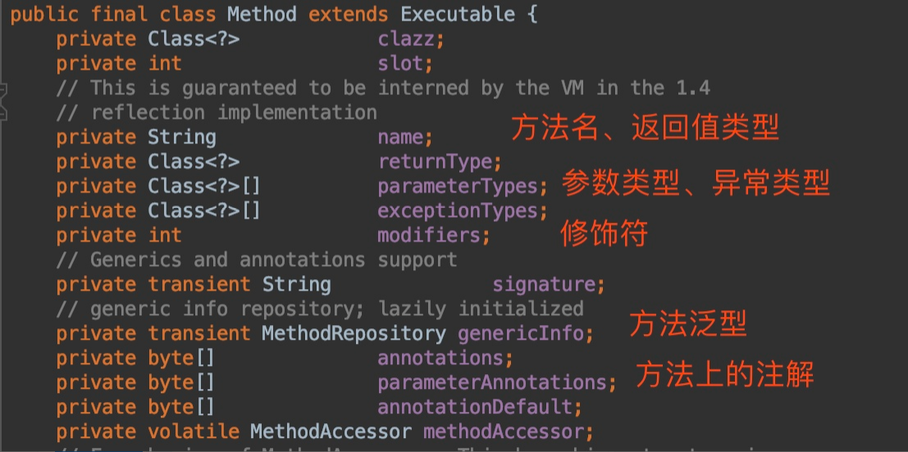
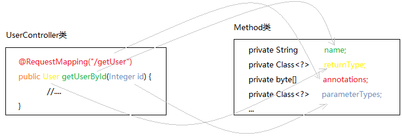

反射

## 一. 定义

在**运行过程**中，动态获取类的信息以及动态调用对象的方法的功能称为 java 语言的反射机制。

- 对于任意一个类，动态的获取类的的属性和方法；
- 对于任意一个对象，动态的调用其方法和属性；

## 二. class对象

### 2.1. 介绍

Java是一种半解释半编译的语言

- .java为源文件；
- .class为编译之后字节码，用于jvm按照一定规则进行读取；
- .class文件被类加载器加载到内存中，并且jvm根据其字节数组创建了对应的Class对象，读入涉及到类加载机制。

### 2.2. class类的对象

每个类都属于class类的对象。

class类包含的参数（想象一下我们如何去记录一个类的全部信息）

- **字段**
- **构造方法**
- **方法**
- 权限修饰符
- 类名
- 参数化类型（泛化信息）
- 接口
- 注解

每个类参数使用数组表示，可能有多个，例如：权限修饰符有public. private. protect。

Field. Method. Constructor因为包含的参数较多，因此单独作为了新类，类中包含其相应的信息。





## 三. 反射的作用

在运行的时候获取类的信息，并且执行动态调用类的方法。

反射的主要作用：

- 创建实例
- 反射调用方法

## 四. 反射的用法

用法：

1. 获取class对象（所需要类）；
2. 新建类的实例；
3. 获取方法；
4. 调用方法。

### 4.1. 获取class对象

常见的方法有四种：

1.已知具体类名：

```java
Class targetClass = TargetObject.class;
```

实际上我们通常并不知道类名，通常我们通过遍历包下面的类来获取 Class 对象。

通过此方式获取Class对象不会进行初始化

2.通过 `Class.forName()`传入类的路径获取：

```java
Class targetClass = Class.forName("com.bear.TargetObject");
```

Class.forName(className)实际调用的是一个native方法 forName0(className, true, ClassLoader.getClassLoader(caller), caller); 

第2个boolean参数表示类是否需要初始化，Class.forName(className)默认是需要初始化。

初始化意味着会触发目标对象的 static块代码执行，static参数也会被再次初始化。

3.通过对象实例`instance.getClass()`获取：

```java
Student student = new Student();
Class targetClass = student.getClass();
```

有对象实例则已完成初始化

4.通过类加载器`xxxClassLoader.loadClass()`传入类路径获取

```java
class clazz = ClassLoader.LoadClass("com.bear.TargetObject");
```

通过类加载器获取Class对象不会进行初始化

### 4.2. 新建类的实例

常见两种方法：

- class.newInstance()
- Contructor.newInstance()

clazz.newInstance()底层调用的还是Contructor对象的newInstance()，使用Contructor对象需要原始中有无参构造函数。

### 4.3. 获取方法

根据class对象获取Method方法时，需要添加方法名和对应的方法参数类型class，调用方法时需要遍历所有method，根据方法名和参数class返回唯一方法。

```java
Method method = targetClass.getMethod("methodName", String.class, Integer.class,......)
```

获取方法时，为什么要加上方法的和名字和参数类型的class？

- 方法名字和参数类型：用于区分类中的方法以及方法可能重载;
- 参数类型的class：不能通过参数名进行方法的区分，需要是参数类型的class;
- 不能直接是String或者int：String和int是引用类型和基础类型不能传递，需要是对象；

### 4.4. 调用方法

在创建实例对象和获取方法之后，方法执行方法

```java
method.invoke(targetObject, "args1", "args2");
```

为什么要在执行方法时传入实例对象？

对象的本质是数据的容器（用于数据的储存），对象放在堆中，相同类的对象的方法为了减少内存占用只有一份副本，放在方法区中，所有我们执行方法的时候需要传入对象，这样才能让方法在确定对象上执行。

### 4.5. 举例：

```java
import java.lang.reflect.Field;
import java.lang.reflect.InvocationTargetException;
import java.lang.reflect.Method;

public class Main {
    public static void main(String[] args) throws ClassNotFoundException, NoSuchMethodException, IllegalAccessException, InstantiationException, InvocationTargetException, NoSuchFieldException {
        /**
         * 获取TargetObject类的Class对象并且创建TargetObject类实例
         */
        Class<?> tagetClass = Class.forName("cn.javaguide.TargetObject");
        TargetObject targetObject = (TargetObject) tagetClass.newInstance();
        /**
         * 获取所有类中所有定义的方法（可选）
         */
        Method[] methods = tagetClass.getDeclaredMethods();
        for (Method method : methods) {
            System.out.println(method.getName());
        }
        /**
         * 获取指定方法并调用
         */
        Method method = tagetClass.getDeclaredMethod("publicMethod",
                String.class, String.class);

        method.invoke(targetObject, "args1", "args2");
        /**
         * 获取指定参数并对参数进行修改
         */
        Field field = tagetClass.getDeclaredField("value");
        //为了对类中的参数进行修改我们取消安全检查
        field.setAccessible(true);
        field.set(targetObject, "JavaGuide");
        /**
         * 调用 private 方法
         */
        Method privateMethod = tagetClass.getDeclaredMethod("privateMethod");
        //为了调用private方法我们取消安全检查
        privateMethod.setAccessible(true);
        privateMethod.invoke(targetObject);
    }
}
```

## 五. 反射的优缺点

- **优点：** 运行期类型的判断，动态加载类，提高代码灵活度。
- **缺点：** 1.性能瓶颈：反射相当于一系列解释操作，而这部分操作并没有经过jvm优化，所以效率较低。2.安全问题，将我们封装好的对象进行“拆解”，将类的所有信息暴露。

## 六. 反射的使用场景

在日常基础开发中，反射使用的相对较少，但是在模块开发（通过反射调用字节码）. 动态代理. Spring框架等大量使用了反射。

场景举例：

- 使用JDBC连接数据库时使用Class.forName()通过反射加载数据库引擎，不用手动的修改数据库具体代码；
- Spring 框架的 IOC（动态加载管理 Bean）创建对象以及 AOP（动态代理）功能都与反射相关；
- 动态配置实例的属性；
- and so on.