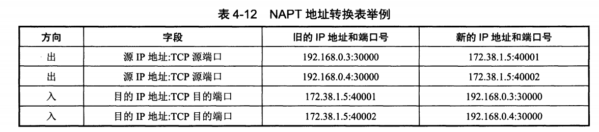
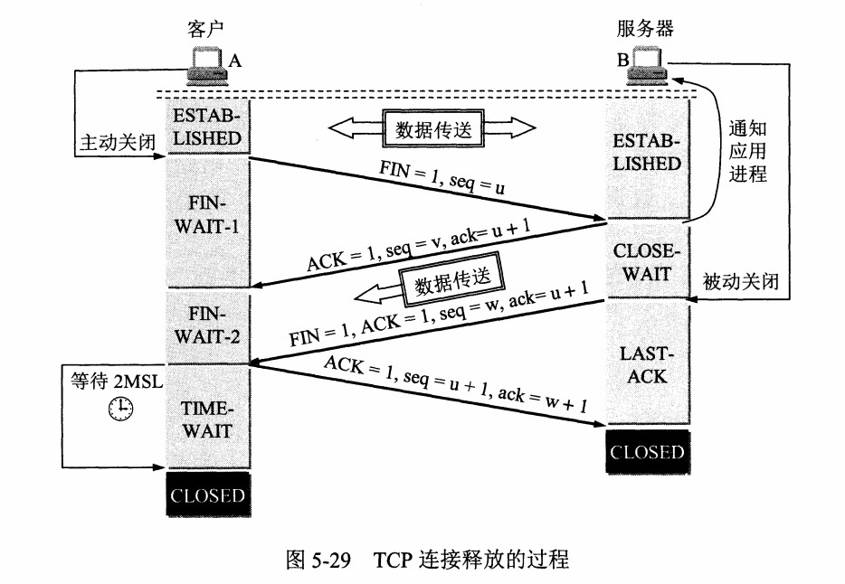

# 一. 计算机体系

## 1.1. 五层协议

- **应用层** ：为特定应用程序提供数据传输服务，例如 HTTP、DNS 等协议。数据单位为报文。
- **传输层** ：为进程提供通用数据传输服务。由于应用层协议很多，定义通用的传输层协议就可以支持不断增多的应用层协议。运输层包括两种协议：
  - 传输控制协议 TCP，提供面向连接、可靠的数据传输服务，数据单位为报文段；
  - 用户数据报协议 UDP，提供无连接、尽最大努力的数据传输服务，数据单位为用户数据报。
  - TCP 主要提供完整性服务，UDP 主要提供及时性服务。
- **网络层** ：为主机提供数据传输服务。而传输层协议是为主机中的进程提供数据传输服务。网络层把传输层传递下来的报文段或者用户数据报封装成分组。
- **数据链路层** ：网络层针对的还是主机之间的数据传输服务，而主机之间可以有很多链路，链路层协议就是为同一链路的主机提供数据传输服务。数据链路层把网络层传下来的分组封装成帧。
- **物理层** ：考虑的是怎样在传输媒体上传输数据比特流，而不是指具体的传输媒体。物理层的作用是尽可能屏蔽传输媒体和通信手段的差异，使数据链路层感觉不到这些差异。

## 1.2. OSI

其中表示层和会话层用途如下：

- **表示层** ：数据压缩、加密以及数据描述，这使得应用程序不必关心在各台主机中数据内部格式不同的问题。
- **会话层** ：建立及管理会话。

五层协议没有表示层和会话层，而是将这些功能留给应用程序开发者处理。

## 1.3. TCP/IP

将五层协议中数据链路层和物理层合并为网络接口层。

TCP/IP 体系结构不严格遵循 OSI 分层概念，应用层可能会直接使用 IP 层或者网络接口层。

## 1.4. 数据在各层之间的传递过程

下层对上层服务，下层对上层透明。在向下的过程中，需要添加下层协议所需要的首部或者尾部，而在向上的过程中不断拆开首部和尾部。

路由器只有下面三层协议，因为路由器位于网络核心中，不需要为进程或者应用程序提供服务，因此也就不需要传输层和应用层。

## 1.5.相关知识点

1. **结点 （node）** ：网络中的结点可以是计算机，集线器，交换机或路由器等。
2. **链路（link ）** : 从一个结点到另一个结点的一段物理线路。中间没有任何其他交点。
3. **主机（host）** ：连接在因特网上的计算机。
4. **ISP（Internet Service Provider）** ：因特网服务提供者（提供商）。
5. **IXP（Internet eXchange Point）** ： 互联网交换点 IXP 的主要作用就是允许两个网络直接相连并交换分组，而不需要再通过第三个网络来转发分组。
6. **RFC(Request For Comments)** ：意思是“请求评议”，包含了关于 Internet 几乎所有的重要的文字资料。
7. **广域网 WAN（Wide Area Network）** ：任务是通过长距离运送主机发送的数据。
8. **城域网 MAN（Metropolitan Area Network）**：用来将多个局域网进行互连。
9. **局域网 LAN（Local Area Network）** ： 学校或企业大多拥有多个互连的局域网。
10. **个人区域网 PAN（Personal Area Network）** ：在个人工作的地方把属于个人使用的电子设备用无线技术连接起来的网络 。
11. **端系统（end system）** ：处在因特网边缘的部分即是连接在因特网上的所有的主机。
12. **分组（packet ）** ：因特网中传送的数据单元。由首部 header 和数据段组成。分组又称为包，首部可称为包头。
13. **存储转发（store and forward ）** ：路由器收到一个分组，先存储下来，再检查其首部，查找转发表，按照首部中的目的地址，找到合适的接口转发出去。
14. **带宽（bandwidth）** ：在计算机网络中，表示在单位时间内从网络中的某一点到另一点所能通过的“最高数据率”。常用来表示网络的通信线路所能传送数据的能力。单位是“比特每秒”，记为 b/s。
15. **吞吐量（throughput ）** ：表示在单位时间内通过某个网络（或信道、接口）的数据量。吞吐量更经常地用于对现实世界中的网络的一种测量，以便知道实际上到底有多少数据量能够通过网络。吞吐量受网络的带宽或网络的额定速率的限制。

## 1.6. 重要知识点总结

1. **计算机网络（简称网络）把许多计算机连接在一起，而互联网把许多网络连接在一起，是网络的网络。**
2. 小写字母 i 开头的 internet（互联网）是通用名词，它泛指由多个计算机网络相互连接而成的网络。在这些网络之间的通信协议（即通信规则）可以是任意的。大写字母 I 开头的 Internet（互联网）是专用名词，它指全球最大的，开放的，由众多网络相互连接而成的特定的互联网，并采用 TCP/IP 协议作为通信规则，其前身为 ARPANET。Internet 的推荐译名为因特网，现在一般流行称为互联网。
3. 路由器是实现分组交换的关键构件，其任务是转发收到的分组，这是网络核心部分最重要的功能。分组交换采用存储转发技术，表示把一个报文（要发送的整块数据）分为几个分组后再进行传送。在发送报文之前，先把较长的报文划分成为一个个更小的等长数据段。在每个数据端的前面加上一些由必要的控制信息组成的首部后，就构成了一个分组。分组又称为包。分组是在互联网中传送的数据单元，正是由于分组的头部包含了诸如目的地址和源地址等重要控制信息，每一个分组才能在互联网中独立的选择传输路径，并正确地交付到分组传输的终点。
4. 互联网按工作方式可划分为边缘部分和核心部分。主机在网络的边缘部分，其作用是进行信息处理。由大量网络和连接这些网络的路由器组成核心部分，其作用是提供连通性和交换。
5. 计算机通信是计算机中进程（即运行着的程序）之间的通信。计算机网络采用的通信方式是客户-服务器方式（C/S 方式）和对等连接方式（P2P 方式）。
6. 客户和服务器都是指通信中所涉及的应用进程。客户是服务请求方，服务器是服务提供方。
7. 按照作用范围的不同，计算机网络分为广域网 WAN，城域网 MAN，局域网 LAN，个人区域网 PAN。
8. **计算机网络最常用的性能指标是：速率，带宽，吞吐量，时延（发送时延，处理时延，排队时延），时延带宽积，往返时间和信道利用率。**
9. 网络协议即协议，是为进行网络中的数据交换而建立的规则。计算机网络的各层以及其协议集合，称为网络的体系结构。
10. **五层体系结构由应用层，运输层，网络层，数据链路层，物理层组成。运输层最主要的协议是 TCP 和 UDP 协议，网络层最重要的协议是 IP 协议。**

# 二. 物理层

## 2.1. 基本术语

1. **数据（data）** :运送消息的实体。
2. **信号（signal）** ：数据的电气的或电磁的表现。或者说信号是适合在传输介质上传输的对象。
3. **码元（ code）** ：在使用时间域（或简称为时域）的波形来表示数字信号时，代表不同离散数值的基本波形。
4. **单工（simplex ）** : 只能有一个方向的通信而没有反方向的交互。
5. **半双工（half duplex ）** ：通信的双方都可以发送信息，但不能双方同时发送(当然也就不能同时接收)。
6. **全双工（full duplex）** : 通信的双方可以同时发送和接收信息。
7. **奈氏准则** : 在任何信道中，码元的传输的效率是有上限的，传输速率超过此上限，就会出现严重的码间串扰问题，使接收端对码元的判决（即识别）成为不可能。
8. **基带信号（baseband signal）** : 来自信源的信号。指没有经过调制的数字信号或模拟信号。
9. **带通（频带）信号（bandpass signal）** ：把基带信号经过载波调制后，把信号的频率范围搬移到较高的频段以便在信道中传输（即仅在一段频率范围内能够通过信道），这里调制过后的信号就是带通信号。
10. **调制（modulation ）** : 对信号源的信息进行处理后加到载波信号上，使其变为适合在信道传输的形式的过程。
11. **信噪比（signal-to-noise ratio ）** : 指信号的平均功率和噪声的平均功率之比，记为 S/N。信噪比（dB）=10*log10（S/N）。
12. **信道复用（channel multiplexing ）** ：指多个用户共享同一个信道。（并不一定是同时）。
13. **比特率（bit rate ）** ：单位时间（每秒）内传送的比特数。
14. **波特率（baud rate）** ：单位时间载波调制状态改变的次数。针对数据信号对载波的调制速率。
15. **复用（multiplexing）** ：共享信道的方法。
16. **ADSL（Asymmetric Digital Subscriber Line ）** ：非对称数字用户线。
17. **光纤同轴混合网（HFC 网）** :在目前覆盖范围很广的有线电视网的基础上开发的一种居民宽带接入网

## 2.2. 重要知识点

1. **物理层的主要任务就是确定与传输媒体接口有关的一些特性，如机械特性，电气特性，功能特性，过程特性。**
2. 一个数据通信系统可划分为三大部分，即源系统，传输系统，目的系统。源系统包括源点（或源站，信源）和发送器，目的系统包括接收器和终点。
3. **通信的目的是传送消息。如话音，文字，图像等都是消息，数据是运送消息的实体。信号则是数据的电器或电磁的表现。**
4. 根据信号中代表消息的参数的取值方式不同，信号可分为模拟信号（或连续信号）和数字信号（或离散信号）。在使用时间域（简称时域）的波形表示数字信号时，代表不同离散数值的基本波形称为码元。
5. 根据双方信息交互的方式，通信可划分为单向通信（或单工通信），双向交替通信（或半双工通信），双向同时通信（全双工通信）。
6. 来自信源的信号称为基带信号。信号要在信道上传输就要经过调制。调制有基带调制和带通调制之分。最基本的带通调制方法有调幅，调频和调相。还有更复杂的调制方法，如正交振幅调制。
7. 要提高数据在信道上的传递速率，可以使用更好的传输媒体，或使用先进的调制技术。但数据传输速率不可能任意被提高。
8. 传输媒体可分为两大类，即导引型传输媒体（双绞线，同轴电缆，光纤）和非导引型传输媒体（无线，红外，大气激光）。
9. 了有效利用光纤资源，在光纤干线和用户之间广泛使用无源光网络 PON。无源光网络无需配备电源，其长期运营成本和管理成本都很低。最流行的无源光网络是以太网无源光网络 EPON 和吉比特无源光网络 GPON。
10. 通信方式：单工通信：单向传输、半双工通信：双向交替传输、全双工通信：双向同时传输

## 2.3. 补充

### 2.3.1. 物理层功能

**物理层(physical layer)的作用是实现相邻计算机节点之间比特流的透明传送，尽可能屏蔽掉具体传输介质和物理设备的差异。**

在物理层上所传送的数据单位是比特。

### 2.3.2. 信道复用

1. **频分复用(FDM)** ：所有用户在同样的时间占用不同的带宽资源。
2. **时分复用（TDM）** ：所有用户在不同的时间占用同样的频带宽度（分时不分频）。
3. **统计时分复用 (Statistic TDM)** ：改进的时分复用，能够明显提高信道的利用率。
4. **码分复用(CDM)** ： 用户使用经过特殊挑选的不同码型，因此各用户之间不会造成干扰。这种系统发送的信号有很强的抗干扰能力，其频谱类似于白噪声，不易被敌人发现, 为每个用户分配 m bit 的码片，并且所有的码片正交。当接收端使用码片  对接收到的数据进行内积运算时，结果为 0 的是其它用户发送的数据，结果为 1 的是用户发送的比特 1，结果为 -1 的是用户发送的比特 0。码分复用需要发送的数据量为原先的 m 倍。
5. **波分复用( WDM)** ：波分复用就是光的频分复用。

# 三. 数据链路层

## 3.1. 基本术语

1. **链路（link）** ：一个结点到相邻结点的一段物理链路。
2. **数据链路（data link）** ：把实现控制数据运输的协议的硬件和软件加到链路上就构成了数据链路。
3. **循环冗余检验 CRC（Cyclic Redundancy Check）** ：为了保证数据传输的可靠性，CRC 是数据链路层广泛使用的一种检错技术。
4. **帧（frame）** ：一个数据链路层的传输单元，由一个数据链路层首部和其携带的封包所组成协议数据单元。
5. **MTU（Maximum Transfer Uint ）** ：最大传送单元。帧的数据部分的的长度上限（1500）。
6. **误码率 BER（Bit Error Rate ）** ：在一段时间内，传输错误的比特占所传输比特总数的比率。
7. **PPP（Point-to-Point Protocol ）** ：点对点协议。即用户计算机和 ISP 进行通信时所使用的数据链路层协议。
8. **MAC 地址（Media Access Control 或者 Medium Access Control）** ：意译为媒体访问控制，或称为物理地址、硬件地址，用来定义网络设备的位置。在 OSI 模型中，第三层网络层负责 IP 地址，第二层数据链路层则负责 MAC 地址。因此一个主机会有一个 MAC 地址，而每个网络位置会有一个专属于它的 IP 地址 。地址是识别某个系统的重要标识符，“名字指出我们所要寻找的资源，地址指出资源所在的地方，路由告诉我们如何到达该处。
9. **网桥（bridge）** ：一种用于数据链路层实现中继，连接两个或多个局域网的网络互连设备（用交换机替代了）。
10. **交换机（switch ）** ：广义的来说，交换机指的是一种通信系统中完成信息交换的设备。这里工作在数据链路层的交换机指的是交换式集线器，其实质是一个多接口的网桥

## 3.2. 重要知识点总结

1. 链路是从一个结点到相邻节点的一段物理链路，数据链路则在链路的基础上增加了一些必要的硬件（如网络适配器）和软件（如协议的实现）
2. 数据链路层使用的主要是**点对点信道**和**广播信道**两种。
3. 数据链路层传输的协议数据单元是帧。数据链路层的三个基本问题是：**封装成帧**，**透明传输**和**差错检测**
4. **循环冗余检验 CRC** 是一种检错方法，而帧检验序列 FCS 是添加在数据后面的冗余码
5. **点对点协议 PPP** 是数据链路层使用最多的一种协议，它的特点是：简单，只检测差错而不去纠正差错，不使用序号，也不进行流量控制，可同时支持多种网络层协议
6. PPPoE 是为宽带上网的主机使用的链路层协议
7. **局域网的优点是：具有广播功能，从一个站点可方便地访问全网；便于系统的扩展和逐渐演变；提高了系统的可靠性，可用性和生存性。**
8. 计算机与外接局域网通信需要通过通信适配器（或网络适配器），它又称为网络接口卡或网卡。**计算器的硬件地址就在适配器的 ROM 中**。
9. 以太网采用的无连接的工作方式，对发送的数据帧不进行编号，也不要求对方发回确认。目的站收到有差错帧就把它丢掉，其他什么也不做
10. 以太网采用的协议是具有冲突检测的**载波监听多点接入 CSMA/CD**。协议的特点是：**发送前先监听，边发送边监听，一旦发现总线上出现了碰撞，就立即停止发送。然后按照退避算法等待一段随机时间后再次发送。** 因此，每一个站点在自己发送数据之后的一小段时间内，存在这遭遇碰撞的可能性。以太网上的各站点平等的争用以太网信道
11. 以太网的适配器具有过滤功能，它只接收单播帧，广播帧和多播帧。
12. 使用集线器可以在物理层扩展以太网（扩展后的以太网仍然是一个网络）

## 3.3. 补充

### 3.3.1.  点对点通信、广播通信、PPP协议、 CSMA/CD 协议

**1.点对点通信**

一对一通信，因为不会发生碰撞，因此也比较简单，使用 PPP 协议进行控制。

**2.广播通信**：

一对多通信，一个节点发送的数据能够被广播信道上所有的节点接收到。

所有的节点都在同一个广播信道上发送数据，因此需要有专门的控制方法进行协调，避免发生冲突（冲突也叫碰撞）。主要有两种控制方法进行协调，一个是使用**信道复用技术**，一是使用 **CSMA/CD 协议**。

**3. PPP协议**

点对点协议。即用户计算机和 ISP 进行通信时所使用的数据链路层协议，以下是 PPP 帧的示意图： 

PPP 的帧格式：

- F 字段为帧的定界符
- A 和 C 字段暂时没有意义
- FCS 字段是使用 CRC 的检验序列
- 信息部分的长度不超过 1500

**4. CSMA/CD 协议**

CSMA/CD 表示载波监听多点接入 / 碰撞检测。

- **多点接入 (MA)**：说明这是总线型网络，许多主机以多点的方式连接到总线上。
- **载波监听 (CS)** ：每个主机都必须不停地监听信道。在发送前，如果监听到信道正在使用，就必须等待。
- **碰撞检测 (CD)** ：在发送中，如果监听到信道已有其它主机正在发送数据，就表示发生了碰撞。虽然每个主机在发送数据之前都已经监听到信道为空闲，但是由于电磁波的传播时延的存在，还是有可能会发生碰撞。

记端到端的传播时延为 τ，最先发送的站点最多经过 2τ 就可以知道是否发生了碰撞，称 2τ 为 **争用期** 。只有经过争用期之后还没有检测到碰撞，才能肯定这次发送不会发生碰撞。

当发生碰撞时，站点要停止发送，等待一段时间再发送。这个时间采用 **截断二进制指数退避算法** 来确定。从离散的整数集合 {0, 1, .., (2k-1)} 中随机取出一个数，记作 r，然后取 r 倍的争用期作为重传等待时间。

### 3.3.2. 封装成帧、透明传输、差错检验

**1.封装成帧**

将网络层传下来的分组添加首部和尾部，用于标记帧的开始和结束。

**2.透明传输**

透明表示一个实际存在的事物看起来好像不存在一样。用户察觉不到转义字符的存在。

帧使用首部和尾部进行定界，如果帧的数据部分含有和首部尾部相同的内容，那么帧的开始和结束位置就会被错误的判定。需要在数据部分出现首部尾部相同的内容前面插入转义字符。如果数据部分出现转义字符，那么就在转义字符前面再加个转义字符。在接收端进行处理之后可以还原出原始数据。这个过程透明传输的内容是转义字符，用户察觉不到转义字符的存在。

**3.差错检验**

目前数据链路层广泛使用了循环冗余检验（CRC）来检查比特差错。

### 3.3.3.  MAC 层硬件地址

MAC 地址是链路层地址，48位，厂商位（24位） + 设备位（24位），通常表示为12个16进制数，每两个16进制数之间用冒号分隔开，如【08:00:20:0A:8C:6D】，理论上不可重复，但是实际上不是同一局域网下可重复，网络中非同一局域网根据IP进行数据的转发。一台设备有多少个网络适配器就有多少个MAC地址。

### 3.3.4. 适配器，转发器，集线器，网桥，以太网交换机的作用以及适用场合

# 四. 网络层

因为网络层是整个互联网的核心，因此应当让网络层尽可能简单。网络层向上只提供简单灵活的、无连接的、尽最大努力交互的数据报服务。

网络层的作用：使用 IP 协议，可以把异构的物理网络连接起来，使得在网络层看起来好像是一个统一的网络。

与 IP 协议配套使用的还有三个协议：

- 地址解析协议 ARP（Address Resolution Protocol）
- 网际控制报文协议 ICMP（Internet Control Message Protocol）
- 网际组管理协议 IGMP（Internet Group Management Protocol）

## 4.1. 基本概念

1. **虚电路（Virtual Circuit）** : 在两个终端设备的逻辑或物理端口之间，通过建立的双向的透明传输通道。虚电路表示这只是一条逻辑上的连接，分组都沿着这条逻辑连接按照存储转发方式传送，而并不是真正建立了一条物理连接。
2. **IP（Internet Protocol ）** : 网际协议 IP 是 TCP/IP 体系中两个最主要的协议之一，是 TCP/IP 体系结构网际层的核心。配套的有 ARP，RARP，ICMP，IGMP。
3. **ARP（Address Resolution Protocol）** : 地址解析协议。地址解析协议 ARP 把 IP 地址解析为硬件地址。
4. RARP：由MAC地址得到IP地址
5. **ICMP（Internet Control Message Protocol ）** ：网际控制报文协议 （ICMP 允许主机或路由器报告差错情况和提供有关异常情况的报告）。
6. **子网掩码（subnet mask ）** ：它是一种用来指明一个 IP 地址的哪些位标识的是主机所在的子网以及哪些位标识的是主机的位掩码。子网掩码不能单独存在，它必须结合 IP 地址一起使用。
7. **CIDR（ Classless Inter-Domain Routing ） **：无分类域间路由选择 （特点是消除了传统的 A 类、B 类和 C 类地址以及划分子网的概念，并使用各种长度的“网络前缀”(network-prefix)来代替分类地址中的网络号和子网号）。
8. **默认路由（default route）** ：当在路由表中查不到能到达目的地址的路由时，路由器选择的路由。默认路由还可以减小路由表所占用的空间和搜索路由表所用的时间。
9. **路由选择算法（Virtual Circuit）** ：路由选择协议的核心部分。因特网采用自适应的，分层次的路由选择协议。

## 4.2. 重要知识点总结

1. **TCP/IP 协议中的网络层向上只提供简单灵活的，无连接的，尽最大努力交付的数据报服务。网络层不提供服务质量的承诺，不保证分组交付的时限所传送的分组可能出错，丢失，重复和失序。进程之间通信的可靠性由运输层负责**
3. 分类的 IP 地址由网络号字段（指明网络）和主机号字段（指明主机）组成。网络号字段最前面的类别指明 IP 地址的类别。IP 地址是一种分等级的地址结构。IP 地址管理机构分配 IP 地址时只分配网络号，主机号由得到该网络号的单位自行分配。路由器根据目的主机所连接的网络号来转发分组。一个路由器至少连接到两个网络，所以一个路由器至少应当有两个不同的 IP 地址
4. IP 数据报分为首部和数据两部分。首部的前一部分是固定长度，共 20 字节，是所有 IP 数据包必须具有的（源地址，目的地址，总长度等重要地段都固定在首部）。一些长度可变的可选字段固定在首部的后面。IP 首部中的生存时间给出了 IP 数据报在互联网中所能经过的最大路由器数。可防止 IP 数据报在互联网中无限制的兜圈子。
5. **地址解析协议 ARP 把 IP 地址解析为硬件地址。ARP 的高速缓存可以大大减少网络上的通信量。因为这样可以使主机下次再与同样地址的主机通信时，可以直接从高速缓存中找到所需要的硬件地址而不需要再去广播方式发送 ARP 请求分组**。
6. 无分类域间路由选择 CIDR 是解决目前 IP 地址紧缺的一个好办法。CIDR 记法把 IP 地址后面加上斜线“/”，然后写上前缀所所占的位数。前缀（或网络前缀用来指明网络），前缀后面的部分是后缀，用来指明主机。CIDR 把前缀都相同的连续的 IP 地址组成一个“CIDR 地址块”，IP 地址分配都以 CIDR 地址块为单位。
7. 网际控制报文协议是 IP 层的协议。ICMP 报文作为 IP 数据报的数据，加上首部后组成 IP 数据报发送出去。使用 ICMP 数据报并不是为了实现可靠传输。ICMP 允许主机或路由器报告差错情况和提供有关异常情况的报告。ICMP 报文的种类有两种 ICMP 差错报告报文和 ICMP 询问报文。
8. **要解决 IP 地址耗尽的问题，最根本的办法是采用具有更大地址空间的新版本 IP 协议 IPv6。** IPv6 所带来的变化有 ① 更大的地址空间（采用 128 位地址）② 灵活的首部格式 ③ 改进的选项 ④ 支持即插即用 ⑤ 支持资源的预分配 ⑥IPv6 的首部改为 8 字节对齐。
9. **虚拟专用网络 VPN 利用公用的互联网作为本机构专用网之间的通信载体。VPN 内使用互联网的专用地址。一个 VPN 至少要有一个路由器具有合法的全球 IP 地址，这样才能和本系统的另一个 VPN 通过互联网进行通信。所有通过互联网传送的数据都需要加密。**
10. MPLS 的特点是：① 支持面向连接的服务质量 ② 支持流量工程，平衡网络负载 ③ 有效的支持虚拟专用网 VPN。MPLS 在入口节点给每一个 IP 数据报打上固定长度的“标记”，然后根据标记在第二层（链路层）用硬件进行转发（在标记交换路由器中进行标记交换），因而转发速率大大加快。

## 4.3. 关键点

### 4.3.1. IP 数据报格式

- **版本** : 有 4（IPv4）和 6（IPv6）两个值；
- **首部长度** : 占 4 位，因此最大值为 15。值为 1 表示的是 1 个 32 位字的长度，也就是 4 字节。因为固定部分长度为 20 字节，因此该值最小为 5。如果可选字段的长度不是 4 字节的整数倍，就用尾部的填充部分来填充。
- **区分服务** : 用来获得更好的服务，一般情况下不使用。
- **总长度** : 包括首部长度和数据部分长度。
- **标识**: 占16位，IP软件维持的一个计数器，**在出现数据分片的时候，用于标记是否同一个数据包，方便接收端重组**。
- **标志** : 在数据报长度过长从而发生分片的情况下，相同数据报的不同分片具有相同的标识符（**MF**（More Fragment）: 是否还有分片。**DF**（Don't Fragment）是否能分片。
- **片偏移** : 和标识符一起，用于发生分片的情况。片偏移的单位为 8 字节。
- **生存时间 ：TTL**，它的存在是为了防止无法交付的数据报在网络中不断兜圈子，浪费资源。以路由器跳数为单位，当 TTL 为 0 时就丢弃数据报。
- **协议** ：指出携带的数据应该上交给哪个协议进行处理，例如 ICMP、TCP、UDP 等。
- **首部检验和** ：因为数据报每经过一个路由器，都要重新计算检验和，只校验数据报首部，不校验数据部分，检验和不包含数据部分可以减少计算的工作量。
- **源IP**
- **目的源IP**
- PS：固定20字节，增加可变部分需要补齐。

### 4.3.2 IP 地址编址方式

IP 地址的编址方式经历了三个历史阶段：

- 分类
- 子网划分
- 无分类

#### 1. 分类

由两部分组成，网络号和主机号，其中不同分类具有不同的网络号长度，并且是固定的。

IP 地址 ::= {< 网络号 >, < 主机号 >}

#### 2. 子网划分

通过在主机号字段中拿一部分作为子网号，把两级 IP 地址划分为三级 IP 地址。

IP 地址 ::= {< 网络号 >, < 子网号 >, < 主机号 >}

要使用子网，必须配置子网掩码。一个 B 类地址的默认子网掩码为 255.255.0.0，如果 B 类地址的子网占两个比特，那么子网掩码为 11111111 11111111 11000000 00000000，也就是 255.255.192.0。

注意，外部网络看不到子网的存在。

#### 3. 无分类

无分类编址 CIDR 消除了传统 A 类、B 类和 C 类地址以及划分子网的概念，使用网络前缀和主机号来对 IP 地址进行编码，网络前缀的长度可以根据需要变化。

IP 地址 ::= {< 网络前缀号 >, < 主机号 >}

CIDR 的记法上采用在 IP 地址后面加上网络前缀长度的方法，例如 128.14.35.7/20 表示前 20 位为网络前缀。

CIDR 的地址掩码可以继续称为子网掩码，子网掩码首 1 长度为网络前缀的长度。

一个 CIDR 地址块中有很多地址，一个 CIDR 表示的网络就可以表示原来的很多个网络，并且在路由表中只需要一个路由就可以代替原来的多个路由，减少了路由表项的数量。把这种通过使用网络前缀来减少路由表项的方式称为路由聚合，也称为 **构成超网** 。

在路由表中的项目由“网络前缀”和“下一跳地址”组成，在查找时可能会得到不止一个匹配结果，应当采用最长前缀匹配来确定应该匹配哪一个。

### 4.3.3. 地址解析协议 ARP

网络层实现主机之间的通信，而链路层实现具体每段链路之间的通信。因此在**通信过程中**，**IP 数据报的源地址和目的地址始终不变**，而 MAC 地址随着链路的改变而改变。

ARP 实现由 IP 地址得到 MAC 地址。

每个主机都有一个 ARP 高速缓存，里面有本局域网上的各主机和路由器的 IP 地址到 MAC 地址的映射表。

如果主机 A 知道主机 B 的 IP 地址，但是 ARP 高速缓存中没有该 IP 地址到 MAC 地址的映射，此时主机 A 通过广播的方式发送 ARP 请求分组，主机 B 收到该请求后会发送 ARP 响应分组给主机 A 告知其 MAC 地址，随后主机 A 向其高速缓存中写入主机 B 的 IP 地址到 MAC 地址的映射。

**针对ARP的攻击**

**ARP欺骗**：攻击方法为是冒充主机发送ARP请求广播，让收到ARP请求的主机，将Cache中的MAC替换为攻击者的MAC地址，进而获取被冒充主机的数据包。防范方案：1.静态绑定IP和MAC。2.动态检测ARP请求包。

**ARP泛洪**：通过在短时间内大量发送无效ARP请求包，替换收到ARP请求包的主机的Cache表有用数据，进而导致主机无法通信。防范方案：1.禁止接口学习ARP表项的功能，2.配置ARP报文限速，3.配置ARP表项严格学习。

### 4.3.4. 网际控制报文协议 ICMP

ICMP 是为了更有效地转发 IP 数据报和提高交付成功的机会。它封装在 IP 数据报中，但是不属于高层协议。

ICMP 报文分为差错报告报文和询问报文。

#### 1. Ping

Ping 是 ICMP 的一个重要应用，主要用来测试两台主机之间的连通性。

Ping 的原理是通过向目的主机发送 ICMP Echo 请求报文，目的主机收到之后会发送 Echo 回答报文。Ping 会根据时间和成功响应的次数估算出数据包往返时间以及丢包率。

#### 2. Traceroute

Traceroute 是 ICMP 的另一个应用，用来跟踪一个分组从源点到终点的路径。

Traceroute 发送的 IP 数据报封装的是无法交付的 UDP 用户数据报，并由目的主机发送终点不可达差错报告报文。

- 源主机向目的主机发送一连串的 IP 数据报。第一个数据报 P1 的生存时间 TTL 设置为 1，当 P1 到达路径上的第一个路由器 R1 时，R1 收下它并把 TTL 减 1，此时 TTL 等于 0，R1 就把 P1 丢弃，并向源主机发送一个 ICMP 时间超过差错报告报文；
- 源主机接着发送第二个数据报 P2，并把 TTL 设置为 2。P2 先到达 R1，R1 收下后把 TTL 减 1 再转发给 R2，R2 收下后也把 TTL 减 1，由于此时 TTL 等于 0，R2 就丢弃 P2，并向源主机发送一个 ICMP 时间超过差错报文。
- 不断执行这样的步骤，直到最后一个数据报刚刚到达目的主机，主机不转发数据报，也不把 TTL 值减 1。但是因为数据报封装的是无法交付的 UDP，因此目的主机要向源主机发送 ICMP 终点不可达差错报告报文。
- 之后源主机知道了到达目的主机**所经过的路由器 IP 地址**以及**到达每个路由器的往返时间**。

### 4.3.5. 虚拟专用网 VPN

由于 IP 地址的紧缺，一个机构能申请到的 IP 地址数往往远小于本机构所拥有的主机数。并且一个机构并不需要把所有的主机接入到外部的互联网中，机构内的计算机可以使用仅在本机构有效的 IP 地址（专用地址）。

有三个专用地址块：

- 10.0.0.0 ~ 10.255.255.255
- 172.16.0.0 ~ 172.31.255.255
- 192.168.0.0 ~ 192.168.255.255

VPN 使用公用的互联网作为本机构各专用网之间的通信载体。专用指机构内的主机只与本机构内的其它主机通信；虚拟指好像是，而实际上并不是，它有经过公用的互联网。

下图中，场所 A 和 B 的通信经过互联网，如果场所 A 的主机 X 要和另一个场所 B 的主机 Y 通信，IP 数据报的源地址是 10.1.0.1，目的地址是 10.2.0.3。数据报先发送到与互联网相连的路由器 R1，R1 对内部数据进行加密，然后重新加上数据报的首部，源地址是路由器 R1 的全球地址 125.1.2.3，目的地址是路由器 R2 的全球地址 194.4.5.6。路由器 R2 收到数据报后将数据部分进行解密，恢复原来的数据报，此时目的地址为 10.2.0.3，就交付给 Y。

### 4.3.6. 网络地址转换 NAT

专用网内部的主机使用本地 IP 地址又想和互联网上的主机通信时，可以使用 NAT 来将本地 IP 转换为全球 IP。

在以前，NAT 将本地 IP 和全球 IP 一一对应，这种方式下拥有 n 个全球 IP 地址的专用网内最多只可以同时有 n 台主机接入互联网。为了更有效地利用全球 IP 地址，现在常用的 NAT 转换表把传输层的端口号也用上了，使得多个专用网内部的主机共用一个全球 IP 地址。使用端口号的 NAT 也叫做网络地址与端口转换 NAPT。

### 4.3.7. 路由器的结构

路由器从功能上可以划分为：路由选择和分组转发。

分组转发结构由三个部分组成：交换结构、一组输入端口和一组输出端口。

### 4.3.8. 路由器分组转发流程

- 从数据报的首部提取目的主机的 IP 地址 D，得到目的网络地址 N。
- 若 N 就是与此路由器直接相连的某个网络地址，则进行直接交付；
- 若路由表中有目的地址为 D 的特定主机路由，则把数据报传送给表中所指明的下一跳路由器；
- 若路由表中有到达网络 N 的路由，则把数据报传送给路由表中所指明的下一跳路由器；
- 若路由表中有一个默认路由，则把数据报传送给路由表中所指明的默认路由器；
- 报告转发分组出错。

### 4.3.9. 路由选择协议

路由选择协议都是自适应的，能随着网络通信量和拓扑结构的变化而自适应地进行调整。

互联网可以划分为许多较小的自治系统 AS，一个 AS 可以使用一种和别的 AS 不同的路由选择协议。

可以把路由选择协议划分为两大类：

- 自治系统内部的路由选择：RIP 和 OSPF
- 自治系统间的路由选择：BGP

#### 1. 内部网关协议 RIP

RIP 是一种基于距离向量的路由选择协议。距离是指跳数，直接相连的路由器跳数为 1。跳数最多为 15，超过 15 表示不可达。

RIP 按**固定的时间间隔仅和相邻路由器**交换自己的路由表，经过若干次交换之后，所有路由器最终会知道到达本自治系统中任何一个网络的最短距离和下一跳路由器地址。

距离向量算法：

- 对地址为 X 的相邻路由器发来的 RIP 报文，先修改报文中的所有项目，把下一跳字段中的地址改为 X，并把所有的距离字段加 1；
- 对修改后的 RIP 报文中的每一个项目，进行以下步骤：
  - 若原来的路由表中没有目的网络 N，则把该项目添加到路由表中；
  - 否则：若下一跳路由器地址是 X，则把收到的项目替换原来路由表中的项目；否则：若收到的项目中的距离 d 小于路由表中的距离，则进行更新（例如原始路由表项为 Net2, 5, P，新表项为 Net2, 4, X，则更新）；否则什么也不做。
- 若 3 分钟还没有收到相邻路由器的更新路由表，则把该相邻路由器标为不可达，即把距离置为 16。

**RIP 协议实现简单，开销小。但是 RIP 能使用的最大距离为 15，限制了网络的规模。并且当网络出现故障时，要经过比较长的时间才能将此消息传送到所有路由器。**

**RIP好消息传的快，坏消息传的慢**

传的慢是因为如果一个网络出现故障，与网络直接相连的路由R1是知道不可达（距离等于16），但是其他路由R2不知道，于是R2会往R1发送到达故障网络的路由信息，但是因为R2里面到故障网络的信息小于R1里面的，所以R1更新了路由，让R1觉得故障网络可到达了，然后R1又去更新R2，知道距离等于16

#### 2. 内部网关协议 OSPF

开放表示 OSPF 不受某一家厂商控制，而是公开发表的；最短路径优先表示使用了 Dijkstra 提出的最短路径算法 SPF。

OSPF 具有以下特点：

- 向本自治系统中的**所有路由器**发送信息，这种方法是洪泛法。
- 发送的信息就是与**相邻路由器的链路状态**，链路状态包括与哪些路由器相连以及**链路的度量，度量用费用、距离、时延、带宽等**来表示。
- **只要当链路状态发生变化**时，路由器才会发送信息。

所有路由器都具有全网的拓扑结构图，并且是一致的。相比于 RIP，OSPF 的更新过程收敛的很快。

#### 3. 外部网关协议 BGP

BGP（Border Gateway Protocol，边界网关协议）

AS 之间的路由选择很困难，主要是由于：

- 互联网规模很大；
- 各个 AS 内部使用不同的路由选择协议，无法准确定义路径的度量；
- AS 之间的路由选择必须考虑有关的策略，比如有些 AS 不愿意让其它 AS 经过。

BGP 只能寻找一条比较好的路由，而不是最佳路由。

每个 AS 都必须配置 BGP 发言人，通过在两个相邻 BGP 发言人之间建立 TCP 连接来交换路由信息。

# 五. 运输层

网络层只把分组发送到目的主机，但是真正通信的并不是主机而是主机中的进程。运输层提供了进程间的逻辑通信，运输层向高层用户屏蔽了下面网络层的核心细节，使应用程序看起来像是在两个传输层实体之间有一条端到端的逻辑通信信道。

## 5.1. 基本术语

1. **进程（process）** ：指计算机中正在运行的程序实体。
2. **应用进程互相通信** ：一台主机的进程和另一台主机中的一个进程交换数据的过程（另外注意通信真正的端点不是主机而是主机中的进程，也就是说端到端的通信是应用进程之间的通信）。
3. **传输层的复用与分用** ：复用指发送方不同的进程都可以通过统一个运输层协议传送数据。分用指接收方的运输层在剥去报文的首部后能把这些数据正确的交付到目的应用进程。
4. **TCP（Transmission Control Protocol）** ：传输控制协议。
5. **UDP（User Datagram Protocol）** ：用户数据报协议。
6. **端口（port） ** ：端口的目的是为了确认对方机器是那个进程在于自己进行交互，比如 MSN 和 QQ 的端口不同，如果没有端口就可能出现 QQ 进程和 MSN 交互错误。端口又称协议端口号。
7. **停止等待协议（stop-and-wait）** ：指发送方每发送完一个分组就停止发送，等待对方确认，在收到确认之后在发送下一个分组，后续升级版有连续等待传输协议ARQ。
8. **流量控制** :   就是让发送方的发送速率不要太快，既要让接收方来得及接收，也不要使网络发生拥塞。
9. **拥塞控制** ：防止过多的数据注入到网络中，这样可以使网络中的路由器或链路不致过载。拥塞控制所要做的都有一个前提，就是网络能够承受现有的网络负荷。

## 5.2. 重要知识点总结

1. **运输层提供应用进程之间的逻辑通信，运输层之间的通信并不是真正在两个运输层之间直接传输数据，是通过下层进行数据链路层进行通信，但是运输层感知不到。**
2. **网络层为主机提供逻辑通信，而运输层为应用进程之间提供端到端的逻辑通信。**
3. 运输层的两个重要协议是用户数据报协议 UDP 和传输控制协议 TCP。在 TCP/IP 体系中，则根据所使用的协议是 TCP 或 UDP，分别称之为 TCP 报文段或 UDP 用户数据报。
4. RTT：客户到服务器往返所花时间（round-trip time，简称RTT），动态加权计算的一个值，RRT一般略大于计算结果。
5. **UDP 在传送数据之前不需要先建立连接，远地主机在收到 UDP 报文后，不需要给出任何确认。虽然 UDP 不提供可靠交付，但在某些情况下 UDP 确是一种最有效的工作方式。 TCP 提供面向连接的服务。在传送数据之前必须先建立连接，数据传送结束后要释放连接。TCP 不提供广播或多播服务。由于 TCP 要提供可靠的，面向连接的传输服务，这一难以避免增加了许多开销，如确认，流量控制，计时器以及连接管理等。这不仅使协议数据单元的首部增大很多，还要占用许多处理机资源。**
6. 硬件端口是不同硬件设备进行交互的接口，而软件端口是应用层各种协议进程与运输实体进行层间交互的一种地址。UDP 和 TCP 的首部格式中都有源端口和目的端口这两个重要字段。当运输层收到 IP 层交上来的运输层报文时，就能够根据其首部中的目的端口号把数据交付应用层的目的应用层。两个进程之间进行通信不光要知道对方 IP 地址而且要知道对方的端口号(为了找到对方计算机中的应用进程)）
7. 运输层用一个 16 位端口号标志一个端口。端口号只有本地意义，用于区分本主机应用中的各个进程。协议端口号简称端口。虽然通信的终点是应用进程，但只要把所发送的报文交到目的主机的某个合适端口，剩下的工作（最后交付目的进程）就由 TCP 和 UDP 来完成。
8. 运输层的端口号分为服务器端使用的端口号（0~1023 指派给熟知端口，1024~49151 是登记端口号）和客户端暂时使用的端口号（49152~65535）
9. **TCP 用主机的 IP 地址加上主机上的端口号作为 TCP 连接的端点。这样的端点就叫做套接字（socket）或插口。套接字用（IP 地址：端口号）来表示。每一条 TCP 连接唯一被通信两端的两个端点所确定。**
10. 停止等待协议是为了实现可靠传输的，它的基本原理就是每发完一个分组就停止发送，等待对方确认。在收到确认后再发下一个分组。
11. 停止等待协议为了提高传输效率，而是采用流水线传输。流水线传输就是发送方可连续发送多个分组，不必每发完一个分组就停下来等待对方确认。
12. 停止等待协议中超时重传是指只要超过一段时间仍然没有收到确认，就重传前面发送过的分组。因此每发送完一个分组需要设置一个超时计时器，其重转时间应比数据在分组传输的平均往返时间更长一些。这种自动重传方式常称为自动重传请求 ARQ。另外在停止等待协议中若收到重复分组，就丢弃该分组，但同时还要发送确认。连续 ARQ 协议可提高信道利用率。发送维持一个发送窗口，凡位于发送窗口内的分组可连续发送出去，而不需要等待对方确认。接收方一般采用累积确认，对按序到达的最后一个分组发送确认，表明到这个分组位置的所有分组都已经正确收到了。
13. TCP 报文段的前 20 个字节是固定的，后面有 4n 字节是根据需要增加的选项。因此，TCP 首部的最小长度是 20 字节。
14. **TCP 使用滑动窗口机制。发送窗口里面的序号表示允许发送的序号。目的确保接收方能及时处理数据。所谓流量控制就是让发送方的发送速率不要太快，要让接收方来得及接收。**
15. 在某段时间，若对网络中某一资源的需求超过了该资源所能提供的可用部分，网络的性能就要变坏。这种情况就叫拥塞。**拥塞控制**就是为了防止过多的数据注入到网络中，这样就可以使网络中的路由器或链路不致过载。全局性的。
16. **为了进行拥塞控制，TCP 发送方要维持一个拥塞窗口 cwnd 的状态变量。拥塞控制窗口的大小取决于网络的拥塞程度，并且动态变化。发送方让自己的发送窗口取为拥塞窗口和接收方的接受窗口中较小的一个。**
17. **TCP 的拥塞控制采用了四种算法，即慢开始，拥塞避免，快重传和快恢复。在网络层也可以使路由器采用适当的分组丢弃策略（如主动队列管理 AQM），以减少网络拥塞的发生。**
18. 运输连接的三个阶段，即：连接建立，数据传送和连接释放。
19. **主动发起 TCP 连接建立的应用进程叫做客户，而被动等待连接建立的应用进程叫做服务器。TCP 连接采用三报文握手机制。服务器要确认用户的连接请求，然后客户要对服务器的确认进行确认。**
20. TCP 的连接释放采用四报文握手机制。任何一方都可以在数据传送结束后发出连接释放的通知，待对方确认后进入半关闭状态。当另一方也没有数据再发送时，则发送连接释放通知，对方确认后就完全关闭了 TCP 连接。

## 5.3. 关键点

### 5.3.1. UDP 和 TCP 的特点

- **传输控制协议 TCP**（Transmission Control Protocol）是面向连接的，提供可靠交付，有流量控制，拥塞控制，提供全双工通信，面向字节流（把应用层传下来的报文看成字节流，把字节流组织成大小不等的数据块），每一条 TCP 连接只能是点对点的（一对一）。
- **用户数据报协议 UDP**（User Datagram Protocol）是无连接的，尽最大可能交付，没有拥塞控制，面向报文（对于应用程序传下来的报文不合并也不拆分，只是添加 UDP 首部），支持一对一、一对多、多对一和多对多的交互通信。

#### 1. TCP和UDP之间的区别

- **UDP** 在传送数据之前不需要先建立连接，远地主机在收到 UDP 报文后，不需要给出任何确认。虽然 UDP 不提供可靠交付，但在某些情况下 UDP 确是一种最有效的工作方式（一般用于即时通信），比如： QQ 语音、 QQ 视频 、直播等等
- **TCP** 提供面向连接的服务。在传送数据之前必须先建立连接，数据传送结束后要释放连接。 TCP 不提供广播或多播服务。由于 TCP 要提供可靠的，面向连接的传输服务（TCP的可靠体现在TCP在传递数据之前，会有三次握手来建立连接，而且在数据传递时，有确认、窗口、重传、拥塞控制机制，在数据传完后，还会断开连接用来节约系统资源），这一难以避免增加了许多开销，如确认，流量控制，计时器以及连接管理等。这不仅使协议数据单元的首部增大很多，还要占用许多处理机资源。TCP 一般用于文件传输、发送和接收邮件、远程登录等场景。

#### 2. TCP 首部格式

- **序号** ：用于对字节流进行编号，例如序号为 301，表示第一个字节的编号为 301，如果携带的数据长度为 100 字节，那么下一个报文段的序号应为 401。
- **确认号** ：期望收到的下一个报文段的序号。例如 B 正确收到 A 发送来的一个报文段，序号为 501，携带的数据长度为 200 字节，因此 B 期望下一个报文段的序号为 701，B 发送给 A 的确认报文段中确认号就为 701。
- **数据偏移** ：指的是数据部分距离报文段起始处的偏移量，实际上指的是首部的长度。
- 紧急URG ：URG = 1表明紧急指针可用，告诉系统数据报中有紧急数据需要传输，优先处理
- **确认 ACK** ：当 ACK=1 时确认号字段有效，否则无效。TCP 规定，在连接建立后所有传送的报文段都必须把 ACK 置 1。
- 推送 PSH：希望接收方立即响应自己消息时，使用PSH。接收方获得数据报中PSH为1时，不再等缓冲区满，直接推送应用。
- 复位 RST ：RST = 1，1.表明连接出现问题需要释放连接然后重新连接，2.拒接一个非法报文和连接。
- **同步 SYN** ：在连接建立时用来同步序号。当 SYN=1，ACK=0 时表示这是一个连接请求报文段。若对方同意建立连接，则响应报文中 SYN=1，ACK=1。
- **终止 FIN** ：用来释放一个连接，当 FIN=1 时，表示此报文段的发送方的数据已发送完毕，并要求释放连接。
- **窗口** ：窗口值作为接收方让发送方设置其发送窗口的依据。之所以要有这个限制，是因为接收方的数据缓存空间是有限的。
- **校验和**：TCP首部校验和计算三部分：**TCP首部+TCP数据+TCP伪首部（IP校验只校验IP首部）**，为什么IP校验已经校验了目的IP和源IP，还要加伪首部？因为中间件（路由器）会修改IP首部内容，如果同时修改了IP首部和IP校验和则会让接收方接收到错误信息，TCP首部和数据一般不会修改，所以不用担心TCP校验和被修改的问题。
- 紧急指针：当URG = 1时才有意义，紧急指针指出紧急数据的字节数。

#### 3. UDP首部格式

首部字段只有 8 个字节，包括源端口、目的端口、长度、检验和。12 字节的伪首部是为了计算检验和临时添加的。校验方式和内容与TCP校验一致。

### 5.3.2. TCP 的三次握手

假设 A 为客户端，B 为服务器端。

- 首先 B 处于 LISTEN（监听）状态，等待客户的连接请求。
- A 向 B 发送连接请求报文，SYN=1，ACK=0，选择一个初始的序号 x。
- B 收到连接请求报文，如果同意建立连接，则向 A 发送连接确认报文，SYN=1，ACK=1，确认号为 x+1，同时也选择一个初始的序号 y。
- A 收到 B 的连接确认报文后，还要向 B 发出确认，确认号为 y+1，序号为 x+1。
- B 收到 A 的确认后，连接建立。

**三次握手的原因**

第三次握手是为了防止失效的连接请求到达服务器，让服务器错误打开连接。

客户端发送的连接请求如果在网络中滞留，客服端会重发连接请求，如果第二个连接请求先于第一个连接请求到达，且在第一个请求到达之前客户端已经完成连接，如果没有第三次握手，那么第一次请求包会错误的开启连接。

**第2次握手传回了ACK，为什么还要传回SYN？**

接收端传回发送端所发送的ACK是为了告诉客户端，我接收到的信息确实就是你所发送的信号了，这表明从客户端到服务端的通信是正常的。而回传SYN则是为了建立并确认从服务端到客户端的通信。

**三次握手是否都可携带数据？**

第三次握手才能携带数据，如果前两次握手就携带数据可能用于恶意攻击，前两次握手建立确认之后就能携带数据。

### 5.3.2. TCP 的四次挥手

- A 发送连接释放报文，FIN=1。
- B 收到之后发出确认，此时 TCP 属于半关闭状态，B 能向 A 发送数据但是 A 不能向 B 发送数据。
- 当 B 不再需要连接时，发送连接释放报文，FIN=1。
- A 收到后发出确认，进入 TIME-WAIT 状态，等待 2 MSL（最大报文存活时间）后释放连接。
- B 收到 A 的确认后释放连接。

**四次挥手的原因**

TCP连接类似于双工通信，断开单向连接需要两次挥手，一共四次挥手。

**CLOSE-WAIT**

客户端发送了 FIN 连接释放报文之后，服务器收到了这个报文，就进入了 CLOSE-WAIT 状态。这个状态是为了让服务器端发送还未传送完毕的数据，传送完毕之后，服务器会发送 FIN 连接释放报文。

**TIME_WAIT**

客户端接收到服务器端的 FIN 报文后进入此状态，此时并不是直接进入 CLOSED 状态，还需要等待一个时间计时器设置的时间 2MSL（RFC规定2分钟，但是2分钟太长，一般取30s，1分钟）。这么做有两个理由：

- 确保最后一个确认报文能够到达。如果 B 没收到 A 发送来的确认报文，那么就会重新发送连接释放请求报文，A 等待一段时间就是为了处理这种情况的发生。
- 等待一段时间是为了让本连接持续时间内所产生的所有报文都从网络中消失，使得下一个新的连接不会出现旧的连接请求报文。

### 5.3.3. TCP 协议如何保证可靠传输

1. **序列号**：TCP 给发送的每一个包进行编号，接收方对数据包进行排序，把有序数据传送给应用层。
2. **校验和：** TCP 将保持它首部和数据的检验和。这是一个端到端的检验和，目的是检测数据在传输过程中的任何变化。如果收到段的检验和有差错，TCP 将丢弃这个报文段和不确认收到此报文段。
3. **流量控制：** TCP 连接的每一方都有固定大小的缓冲空间，TCP的接收端只允许发送端发送接收端缓冲区能接纳的数据。当接收方来不及处理发送方的数据，能提示发送方降低发送的速率，防止包丢失。TCP 使用的流量控制协议是可变大小的滑动窗口协议。 （TCP 利用滑动窗口实现流量控制）
4. **拥塞控制：** 当网络拥塞时，减少数据的发送。
5. **确认应答(ARQ协议)：** 也是为了实现可靠传输的，它的基本原理就是每发完一个分组就停止发送，等待对方确认。在收到确认后再发下一个分组。
6. **超时重传：** 当 TCP 发出一个段后，它启动一个定时器，等待目的端确认收到这个报文段。如果不能及时收到一个确认，将重发这个报文段。

### 5.3.4. ARQ协议

**自动重传请求**（Automatic Repeat-reQuest，ARQ）：如果发送方在发送后一段时间之内没有收到确认帧，它通常会重新发送。

它通过使用确认和超时这两个机制，在不可靠服务的基础上实现可靠的信息传输。。

ARQ包括**停止等待ARQ协议**和**连续ARQ协议**。

#### 1. 停止等待ARQ协议

每发完一个分组就停止发送，等待对方确认，因此每发送完一个分组需要设置一个超时计时器，其重传时间应比数据在分组传输的平均往返时间更长一些。超时时间之后还未收到确认则说明未发送成功，则需要重传。接收方收到相同报文则丢弃，但是需要发送确认报文（可能是因为发送方未收到确认报文）。

**优点**：简单

**缺点**：信道利用率低，等待时间长

**差错的情况**

- **确认丢失** ：确认消息在传输过程丢失。当A发送M1消息，B收到后，B向A发送了一个M1确认消息，但却在传输过程中丢失。而A并不知道，在超时计时过后，A重传M1消息，B再次收到该消息丢弃消息，发送确认消息。
- **确认迟到** ：确认消息在传输过程中迟到。A发送M1消息，B收到并发送确认。在超时时间内没有收到确认消息，A重传M1消息，B仍然收到并继续发送确认消息。A、B都丢弃收到的重复消息。

#### 2. 连续ARQ协议

连续 ARQ 协议可提高信道利用率。发送方维持一个发送窗口，凡位于发送窗口内的分组可以连续发送出去，而不需要等待对方确认。接收方一般采用累计确认，对按序到达的最后一个分组发送确认，表明到这个分组为止的所有分组都已经正确收到了。

**优点：** 信道利用率高，容易实现，即使确认丢失，也不必重传。

**缺点：** 不能向发送方反映出接收方已经正确收到的所有分组的信息。 比如：发送方发送了 5条 消息，中间第三条丢失（3号），这时接收方只能对前两个发送确认。发送方无法知道后三个分组的下落，而只好把后三个全部重传一次。这也叫 Go-Back-N（回退 N），表示需要退回来重传已经发送过的 N 个消息。

### 5.3.5. 滑动窗口

窗口是缓存的一部分，用来暂时存放字节流。发送方和接收方各有一个窗口，接收方通过 TCP 报文段中的窗口字段告诉发送方自己的窗口大小，发送方根据这个值和其它信息设置自己的窗口大小。

### 5.3.6. 流量控制

流量控制是为了控制发送方发送速率，保证接收方来得及接收。局部端到端的。

接收方发送的确认报文中的窗口字段可以用来控制发送方窗口大小，从而影响发送方的发送速率。将窗口字段设置为 0，则发送方不能发送数据。

### 5.3.7. 拥塞控制

**拥塞控制**就是为了防止过多的数据注入到网络中，这样就可以使网络中的路由器或链路不致过载。全局性的。

#### 1. 慢开始和拥塞避免

- 慢开始：发送的最初执行慢开始，令 cwnd = 1，每次确认之和double  cwnd 值。
- 拥塞避免：到达门限值 ssthresh ，每次确认之后 cwnd 只增加 1。**出现超时后**，令 cwnd = 1，门限值 ssthresh = cwnd / 2。

#### 2. 快重传和快恢复

- 快重传：在发送方，如果收到三个重复确认，那么可以知道下一个报文段丢失，立刻执行快重传。
- 快恢复：此时只是个丢失个别数据报，网络并不拥塞，因此执行快恢复。令 ssthresh = cwnd / 2 ，cwnd = ssthresh，注意到此时直接进入拥塞避免。

#### 3. BBR拥塞控制

BBR拥塞控制：基于**发送端延迟**和**带宽评估**的拥塞控制算法。传统拥塞控制算法基于单个丢包判断是否拥塞。

BBR的思想：

- 不再将丢包认为是一个网络拥堵的现象；
- 分别估计带宽和延迟。

BBR的主要策略是周期性通过ACK和NACK返回来评估链路的最小往返时间（min_rtt）和（最大带宽）max_bandwidth

**cwnd = max_bandwidth / min_rtt**

#### 4. WebRTC GCC

WebRTC 的 GCC 是一个基于**发送端丢包率**和**接收端延迟带宽统计**的拥塞控制，而且是一个尽力可靠的传输算法，在传输的过程中如果一个报文重发太多次后会直接丢弃，这符合视频传输的场景。

**基于发送端丢包率**

丢包率反映网络拥塞状况。如果丢包率很小或者为0，说明网络状况良好，在不超过预设最大码率的情况下，可以增大发送端码率；反之如果丢包率变大，说明网络状况变差，此时应减少发送端码率。

**基于接收端延迟带宽统计**

数据包的到达时间延迟m(i)反映网络拥塞状况。当延迟很小时，说明网络拥塞不严重，可以适当增大目标码率；当延迟变大时，说明网络拥塞变严重，需要减小目标码率；当延迟维持在一个低水平时，目标码率维持不变。

### 5.3.8. 部分面试知识点

#### 1. 糊涂窗口

当发送端应用进程产生数据很慢、或接收端应用进程处理接收缓冲区数据很慢, 就会使应用进程间传送的报文段很小，特别是有效载荷很小。极端情况下，有效载荷可能只有1个字节；而传输开销有40字节(20字节的IP头+20字节的TCP头) 这种现象就叫糊涂窗口综合症。

**解决方案：**

- **Nagle算法**：任意时刻，最多只能有一个未被确认的小段（小于MSS尺寸的数据块）。以此避免网络中有太多小数据包，但是只是减轻了网络负载，未改善通信效率，并降低了实时性。
- **CORK算法**：尽力把小数据包拼接成一个大的数据包（一个MTU）再发送出去，当然若一定时间后（一般为200ms，该值尚待确认），内核仍然没有组合成一个MTU时也必须发送现有的数据。同样实时性也降低了。

#### 2. 半打开连接和半关闭连接

- 半打开连接：未接收到第三次握手的时候。
- 半关闭连接：只进行了两次挥手的时候。

两者区别：前者还未建立确认连接，无法正常发送消息，后者仍建立确认连接，可以发送消息。

#### 3. MSS多大？如何确认？

- MTU: Maxitum Transmission Unit 最大传输单元
- MSS: Maxitum Segment Size 最大分段大小

TCP在三次握手建立连接过程中，会在SYN报文中使用MSS（Maximum Segment Size）选项功能，协商交互双方能够接收的最大段长MSS值。一般默认MTU为1500，MSS = MTU - 20字节TCP报头 - 20字节IP报头。

在网络传输过程，路由器等中间设备不允许对IP数据包进行拆分，所以超过MTU大小的数据包会被丢弃，并向主机发送ICMP差错报文。如果中间设备支持的MTU小于接收方和发送方，那么ICMP中会携带中间设备支持的MTU，以此让发送方实现MSS的调节。

并不是任何条件下都可协商。当建立一个连接时，每一方都有用于通告它期望接收的MSS选项（MSS选项只能出现在SYN报文段中）。如果一方不接收来自另一方的MSS值，则MSS就定为默认值536字节（这个默认值允许20字节的IP首部和20字节的TCP首部以适合576字节IP数据报)。

[详情](https://blog.csdn.net/xiaofei0859/article/details/51052848)

#### 4. 保活计时器的作用？

在于看看对方有没有发生异常，如果有异常就及时关闭连接。当传输双方不主动关闭连接时，就算双方没有交换任何数据，连接也是一直有效的。保活定时器每隔一段时间会超时，超时后会检查连接是否空闲太久了，如果空闲的时间超过了设置时间，就会发送探测报文。然后通过对端是否响应、响应是否符合预期，来判断对端是否正常，如果不正常，就主动关闭连接，而不用等待HTTP层的关闭了。

#### 5. 为什么TCP 首部有一个首部长度字段而UDP首部中却没有？

TCP首部的最后有一些选项，但UDP首部中没有选项。

#### 6.TCP粘包和拆包

- **粘包**：由于TCP传输协议面向流的，没有消息保护边界。一方发送的多个报文可能会被合并成一个大的报文进行传输。
  - 要发送的数据小于 TCP 发送缓冲区的大小，TCP 将多次写入缓冲区的数据一次发送出去，将会发生粘包。 
  - 接收数据端的应用层没有及时读取接收缓冲区中的数据，将发生粘包。
- **拆包**：如果数据包超过一次TCP报文所能传输的最大值时，就会将一个数据包拆成多个最大TCP长度的TCP报文分开传输。
  - 要发送的数据大于 TCP 发送缓冲区剩余空间大小，将会发生拆包。 
  - 待发送数据大于 MSS（最大报文长度），TCP 在传输前将进行拆包。

IP数据包里面有可以确定分片属于那个包字段，但是TCP数据报没有可以辅助区分报文的字段。同时粘包和拆包都是针对同一个连接发送的数据。

**粘包和拆包发生的解决方案**

由于 TCP 本身是面向字节流的，无法理解上层的业务数据，所以在底层是无法保证数据包不被拆分和重组的，这个问题只能通过上层的应用协议栈设计来解决，根据业界的主流协议的解决方案，归纳如下：

- **消息定长：**发送端将每个数据包封装为固定长度（不够的可以通过补 0 填充），这样接收端每次接收缓冲区中读取固定长度的数据就自然而然的把每个数据包拆分开来。 
- **设置消息边界：**服务端从网络流中按消息边界分离出消息内容。在包尾增加回车换行符进行分割，例如 FTP 协议。 
- **将消息分为消息头和消息体：**消息头中包含表示消息总长度（或者消息体长度）的字段。

- 更复杂的应用层协议比如 Netty 中实现的一些协议都对粘包、拆包做了很好的处理。

[详情](https://cloud.tencent.com/developer/article/1430021)

#### 7. 短连接，并行连接，持久连接与长连接

##### 7.1. 短连接

 短连接多用于操作频繁，点对点的通讯，而且连接数不能太多的情况。每个 TCP 连接的建立都需要三次握手，每个 TCP 连接的断开要四次挥手。适用于并发量大，但是每个用户又不需频繁操作的情况。

- 用户需要频繁操作的业务场景下(如新用户注册，网购提交订单等)，不建议使用。
- 用户登录使用不频繁可以使用短链接。

##### 7.2. 并行连接

为了优化短连接，并行连接允许客户端打开多条连接，并行地执行多个事务，每个事务都有自己的TCP连接。这样可以克服单条连接的空载时间和带宽限制，时延可以重叠起来，而且如果单条连接没有充分利用客户端的网络带宽，可以将未用带宽分配来装载其他对象。充分利用多线程并发。

并行连接不一定更快，因为带宽资源有限，每个连接都会去竞争这有限的带宽。

**一般机器上面并行连接的条数 4 - 6 条**。

##### 7.3. 持久连接

HTTP1.0 版本以后，允许 HTTP 设备在事务处理结束之后将 TCP 连接保持在打开状态，以便为未来的 HTTP 请求重用现存的连接。在事务处理结束之后仍然保持keepalive_timeout时长的打开状态的 TCP 连接被称为持久连接。

**在 HTTP 1.1 中 所有的连接默认都是持续连接**，除非特殊声明不支持。HTTP 持久连接不使用独立的 keepalive 信息，而是仅仅允许多个请求使用单个连接。然而，Apache 2.0 httpd 的默认连接过期时间是仅仅 15 秒，对于 Apache 2.2 只有 5 秒。短的过期时间的优点是能够快速的传输多个 web 页组件，而不会绑定多个服务器进程或线程太长时间。

持久连接与并行连接相比，带来的优势如下：

1. 避免了每个事务都会打开/关闭一条新的连接，造成时间和带宽的耗费； 
2. 避免了 TCP 慢启动特性的存在导致的每条新连接的性能降低； 
3. 可打开的并行连接数量实际上是有限的，持久连接则可以减少建立的连接的数量； 

##### 7.4. 长连接

长连接与持久连接本质上非常的相似，持久连接侧重于 HTTP 应用层，特指一次请求结束之后，服务器会在自己设置的 keepalivetimeout 时间到期后才关闭已经建立的连接。长连接则是 client 方与 server 方先建立连接，连接建立后不断开，然后再进行报文发送和接收，直到有一方主动关闭连接为止。

长连接的适用场景也非常的广泛：

1. 监控系统：后台硬件热插拔、LED、温度、电压发生变化等； 
2. IM 应用：收发消息的操作； 
3. 即时报价系统：例如股市行情 push 等； 
4. 推送服务：各种 App 内置的 push 提醒服务；

#### 8. TIME_WAIT快速回收与重用

**TIME_WAIT快速回收**

Linux实现了一个TIME_WAIT状态**快速回收**的机制，即无需等待两倍的MSL这么久的时间，而是等待一个重传时间即释放。释放了之后，一个连接的具体元素信息就都没有了。

释放可能出现的问题：1. 新的连接可能被之前迟到的FIN包给终止，2.被之前连接劫持的危险。

在快速释放掉TIME_WAIT连接之后，连接双方的信息依然保留着。丢失的仅仅是端口信息。不过有了连接双方的IP地址信息以及TCP最后一次触摸它的时间戳就足够了，TCP规范给出一个优化，即一个新的连接除了同时触犯了以下几点，其它的均可以快速接入，即使它本应该处在TIME_WAIT状态(但是被即快速回收了)：

1. 来自同一台机器的TCP连接携带时间戳；
2. 之前同一台peer机器(仅仅识别IP地址，因为连接被快速释放了，没了端口信息)的某个TCP数据在MSL秒之内到过本机；
3. 新连接的时间戳小于peer机器上次TCP到来时的时间戳，且差值大于重放窗口戳。

**TIME_WAIT重用**

TIME_WAIT重用有相关的规范，即：如果能保证以下任意一点，一个TIME_WAIT状态的四元组(即一个socket连接)可以重新被新到来的SYN连接使用：

1. 初始序列号比TW老连接的末序列号大
2. 如果使能了时间戳，那么新到来的连接的时间戳比老连接的时间戳大

[详情](https://blog.csdn.net/dog250/article/details/13760985)

#### 9. UDP如何实现可靠性传输

为什么需要在UDP可靠性传输？

在一些网络情况下，TCP可能不能提供正常的通信质量的保证或者成本较高。

UDP本身不具有可靠性，如果需要实现可靠性可以参考TCP可靠性的实现，但是具体实现需要放到**应用层**。

**策略**：实现确认机制、重传机制（超时重传、请求重传）、窗口确认机制。

目前常用方法：RUDP、RTP和RTCP、UDT

##### 1. RUDP（Reliable User Datagram Protocol）

通过类似于TCP的重传机制（超时重传、请求重传），滑动窗口和拥塞控制实现可靠性传输。

##### 2. RTP（Real Time Protocol）和 RTCP（RTP Control Ptotocol）

基于序列号、重传机制和确认机制实现可靠性，RTP协议是一种基于UDP的传输协议，RTP本身并不能为按顺序传送数据包提供可靠的传送机制，也不提供流量控制或拥塞控制，它依靠RTCP提供这些服务。

##### 3. UDT（UDP-based Data Transfer Protocol）

基于拥塞控制和序列号和重传机制实现可靠性。主要用于支持高速广域网上的海量数据传输，而互联网上的标准数据传输协议TCP在高带宽长距离网络上性能很差。

# 六. 应用层

## 6.1. 关键点

### 1. 域名系统

DNS 是一个分布式数据库，提供了主机名和 IP 地址之间相互转换的服务。这里的分布式数据库是指，每个站点只保留它自己的那部分数据。

域名具有层次结构（查询从顶级域名开始往下开始查询），从上到下依次为：根域名、顶级域名、二级域名。

DNS 可以使用 UDP 或者 TCP 进行传输，使用的端口号都为 53。大多数情况下 DNS 使用 UDP 进行传输，这就要求域名解析器和域名服务器都必须自己处理超时和重传从而保证可靠性。在两种情况下会使用 TCP 进行传输：

- 如果返回的响应超过的 512 字节（UDP 最大只支持 512 字节的数据）。
- 区域传送（区域传送是主域名服务器向辅助域名服务器传送变化的那部分数据）。

**DNS 查询方式**

- 递归查询：本地域名服务器向根域名服务器查询一次，各级域名服务器依次向下查询，结果再依次向上返回（不推荐使用，根域名服务器压力太大）。
- 迭代查询：本地域名服务器从上到下依次向各级域名服务器请求。

**域名缓存**

浏览器缓存、路由器缓存、DNS缓存

**DNS缓存投毒**

- 问题：DNS 欺骗可以导致恶意重定向流量的结果。
- 原理：本地DNS服务器通过迭代的方式进行查询，并不知道具体的相关域名服务器负责的区域，同时本地DNS服务器不会验证接到回复是否正确（只要回复与查询匹配并且格式正确），所以恶意攻击者可以通过伪造回复欺骗本地DNS服务器，同时本地DNS服务器会缓存DNS查询结果，从而加剧DNS攻击情况。
- 解决方案：防止 DNS 缓存被投毒的最佳方法是实现加密和身份验证的安全方法。

**DNS劫持**

- 问题：直接将请求导向恶意伪造的DNS服务器，从而实现将用户导向恶意IP地址。
- 解决方案：将数字签名添加到DNS查找中的所有步骤。

### 2. 文件传送协议

FTP 使用 TCP 进行连接，它**需要两个连接**来传送一个文件：

- 控制连接：服务器打开端口号 21 等待客户端的连接，客户端主动建立连接后，使用这个连接将客户端的命令传送给服务器，并传回服务器的应答。
- 数据连接：用来传送一个文件数据。

根据数据连接是否是服务器端主动建立，FTP 有主动和被动两种模式：

- 主动模式：服务器端主动建立数据连接，其中服务器端的端口号为 20，客户端的端口号随机，但是必须大于 1024，因为 0~1023 是熟知端口号。

- 被动模式：客户端主动建立数据连接，其中客户端的端口号由客户端自己指定，服务器端的端口号随机。

主动模式要求客户端开放端口号给服务器端，需要去配置客户端的防火墙。被动模式只需要服务器端开放端口号即可，无需客户端配置防火墙。但是被动模式会导致服务器端的安全性减弱，因为开放了过多的端口号。

### 3. 动态主机配置协议

DHCP (Dynamic Host Configuration Protocol) 提供了即插即用的连网方式，用户不再需要手动配置 IP 地址等信息。

DHCP 配置的内容不仅是 IP 地址，还包括子网掩码、网关 IP 地址。

DHCP 工作过程如下：

1. 客户端发送 Discover 报文，该报文的目的地址为 255.255.255.255:67，源地址为 0.0.0.0:68，被放入 UDP 中，该报文被广播到同一个子网的所有主机上。如果客户端和 DHCP 服务器不在同一个子网，就需要使用中继代理。
2. DHCP 服务器收到 Discover 报文之后，发送 Offer 报文给客户端，该报文包含了客户端所需要的信息。因为客户端可能收到多个 DHCP 服务器提供的信息，因此客户端需要进行选择。
3. 如果客户端选择了某个 DHCP 服务器提供的信息，那么就发送 Request 报文给该 DHCP 服务器。
4. **DHCP 服务器发送 Ack 报文**，表示客户端此时可以使用提供给它的信息。

### 4. 远程登录协议

TELNET 用于登录到远程主机上，并且远程主机上的输出也会返回。

TELNET 可以适应许多计算机和操作系统的差异，例如不同操作系统系统的换行符定义。

### 5. 电子邮件协议

一个电子邮件系统由三部分组成：用户代理、邮件服务器以及邮件协议。

邮件协议包含发送协议和读取协议，**发送**协议常用 SMTP，**读取**协议常用 POP3 和 IMAP。

#### 5.1. SMTP

SMTP 只能发送 ASCII 码，而互联网邮件扩充 MIME 可以发送二进制文件。MIME 并没有改动或者取代 SMTP，而是增加邮件主体的结构，定义了非 ASCII 码的编码规则。

#### 5.2. POP3

POP3 的特点是只要用户从服务器上读取了邮件，就把该邮件删除。

#### 5.3. IMAP

IMAP 协议中客户端和服务器上的邮件保持同步，如果不手动删除邮件，那么服务器上的邮件也不会被删除。IMAP 这种做法可以让用户随时随地去访问服务器上的邮件。

### 6. 常用端口

|       应用       | 应用层协议 | 端口号  | 传输层协议 |            备注             |
| :--------------: | :--------: | :-----: | :--------: | :-------------------------: |
|     域名解析     |    DNS     |   53    |  UDP/TCP   | 长度超过 512 字节时使用 TCP |
| 动态主机配置协议 |    DHCP    |  67/68  |    UDP     |                             |
| 简单网络管理协议 |    SNMP    | 161/162 |    UDP     |                             |
|   文件传送协议   |    FTP     |  20/21  |    TCP     |  控制连接 21，数据连接 20   |
|   远程终端协议   |   TELNET   |   23    |    TCP     |                             |
|  超文本传送协议  |    HTTP    |   80    |    TCP     |                             |
| 简单邮件传送协议 |    SMTP    |   25    |    TCP     |                             |
|   邮件读取协议   |    POP3    |   110   |    TCP     |                             |
| 网际报文存取协议 |    IMAP    |   143   |    TCP     |                             |

### 7. Web 页面请求过程

1. IP配置（手动或者 DHCP ）
2. ARP 解析 MAC 地址
3. DNS 解析域名
4. HTTP 请求页面

#### 1. DHCP 配置主机信息

- 假设主机最开始没有 IP 地址以及其它信息，那么就需要先使用 DHCP 来获取。
- 主机生成一个 DHCP 请求报文，并将这个报文放入具有目的端口 67 和源端口 68 的 UDP 报文段中。
- 该报文段则被放入在一个具有广播 IP 目的地址(255.255.255.255) 和源 IP 地址（0.0.0.0）的 IP 数据报中。
- 该数据报则被放置在 MAC 帧中，该帧具有目的地址 FF:FF:FF:FF:FF:FF，将广播到与交换机连接的所有设备。
- 连接在交换机的 DHCP 服务器收到广播帧之后，不断地向上分解得到 IP 数据报、UDP 报文段、DHCP 请求报文，之后生成 DHCP ACK 报文，该报文包含以下信息：IP 地址、DNS 服务器的 IP 地址、默认网关路由器的 IP 地址和子网掩码。该报文被放入 UDP 报文段中，UDP 报文段有被放入 IP 数据报中，最后放入 MAC 帧中。
- 该帧的目的地址是请求主机的 MAC 地址，因为交换机具有自学习能力，之前主机发送了广播帧之后就记录了 MAC 地址到其转发接口的交换表项，因此现在交换机就可以直接知道应该向哪个接口发送该帧。
- 主机收到该帧后，不断分解得到 DHCP 报文。之后就配置它的 IP 地址、子网掩码和 DNS 服务器的 IP 地址，并在其 IP 转发表中安装默认网关。

#### 2. ARP 解析 MAC 地址

- 主机通过浏览器生成一个 TCP 套接字，套接字向 HTTP 服务器发送 HTTP 请求。为了生成该套接字，主机需要知道网站的域名对应的 IP 地址。
- 主机生成一个 DNS 查询报文，该报文具有 53 号端口，因为 DNS 服务器的端口号是 53。
- 该 DNS 查询报文被放入目的地址为 DNS 服务器 IP 地址的 IP 数据报中。
- 该 IP 数据报被放入一个以太网帧中，该帧将发送到网关路由器。
- DHCP 过程只知道网关路由器的 IP 地址，为了获取网关路由器的 MAC 地址，需要使用 ARP 协议。
- 主机生成一个包含目的地址为网关路由器 IP 地址的 ARP 查询报文，将该 ARP 查询报文放入一个具有广播目的地址（FF:FF:FF:FF:FF:FF）的以太网帧中，并向交换机发送该以太网帧，交换机将该帧转发给所有的连接设备，包括网关路由器。
- 网关路由器接收到该帧后，不断向上分解得到 ARP 报文，发现其中的 IP 地址与其接口的 IP 地址匹配，因此就发送一个 ARP 回答报文，包含了它的 MAC 地址，发回给主机。

#### 3. DNS 解析域名

- 知道了网关路由器的 MAC 地址之后，就可以继续 DNS 的解析过程了。
- 网关路由器接收到包含 DNS 查询报文的以太网帧后，抽取出 IP 数据报，并根据转发表决定该 IP 数据报应该转发的路由器。
- 因为路由器具有内部网关协议（RIP、OSPF）和外部网关协议（BGP）这两种路由选择协议，因此路由表中已经配置了网关路由器到达 DNS 服务器的路由表项。
- 到达 DNS 服务器之后，DNS 服务器抽取出 DNS 查询报文，并在 DNS 数据库中查找待解析的域名。
- 找到 DNS 记录之后，发送 DNS 回答报文，将该回答报文放入 UDP 报文段中，然后放入 IP 数据报中，通过路由器反向转发回网关路由器，并经过以太网交换机到达主机。

#### 4. HTTP 请求页面

- 有了 HTTP 服务器的 IP 地址之后，主机就能够生成 TCP 套接字，该套接字将用于向 Web 服务器发送 HTTP GET 报文。
- 在生成 TCP 套接字之前，必须先与 HTTP 服务器进行三次握手来建立连接。生成一个具有目的端口 80 的 TCP SYN 报文段，并向 HTTP 服务器发送该报文段。
- HTTP 服务器收到该报文段之后，生成 TCP SYN ACK 报文段，发回给主机。
- 连接建立之后，浏览器生成 HTTP GET 报文，并交付给 HTTP 服务器。
- HTTP 服务器从 TCP 套接字读取 HTTP GET 报文，生成一个 HTTP 响应报文，将 Web 页面内容放入报文主体中，发回给主机。
- 浏览器收到 HTTP 响应报文后，抽取出 Web 页面内容，之后进行渲染，显示 Web 页面。

### 8.HTTP断点续传

**断点续传**：在网络传输中，从已经传输完成的地方开始再次传输，以此实现节省时间和提高效率。

**运用场景**：

- 在上传或者下载的时候，如果出现网络状态或网络断开之后导致文件传输失败的情况下，再次连接之后可以通过断点续传继续传输数据。
- 多线程并行下载数据，将整个数据分割成多块，每一个线程负责一部分，提高下载速度。

**实现方法**：**HTTP1.1** 协议开始支持获取文件的部分内容。它通过在 Header 里两个参数实现的，客户端发请求时对应的是 **Range** ，服务器端响应时对应的是 **Content-Range**。

- **Range**

  用于请求头中，指定第一个字节的位置和最后一个字节的位置。

  **Range: bytes=500-999** 表示第 500-999 字节范围的内容

- **Content-Range**

  用于响应头中，在发出带 Range 的请求后，服务器会在 Content-Range 头部返回当前接受的范围和文件总大小

  **Content-Range: bytes 0-499/22400**，表示0－499 是指当前发送的数据的范围，而 22400 则是文件的总大小。

- 响应完成后，返回的响应头内容也不同：

  HTTP/1.1 200 Ok（不使用断点续传方式） 

  HTTP/1.1 206 Partial Content（使用断点续传方式）

